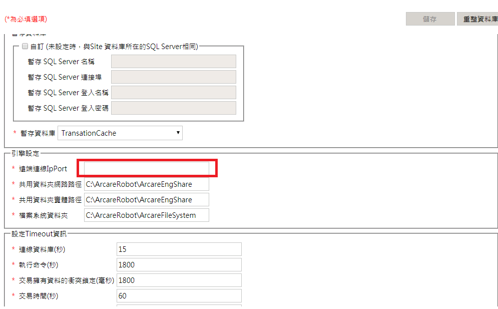

## 版本：

|日期|版號|備註|
|:--:|:--:|:--:|
|2021/3/9|2021030001|初版|

## 說明：

    當新安裝RTE時設定伺服器提供服務的完整網址，需確認該網址必須讓所有需要使用系統的使用者都可以連線。

## 環境需求：

|項目|內容|備註|
|:--:|:--:|:--:|
|帳號|請準備站台管理員||
|RTE|8.9.2 及以後版本||

## 安裝步驟：

### 站台設定

1.開啟Site資料庫設定 { http://localhost:8080/ArcareEng/SiteDatabaseSet.jsp }設定遠端連線IP:PORT  

    範例：https://server.arcare-robot.com