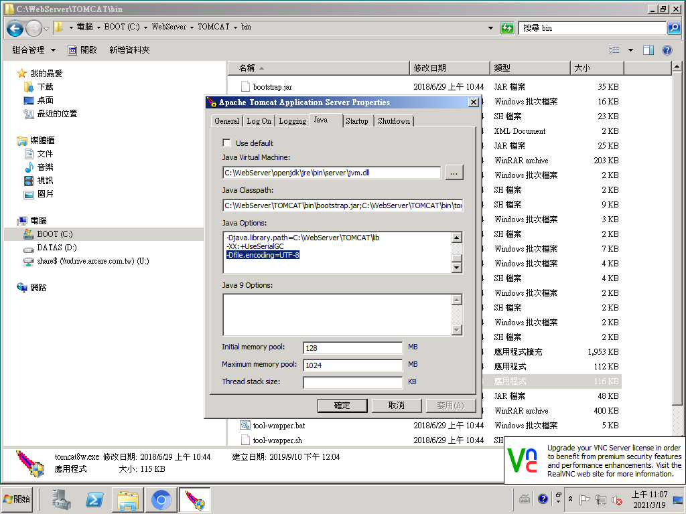

## 版本：

|日期|版號|備註|
|:--:|:--:|:--:|
|2021-3-24|2021030001|初版|

## 說明：

### 當郵件發送後，收件者在Outlook中查看郵件時顯示亂碼。

## 環境需求：

|項目|內容|備註|
|:--:|:--:|:--:|
|帳號|請準備站台安裝所屬伺服器的系統管理員帳號||
|RTE|8.9.2 及以後版本||

## 解決方式：

### 系統服務設定修改
於系統服務中[Tomcat]服務設定中增加[-Dfile.encoding=UTF-8]

