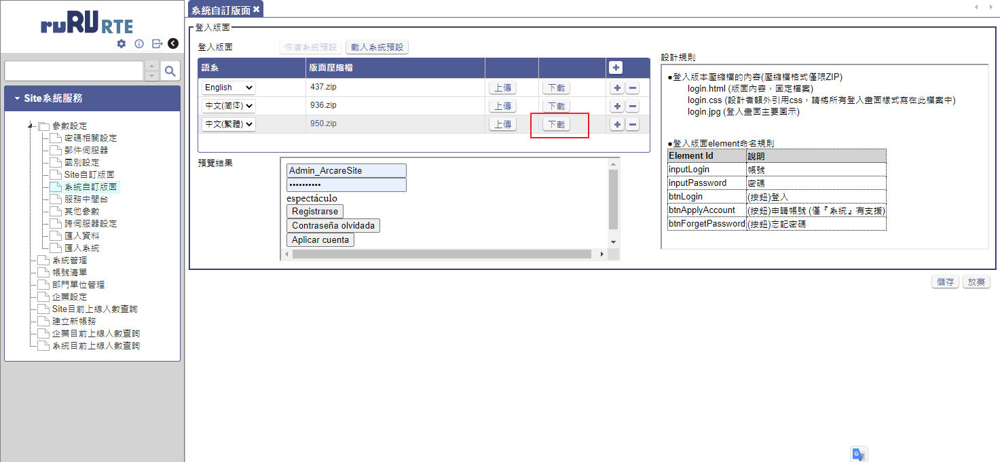
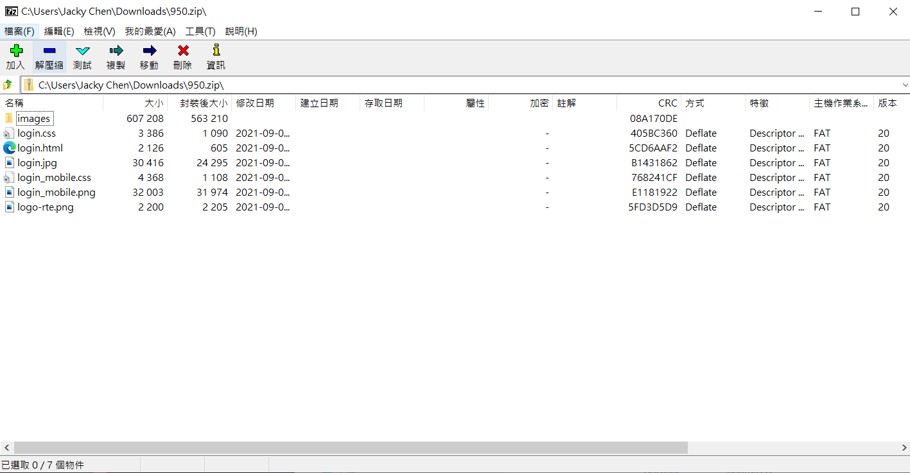
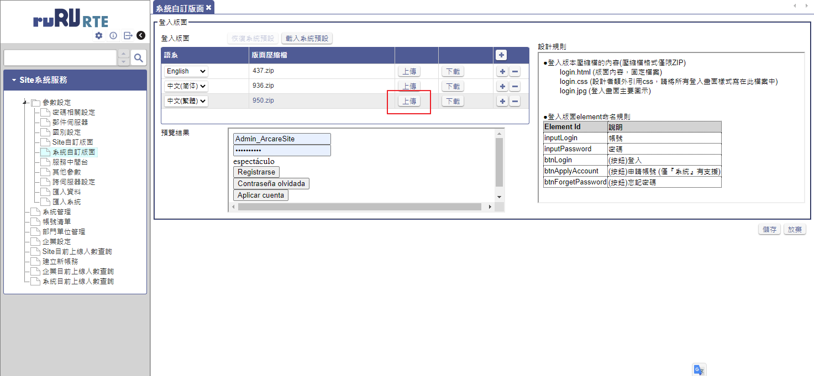

## 版本：

|日期|版號|備註|
|:--:|:--:|:--:|
|2021-09-01|2021090001|初版|
|2021-09-02|2021090002|異動|
|2021-10-07|2021100001|異動|

## 說明：

    如何自行定義登入(站台 / 系統)首頁樣式？

## 環境需求：

|項目|內容|備註|
|:--:|:--:|:--:|
|帳號|請準備站台安裝所屬伺服器的系統管理員帳號||
|RTE|8.10.0 及以後版本||

## 設計流程說明：

1. 下載版面基本檔案壓縮包

   - 每個語系會有獨立壓縮包，這是因為不同語系文字長度有差異，因此有不同版面設定需要，請依據需求下載所需語系的版面壓縮檔進行修改更新。
   - 如果要更改系統登入首頁樣式請於[系統自訂版面]中下載，如果要更改站台登入首頁樣式請於[Site自訂版面]中下載。

      

2. 如何進行修改設計 ?

    首先解壓縮檔案，其中logo.html負責HTML的Layout、文字定義等、logo.css負責樣式定義、logo-rte.png是預設Logo檔案

    * 其他應注意事項：

      1. logo.html不支援Link圖片。

      2. login.css是提供附加所需的CSS設定，RTE會自行讀取與附加，無須於logo.html中設定Link，另外、建議勿刪除原有class或ID。

      3. 背景顏色及樣式設定請於logo.css中body{}中修改樣式設定

          body{
              background:linear-gradient(to bottom,#396982,#0d202c);
              FONT-FAMILY:Microsoft JhengHei;
          }

      4. class為arcare的DIV，是LOGO容器，除非不使用LOGO，否則建議請勿移除，相應的CSS定義也請勿異動，建議LOGO採用136x35，PNG格式，直接覆蓋(logo-rte.png)

3. 檔案處理應注意事項

    * 勿隨意更改檔名

    * 其他圖檔請勿更動

4. 完成後上傳壓縮檔 

    * 壓縮檔內檔案結構如下

        

    * 請依據語系上傳

        

5. 完成後請重新顯示或執行登入登出即可檢視新設計。

### [自訂登入版面教學文件](自訂登入版面.pdf){:target='_blank'}
