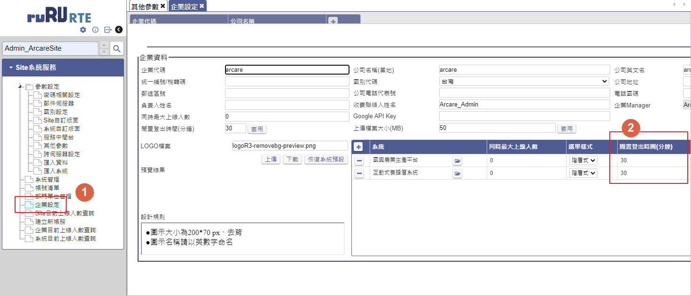

## 版本：

|日期|版號|備註|
|:--:|:--:|:--:|
|2021-09-02|2021090005|初版|

## 說明：

    當前端使用反向代理機制作為代理RTE服務時，時常因為操作系統靜止時間過久，被踢出系統。

## 環境需求：

|項目|內容|備註|
|:--:|:--:|:--:|
|帳號|請準備站台安裝所屬伺服器的系統管理員帳號||
|RTE|8.10.0 及以後版本||
|反向代理服務|以nginx為例||

## 問題說明：

基於服務統一管理或是安全通訊需求，會在RTE前端增加反向代理服務，以便代理內部RTE服務提供給外部使用者使用，而由於安全考量多數反向代理服務都有連線timeout時間設定及預設值，如果發現時常被踢出系統可能是timeout時間過短所致，以下說明如何確認問題，並以nginx作為反向代理服務時如何設定timeout時間設定。

### 1. 檢查問題

開啟開發人員工具，檢查console是否短時間重複出現websocket連線中斷！

   

而站台管理中[企業設定] > [系統閒置登出時間]設定時間大於被踢時間

   

### 2. 解決方式

修改timeout時間以便符合你們的使用習慣，RTE如果websocket被中斷五次過程中使用者都沒有執行與伺服端的互動例如新增、修改、查詢、刪除，使用者帳號就會被踢出系統，因此適度調整timeout可以讓你避免發生服務中斷，以nginx為例，預設值為60秒中斷五次是5分鐘，基於安全考量建議可以修改為75秒則中斷五次是6分秒。

請於 server{}標籤中的location增加proxy_connect_timeout設定，如下：

    location /ArcarEng/ {
        proxy_pass http://backend/ArcarEng;
        proxy_connect_timeout 75s;
        proxy_http_version 1.1;
        proxy_set_header Upgrade $http_upgrade;
        proxy_set_header Connection "upgrade";
    }

### 3. 完成後請重啟反向代理服務(以nginx為例)