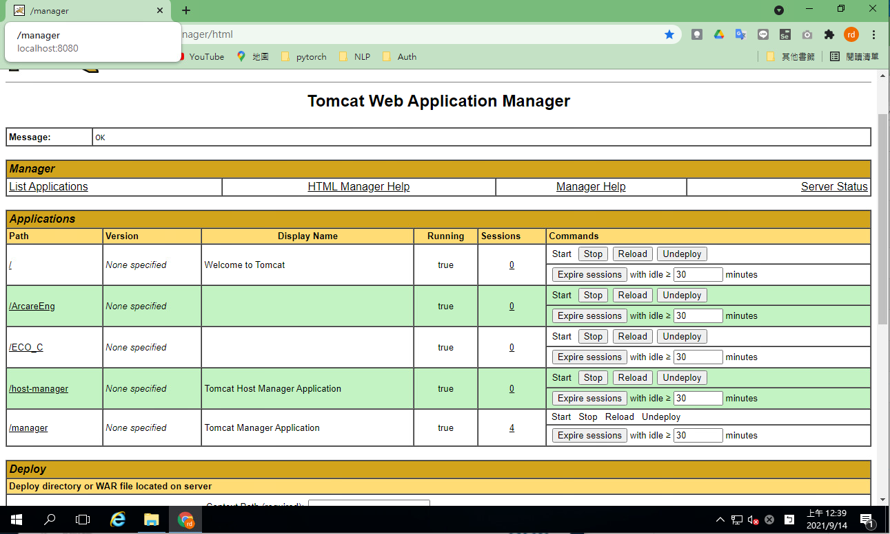
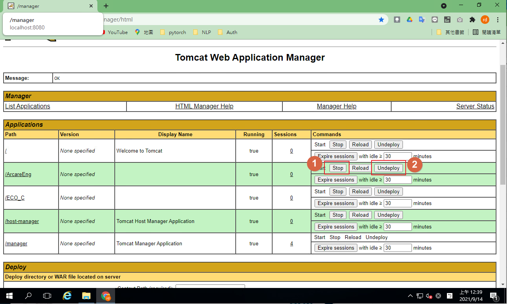
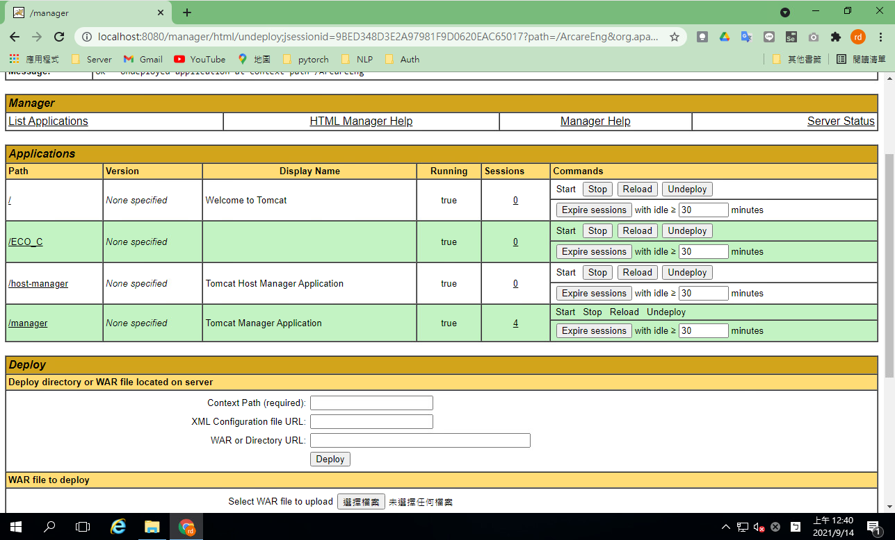
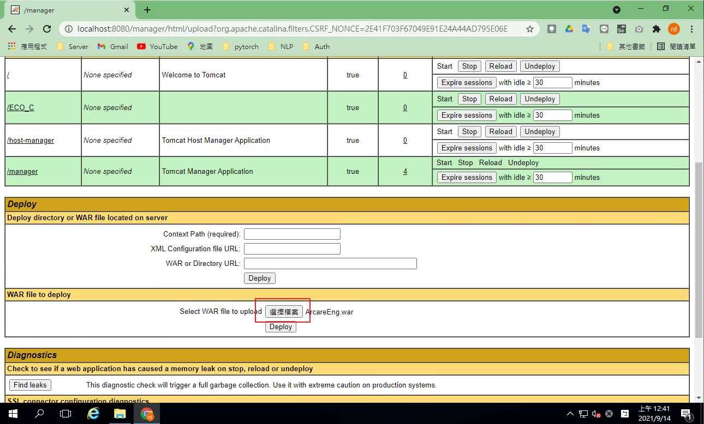
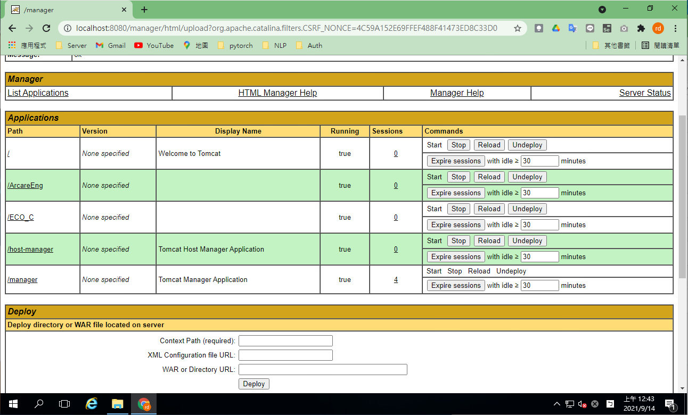
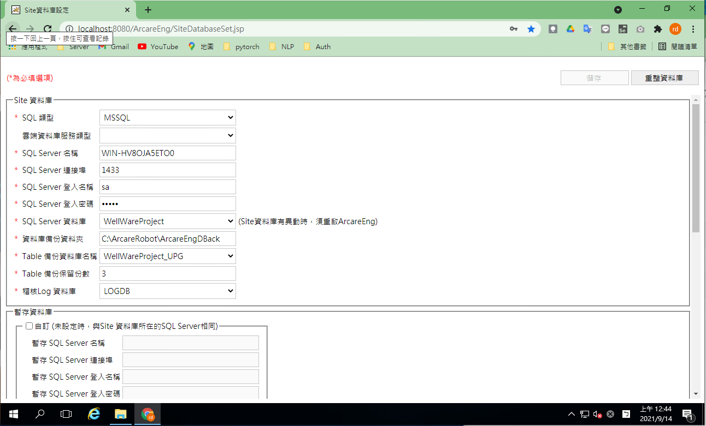
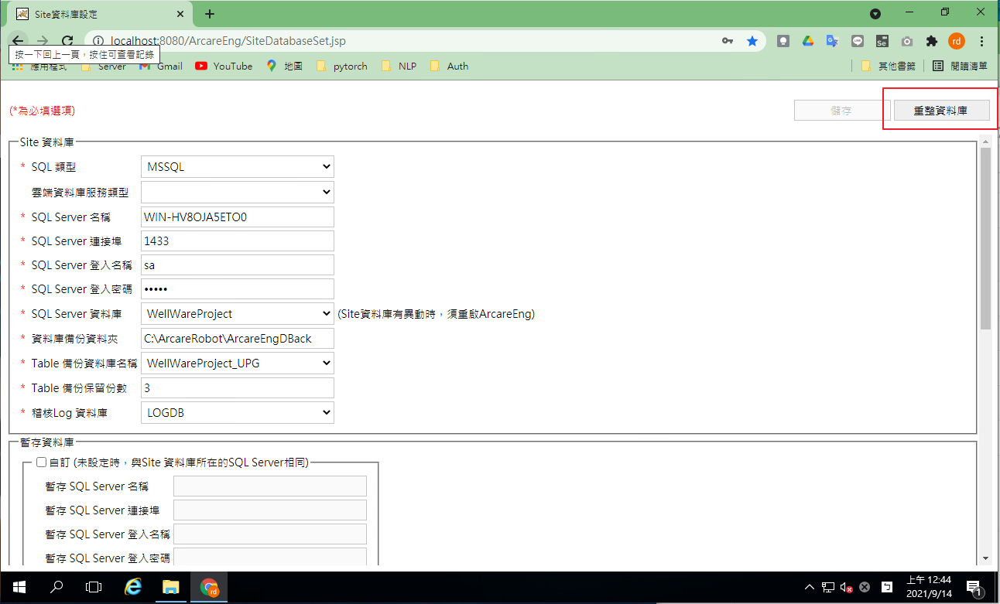
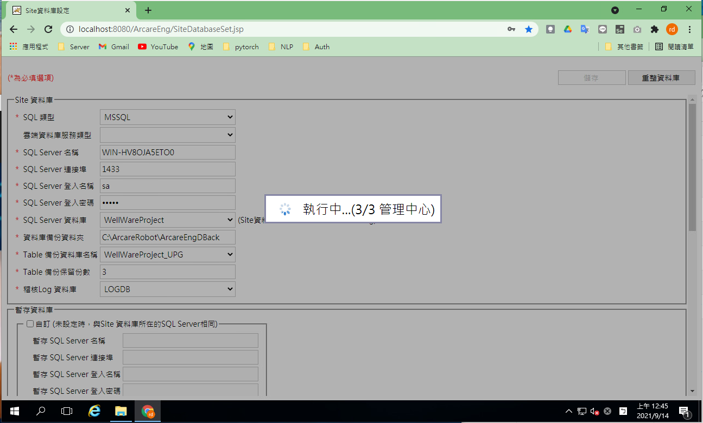
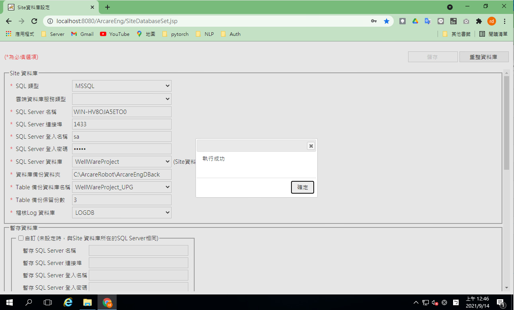

## 版本：

|日期|版號|備註|
|:--:|:--:|:--:|
|2021-09-14|2021090006|初版|

## 說明：

    更新RTE引擎步驟

## 環境需求：

|項目|內容|備註|
|:--:|:--:|:--:|
|帳號|請準備站台安裝所屬伺服器的系統管理員帳號||
|RTE|8.10.0 及以後版本||

## 說明及注意事項：

    一、當RTE引擎釋出新版，系統管理員需要進行更新。
    二、更新作業請於伺服器端本機作業。
    三、請先依據版本查閱[版本更新注意事項]。
    四、同一站台只能有單一主要版本應用系統，更新RTE引擎前務必確認。

## [各主要版本更新注意事項：](http://localhost:4000/RELEASE/RTE/README.html){:target='_blank'}

### 1. 開啟Tomcat管理視窗
* http://localhost:8080/manager

### 2. 停止並解佈署ArcareEng

### 3. 由於服務需要經過檢查與檔案清理需要一點時間請耐心等候，完成後[ /ArcareEng ]會被移除如下

### 4. 先將安裝檔版本號去除後選擇[選擇檔案]選取要佈署的Client引擎檔案(去除版本後的檔名為ArcareEng.war，上傳佈署的檔案名稱不可以更改)

### 5. 按下[Deploy]後完成佈署

### 6. 前往資料庫設定頁面
* http://localhost:8080/ArcareEng/SiteDatabaseSet.jsp

### 7. 按下[重整資料庫]讓引擎調整資料庫結構

### 8. 等待資料庫重整

### 9. 完成重整，更新作業完成

