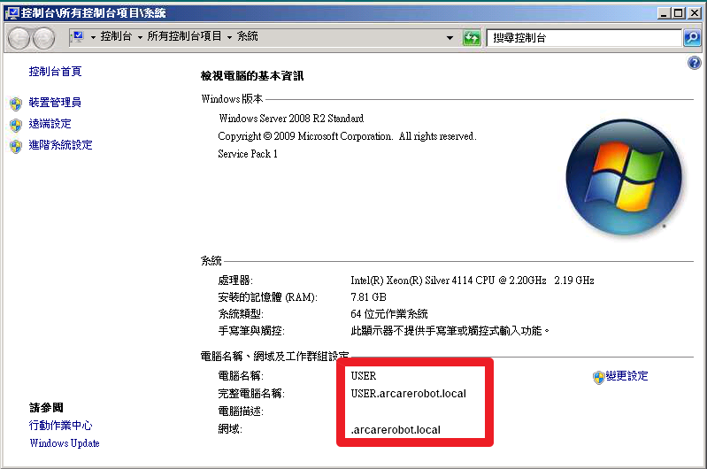
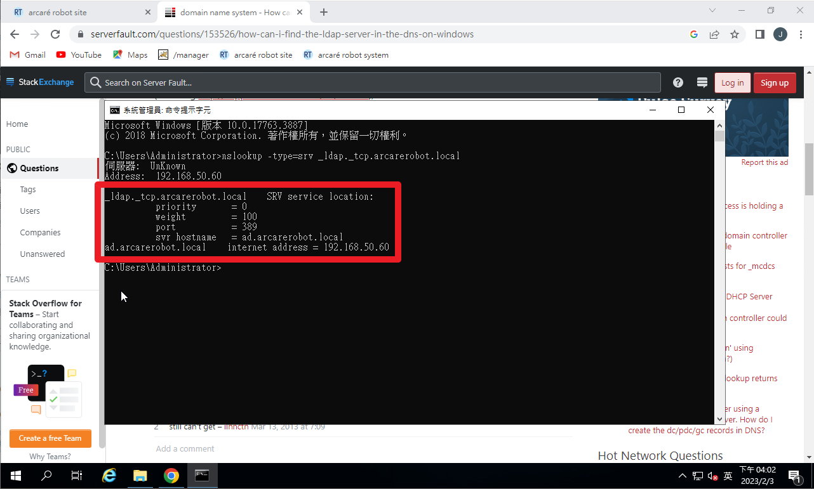
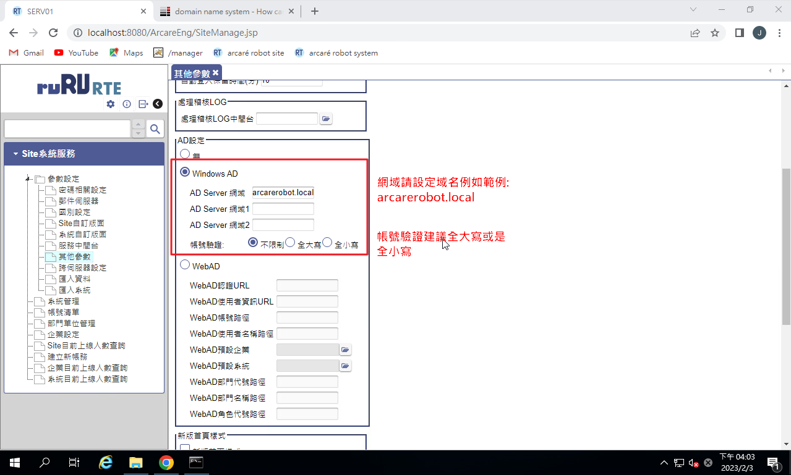

## 版本：

|日期|版號|備註|
|:--:|:--:|:--:|
|2023-02-06|2023020001|初版|

## 說明：

#### Windows Server 2019 Active Directory單一簽入整合設定

## 環境需求：

|項目|內容|備註|
|:--:|:--:|:--:|
|帳號|請準備站台安裝所屬伺服器的系統管理員帳號||
|RTE|8.10.0 及以後版本||
|Windows Active Directory|2019及以後版本||

## 說明及注意事項：

#### 一、伺服器建議加入Active Directory網域（非必要）
#### 二、確定域名可以正確查到Active Directory網域伺服器（必要）
#### 三、確定Active Directory網域中帳號建立規則（重要）
#### 四、RTE站台中整合Active Directory網域認證設定（必要）

## 設定

### 1. 伺服器建議加入Active Directory網域（非必要）

#### 由於需要透過網域功能透過域名尋找到正確LDAP伺服器位置，建議安裝的伺服器加入網域較為理想

### 2. 確定域名可以正確查到Active Directory網域伺服器（必要）

#### 請將DNS設定為Active Directory網域的授權DNS以確定DNS可以正確搜尋到LDAP伺服器，設定完成後建議於『命令題示字元』用以下指令檢查DNS設定是否滿足需要：

    nslookup –type=srv _ldap._tcp.%網域名稱%

#### 完成後應該顯示查詢到的Active Directory網域伺服器名稱與IP位置

### 3. 確定Active Directory網域中帳號建立規則（重要）

#### 建議Active Directory網域中帳號不分大小寫都不得重複，避免帳號新增時發生錯誤，所以帳號設定建議統一採用全部小寫或全部大寫。

### 4. RTE站台中整合Active Directory網域認證設定（必要）

### 5. 完成後即可執行登入

    http://%網址或IP%:%PORT%/ArcareEng/login.jsp