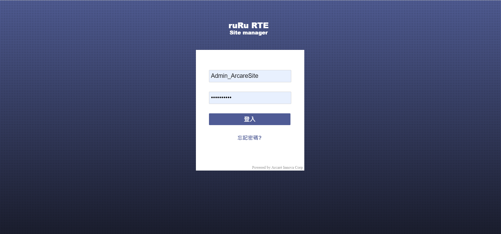

# 郵件帳號設定

## 版本：

|日期|版號|備註|
|:--:|:--:|:--:|
|2021-1-20|2021010001|初版|

## 說明：

    當新安裝RTE或是發送郵件用的帳號變更時、需要進行郵件帳號重新更改或設定。

## 環境需求：

|項目|內容|備註|
|:--:|:--:|:--:|
|帳號|請準備站台管理員以及系統管理員帳號||
|RTE|8.9.2 及以後版本||

## 安裝步驟：

### 站台設定

1.站台設定主要提供帳號申請通知，請先以站台管理員帳號當入站台管理畫面  

2.進入[參數設定] > [郵件伺服器] ，請更新伺服器位置、PORT號、帳戶、密碼（相關訊請洽MIS或系統管理員） 

### 系統設定

1.以系統管理員登入應用系統  

2.進入[系統服務] > [系統應用]  

3.點擊[系統參數設定]頁面  

