# 平台基礎套件安裝

## 版本

|日期|版號|備註|
|:--:|:--:|:--:|
|2020-11-25|2020110001|初版|

## 作業目的

    在安裝RTE前，必須先安裝server端所需的相關套件。

## 環境需求

|項目|內容|備註|
|:--:|:--:|:--:|
|帳號|請使用本機帳號，且該帳號具有Administrator權限||
|作業系統|Windows 2008 R2 以上||
|資料庫版本|MS SQL 2008R2 以上||
|安裝套件|autodeploy.zip||

## 安裝步驟

### 準備安裝程式

1.將安裝套件[autodeploy.zip]放置於指定安裝路徑（例如 [c:\\\\]）  

2.解壓縮檔案於該路徑  

3.完成解壓縮可以看見該路徑下有[autodeploy]資料夾  

### 執行程式套件安裝

#### 1.安裝Chromium瀏覽器  

1-1.進入autodeploy\chromium資料夾選擇，在「chromium_install.bat」上按滑鼠右鍵，然後點選「以系統管理員身分執行」  

1-2.當指令視窗執行完成並自行關閉視窗即完成安裝  

#### 2.安裝OpenJDK  

2-1.進入autodeploy\openjdk資料夾，在「openjdk_install.bat」上按滑鼠右鍵，然後點選「以系統管理員身分執行」。 

2-2.點選[執行]  

2-3.當指令視窗執行完成並自行關閉視窗即完成安裝  

#### 3.安裝ExcelToPDF套件  

3-1.進入安裝資料夾autodeploy\opt  

3-2.右鍵執行以系統管理員身分執行「install.bat」  

3-3.當指令視窗執行完成並自行關閉視窗即完成安裝  
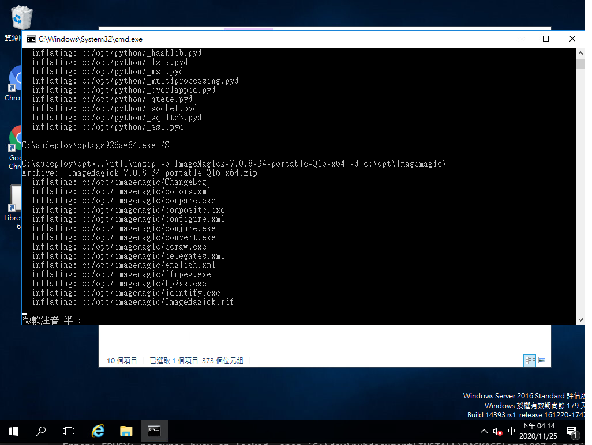

#### 4.安裝Tomcat  

4-1.進入autodeploy\TOMCAT資料夾，在「tomcat_install.bat」上按滑鼠右鍵，然後點選「以系統管理員身分執行」。  

4-2.當指令視窗執行完成並自行關閉視窗即完成安裝  

4-3.接著請切換到TOMCAT的bin目錄，如果剛才在C槽安裝，安裝的目錄會在C:\WebServer\TOMCAT\bin，如果在D槽安裝，則會在D:\WebServer\TOMCAT\bin，依此類推。進入TOMCAT的bin目錄之後，執行「tomcat8w.exe」 
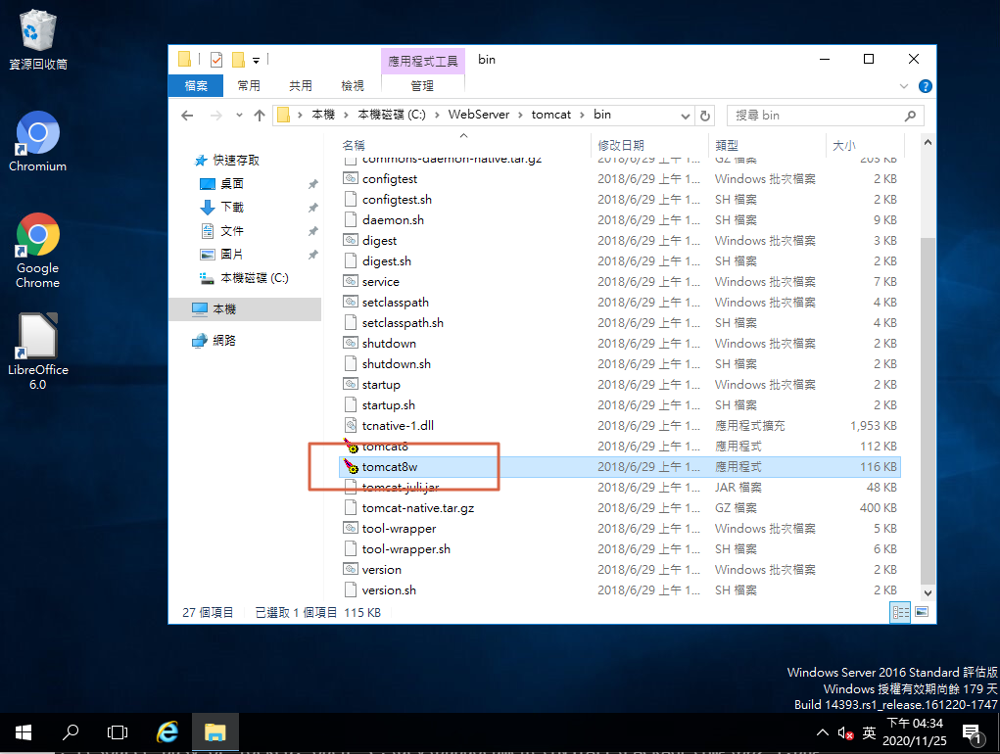

4-4.切換到「Java」頁籤，將記憶體容量設定為2048MB或是更高，然後按下「套用」  

4-5.切換到General頁籤，按下「Stop」 
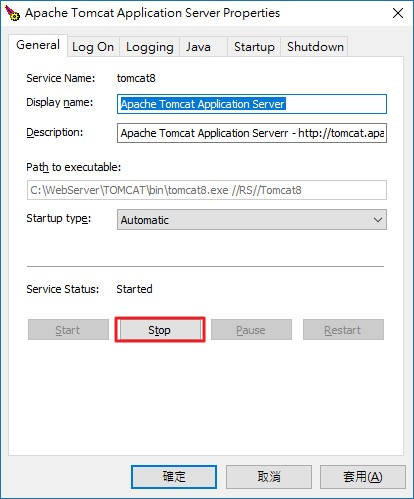

4-6.當Service Status變為Stopped之後，再按下「Start」，重新啟動TOMCAT。 

4-7.開啟瀏覽器，登入TOMCAT網頁(http://localhost:8080/manager)，確認TOMCAT是否正常。 
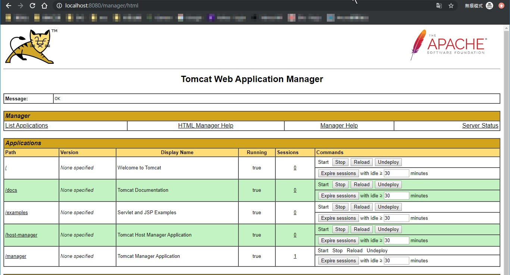

4-8.基於安全因素考量，建議Undeploy [docs] / [examples]  

4-8.Undeploy [docs] / [examples] 完成後  
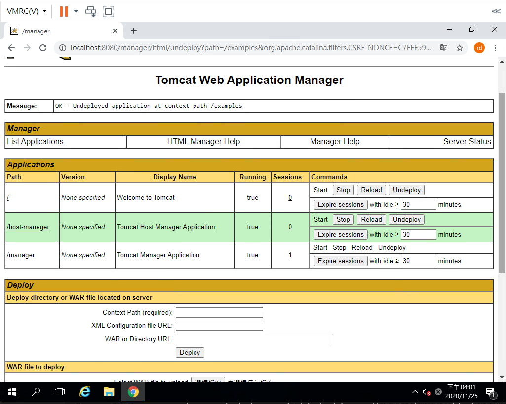

#### 5.安裝RTE  

5-1.開啟Tomcat管理視窗  

5-2.按下[選擇檔案]  

5-3.選擇安裝檔[ArcareEng.war]  
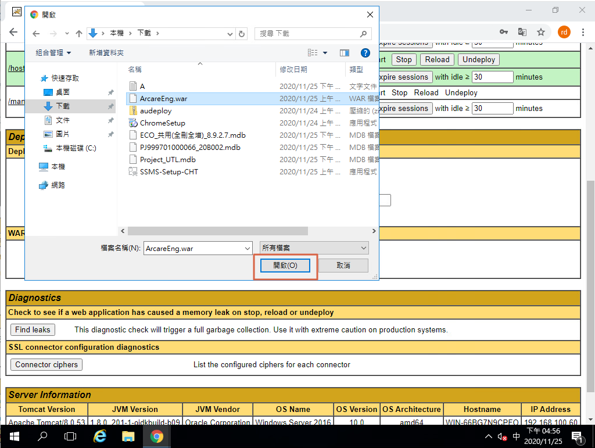

5-4.按下[Deploy]  

5-5.完成安裝  

### RTE環境初始化作業準備

#### 共用資料夾設定

用途說明：引擎運作時，需要一個磁碟空間來存放暫存檔案，所以需要在伺服器上規劃一個資料夾讓引擎使用。 
1.在伺服器任一磁碟路徑上，建立一個Share資料夾，例如 [C:\ArcareRobot\ArcareEngShare] 
2.如果運行的環境要使用多台AP伺服器進行負載平衡(load balance)，請將這個Share資料夾設定為共用(如下圖)，[否則可跳過此設定] 
 
若有需要針對此共用資料夾進行指定帳號的權限鎖定，才需進行以下 3 ~ 5 步驟設定： 
3.設定可存取資料夾的帳號，權限需設定成可讀取/寫入，如下圖所示： 
 
4.開啟Windows服務，找到Apache Tomcat的服務後，將該組帳號密碼指定給Tomcat，此設定表示Tomcat服務使用此帳號權限進行程式執行。 
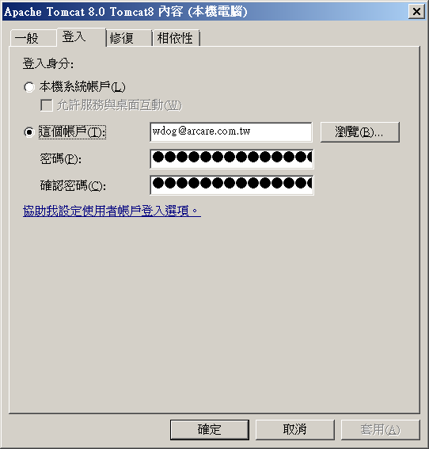 
5.確認後重啟Tomcat服務： 
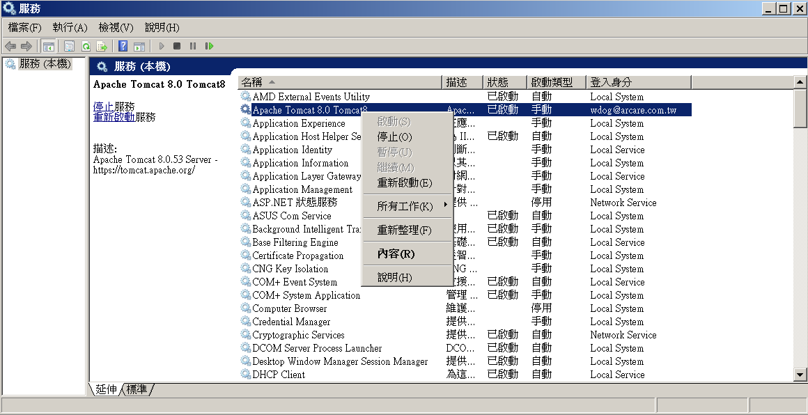 

#### 資料庫設定

##### 作業說明：

初次安裝RTE後，須進行資料庫設定以指定資料庫位置  

##### 操作介面介紹：

開啟Site資料庫設定 { http://localhost:8080/ArcareEng/SiteDatabaseSet.jsp }，進入頁面後輸入各項設定，完成後點擊右上儲存  
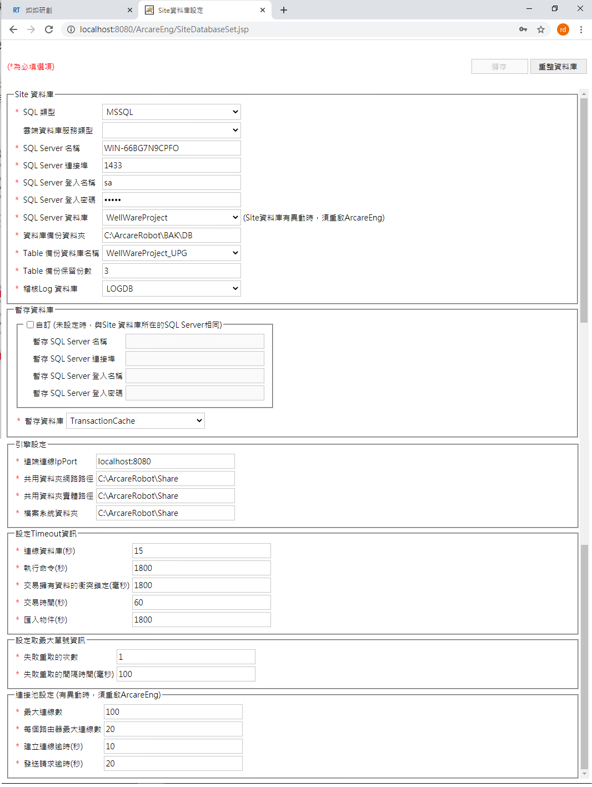
###### Site資料庫區塊：

輸入Server連線的SQL資料庫相關資訊，裝SQL_EXPRESS版本需注意，SQLServer名稱後面需加 [\SQLEXPRESS]且要先開啟TCP/IP相關設定才能進行此步驟  

* SQL 類型：預設[MSSQL]，指定單機型SQL伺服器
* SQL Server名稱：輸入SQL Server電腦名稱
* SQL Server連接埠：輸入SQL Server連線port號
* SQL Server登入名稱：輸入登入帳號
* SQL Server登入密碼：輸入登入密碼
* SQL Server資料庫：挑選儲存Site資料的DB，預設建立 [WellWareProject]
* 資料庫備份資料夾：輸入系統更新時的自動備份路徑，例：C:\ArcareRobot\ArcareEngDBbak
* Table備份資料庫名稱：挑選Site資料庫的備份DB，預設建立 [WellWareProject_UPG]
* Table保留份數：輸入Site資料庫備份的份數
* 稽核Log資料庫：挑選儲存使用者操作紀錄的資料庫，預設建議 [LOGDB]
    * 註.稽核LOG資料庫有設定時，DB容量會快速累積，請隨時注意 

###### 暫存資料庫區塊：

輸入SQL連線服務程式的相關設定  

* 暫存資料庫設定：不勾選自訂則引擎會使用上方SQL Server設定連線，如需自訂則打勾選項並依序填寫相關連線資料  
* 暫存資料庫：挑選資料庫，建議新增資料庫單獨給此功能使用，名稱建議：[TransactionCache]，此資料庫專為過帳暫存使用，日常備份不須備份此資料庫。  

###### 引擎設定：

* 遠端連線IpPort：Server遠端連線時的IP與PORT  
* 共用資料夾網路路徑：共用資料夾的網路磁碟路徑(前面2.2節設定的)(如果沒有多台AP server架構，可設定和共用資料夾實體路徑相同即可)  
* 共用資料夾實體路徑：共用資料夾的實體路徑，例如C:\ArcareRobot\ArcareEngShare。  

###### 設定Timeout資訊：

輸入引擎處理各項功能時，逾期的秒數設定  

* 連線資料庫(秒)：RTE與資料庫連線的逾期時間
* 執行命令(秒)：RTE執行資料庫作業的逾期時間
* 交易擁有資料的衝突鎖定(毫秒)：整個資料交易鎖定最長時間
* 交易時間(秒)：交易內單一作業逾期時間
* 匯入物件(秒)：匯入作業逾期時間

###### 設定取最大單號資訊：

* 失敗重取次數：取單據號碼失敗時，重新取單據號碼的次數
* 失敗重取的間隔時間(毫秒)：每次重新取單據號碼的間隔時間

### RTE環境初始化作業

#### 站台激活

1. 進入管理介面 - 輸入網址【 http://IP:PORT/ArcareEng/SiteLogin.jsp 】  

2. 預設帳戶密碼 [Admini_ArcareSite / arcare]  

3. 登入後進入設定國別/語系  
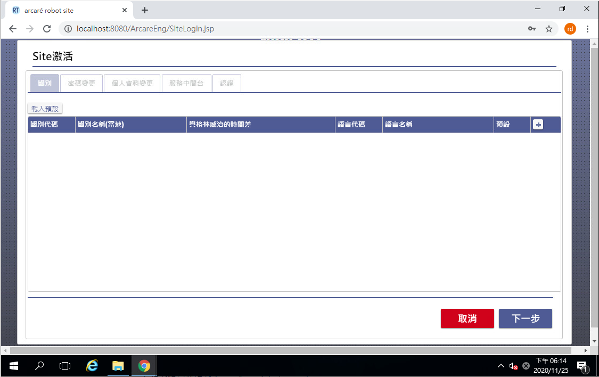

4. 設定國別/語系  

    1. 按下[載入預設]
    2. 選擇預設語系 [必要]
    3. 修改國別/語系項目
    4. 完成按[下一步]

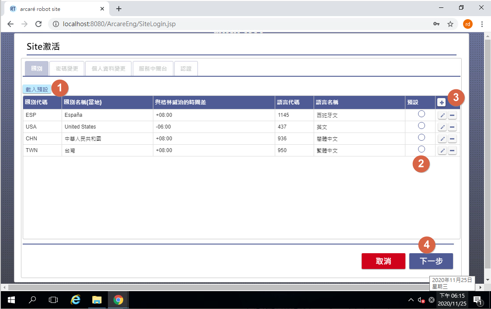

5. 設定站台管理員密碼 [Admin_ArcareSite]  

    1. 舊密碼：預設初始密碼
    2. 新密碼：英文大小寫加數字
    3. 確認新密碼：與新密碼必須一致
    4. 完成按[下一步]

6. 修改站台管理員資訊 [Admin_ArcareSite]  

7. 建立中間台資訊  

   中間台資訊主要是當多台負載平衡運作時指定排程有哪一台負責，避免重複執行  

    1. 新增鍵：新增中間台設定值
    2. 伺服器：請使用電名稱
    3. 連接埠：8080
    4. 設定完成按下儲存鍵
    5. 選擇執行排程作業的機台
    6. 完成按[下一步]

8. 選擇處理排程機台後確認，請按 [確定]  

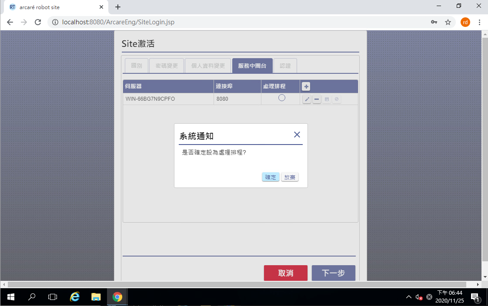

9. 指定站台名稱後，請按 [啟動完成] 完成初始化作業  

    a. 站台名稱建議以中英文名，請避免使用特殊字元 
    b. 完成後按下[啟動完成]按鍵，完成啟動作業

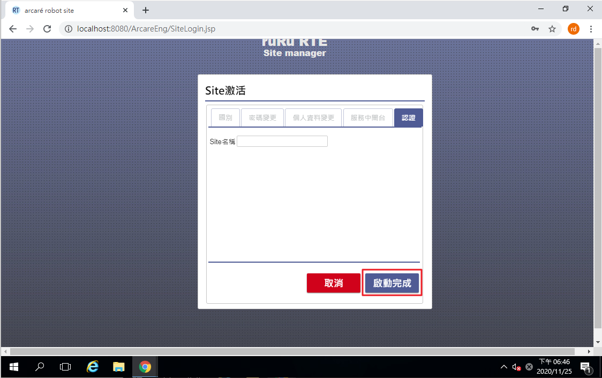