# RTE 專案安裝

## 版本

|日期|版號|備註|
|:--:|:--:|:--:|
|2021-08-18|2021080001|改版|
|2021-02-25|2021020001|改版|
|2020-12-14|2020120001|初版|

## 作業目的

    當完成基礎平台安裝後，進入專案安裝

## 環境需求

|項目|內容|備註|
|:--:|:--:|:--:|
|帳號|請使用RURU站台管理員帳號|平台預設帳號，安裝過程會預設強制修改密碼|
|環境|RTE|已完成基礎套件安裝及初始作業|
|系統工具|Project_UTL.mdb||
|應用系統安裝檔|{專案料號}_{版本號}.mdb||

## 安裝步驟

### 建立企業

1. 以站台管理員帳號[Admin_ArcareSite]登入站台管理系統  

2. 設定密碼激活等待時間 
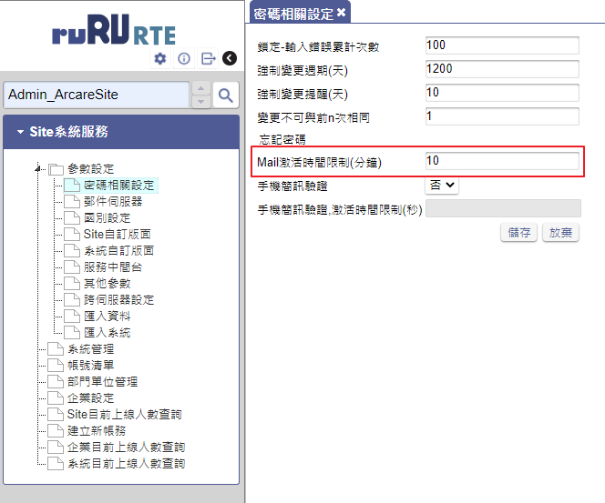

3. 設定郵件伺服器 
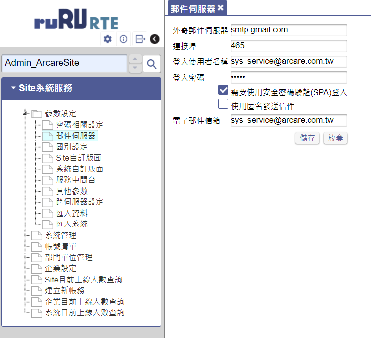
#### 備註：如果帳號屬於不用驗證密碼則帳號、密碼欄位請勿輸入，並僅勾選[使用匿名發送郵件]，請勿勾選[需要使用安全密碼驗證(SPA)登入]

3. 點選[企業設定]、並按下[新增]按鈕  

4. 跳出[企業資料]設定畫面  

    # 企業資料：
    1. 企業代號： 公司簡稱，可以使用英文或中文但請勿使用特殊字元，20個字元 
    2. 公司名稱： 公司名稱，可以使用英文或中文但請勿使用特殊字元，80個字元 
    3. 公司英文名： 公司英文名稱，80個字元 
    4. 公司地址： 公司地址，80個字元 
    5. 國別代碼： 繁體中文、英文、西班牙語、簡體中文 
    6. 電話國碼： 電話國碼，6個字元 
    7. 公司電話代表號： 公司對外電話代表號碼，12個字元 
    8. 收費聯絡人姓名： 帳務聯絡人，80個字元 
    9. 統一編號/稅籍碼：統一編號/稅籍碼，80個字元 
    10. 郵遞區號：郵遞區號，10個字元 
    11. 負責人姓名： 公司負責人，80個字元 
    12. Google API Key： Google服務堤供的金鑰 
    13. 上傳檔案大小：預設50M，不得為零 
    14. 同時最大上線人數：0為不設限制 
    15. 使用者維持登入時間(分鐘)：0為不設限制 
     

5. 站台完成設定，按下[儲存]鍵完成建立企業  

6. 企業建立完成  

### 建立企業管理員帳號

1. 使用站台管理員帳號，登入站台管理系統，進入[帳號清單] > [按下新增按鈕]  

2. 設定帳號資訊  

    #### 帳號資訊：
    1. 帳號：帳號名稱請以英文、數字設定不重複 
    2. 所屬企業名稱：企業設定中的企業名稱 
    3. 姓名：人員姓名 
    4. 電子郵件信箱：電子郵件信箱 
    5. 備用信箱：備用信箱位置 
    6. 分機號碼/專線：市話分機、專線 
    7. 手機號碼：行動電話 
    8. 國別：台灣、西班牙、美國、中華人民共和國 
    9. 部門單位：[部門單位管理]中的部門名稱 
     

3. 指定帳號所屬企業 

4. 完成帳號設定，按下[儲存]鍵完成新增作業  

### 指定企業管理員

1. 以站台管理員帳號登入站台管理系統，選取[企業設定]  

2. 開啟帳號清單，指定企業管理員  

3. 選取欲指定人員，勾選帶回  
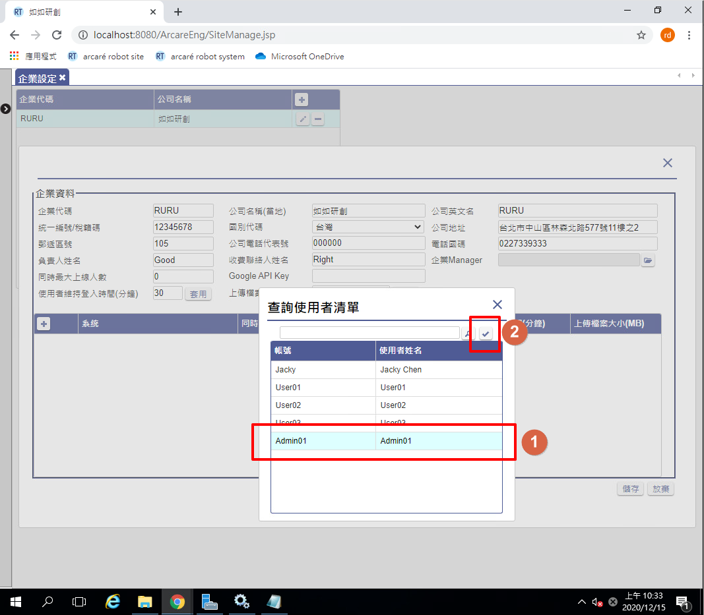

4. 按下儲存按鍵，完成指定企業管理員  

### 建立新系統站台相關設定

1. 以站台管理員帳戶登入站台管理介面  
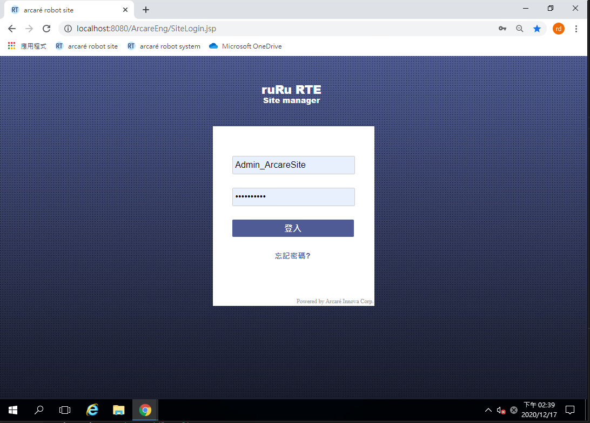

2. 新增系統相關設定，點選[WellWareProject] > 按下[新增按鍵]  

3. 指定專案相關設定，並按下[儲存]鍵完成儲存  
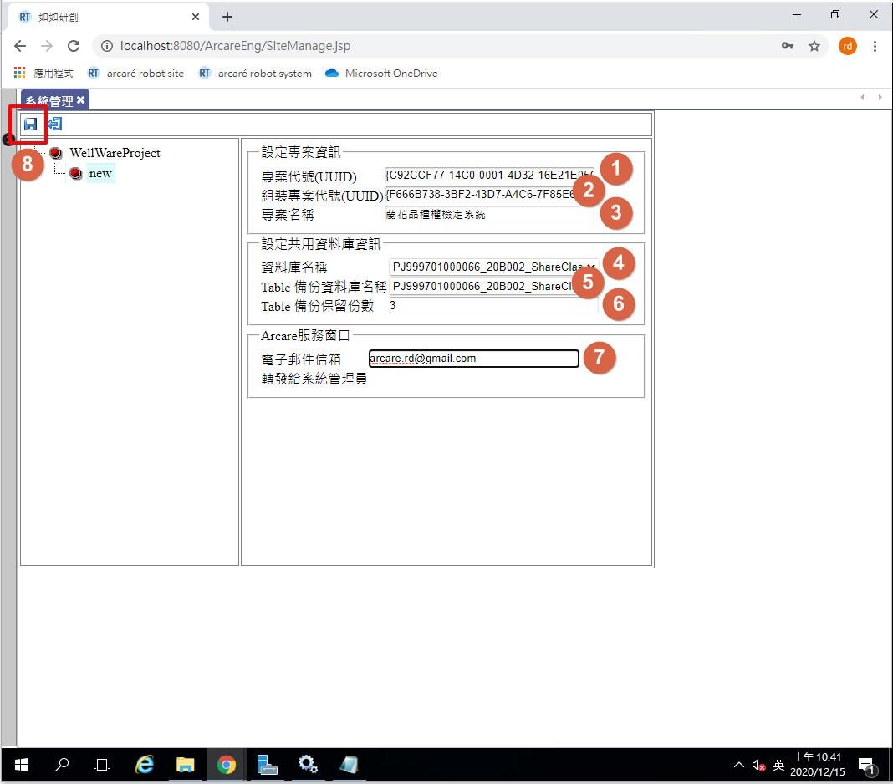
    # 專案資訊：
    1. 專案代號(UUID)：專案於站台中的唯一碼（由站台自動產生） 
    2. 組裝代號(UUID)：安裝的應用系統所屬組裝代號 
       <h3 style="color:red;">(系統安裝前請務必確認組裝代號(UUID)正確無誤，否則系統將無法正確執行，該資料在[IDE][專案管理][工廠開案資訊]中)</h3> 
    3. 專案名稱：專案名稱，建議中英文或數字開頭，勿將第一個字元使用特殊字元 
    4. 資料庫名稱：資料庫名稱，建議勿將第一個字元使用特殊字元，並避開MS-SQL關鍵字 
    5. Table 備份資料庫名稱：備份用資料庫名稱，建議勿將第一個字元使用特殊字元，並避開MS-SQL關鍵字 
    6. Table 備份保留份數：數字，預設值3份 
    7. 電子郵件名稱：當該處有設定，且系統取用BPS功能，將主動寄一份給該電子郵件帳戶，主要提供RURU服務部門蒐集異常資訊提供支援服務 
    8. 儲存編輯 
     

4. 儲存中  

5. 完成儲存  

6. 建立公司，選擇專案，按下[新增]按鍵  

7. 指定公司相關設定，並按下[儲存]鍵完成儲存  

    # 公司資訊：
    1. 公司代號(UUID)：公司於專案中的唯一碼（由站台自動產生） 
    2. 公司名稱：公司名稱，建議勿將第一個字元使用特殊字元 
    3. 公司英文名稱：公司英文名稱，建議勿將第一個字元使用特殊字元 
    4. 資料庫名稱：資料庫名稱，建議勿將第一個字元使用特殊字元，並避開MS-SQL關鍵字 
    5. Table 備份資料庫名稱：備份用資料庫名稱，建議勿將第一個字元使用特殊字元，並避開MS-SQL關鍵字 
    6. Table 備份保留份數：數字，預設值3份 
    7. 儲存 
     

8. 完成公司相關設定  

### 為系統指定企業歸屬

1. 以站台管理員帳戶登入站台管理介面  

2. 選取[企業設定]，按下[編輯]按鍵  

3. 按下新增按鍵，指定系統與企業相關資訊  

4. 按下系統選擇按鍵，挑回所需系統  

5. 按下[儲存]按鍵，完成設定結束  
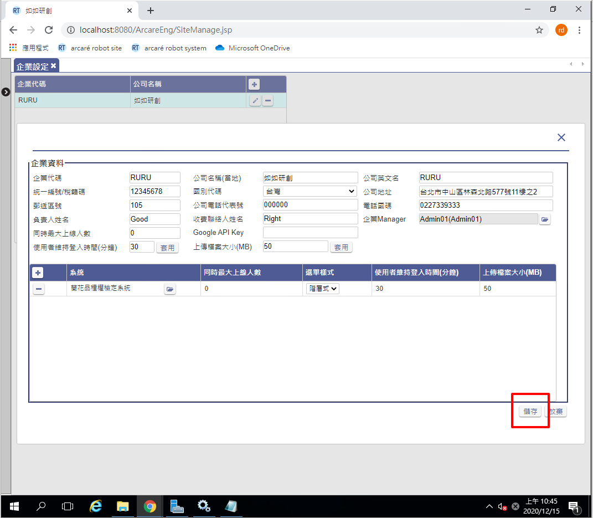
    # 系統資訊：
    1. 系統名稱：挑選的系統名稱 
    2. 選單樣式：登入RTE後左側選單樣式 
    3. 上傳檔案大小：預設50M，不得為零 
    4. 同時最大上線人數：0為不設限制 
    5. 使用者維持登入時間(分鐘)：0為不設限制 

### 安裝系統工具

1. 以企業管理員帳戶登入站台管理介面  

2. 選擇[參數設定] > [選擇匯入系統]，按下[選擇檔案]選取要匯入的[系統工具]安裝檔  

3. 選取要匯入的[系統工具]安裝檔("Project_UTL.mdb")，按下[開啟]按鍵  

4. 按下[載入清單]後，開始載入要匯入的清單  

5. 載入中  

6. 完成清單載入  
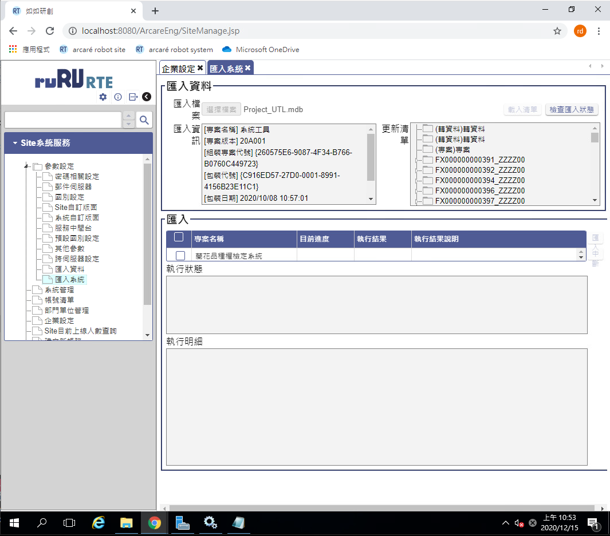

7. 選擇要匯入的目的專案，按下[匯入]按鍵進行匯入作業  

8. 完成匯入作業   
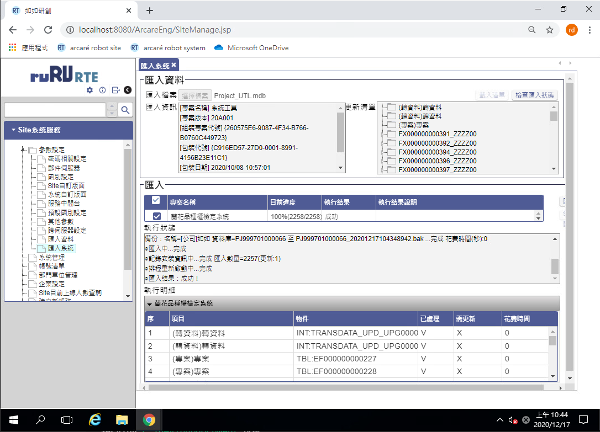

### 安裝應用系統

1. 以企業管理員帳戶登入站台管理介面  

2. 選擇[參數設定] > [選擇匯入系統]，按下[選擇檔案]選取要匯入的[系統工具]安裝檔  

3. 選取要匯入的[應用系統]安裝檔({專案料號}_{版本編號}.mdb)，按下[開啟]按鍵  

4. 按下[載入清單]後，進行載入要匯入的清單  
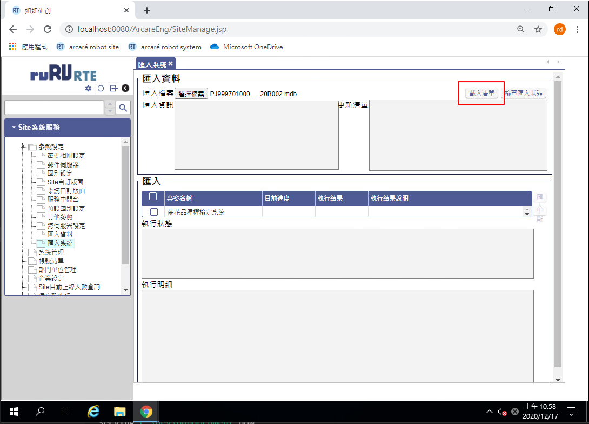

5. 完成清單載入  

6. 選擇要匯入的目的專案，按下[匯入]按鍵進行匯入作業  
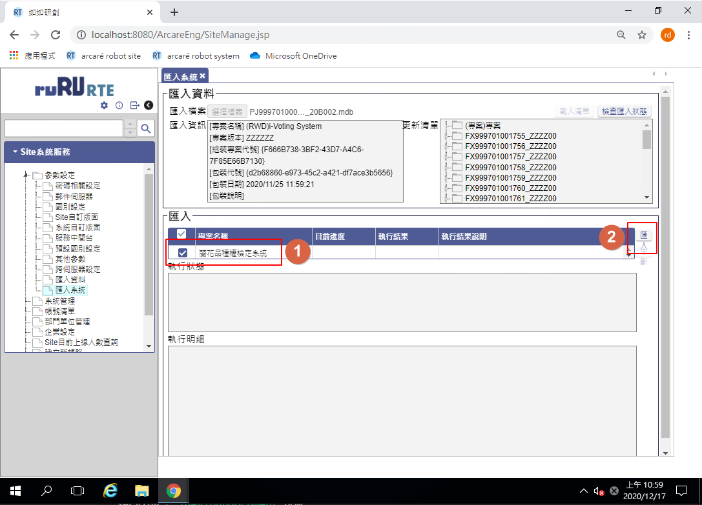

7. 完成匯入作業   

### 指定系統管理員

1. 以企業管理員帳戶登入站台管理介面  

2. 選取[系統_管理員設定]介面，開啟系統清單，挑選要指定的系統  
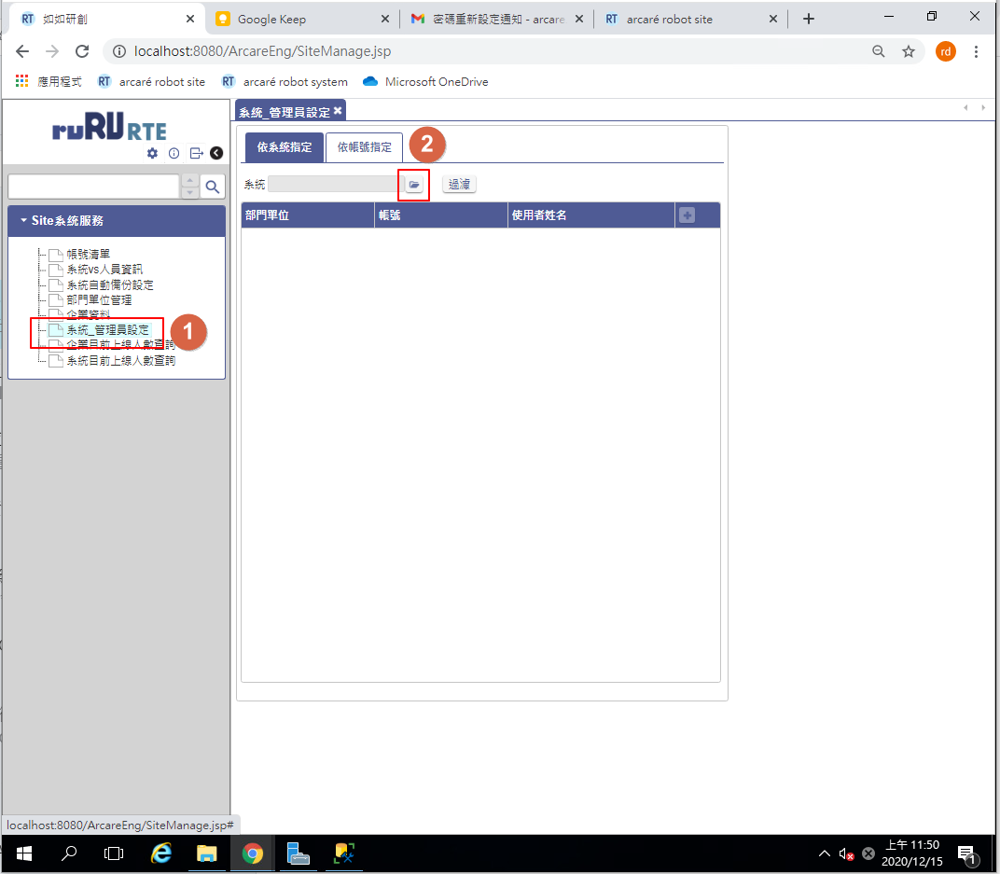

3. 勾選指定系統帶回  
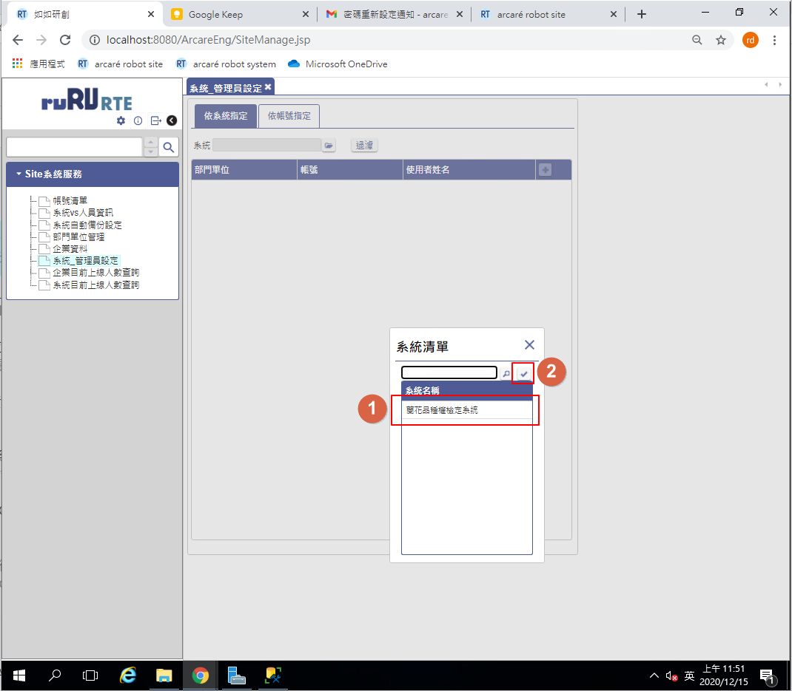

4. 按下[過濾鍵]查詢該系統現有管理員清單  

5. 按下[新增]按鍵開啟帳號清單  

6. 勾選帳號按下[儲存]按鍵指定帶回  
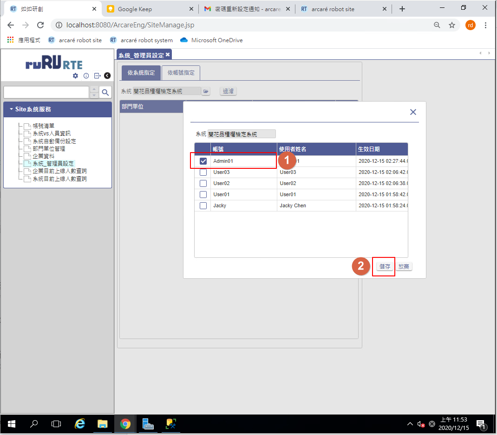

7. 完成系統管理員帳號指定  

## 測試安裝

1. 進入登入畫面  

2. 登入系統  
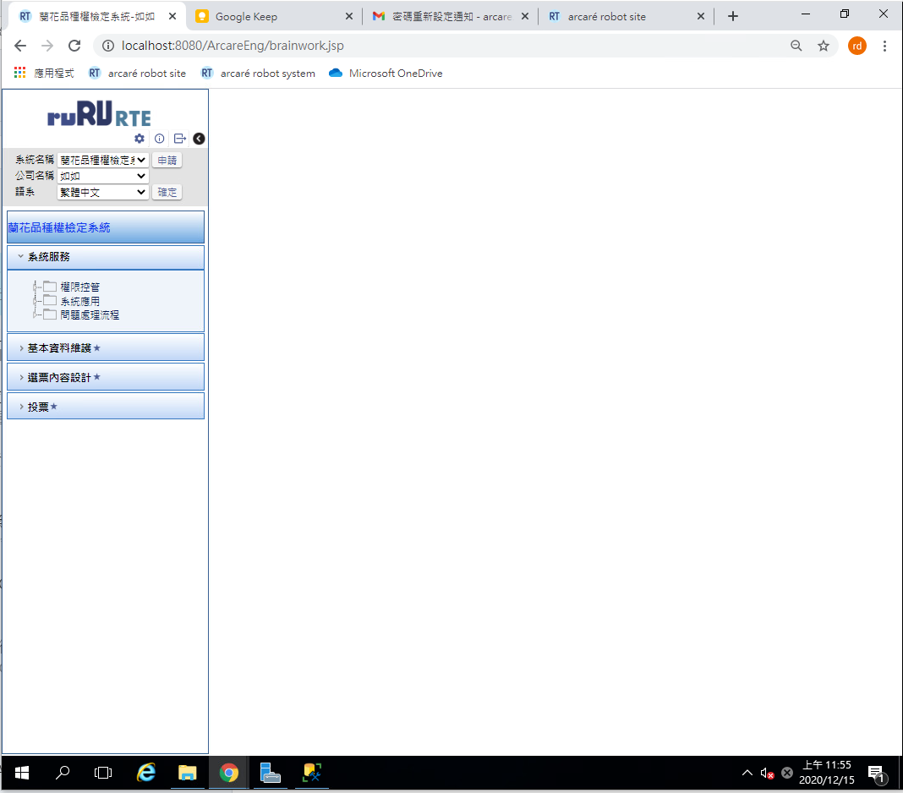
