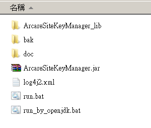
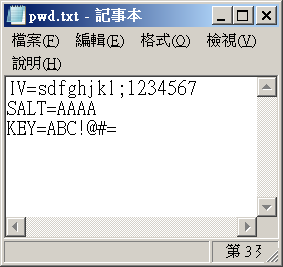
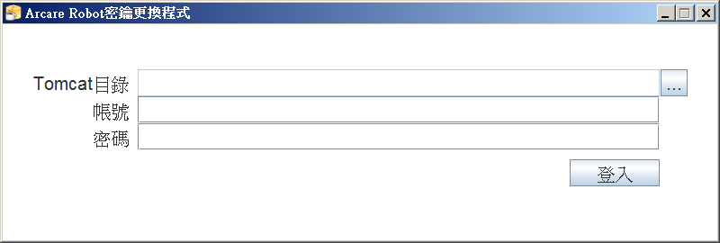
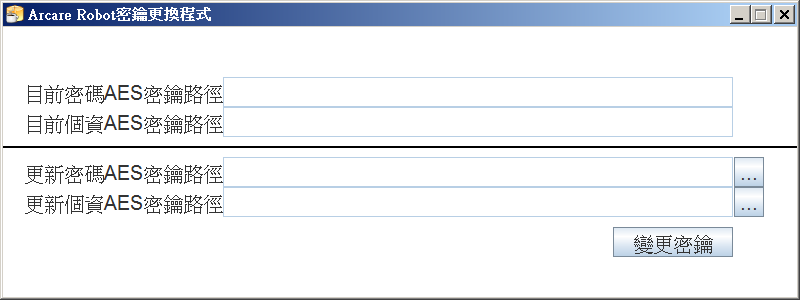
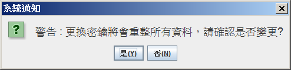
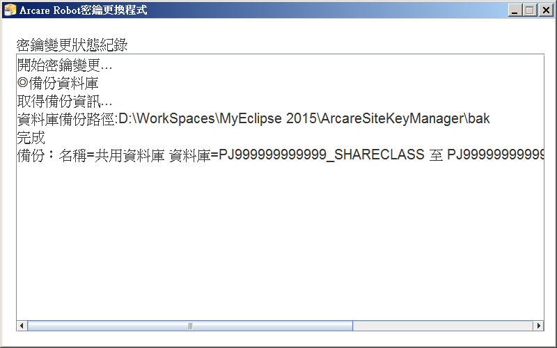

## Arcare encrypt key manager tool (AEKMT)

## 功能說明

此程式為Robot運行台更換以下AES密鑰的程式，更換密鑰清單如下:
 1. 密碼密鑰:負責加解密在運行台中設定為密碼的資料庫欄位
 2. 個資密鑰:負責加解密在運行台中設定為個資加密的資料庫欄位

## 版本

|最後更新日期|備註|
|:--:|:--:|
|2021-10-21|初版|

## 作業建議

如果你發現加密金鑰疑似外洩，可以透過該工具進行更新金鑰作業，但需要注意！更新時間需要視資料量而定，可能從數小時到數天不等，請視個案狀況妥善規劃所有作業。

## 環境需求

 1. RTE中的的應用系統，其設計功能已經有使用個資加密功能，且資料已經加密使用中。
 2. 金鑰存放路徑Tomcat服務必須具有存取權。
 3. 執行時只能在應用系統所在的伺服器執行。
 4. 請預先準備好金鑰檔案，更新舊檔案時請放至於其他路徑。
 5. 執行前所有資料庫請務必執行一次完整備份。

## 操作說明

#### 1. 聯繫ruRU窗口取得程式後，解壓縮後內容如下：

 

 圖1-1

 各項目說明如下表2-1所示:

|項目名稱|項目用途說明|
|:-:|:-:|
|ArcareSiteKeyManager_lib|變更密鑰類別庫|
|bak|執行變更密鑰時，存放備份資料庫的資料夾|
|logs|執行變更密鑰時，程式紀錄Log的資料夾|
|ArcareSiteKeyManager.jar|變更密鑰主程式|
|log4j2.xml|變更密鑰主程式Log設定檔案|
|run.bat|若運行台為安裝版的JDK，執行此批次檔案啟動程式|
|run_by_openjdk.bat|若運行台為openjdk，執行此批次檔案啟動程式|

表1-1

備註:判斷JDK的方式，打開dos視窗執行 java –version 若有出現java版本資訊表示為安裝版的JDK

#### 2. 建立金鑰檔案

金鑰檔案請依照下圖2-1中格式進行內容填寫

 

 圖2-1

- 檔案內容說明:
  - IV : AES向量參數，長度須為16 bytes
  - SALT : AES執行加密時所用的SALT，長度須為4bytes
  - KEY : AES密鑰

檔案編碼請存成UTF-8編碼

#### 3. 依照運行台環境執行run.bat / run_by_openjdk.bat後，啟動變更密鑰主程式的登入畫面，程式畫面如下圖3-1所示:

 

 圖3-1

- 畫面欄位說明如下:
    - Tomcat目錄：該欄位僅可使用開窗挑選目錄，請挑選Tomcat安裝目錄
    - 帳號：請輸入運行台Site管理員的帳號
    - 密碼：請輸入運行台Site管理員的密碼

進行完上述步驟後，點擊登入按鈕進行登入。

#### 4. 成功登入後，可看到變更密鑰設定畫面，如下圖3-2所示：

 

 圖4-1

- 畫面欄位說明如下:
    - 目前密碼AES密鑰路徑:顯示目前運行台密碼密鑰檔案的路徑
    - 目前個資AES密鑰路徑:顯示目前運行台個資密鑰檔案的路徑
    - 更新密碼AES密鑰路徑:該欄位僅可使用開窗挑選檔案，請挑選要更新的密碼密鑰檔案
    - 更新個資AES密鑰路徑:該欄位僅可使用開窗挑選檔案，請挑選要更新的個資密鑰檔案

進行完上述步驟後，請點擊變更密鑰按鈕，會彈出確認訊息視窗，如下圖3-3所示:

  

  圖4-2

若確認要變更，請點擊﹝是﹞開始進行變更，若點擊﹝否﹞則回到變更密鑰設定畫面

#### 5. 開始進行變更密鑰後，會出現密鑰變更狀態紀錄的畫面，如下圖3-4所示：

  

  圖5-1

- 在密鑰變更的過程中，會執行以下步驟:
    - 停止運行台Tomcat服務，避免密鑰變更的過程中運行台執行而造成資料錯誤
    - 備份所有運行專案資料庫(含共用資料庫、分公司資料庫)，備份路徑在程式目錄的bak下
    - 使用舊版的密碼密鑰進行Site資料庫的解密，再使用新版的密碼密鑰進行加密後，回寫至Site資料庫中
    - 使用舊版的密碼密鑰進行專案資料庫的解密，再使用新版的密碼密鑰進行加密後，回寫至專案資料庫中
    - 使用舊版的個資密鑰進行專案資料庫的解密，再使用新版的個資密鑰進行加密後，回寫至專案資料庫中

※備註：若密鑰變更的過程中有發生錯誤，程式會進行資料庫還原的動作，也可在密鑰變更狀態紀錄的畫面上看到錯誤訊息。若程式在執行變更時，被人為關閉或不可抗拒因素(關機、從工作管理員刪除…等等)，也人工手動還原資料庫，避免資料發生問題。

程式執行完畢後，請手動啟動Tomcat服務。

## 常見問題

### 啟動程式相關問題

* Q: 啟動程式時，跳出錯誤訊息﹝程式已在執行中，不可重複執行﹞ 
A: 請確認程式是否已經有開啟，若程式未開啟則表示上次程式未正常關閉，請將ArcareSiteKeyManager目錄下lock.txt手動刪除後再次啟動程式即可。

### 登入畫面相關問題

* Q: 點擊﹝登入﹞按鈕時，跳出錯誤訊息﹝引擎設定檔案(ArcareEng.xml)﹞不存在﹞ 
A:請檢查欄位.Tomcat目錄所指定的目錄是否為Tomcat安裝跟目錄(如C:\Tomcat)、以及請確認運行台是否有執行過SiteDatabaseSet.jsp進行資料庫設定。

* Q:點擊﹝登入﹞按鈕時，跳出錯誤訊息﹝帳號不存在﹞、﹝密碼錯誤﹞、﹝該帳號權限並非site manager﹞ 
A:該程式執行須Site管理員權限的帳密，上述錯誤表示並未正確輸入擁有Site管理員權限的帳號以及密碼進行登入

### 變更密鑰畫面相關問題

* Q:點擊﹝變更密鑰﹞按鈕時，跳出錯誤訊息﹝密鑰路徑未更改，不須進行密鑰變更﹞ 
A:因密鑰路徑未更改，代表不須重新進行密鑰變更的動作
