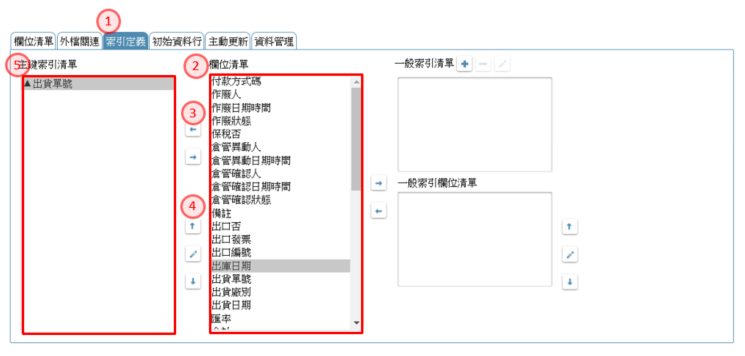
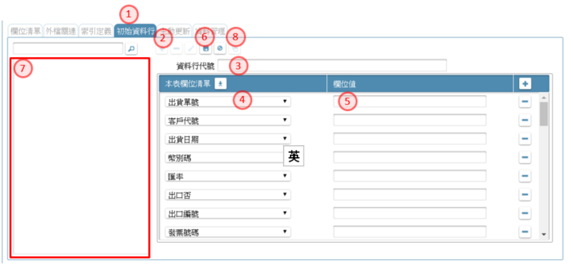
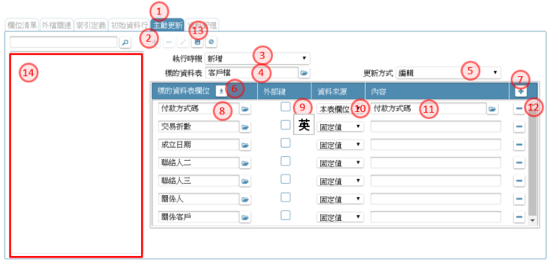

作業目的：定義資料庫裡面的各個資料表及其包含資料欄位的各項屬性。

可單擊資料表格節點後彈出【資料表】頁面  {#DBTableDefine}

資料庫資料表的定義包含下列項目： 
 - [7.1 新增資料表](#DBTableDefine_BasicSet)
 - [7.2 資料表工具列](#DBTableDefine_BasicSet2)
 - [7.3 欄位清單](#DBTableDefine_FieldList)
 - [7.4 外檔關聯](#DBTableDefine_ForeignFileRelation)
 - [7.5 索引定義](#DBTableDefine_IndexDefine)
 - [7.6 初始資料行](#DBTableDefine_InitialRecord)
 - [7.7 主動更新](#DBTableDefine_PushUpdate)
 - [7.8 資料管理](#DBTableDefine_AccessControl)
 - [7.9.以匯入方式建立資料表](#DBTableDefine_ExcelImport)

資料庫運用相關的項目： 
 - [7.10. 外部資料庫連線](#ExternalDB)
 - [7.11. 預存程序](#StoredProcedure)
 - [7.12 系統表格](#SystemTable)
 - [7.13 系統API](#SystemAPI)

## **7.1 新增資料表** {#DBTableDefine_BasicSet}
參考資料：[☢影片](https://youtu.be/lIGqUN7pAAA){:target='_blank'} [℗文件](pdf/6-2新增資料表.pdf){:target='_blank'}

1.  開啟架構樹下資料表格節點，駐留資料交易。
2.  滑鼠右鍵，彈出選單，點選「新增資料表」開啟【新增資料表】頁面，
3.  資料交易名稱：此名稱是SD在專案發展時的資源resource名稱。
4.  設定完畢後，按儲存，則此記錄新增完成

## **7.2 資料表工具列** {#DBTableDefine_BasicSet2}
> 功能說明：

1. 以頁籤方開啟多個資料表，可點選頁籤名，進行切換。
2. 新增鍵：新增一個資料表，在編輯區出現新增資料表（同7.1)。
3. 修改鍵：異動資料表基本設定。
4. 刪除鍵：刪除駐留資料表。
5. 檢錯鍵：檢查駐留的資料表格內容是否符合設定。當有異常時，會提示錯誤內容。
6. 表格欄位清單：開啟[【表格欄位清單】](17.html#TableFieldList)查詢與資料表相關的欄位資訊。操作方式請參考［17.5 表格欄位清單］
7. 規格描述：開啟[【規格描述】](06.html#SpecificationAnnotated)]說明及述敘此表格的相關事項。操作方式請參考［6.1.1］
8. 匯入鍵：以事先準備好的excel 檔，匯入產生資料表。操作方式請參考［7.9.以匯入方式建立資料表］

## **7.3 欄位清單** {#DBTableDefine_FieldList}
> 功能說明：

### **7.3.1 新增資料欄位**
參考資料：[☢影片](https://youtu.be/mfe16kTou-Q){:target='_blank'} [℗文件](pdf/6-3新增資料表欄位(資料行).pdf){:target='_blank'}

1. 點選畫面的[欄位清單]頁籤。
2. 新增鍵：點選 + 新增鍵新增資料表的資料欄位(data field)。
3. 欄位名稱：輸入資料欄位的中文名稱，為SD在規格設計時引用之名。
4. 料號：顯示此資料欄位的料號，由平台自動編定之，不可修改
5. 結構命名：輸入資料欄位的英文名稱，即是DB schema 的field name。首字必須為英文字，後續字僅可英數、底線。
6. 資料型態：挑選型態(data type)=文字/數字(bigint)/數字(int)/數字(smallint)/數字(tinyint)/數字/日期/日期時間/備註/二進位/全唯碼
7. 可變長度：指定此資料欄，存入DB時是固定或變動長度；勾選者代表為變動長度。
8. Unicode：設定本欄位是否需要Unicode編碼轉換。若勾選者在輸入不同語系文字時可自動轉換。
9. 資料長度：輸入資料欄位的長度；小數位：若型態為數字, 進階指定小數位數
10. 初始值：輸入本資料欄位的初始值
11. 允空值：指定本資料欄位是否允許空值
12. 密碼處理：指定本欄位是否受在表單呈現時，以密碼方式處理；限制不可為鍵值或個資加密欄位；必須為文字型態欄位
13. 個資加密：指定本欄位儲存到資料庫時，是否採加密模式；限制不可為鍵值或序號、備註、二進位欄位型態；外部資料庫連線者，不允設定個資加密。
14. 鍵值：指定本資料欄位是否為鍵值欄位key field
15. 檔案唯一號：指定本欄位是否為檔案傳輸中記錄上下傳檔案的唯一號用途；僅適用於欄位型態=全唯碼　者
16. 儲存鍵：設定完畢後，點選本鍵則此資料欄位新增完成

### **7.3.2 修改資料欄位**
參考資料：[☢影片](https://youtu.be/At5YerlHL8c){:target='_blank'} [℗文件](pdf/6-4修改資料表欄位(資料行).pdf){:target='_blank'}

1. 在元件清單裡，駐留指定要修改的資料欄位名稱。
2. 修改鍵：點選本鍵修改資料表的資料欄位(data field)。
3. 各欄位的說明同［7.3.1 新增資料欄位］
4. 儲存鍵：修改完畢後，點選本鍵則此資料欄位異動完成

### **7.3.3 刪除資料欄位**
> 功能說明：

1. 在元件清單裡，駐留指定要刪除的資料欄位名稱。
2. 刪除鍵：點選本鍵刪除資料表的資料欄位(data field)。系統會提示訊息要求再次確認

### **7.3.4 與其它資料欄位相關**
> 功能說明：

1. 規格描述：開啟[【規格描述】](06.html#SpecificationAnnotated)說明及述敘此欄位的相關事項。操作方式請參考［6.1.1］
2. 同步參考欄位：開啟[【同步參考欄位】](17.html#TableFieldSync)查詢與資料表相關的欄位資訊。操作方式請參考［17.5.1 同步參考欄位］
3. 引用：可指定引用的來源為表格或欄位
4. 關鍵字：指定搜尋的資料表名稱或欄位名稱
5. 搜尋鍵：在指定引用來源及輸入關鍵字後，利用本鍵找出與有關的欄位, 進行標註點選
6. 複製清單：系統載入符合條件的內容，可單選或複選(Ctrl+Click)多筆記錄
7. 複製鍵：將欄位指定的欄位複製到欄位元件清單

## **7.4 外檔關聯** {#DBTableDefine_ForeignFileRelation}
> 功能說明：為了保護被引用的資料，不會被任意刪除，進而造成資料失聯。例如：部門檔中有部門代碼欄位，員工檔內也有儲存部門代碼，若在員工檔設定使用登冊，可以在部門檔資料被刪除時，檢查該部門代碼是否被員工檔引用，若被引用則會不允刪除

參考資料：[☢影片](){:target='_blank'} [℗文件](pdf/6-9外檔關連設定.pdf){:target='_blank'}

1. 點選畫面的[外部關連]頁籤。
2. 駐留根節點的資料表(以下簡稱A表)
3. 新增鍵：新增資料表的關連表格。
4. 被關連表格名：挑選指定與本資料表有關連的。(以下簡稱B表)
5. 關聯型態：說明兩者的關係一對一、一對多、多對一、多對多
6. 使用中的防護：當A表使用到B表的欄位時，若B表的欄位被刪除時, A表的欄位會產生失聯現象；勾選本欄位的作用於在Ｂ表的欄位修改或刪除時，受到Ａ表的檢查，必須是不存在Ａ表使用中的才可執行動作，由此產生防護的作用。
7. 儲存鍵：設定表格完畢後，點選本鍵存回關連表格
8. 駐留要設定關連的資料表格
9. 連結欄位：指定B表的與A表有關的資料欄位。
10. 連結本表欄位：指定A表的與B表有關的資料欄位。
11.  關連新增鍵：建立儲存關連記錄
12.  關連刪除鍵：刪除駐留的的關連記錄
13.  關連修改鍵：異動駐留的的關連記錄

## **7.5 索引定義** {#DBTableDefine_IndexDefine}
> 功能說明：資料庫的資料表是依據創建(create) 的時間順序存放的，很難直接找到你所需要的資料(只能sequencial serach)；所以，為了提高資料讀取的效率，就必須建立索引檔，設定其排序的規則，包含資料欄位及升降冪，日後資料表資料新增的同時，也會在各個索引檔內增加一筆資料，插入在其排序中的位置，可能會發生索引檔的分割(split) 來安插這一筆資索引紀錄(record)，指到其對應所資料表紀錄的位置。一個資料表可以同時設定多個索引檔來滿足各種不同的使用需求，但是，索引檔太多也會產生系統額外的負擔加大，必須恰當使用，以維護系統效能。

參考資料：[☢影片](https://youtu.be/-1G2Z3ippEY){:target='_blank'} [℗文件](pdf/6-6設定索引.pdf){:target='_blank'}

### **7.5.1 設定主索引**

1. 點選畫面的[索引定義]頁籤。
2. 元件清單：顯示本資料表格所有的欄位；可點選指定
3. 列入鍵：將駐留在元件清單裡的欄位，設定為主鍵值；設定後會出現在[主鍵清單]裡
4. 取消鍵：將駐留在[主鍵清單]欄位，取消為主鍵的設定；設定後會從在[主鍵清單]裡消失
5. 主鍵清單：顯示所有設定為主鍵的欄位

### **7.5.2 設定副索引**

1. 點選畫面的[索引定義]頁籤。
2. 新增鍵：建立新的索引；點選後開啟 [新增索引] 視窗
3. 索引名稱：輸入索引名稱。同一表格裡索引名稱不可重複
4. 儲存鍵：存回指定的索引名稱
5. 索引清單：顯示所有設定為索引的內容。主索引為系統內定
6. 元件清單：挑選要加入索引的欄位。
7. 加入鍵：將駐留在[元件清單]裡的欄位，列入[排序清單]裡
8. 排序清單：顯示依駐留在索引清單的記錄，所設定排序欄位內容
9. 上移鍵：將駐留在[排序清單]裡的欄位，順序往上移；影響[排序清單]
10. 下移鍵：將駐留在[排序清單]裡的欄位，順序往下移；影響[排序清單]
11. 排序鍵：改變駐留在[排序清單]裡的欄位，排序的生降冪；點選後開啟 [切換排序] 視窗
12. 排序方式：下拉挑選升冪/降冪
13. 儲存鍵：儲存設定內容

## **7.6 初始資料行** {#DBTableDefine_InitialRecord}
> 功能說明：準備一些基本資料，當資料庫初始化後，可以直接載入作為基本資料來支持表單的運作，例如比較標準的項目代號一覽表。

參考資料：[☢影片](https://youtu.be/vigF4xeSem0){:target='_blank'} [℗文件](pdf/6-7初始資料設定.pdf){:target='_blank'}

1. 點選畫面的[初始資料行]頁籤。
2. 新增鍵：點選 + 新增鍵新增資料表的初始記錄。
3. 資料行代號：輸入資料行中文名稱，同一資料表資料行名稱不允重複。
4. 載入鍵：載入資料表的所有欄位在清單中。
5. 欄位值：輸入本筆資料欄位要預設的內容值
6. 儲存鍵：設定完畢後，點選本鍵則新增完成；新增記錄顯示在[資料行清單]
7. 資料行清單：顯示已建立的資料行內容；可利用駐留指定切換欄位清單的記錄內容
8. 複製鍵：可複製駐留在[資料行清單]內的記錄內容

## **7.7 主動更新** {#DBTableDefine_PushUpdate}
> 功能說明：為了維持兩個關聯度極高的資料表之間的資料正確性，可使用連續處發功能來達成。例如：A資料表儲存訂單基本資料，B資料表儲存訂單明細資料，當A資料表的資料被刪除時，也必須連帶刪除B資料表的對應資料，就可在A資料表上設定連續觸發功能。

參考資料：[☢影片](https://youtu.be/TGteH6RoWYk){:target='_blank'} [℗文件](pdf/6-8主動更新(Trigger)設定.pdf){:target='_blank'}

1. 點選畫面的[主動更新]頁籤。
2. 新增鍵：點選 + 新增鍵新增資料表的更新動作。
3. 執行時機：選擇執行時機 新增／修改／刪除。(本資料表資料受到何種影響時要執行)。
4. 標的資料表：選擇標的資料表名稱。(連帶要影響的資料表)
5. 更新方式：選擇更新方式　新增／修改／刪除。(要如何異動被連帶影響的表格)
6. 載入鍵：載入資料表的所有欄位在清單中。
7. 資料列新增鍵：點選 + 新增鍵新增做為比對依據的資料列。
8. 標的資料表欄位：點選標的資料表中的欄位名。(依據標的資料表的哪個欄位異動標的資料表的資料)
9. 外部鍵：若要符合條件才異動標的資料表的資料，請勾選此欄位。
10. 資料來源：選擇資料來源。(固定值：標的資料表的欄位符合某個固定值就異動。本表欄位：目的資料表的指定欄位值與本張資料表的指定欄位值相符合才異動)
11. 內容：輸入要對應的固定值或是本表欄位。
12. 資料列刪除鍵：刪除不須要的資料列。
13. 儲存鍵：設定完畢後，點選本鍵則新增完成；新增記錄顯示在[資料行清單]
14. 主動更新清單：顯示已建立的資料行內容；可利用駐留指定切換欄位清單的記錄內容

## **7.8 資料管理** {#DBTableDefine_AccessControl}

1. 點選畫面的[資料管理]頁籤。
2. 修改鍵：進入修改資料表的動作。
3. 歸屬資料庫：設定為系統共用，表示本資料表在各分公司都必須使用，在安裝時會放在share-class內。
4. 歸屬資料庫：設定為分公司專用，表示此資料表存在個別公司架構下的資料庫裡(每個公司有一個DB instant)
5. 歸屬資料庫：設定為其它，表示此資料表非本系統管控，而是在連線允許的狀況態可存取的其它資料庫
6. 其它資料庫名：當歸屬資料庫設定為其它時，須指定該資料庫的連線設定。原設定請參考［7.10］
7. 永久保存：此資料表如果是作業處理中的一個資料暫存區域，則屬與非永久保存，運行時在該表單作業完成後，這個資料鰾內的紀錄就被刪4除，以節省資料庫空間，並且維持資料庫效率。預設為[是]，若否，則產出在暫存用的MDB檔。
8. 儲存鍵：設定完畢後，點選本鍵儲存內容

## **7.9 從EXCEL載入Table Schema** {#DBTableDefine_ExcelImport}
> 功能說明：為了讓舊系統的轉換(proting) 更加快速，可以將其schema 整理為EXCEL格式，直接匯進來產生資料表，也可以同時產生檢視表，作為自動(從檢視表) 繪製表單畫面之用。

參考資料：[☢影片](https://youtu.be/oI7O6CaQJdM){:target='_blank'} [℗文件](pdf/6-10以匯入方式建立資料表.pdf){:target='_blank'}

1. 匯入鍵：在資料表加註畫面點選匯入功能按鍵。
2. 檔案新增鍵：增加一筆資料列
3. 來源檔案：選擇要匯入的檔案。
4. 產生檢視表：可選擇是否要在匯入資料表後，自動產成檢視表(View)。
5. 執行結果：顯示駐留的資料列，執行匯入後的狀態
6. 詳細鍵：當執行異常時，可利用本鍵開啟錯誤的訊息檔內容
7. 檔案刪除鍵：刪除留的資料列
8.執行鍵：開始匯入動作。執行完畢後，可查詢詳細執行結果

### **7.9.1 匯入資料表的格式**
>EXCEL 格式說明

|**Col#**|**填寫欄位**|**內容長度**|**填寫說明**|
| :-: | :-: | :-: | :- |
|A|表格中文名|80|資料庫資料表格的中文名稱|
|B|表格英文名|20|資料庫資料表格的英文名稱，使用於 database schema, 所以不能夾雜特殊符號與空格，可以包含大小寫英文字母及底線(underline \_ )。必須是唯一的|
|C|欄位中文名|80|資料庫資料欄位的中文名稱|
|D|欄位英文名|20|資料庫資料欄位的英文名稱，使用於 database schema, 所以不能夾雜特殊符號與空格，可以包含大小寫英文字母 必須是唯一的，最起碼在同一個資料表內是唯一|
|E|可否空值|1|是否可以為 Null?  Y.可 N.不可, 沒填值時預設為Y|
|F|初始值|80|　|
|G|資料型態|8|位元/文字/整數(bigint)/整數(int)/整數(smallint)/整數(tinyint)/數字/日期/日期時間/備註/二進位/全唯碼|
|H|可變長度 |1|是否可以為變動長度? Y.是|
|I|Unicode|1|是否是否需要Unicode編碼轉換 ? Y.是|
|J|序號|1|是否由系統產生序號? Y.是|
|K|長度|5|資料長度|
|L|小數位數|2|小數點以下的位數長度。沒填值, 預設為0|
|M|個資加密|1|Y.是 N.否, 沒填值, 預設為N|
|N|密碼處理|1|Y.是 N.否, 沒填值, 預設為N|
|O|檔案唯一號|1|Y.是 N.否, 沒填值, 預設為N|
|P|鍵值欄位|1|是否為 key field? Y. 是 N.否, 沒填值, 預設為N|

依此規格，一個工作表內可以敘述多個資料表的資訊，以前兩欄的資料表名稱可以清楚區分。

### **7.9.2 EXCEL 範例**

執行結果：
1. 在專案資源區的資料表內可以找到新增的客戶檔和客戶聯絡人檔
2. 在專案資源區的檢視表內可以找到新增的且與資料表同名的檢視表客戶檔和客戶聯絡人檔
3. 點開檢視表：客戶檔，可以在其結構展開的頁籤中看到資料表的連結

## **7.10 外部資料庫連線** {#ExternalDB}

1. 新增鍵：可利用本鍵，進入新增模式
2. 連線名稱：可利用開窗鍵, 開啟[【多語詞庫】](16.html#MaintainMultilingual)指定挑選詞庫，操作方法請參考［16.2］, 來指定函數的名稱
3. 跨機台：指定資料庫是否同在一個DB Server．版本808.8以前均只提供同機台資料庫
4. 資料庫類型：指定資庫的類型，下拉：MSSQL/MYSQL/ORACLE，版本808.8以前均只提供MS-SQL資料庫
5. 料號：顯示料號
6. 連線說明：自行輸入
7. 儲存鍵：可利用本鍵，儲存內容到資料庫
8. 關鍵字：輸入指定的關鍵字，以方便搜尋查詢
9. 搜尋鍵：濾出符合關鍵字的內容到速查清單
10. 速查清單：經由搜尋鍵查出符合關鍵字的內容清單，可駐留指定記錄，查詢進而編修內容

## **7.11 預存程序** {#StoredProcedure}

1. 新增鍵：可利用本鍵，進入新增模式
2. 預存程序名稱：可利用開窗鍵, 開啟[【多語詞庫】](16.html#MaintainMultilingual)指定挑選詞庫，操作方法請參考［16.2］, 來指定預存程序的名稱,以下簡稱SP
3. 歸屬資料庫：指定SP附掛的資料庫資料，下拉選項：系統/分公司/其它
4. 資料庫類型：指定資庫的類型，下拉：MSSQL/MYSQL/ORACLE，版本808.8以前均只提供MS-SQL資料庫
5. 資料庫名稱：當歸屬資料庫=其它 時致能，挑選顯示 共用_專案資源:A14外部資料庫連線
6. 程式說明：自行輸入
7. 參數設定：呼叫ＳＰ時必須傳入的參數
8. 回傳結果：執行ＳＰ後預計得到的內容
9. 儲存鍵：可利用本鍵，儲存內容到資料庫
10. 關鍵字：輸入指定的關鍵字，以方便搜尋查詢
11. 搜尋鍵：濾出符合關鍵字的內容到速查清單
12. 速查清單：經由搜尋鍵查出符合關鍵字的內容清單，可駐留指定記錄，查詢進而編修內容

## **7.12 系統表格** {#SystemTable}
> 作業目的：平台提供系統管理工具時, 會有部份資料表可開放給設定系統時引用, 例如: 使用者帳號, 角色權限等, 萬年曆 等, 我們稱之為「系統表格」；在設計系統時，若有相關需要時可執行引用，讓專案可以使用系統工具的資料表。

參考資料：[☢影片](https://youtu.be/v1tzFeug3ss){:target='_blank'} [℗文件](pdf/18-15系統表格.pdf){:target='_blank'}

### **7.12.1 新增引用系統表格**
> 作業目的：將系統表格引用到指定的專案中，方便後續的查表或異動動作。

1. 關鍵字：輸入系統表格的關鍵字
2. 搜尋鍵：點選本鍵，將符合關鍵字的表格列入清單中
3. 表格清單：駐留到引用的表格名稱記錄
4. 複製引用：點選本鍵，將指定的表格納入本專案的資料表中，供後續引用
5. 存取權限：說明本系統表格是否允許在過帳時進行增修或刪除的異動
6. 引用清單：顯示本系統表格被引用的專案清單
7. 資料表：複製引用鍵, 會在資料表新增記錄
8. 系統表格：複製引用鍵, 會在資料表新增記錄, 並標示為系統表格，不允異動刪除

### **7.12.2 系統表格同更新**
> 作業目的：當系統表格的結構有異動時，受收到異動的通知，必須執行同步的動作，資料結構才會一致。

1. 差異：當系統表格有異動時，除了收到郵件通知外，本欄位會出現打勾的狀態
2. 同步更新：點選本鍵，依最近的結構，更新到資料表格裡。

### **7.12.3 系統表格清單**
> 作業目的：系統提供的可引用的表格清單。

|系統表格名稱|系統資料表名|主要用途|
| :- | :- | :- |
|SYS_工作排程執行LOG|SYS_TASKLOG|系統執行排程後的歷程資料|
|SYS_系統API|UTL_SYAPISET|系統提供的API清單|
|SYS_系統API_接收|UTL_APIJRCE|系統提供的API接收參數的明細|
|SYS_系統API_傳遞|UTL_APIJTNS|系統提供的API傳遞參數的明細|
|SYS_系統參數|SYS_PARAM|系統設定的參數內容|
|SYS_系統專案版本資訊|SYS_INSTALL2|系統專案版本資訊|
|SYS_系統語言|UTL_SYSLANG|各專案使用的語系的清單|
|SYS_表格清單|SYS_TBLS|各專案使用的資料表的清單|
|SYS_表格鍵值欄位清單|SYS_TBLPKEYS|各專案使用資料表的鍵值清單|
|SYS_解鎖工具|SYS_LOCKHANDLE|運行狀態下已鎖定的清單|
|SYS_輸出LOG|SYS_OUTPUTLOG|系統執行匯出、報表等的歷程資料|
|UTL_API限定來源檔|UTL_APIIPLIMITED|呼叫API限定來源白名單|
|UTL_BOM展開暫存檔|UTL_CACHE|使用展BOM的邏輯函數時,暫存的資料|
|UTL_元件代號|UTL_COMP|各專案表報上的元件內容|
|UTL_伺服器主檔|UTL_SERVERSET|系統工具上伺服器的設定資訊|
|UTL_表單勾選記錄檔|UTL_CHBOXLOG|表單在進行勾選時的鍵值|
|UTL_表單引用單元|UTL_FMDUSUT|表單設定欄位被引用檢查清單|
|UTL_專案清單|UTL_PROJLS|同一系統上安裝專案的清單|
|UTL_幣別設定|UTL_CURRENCY|系統工具提供的幣別選項|
|UTL_編碼模版主檔|UTL_PICTYPEN|系統工具提供的模版範本|
|UTL多語_多語言編輯表身|UTL_LANGETB|專案的多語言詞庫|
|UTL多語_系統多語言詞庫主檔表身|UTL_SLANGSB|專案的多語言詞庫|
|UTL多語_系統多語言詞庫主檔表頭|UTL_SLANGSH|專案的多語言詞庫|
|UTL多語_系統多語言編輯表身|UTL_SLANGETB|專案的多語言詞庫|
|UTL專案_API查詢資料設定檔|UTL_APIDATAQUERYH|專案使用的API查詢資料的設定|
|UTL專案_API查詢資料設定參數檔|UTL_APIDATAQUERYB|專案使用的API查詢資料的參數明細|
|UTL專案_MAIL來源欄位明細|UTL_MAILFLDS|專案使用MAIL發送的變動欄位|
|UTL專案_工作排程執行方式設定|SYS_TASKB|專案各工作排程執行設定|
|UTL專案_工作排程清單|UTL_TASK|專案各工作排程的清單|
|UTL專案_外部呼叫功能鍵_接收|UTL_EXCAFNI|專案開放外部呼叫功能鍵的接收參數|
|UTL專案_外部呼叫功能鍵_傳遞|UTL_EXCAFNS|專案開放外部呼叫功能鍵的傳遞參數|
|UTL專案_外部呼叫功能鍵表頭|UTL_EXCAFNH|專案開放外部呼叫功能鍵的清單|
|UTL專案_外部程式設定|UTL_APISET|專案對外呼叫API清單|
|UTL專案_表單功能鍵代號檔|UTL_FUNC|專案的表單上功能鍵清單|
|UTL專案_表單資訊檔|UTL_FRMINFO|專案的表單資訊|
|UTL專案_表單對應多語清單|UTL_FMDLGST|專案的表單多語系清單|
|UTL專案_表單編碼原則變動欄位清單|UTL_INNOPICL|專案使用編碼原則裡的變動欄位清單|
|UTL專案_表單檔|UTL_PJFMDLS|專案的表單清單|
|UTL專案_單據編碼重新依據檔|UTL_FCAGAIN|專案使用模版裡設定重新編碼的依據|
|UTL專案_單據編碼原則表身檔|SYS_NOPIC_B|專案使用的單據編碼的條件明細|
|UTL專案_單據編碼原則表頭檔|SYS_NOPIC_H|專案使用的單據編碼的清單|
|UTL專案_報表元件代號|UTL_RPDCOMP|專案的報表清單|
|UTL專案_報表元件對應條文設定|UTL_RPDNOH|專案報表對應條文設定|
|UTL專案_報表條文|UTL_LAWNO|專案的報表使用的條文設定|
|UTL專案_報表資訊檔|UTL_RPDINFO|專案的報表資訊|
|UTL專案_發送MAIL設定|UTL_FORMALSET|專案使用發送MAIL的設定|
|UTL專案_發送MAIL替換字設定|UTL_FORMABST|專案使用發送MAIL的裡有替換字的明細|
|UTL專案_資料交換輸出設定檔|UTL_OUTSET|專案使用資料交換輸出的清單|
|UTL專案_圖示設定|SYS_ICON|專案使用圖示的清單|
|UTL專案_模版設定|SYS_CTRLPICT|專案使用資料模版的清單|
|UTL專案_模版設定_遮罩位置|SYS_CTRLPICT_COVER|專案使用資料模版裡遮罩位置明細|
|UTL專案_輸入來源資料|UTL_INSET_SOURCE|專案使用輸入來源資料|
|UTL專案_輸入設定|UTL_INSET|專案使用輸入清單|
|UTL專案_輸出入實體欄位明細|UTL_FLDS|專案使用輸出入欄位明細|
|UTL專案_輸出來源資料|UTL_OUTSET_SOURCE|專案使用輸出來源資料|
|UTL專案_輸出排序設定|UTL_OUTODBY|專案使用輸出的排序內容|
|UTL專案_檔案櫃設定|UTL_FILESET|專案使用檔案櫃的資訊|
|UTL組織_組織名稱多語檔|SYS_CORP_NAME|系統工具建置組織的名稱多語清單|
|UTL組織_組織編制計劃檔|UTL_ORGPLAN|系統工具建置組織編制計劃清單|
|UTL組織_組織檔|SYS_CORP|系統工具建置組織清單|
|UTL登入_公司權限檔|UTL_ORGBRAN|系統工具管理使用者可登入組織的記錄|
|UTL登入_使用者帳號檔|UTL_USERINFO|系統工具管理使用者帳號的清單|
|UTL登入_前置處理主檔|UTL_LAFTEMST|系統工具管理專案設定使用者登入時可選擇前置處理作業|
|UTL萬年曆_日期檔|UTL_CALENDARMD|系統工具供萬年曆使用的月份(1~12)、日期(1~31)計43筆固定資料|
|UTL萬年曆_月份檔|UTL_CALENDARMONTH|系統工具建置萬年曆中的月份(一年12筆)|
|UTL萬年曆_每週第一天|UTL_YEARWEEKONE|系統工具建置萬年曆中的每週第一天(一年52筆)|
|UTL萬年曆_萬年曆檔|UTL_CALENDAR|系統工具建置萬年曆中的日期(一年365筆)|
|UTL選單_系統選單主檔|UTL_SYSFLOWINFO|系統工具設定選單的清單|
|UTL選單_系統選單對應表單|UTL_SYSFLOWFRM|系統工具設定選單點擊時對應表單|
|UTL選單_選單下表單資訊檔|UTL_FLOWFRM|系統工具設定選單下的表單清單|
|UTL選單_選單資訊檔|UTL_FLOWINFO|系統工具設定選單的資訊|
|UTL權限_人員角色別設定檔|UTL_PJOBINER|系統工具設定權限時指定人員對角色的清單|
|UTL權限_人員組織別設定檔|UTL_BRANCH|系統工具設定權限時指定人員對組織的清單|
|UTL權限_角色表單別權限檔|UTL_GRFRMLUB|系統工具設定權限時角色對表單的權限|
|UTL權限_角色按鍵別權限檔|UTL_GRFMSYSET|系統工具設定權限時角色對表單功能鍵的權限|
|UTL權限_角色選單別權限檔|UTL_FLOWGRLU|系統工具設定權限時角色對選單的權限|
|UTL權限_角色檔|UTL_GROUPMS|系統工具設定權限區分角色的清單|
|UTL權限_保密群組表單元件檔|UTL_PASSB|系統工具設定保密群組下表單的保欄密欄位|
|UTL權限_保密群組對應角色檔|UTL_PASSGRST|系統工具設定權限時角色對保密群組的權限|
|UTL權限_保密群組檔|UTL_PASSH|系統工具設定的保密群組清單|
|WFS_表報流程附件內容檔|WFS_FMDRPTFLOWATTFL|表報在執行簽核流程時,所設定的附件|
|WFS_表報流程重簽條件檔|WFS_FMDRPTFLOWCOND|表報在執行簽核流程時,所設定的重送的條件|
|WFS_表報流程設定檔|WFS_FMDRPTFLOWH|WFS_表報流程設定檔|
|WFS_單據送簽記錄附件檔|WFS_SIGNDATAFILE|簽核模組設定單據送簽附件的資料|
|WFS_單據送簽記錄檔|WFS_SIGNDATA|簽核模組設定單據送簽的資料|
|WFS_單據簽核查詢作業表身|WFS_FRPWHB|簽核模組設定單據簽核查詢作業表身|
|WFS_單據簽核關卡加簽郵件替代檔|WFS_SIGNSTAGEADDPARA|簽核模組設定單據簽核關卡加簽郵件替代的資料|
|WFS_單據簽核關卡歷程檔|WFS_SIGNSTAGEHIS|簽核模組設定單據簽核關卡歷程的資料|
|WFS_單據簽核關卡檔|WFS_SIGNSTAGE|簽核模組設定單據簽核關卡的資料|
|WFS_簽核人員代理檔|WFS_SIGNAGENT|簽核模組設定簽核人員代理的資料|
|WFS_簽核人員匯入暫存檔|WFS_USERLISTTMP|簽核模組設定簽核人員匯入暫存的資料|
|WFS_簽核人員檔|WFS_USERLIST|簽核模組設定簽核人員的資料|
|WFS_簽核流程定義參數檔|WFS_FLOWPARAMETER|簽核模組設定簽核流程定義參數的資料|
|WFS_簽核流程定義郵件替代參數檔|WFS_FLOWMAILPARA|簽核模組設定簽核流程定義郵件替代參數的資料|
|WFS_簽核流程定義檔|WFS_FLOW|簽核模組設定簽核流程定義的資料|
|WFS_簽核流程定義簽核人員檔|WFS_FLOWIITEMSIGN|簽核模組設定簽核流程定義簽核人員的資料|
|WFS_簽核流程定義關卡條件檔|WFS_FLOWITEMCOND|簽核模組設定簽核流程定義關卡條件的資料|
|WFS_簽核流程項次檔|WFS_FLOWITEM|簽核模組設定簽核流程項次的資料|
|WFS_簽核專案編制人員檔|WFS_PRJUSERLIST|簽核模組設定簽核專案編制人員的資料|
|WFS_簽核專案編制結構檔|WFS_PRJSTRUCTURE|簽核模組設定簽核專案編制結構的資料|
|WFS_簽核專案檔|WFS_PRJINFO|簽核模組設定簽核專案的資料|
|WFS_簽核組織單位匯入暫存檔|WFS_ORGTABLETMP|簽核模組設定簽核組織單位匯入暫存的資料|
|WFS_簽核組織單位檔|WFS_ORGTABLE|簽核模組設定簽核組織單位的資料|
|WFS_簽核組織編制人員檔|WFS_ORGJOBPOS|簽核模組設定簽核組織編制人員的資料|
|WFS_簽核組織編制結構檔|WFS_ORGSTRU|簽核模組設定簽核組織編制結構的資料|
|WFS_簽核組織編制檔|WFS_ORGVER|簽核模組設定簽核組織編制的資料|
|WFS_簽核催簽設定檔|WFS_PUSHSIGN|簽核模組設定簽核催簽設定的資料|
|WFS_簽核催簽郵件替代參數檔|WFS_WPUSHMAILSWAP|簽核模組設定簽核催簽郵件替代參數的資料|
|WFS_簽核編制匯入暫存檔|WFS_ORGSTRUTMP|簽核模組設定簽核編制匯入暫存的資料|
|                     |                       |                                      |

## **7.13 系統API** {#SystemAPI}
> 作業目的：為了開放此專案內的資源給外部系統使用，平台提供了四個API讓外部系統呼叫。

### **7.13.1 新增資料表記錄**
> API名稱：http://ip:port/ArcareEng/ProjectAppendService
>
> 功能說明：新增專案中的實體資料，以下範例為新增資料到指定專案的兩個實體中

|類別|順序|參數名稱|參數型態|
| :- | :-: | :- | :- |
|傳遞|1|專案全唯碼(型態:字串)|字串|
|傳遞|2|分公司全唯碼(型態:字串)|字串|
|傳遞|3|要新增到專案的實體清單(型態:JSON陣列)|陣列|
|傳遞|4|專案全唯碼(型態:JSON物件)|物件|
|傳遞|5|實體英文名(型態:字串)|字串|
|傳遞|6|是否為共用資料庫實體(型態:布林)|布林|
|傳遞|7|要新增的實體資料列(型態:JSON陣列)|陣列|
|傳遞|8|要新增的實體資料行(型態:JSON物件)|物件|
|傳遞|9|欄位內容值(key:欄位名稱)|　|
|接收|1|執行結果(型態:布林)|布林|
|接收|2|執行失敗時的錯誤訊息(型態:字串)，執行失敗時才有此參數|字串|

### **7.13.2 資料表記錄的增刪查改**
> API名稱：<http://ip:port/ArcareEng/ProjectDataService>
>
> 功能說明：呼叫運行系統中，資料表記錄的增刪查改

|類別|順序|參數名稱|參數型態|
| :- | :- | :- | :- |
|傳遞|1|專案全唯碼(型態:字串)|字串|
|傳遞|2|分公司全唯碼(型態:字串)|字串|
|傳遞|3|異動的實體表格英文名(型態:字串)|字串|
|傳遞|4|實體表格在共用資料庫否(型態:布林)|布林|
|傳遞|5|異動類型(型態:數字，1.新增/2.修改/3.查詢/4.刪除)|數字|
|傳遞|6|過濾式(型態:字串)|字串|
|傳遞|7|異動欄位陣列(型態:一維JSON物件陣列)|陣列|
|傳遞|8|異動欄位(型態:JSON物件)|物件|
|傳遞|9|異動欄位名稱(型態:字串)|字串|
|傳遞|10|異動欄位內容值(型態:依異動欄位資料型態而定)|　|
|接收|1|執行結果(型態:布林)|布林|
|接收|2|執行失敗時的錯誤訊息(型態:字串)|字串|
|接收|3|:執行查詢時的資料紀錄(型態:一維JSON物件陣列)|陣列|
|接收|4|紀錄欄位(型態:JSON物件)|物件|
|接收|5|欄位內容值(key:欄位名稱)|　|

### **7.13.3 呼叫指定功能鍵**
> API名稱：<http://ip:port/ArcareEng/ProjectPsdService>
>
> 功能說明：呼叫指定功能鍵

|類別|順序|參數名稱|參數型態|
| :- | :- | :- | :- |
|傳遞|1|專案全唯碼(型態:字串)|字串|
|傳遞|2|語言別(型態:數字)，不帶的話，預設給950|數字|
|傳遞|3|功能鍵料號(型態:字串)|字串|
|傳遞|4|分公司全唯碼(型態:字串)|字串|
|傳遞|5|使用者自定義參數(型態:物件，內容為{"參數名稱":"參數內容值}")|物件|
|接收|1|執行結果(型態:布林)|布林|
|接收|2|中間台引擎回傳值(執行成功時才有此參數，型態:任意)|　|
|接收|3|錯誤訊息(執行失敗時才有此參數，型態:字串)|字串|
|接收|4|中間台引擎回傳的BPS資訊，型態:字串|字串|

### **7.13.4 呼叫查詢資料**
> API名稱：<http://ip:port/ArcareEng/ProjectQueryService>
>
> 功能說明：呼叫在運行專案中設定好查詢資料的API

|類別|順序|參數名稱|參數型態|
| :- | :- | :- | :- |
|傳遞|1|專案全唯碼(型態:字串)|字串|
|傳遞|2|分公司全唯碼(型態:字串)|字串|
|傳遞|3|API代號(型態:字串)|字串|
|傳遞|4|自訂參數物件(型態:物件)|物件|
|傳遞|5|自訂參數|　|
|接收|1|執行結果(型態:布林)|布林|
|接收|2|執行失敗時的錯誤訊息(型態:字串)，執行失敗時才有此參數|字串|
|接收|3|執行查詢時的資料紀錄(型態:一維JSON物件陣列)|陣列|
|接收|4|紀錄欄位(型態:JSON物件)|物件|
|接收|5|欄位內容值(key:欄位名稱)|　|

---
[**回到章節目錄**](index.html#MainMenu)