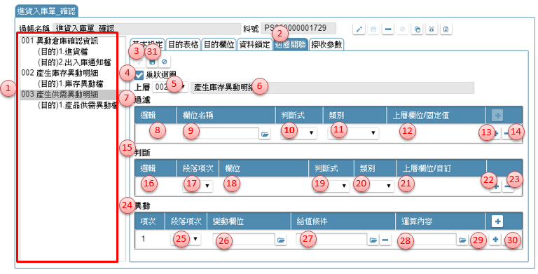

# 摘要說明
對於較複雜的資料庫更新作業，不是系統的標準新增/新增存回，修改/修改存回所能滿足時，設計者必須另外撰寫資料庫更新的處理條件與邏輯。

流程架構可參考[附錄C](#AppendixC) 過帳架構及案例說明

參考資料：[影音集(DataTrans)](https://help.arcare-robot.com/IDE/8831/Vedio/ruRU_IDE-Vedio.html#DATATRANS) 

[FAQ相關](https://help.arcare-robot.com/IDE/8831/FAQ/ruRU_IDE-FAQ.html#DATATRANS)

資料交易操作包含以下項目： 
- [**12.1 新增資料交易** ](#Posting)	
- [**12.2 資料交易工具列** ](#PostingTool)
- [**12.3 基本設定** ](#Posting_BasicSet)
- [**12.4 目的表格** ](#Posting_DestinationTable)
- [**12.5 目的欄位** ](#Posting_DestinationField)
- [**12.6 資料鎖定** ](#Posting_DataLock)
- [**12.7 迴圈關聯** ](#Posting_AssociatedLoop)
- [**12.8 接收參數** ](#Posting_ReceiveParameter)
- [**12.A 資料交易_段落複製** ](#Posting_Copy)

## **12.1 新增資料交易**  {#Posting}  

1.  開啟架構樹下「資料表格」節點，駐留 DB04.資料交易。
2.  滑鼠右鍵，彈出選單，點選「新增資料交易」開啟【新增資料交易】頁面
3.  資料交易名稱：此名稱是SD在專案發展時的資源resource名稱。
4.  設定完畢後，按儲存，則此記錄新增完成。
5.  新增後，系統會開啟明細畫面進行的細部定義工作。

操作說明如下

可單擊資料表格節點後彈出【資料交易】頁面

## **12.2 資料交易工具列** {#PostingTool}

1. 以輸入關鍵字方式，搜尋內容	
2. 新增鍵：新增一個過帳，在編輯區出現新增資料交易項目（同12.1)。	
3. 清單：以雙擊方式開啟資料交易內容，並以頁籤方式同時開啟多個交易。	
4. 修改鍵：異動資料交易名稱。	
5. 儲存鍵：在編修狀態下，把異動後記錄存回	
6. 刪除鍵：刪除駐留資料交易。	
7. 複製鍵：可利用本按鍵開啟[【資料交易加註複製】](#Posting_Copy)指定複製的來源段落及替代內容。操作方式請參考［12.A］	
8. 檢錯鍵：檢查駐留的資料交易格內容是否符合設定。當有異常時，會提示錯誤內容。	
9. 規格描述：開啟[[【規格描述】](06.html#SpecificationAnnotated)](#SpecificationAnnotated)說明及述敘此表格的相關事項。操作方式請參考［19.2.4 規格描述］	

## **12.3 基本設定** {#Posting_BasicSet}
> 作業目的：執行資料交易時，需設定資料從哪裡來、有無參數、以及要寫入哪些資料表。

### **12.3.1 新增段落**
> 段落的定義：一個資料交易可以處理多個段落；一個段落是一個來源處理多個目的表格。

1. 資料交易處理清單：此處顯示要處理資料異動的段落及目的項目，要設定段落時，必須空白無資料或是駐留段落節點時，才有效					
2. 基本設定：駐留在本頁籤下，設定段落的內容					
3. 新增鍵：點選本鍵，進入新增狀態					
4. 段落名稱：輸入可說明本段落作業目的敍述說明					
5. 來源類別＿無：選擇本項，表示此段落無資料表格當來源，異動時僅以參數或固定值處理			
6. 來源類別＿檢視表：選擇本項，表示此段落由指定的檢視表當來源					
7. 來源檢視表：依查表來源，開窗挑選指定檢視表格名稱					
8. 清除檢視表鍵：利用本鍵清除原指定的檢視表名稱					
9. 參數鍵：依該檢視表是否有定義接收參數，而點選本鍵開啟[【傳遞參數】](20.html#PassParameters)，操作說明請參考［附錄A4］
10. 清除參數鍵：利用本鍵清除原指定的檢視表的參數					
11. 過濾鍵：可利用本鍵, 開啟[【條件式】](20.html#ConditionStatement)中, 指定表格來源記錄的符合條件內容					
12. 清除鍵：利用本鍵清除原指定的條件式					
13. 來源排序：若本要指定來源檢視表依據特定的排序呈現時，在本表格設定相關資訊					
14. 欄位名稱：開窗挑選指定的來源檢視表格的欄位清單					
15. 排序方式：下拉挑選升冪(由小到大排)/降冪(由大到小排列)					
16. 排序增加鍵：增加排序的項目					
17. 排序刪除鍵：刪除排序的項目					
18. 排序上移鍵：駐留資料列往上移動					
19. 排序下移鍵：駐留資料列往下移動					
20. 來源類別＿固定筆數：選擇本項，表示此段落由指定的筆數當執行的次數					
21. 起始值：指定執行次數的起始值，可利用開窗鍵, 開啟[【運算式】](20.html#ExpressionStatement)設定組合運算式, 作為欄位給值的依據					
22. 終止值：指定執行次數的結束值，可利用開窗鍵, 開啟[【運算式】](20.html#ExpressionStatement)設定組合運算式, 作為欄位給值的依據					
23. 累加值：指定執行次數每次累加的數值，可利用開窗鍵, 開啟[【運算式】](20.html#ExpressionStatement)設定組合運算式, 作為欄位給值的依據					
24. 儲存鍵：點選本鍵，把異動後的資料存回資料庫					

### **12.3.2 段落其它功能**
作業目的：本作業介紹如何段落的其它作業項目，包括刪除、移動順序。

1. 資料交易處理清單：要刪除段落時，必須駐留該段落節點時，才有效
2. 基本設定：駐留在本頁籤下，設定段落的內容
3. 刪除鍵：點選本鍵，刪除駐留的段落，系統會再次提示訊息要求確認
4. 段落順序上移鍵：段落的執行序號，由系統依建立的順序自動產生，若需要調整時可點選本鍵將順序上移，執行序會重編
5. 段落順序下移鍵：可點選本鍵將順序上移，執行序會重編

## **12.4 目的表格** {#Posting_DestinationTable}
> 作業目的：執行資料庫資料交易時，需設定寫入哪些資料表、用什麼方式寫入。
> 異動目的資料表，可依歸屬的段落所指定的資料來源筆數而異動若干筆的目的記錄。本作業介紹如何新增及設定目的資料表。

1. 處理清單：此處顯示要處理資料異動的段落及目的項目，要新增目的表格時時，必須是駐留段落節點時，或目的表格才有效果
2. 目的表格：駐留在本頁籤下，設定目的表格的內容
3. 新增鍵：點選本鍵，進入新增狀態
4. 目的類型：下拉: 專案資料表/系統通行碼，預設為專案資料表
5. 目的表格：當目的表格類型＝專案資料表時，本欄位開窗挑選指定要異動的資料表格名稱；若為表格類型＝系統通行碼，則清空不輸入。
6. 表格別名：同一段落，多個目的表格時以代號區分，同一段落代號不可重複
7. 異動方式：選擇對目的表格記錄的異動方式，下拉：無條件新增／條件成立修改, 不成立新增／修件成立保留, 不成立新增／條件成立刪除；若為表格類型＝系統通行碼，則限定為「條件成立刪除」
8. 同步批號：當不同段落間，有需要資料延續使用時，可設定為同一批號
9. 判斷條件：當異動類別中, 有條件者, 必須指定條件項目
10. 比對欄位：開窗挑選來源目的表格的欄位, 作為與來源比對的依據
11. 類別：下拉挑選類別，下拉：參數/來源/系統值/固定值/運算式
12. 來源欄位：類別=參數： 開窗選擇過帳的參數項目 
類別=來源： 開窗挑選來源檢視表格的欄位 
類別=系統資訊：下拉: 系統日期/系統日期時間/唯一序號碼/使用者姓名/使用者帳號/使用者序號/簽入公司序號 
類別=固定值: 由使用者自行輸入 
類別=運算式: 開啟[【運算式】](20.html#ExpressionStatement)設定內容 
13. 新增條件項目鍵：新增比對欄位
14. 刪除條件項目鍵：刪除比對條件
15. 儲存鍵：點選本鍵，把異動後的資料存回資料庫

## **12.5 目的欄位** {#Posting_DestinationField}
> 作業目的：執行資料庫資料交易時，要影響那些欄位、給值內容等設定。依資料交易的需求指定要異動目的表格的欄位給值方式及內容。

1. 資料交易處理清單：此處顯示要處理資料異動的段落及目的項目，要異動目的表格時，必須是駐留目的表格才有效果
2. 目的欄位：駐留在本頁籤下，設定目的欄位的內容
3. 新增鍵：點選本鍵，進入新增狀態
4. 影響欄位：要異動的目的欄位，挑選目的表格的目的欄位
5. 加密欄位：顯示本欄位在資料表上是否為資料加密型態的欄位。此勾選影響對應的來源欄位必須是加密或解密型態的資料欄位
6. 給值條件：當給值的內容會因為條件的不同而有異差，可利用開窗鍵, 開啟開啟[【運算式】](20.html#ExpressionStatement)設定組合運算式，作為判斷目的欄位給值的條件，操作說明請參考［附錄A2］
7. 給值方式_固定給值鍵：選擇本項，表示此欄位的給值，有固定的來源對應
8. 固定給值類別：指定給值=取得序號，請參考註解Ａ
9. 給值方式_運算給值：選擇本項，表示此欄位的以運算式給值
10. 運算給值內容：可利用開窗鍵, 開啟[【運算式】](20.html#ExpressionStatement)設定組合運算式, 作為目的欄位給值的內容
11. 給值方式_多語詞庫：選擇本項，表示此欄位的以內容是給一多語詞庫料號
12. 多語詞庫：可利用開窗鍵開啟[【多語詞庫】](16.html#MaintainMultilingual)指定挑選詞庫來指定目的欄位的內容，操作方法請參考［16.2］
13. 給值方式_重新編碼：選擇本項，表示此欄位須重新編碼
14. 重新編碼：指定編碼的型態，下拉：單據編碼/流水序號/項目/取得序號, 內容請參考註解Ｂ
15. 套用取號：選擇本項，表示套用其它段落或目的欄位取到的欄位值
16. 給值方式_條件取號：指定套用編碼的型態，下拉：單據編碼/流水序號/項目/取得序號，內容參考註解Ｃ
17. 條件取號：選擇本項，表示必須在符合條件的情況下，才取編號
18. 條件取號＿成立鍵值：選擇本項，表示必須在符合條件的情況下，才取編號
19. 條件取號＿不成立給值：可利用開窗鍵, 開啟[【運算式】](20.html#ExpressionStatement)設定組合運算式, 作為判斷條件成立的鍵值
20. 給值方式_預設空值：選擇本項，表示依據目的欄位的型態給空白值或０
21. 特定處理＿選項：當以上各給值方式給了目的欄位對應後，配合案例的運作有其它特別處理的應用時，可下拉：無／累加／累減／檔名／檔案／加密 
　累加：在同一個段落裡，對同一筆記錄的目的欄位進行累加的動作 
　累減：在同一個段落裡，對同一筆記錄的目的欄位進行累減的動作 
　檔名：給值的內容是一已上傳的二進位檔案內容，目的欄位要取的是檔案的名稱 
　檔案：給值的內容是一已上傳的二進位檔案內容，目的欄位要取的是檔案的內容 
22. 回傳參數否：當設定特定處理＝累加或累減時，必須指定目的欄位的計算方式由初始值開始：表示由０累算對應的欄位給值內容，沿用目的欄位原值：表示由目的欄位一開始取得的原則累算對應的欄位給值內容
23. 回傳參數：勾選者，表示將本目的欄位處理後的內容值，做為回傳參數的一項
24. 回傳參數＿傳遞參數：在勾選回傳參數時，指定目的欄位內容值要對應要參數的那一個變數
25. 儲存鍵：點選本鍵，把異動後的資料存回資料庫
26. 自動載入鍵：載入指定的目的表格所有欄位, 並依來源, 參數進行名稱比對, 同名者, 以指定方式自動對應

**註解A**

a1. 固定_系統資訊：下拉：系統日期/系統日期時間/唯一序號碼/使用者姓名/使用者帳號/使用者序號/簽入公司序號 
a2. 固定_接收參數：選擇來自[接收參數]的參數名稱 
a3. 固定_來源欄位：選擇來源表格的欄位清單  
a4. 固定_序號欄位：選擇目的序號欄位 
a5. 固定_序號表格：選擇來源資料表格 
a6. 固定_序號鍵值：選擇來源資料表格的鍵值 

**註解B**

b1. 設定_表單名：指定參考套用編碼的表單 
b2. 設定_元件名：指定參考套用編碼的元件 
b3. 編碼＿鍵值：若同時產生多筆記錄, 而有不同編碼產出時, 可利用開窗鍵, 開啟[【運算式】](20.html#ExpressionStatement)設定組合運算式, 作為欄位辨視的條件 
b4. 清除編碼鍵值鍵：清除已設定的運算式 
b5. 流水號＿固定起始值：型態=流水序號，選擇本項，表示由固定號碼開始往下編 
b6. 流水號＿參照起始值：型態=流水序號， 選擇本項，表示由指定的參照欄位內容往下編，指定的起始的參考欄位 
b7. 流水號＿鍵值：若同時產生多筆記錄, 而有不的號碼產出時, 可利用開窗鍵, 開啟[【運算式】](20.html#ExpressionStatement)設定組合運算式, 作為欄位辨視的條件 
b8. 清除流水號鍵值鍵：清除已設定的運算式 
b9. 項次＿固定起始值：型態=流水序號，選擇本項，表示由固定號碼開始往下編 
b10. 項次＿參照值：指定的起始的參考欄位 
b11. 項次＿鍵值：若同時產生多筆記錄, 而有不的號碼產出時, 可利用開窗鍵, 開啟[【運算式】](20.html#ExpressionStatement)設定組合運算式, 作為欄位辨視的條件 
b12. 清除項目鍵值鍵：清除已設定的運算式 
b13. 取得序號＿鍵值：若同時產生多筆記錄, 而有不的號碼產出時, 可利用開窗鍵, 開啟[【運算式】](20.html#ExpressionStatement)設定組合運算式, 作為欄位辨視的條件 
b14. 清除取得序號鍵值鍵：清除已設定的運算式 

**註解C**

c1. 套用取號＿鍵值：設定組合運算式, 作為目的欄位取號判斷的依據，可利用開窗鍵, 開啟[【運算式】](20.html#ExpressionStatement)設定  
c2. 流水序號_鍵值：設定組合運算式, 作為目的欄位取號判斷的依據，可利用開窗鍵, 開啟[【運算式】](20.html#ExpressionStatement)  
c3. 項次_鍵值：設定組合運算式, 作為目的欄位取號判斷的依據，可利用開窗鍵, 開啟[【運算式】](20.html#ExpressionStatement) 
c4. 取得序號_表格：選擇來源資料表格 
c5. 取得序號_欄位：選擇來源資料表格的欄位 
c6. 取得序號_鍵值：設定組合運算式, 作為來源資料表格的鍵值依據，開啟[【運算式】](20.html#ExpressionStatement) 

## **12.6 資料鎖定** {#Posting_DataLock}
> 作業目的：執行資料庫資料交易時，為避免多人同時存取同一筆記錄，進行資料異動或計算時，發生重疊的狀況，所以必須宣告記錄使用前的鎖定條件及內容。

1. 資料交易處理清單：駐留要增加資料鎖定的段落
2. 資料鎖定：駐留在本頁籤下，設定鎖定的內容
3. 新增鍵：點選本鍵，進入新增狀態
4. 鎖定表格：開窗挑選指定要異動的資料表格名稱，同一段落內不允重複
5. 比對欄位：開窗挑選來源目的表格的欄位, 作為與來源比對的依據
6. 類別：下拉挑選類別，下拉：來源/系統值/固定值
7. 來源欄位：類別=來源： 開窗挑選來源檢視表格的欄位 
類別=系統資訊：下拉: 使用者姓名/使用者帳號/使用者序號/簽入公司序號 
類別=固定值: 由使用者自行輸入 
8. 新增條件項目鍵：新增比對欄位
9. 刪除條件項目鍵：刪除比對條件
10. 儲存鍵：點選本鍵，把異動後的資料存回資料庫

## **12.7 迴圈關聯** {#Posting_AssociatedLoop}
> 作業目的：有的工作需進行自動的數量分配，以免使用者手工指定數量既耗時又容易出錯，迴圈功能可達到此效果。

1. 資料交易處理清單：駐留要增加資料鎖定的段落
2. 資料鎖定：駐留在本頁籤下，設定鎖定的內容
3. 新增鍵：點選本鍵，進入新增狀態
4. 巢狀迴圈：勾選本項，表示另一個段落當外圈進行巢狀的遞迴
5. 巢狀上層：下拉挑選駐留筆以上的段落編號
6. 巢狀上層段落：顯示指定當迴圈的的段落名稱
7. 迴圈過濾：指定上層段落的資料要進入本段落計算的條件邏輯
8. 邏輯：下拉指定，AND/OR
9. 欄位名：挑選本段落欄位
10. 判斷式：下拉指定，大於/小於/等於…等等運算子
11. 類別：下拉指定，來源/固定值
12. 上層欄位/固定值：依指定的類別給值 
類別＝來源：開窗挑選上層段落的來源表格欄位 
類別=固定值：自行輸入 
13. 新增過濾項目鍵：新增迴圈過濾的資料列
14. 刪除過濾項目鍵：刪除迴圈過濾的資料列
15. 迴圈判斷：指定本階段落的資料要繼續執行的條件邏輯
16. 邏輯：下拉指定，AND/OR
17. 段落項次：可選擇要設定的段落項次
18. 欄位：開窗段落的來源表格欄位名稱
19. 判斷式：下拉：大於/小於/等於…等等運算子
20. 類別：下拉：來源/固定值
21. 欄位名/固定值鍵：依指定的類別給值 
類別＝來源：開窗挑選本層段落的來源表格欄位 
類別=固定值：自行輸入 
22. 新增過濾項目鍵：新增迴圈判斷的資料列
23. 刪除過濾項目鍵：刪除迴圈判斷的資料列
24. 迴圈條件異動：指定本階段落的對記錄欄位要異動的內容
25. 段落項次：挑選段落項次
26. 變動欄位：開窗挑選段落中的來源欄位
27. 給值條件：可利用開窗鍵, 開啟[【運算式】](20.html#ExpressionStatement)設定組合運算式, 作為關聯欄位給值條件的依據
28. 運算內容：可利用開窗鍵, 開啟[【運算式】](20.html#ExpressionStatement)設定組合運算式, 作為關聯欄位給值的內容
29. 新增異動項目鍵：新增迴圈判斷的資料列
30. 刪除異動項目鍵：刪除迴圈判斷的資料列
31. 儲存鍵：點選本鍵，把異動後的資料存回資料庫

## **12.8 接收參數** {#Posting_ReceiveParameter}
> 作業目的：設定執行本資料交易時，必須傳入的參數內容

1. 接收參數：駐留在本頁籤下，設定參數的內容
2. 修改鍵：點選本鍵，進入編修模式
3. 接收參數表格：用於記錄由前單傳入的參數
4. 新增鍵：點選 + 新增鍵新增檢視表的初始記錄。
5. 參數名：輸入本筆資料欄位要接收的變數名。
6. 型態：下拉挑選, 型態:文字/數字/日期
7. 說明：輸入參數用途
8. 刪除參數項目鍵：刪除參數資料列
9. 回傳參數表格：用於表列由本單產生的資料要回應給呼叫端
10. 參數名：輸入本筆資料欄位要回傳的變數名。
11. 型態：下拉挑選, 型態:文字/數字/日期
12. 多筆否：勾選時，表示回傳的資料是多筆。這部份用於外部呼叫按鍵者才有效用。
13. 說明：輸入參數用途
14. 儲存鍵：將異動的參數內容進行儲存。

## **附錄 12.A 資料交易加註複製** {#Posting_Copy}
> 作業目的：利用本功能複製已存在的其它交易的段落

1. 目的過帳：顯示啟動本作業的過帳名名稱
2. 來源過帳：挑選指定要複製的段落所在的過帳名稱
3. 來源段落：挑選指定要複製的段落名稱
4. 載入鍵：點選本鍵時，會把來源段落內容的變數項目載入替代內容表格中
5. 原使用參數名稱：顯示應來源的內容使用到的相關單元名稱
6. 替換參數名稱：依應來源參數原先定義的類型，挑選指定要替代的內容
7. 同名對應鍵：利用本按鍵，依替代表格內所出現的原使用名稱，找到本表單內有相同類型、相同名稱者進行對應，減少用戶挑選的時間
8. 執行鍵：點選按鍵，把已指定好的規格項目及替代內容，替換掉原本段落定義

---
[**回到章節目錄**](index.html#MainMenu)