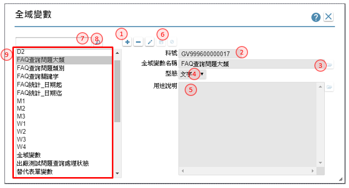

- [**16.1 資料模版**](#DataTemplate)
- [**16.2 多語設定**](#MaintainMultilingual)
- [**16.3 圖示設定**](#Icon)
- [**16.4 交換格式**](#ExchangeFormat)
- [**16.5 排程設定**](#Schedule)
- [**16.6 報表條文**](#ReportClause)
- [**16.7 啟動表單**](#AutoRunForm)
- [**16.8 外部程式**](#ExternalAPI)
- [**16.9 開放按鍵**](#DeclareRelaesedButton)
- [**16.10 檔案櫃**](#FileCabinet)
- [**16.11 全域變數**](#GlobalVariable)
- [**16.12 單元樣式**](#UnitStyle)
- [**16.13 自訂函數**](#UserDefineFunction)

## **16.1 資料模版** {#DataTemplate}
> 作業目的：為了使每個表單元件可以根據資料類型顯示適當的格式，所以需設定整個專案中需要用到的模版，以便在設定元件規格時可以套用。

1. 新增鍵：可利用本鍵，進入新增模式
2. 模版名稱：可利用開窗鍵, 開啟[【多語詞庫】](16.html#MaintainMultilingual)指定挑選詞庫, 來指定模版的名稱，操作方法請參考［16.2］
3. 料號：顯示模版的料號
4. 專案預設：顯示駐留的模版料號, 是否為專案預設
5. 模版組成_文字：選擇本項, 表示欄位內容, 是以文字方式處理 
不限：表示不限制文字內容 
限定大寫：表示限定文字必須是英文字母必大寫 
特殊格式：表示文字套用特殊格式 
6. 特殊格式：指定特殊格式的編碼原則:
X:輸入任何值　 
!:小寫字母自動轉成大寫　 
9:僅允許輸入數字(含負號)  
A:僅允許英文字母大小寫　 
N:僅允許英文及數字 
7. 模版組成_數字：選擇本項, 表示欄位內容, 是以數字方式處理
8. 數字_小數位數：在數字模式下, 輸入小數位數
9. 數字_千分比：勾選是否出現千分位符號
10. 百分比：勾選是否為百分比模式, 若勾選者, 會在欄位出現%符號
11. 模版組成_貨幣：選擇本項, 表示欄位內容, 是以貨幣方式處理
12. 貨幣_小數位數：在貨幣模式下, 輸入小數位數
13. 貨幣_千分比：勾選是否為百分比模式, 若勾選者, 會在欄位出現%符號
14. 符號：勾選是否出現貨幣符號
15. 填滿：勾選在不滿欄位長度時, 是否符號填補
16. 填滿符號：勾選在填滿欄位時, 輸入填補的符號
17. 轉換：勾選是否轉換其它表現模式
18. 轉換類別：在指定轉換的狀態下, 下拉選擇：國字金額／英文金額的型態
19. 模版組成_日期：選擇本項, 表示欄位內容, 是以日期方式處理
20. 日期年度：選擇年度的型態=西元年／民國年
21. 日期內容：日期模式下, 選擇日期的出現的內容=年月日／年月／月日
22. 年月日格式：選擇年月日的格式=年月日／月日年／日月年
23. 年月格式：選擇年月格式時，挑選內容＝年月／月年
24. 月日：選擇月日格式時，挑選內容＝月日／日月
25. 日期分隔符號：日期的分隔符號，挑選內容＝／—。
26. 時間內容：選擇是否帶有時間, 選擇內容＝無／12時制／24時制
27. 時間格式：若有帶有時間, 選擇格式＝ＨＨ：ＭＭ／ＨＨ：ＭＭ：ＳＳ
28. 英文月份：指定是否帶有英文月份顯示
29. 模版組成_時間：選擇本項, 表示欄位內容, 是以時間方式處理
30. 時間內容：選擇是否帶有時間, 選擇內容＝無／12時制／24時制
31. 時間格式：若有帶有時間, 選擇格式＝ＨＨ：ＭＭ／ＨＨ：ＭＭ：ＳＳ
32. 模版組成_編輯器：選擇本項, 表示欄位內容, 是以編輯器的方式處理
33. 儲存鍵：可利用本鍵，儲存內容到資料庫
34. 關鍵字：輸入指定的關鍵字，以方便搜尋查詢
35. 搜尋鍵：濾出符合關鍵字的內容到速查清單
36. 速查清單：經由搜尋鍵查出符合關鍵字的內容清單，可駐留指定記錄，查詢進而編修內容
37. 專案預設鍵：指定駐留的模版料號, 專案預設；作用於產生新元件加註時的預設值
38. 顯示遮罩：勾選是否呈現遮罩效果
39. 遮罩字元：輸入要呈現的遮罩樣式
40. 遮罩區段_起始位置：輸入要呈現的遮罩起始位置
41. 遮罩區段_終止位置：輸入要呈現的遮罩終止位置
42. 遮罩區段_區段長度：依照輸入遮罩區段，系統自動計算出長度、碼數

## **16.2 多語設定** {#MaintainMultilingual}
> 作業目的：當系統的使用者有不同國家的成員時，需使用此功能管理專案的多語言。

1. 新增鍵：可利用本鍵，進入新增模式
2. 詞彙說明：輸入本多語庫的用途描述
3. 料號：顯示料號
4. 語系碼：系統依據專案使用的多語內容，載入列表
5. 語系名稱：顯示語系的名稱
6. 文字內容：輸入本詞彙在不同語系的用語，新增時預設為詞彙說明
7. 儲存鍵：儲存鍵：系統檢查以下項目，通過後儲存內容到資料庫。
8. 儲存鍵：可利用本鍵，儲存內容到資料庫
9. 關鍵字：輸入指定的關鍵字，以方便搜尋查詢
10. 速查清單：經由搜尋鍵查出符合關鍵字的內容清單，可駐留指定記錄，查詢進而編修內容
11. 使用來源鍵：利用本按鍵，找出使用本詞彙的相關物件
12. 類別：使用本詞彙的物件的類別
13. 名稱：使用本詞彙的物件的名稱
14. 連結鍵鍵：點選本鍵時，可開啟連結開啟到該物件所設定的操作介面

## **16.3 圖示設定** {#Icon}
> 功能說明：有些客戶需要顯示自己公司的標誌，或是想在系統中顯示指定的圖案，則需使用此功能。
>
> 參考資料：[影音說明](https://youtu.be/RNolHOC-pz8)

1. 新增鍵：可利用本鍵，進入新增模式
2. 圖示名稱：可利用開窗鍵, 開啟[【多語詞庫】](16.html#MaintainMultilingual)指定挑選詞庫, 來指定圖示的名稱請參考［16.2］
3. 圖示用途：指定本圖示的用途 
按鍵：表示圖示的用途在於功能按鈕 
樹枝：表示圖示的用途在於樹狀節點 
公司LOGO：表示圖示的用途在於公司LOGO 
表單：表示圖示的用途在於表單底圖 
4. 圖片大小：圖片的寛度及高度，對於用途為樹技或按鍵的圖示，本寛度為單一小圖示的大小。
5. 圖檔名稱：顯示上傳的圖檔名稱
6. 選擇檔案鍵：點選本按鈕, 開啟檔案管, 挑選檔案
7. 檢視鍵：在有上傳圖示的狀態下，可利用本按鍵檢視圖示內容
8. 下載鍵：在有上傳圖示的狀態下，可利用本按鍵下載圖示內容
9. 圖片原則：說明圖片用途及限制
10. 儲存：可利用本鍵，儲存內容到資料庫
11. 關鍵字：濾出符合關鍵字的內容到速查清單
12. 搜尋鍵：經由搜尋鍵查出符合關鍵字的內容清單，可駐留指定記錄，查詢進而編修內容
13. 速查清單：經由搜尋鍵查出符合關鍵字的內容清單，可駐留指定記錄，查詢進而編修內容

## **16.4 交換格式** {#ExchangeFormat}
> 作業目的：需要將系統的資料以檔案的方式輸出時，此功能可讓系統能依照設定的格式，將資料匯出至txt檔、Excel檔，或是由txt檔、Excel檔匯入資料。

1. 新增鍵：可利用本鍵，進入新增模式
2. 格式名稱：可利用開窗鍵, 開啟[【多語詞庫】](16.html#MaintainMultilingual)指定挑選詞庫, 請參考［16.2］來指定格式的名稱
3. 料號：顯示料號
4. 檔案類型：下拉指定檔案的格式Excel / XML /Text 格式
5. 檔案格式：檔案的格式 xlsx / xls
6. 限定檔名：選擇交換時, 是否指定檔案名稱, 選擇：否／是
7. 限定檔案名稱：在限定檔名的狀態下, 輸入檔案名稱
8. 查表定義：勾選本項者，表示在執行資料交換時，再由介面決定檔名
9. 範本附件：指定本格式是否有範本上傳， 選擇：否／是
10. 範本附件名稱：在指定範本附件的狀態下, 上傳檔案，經由選擇檔案, 開檔案總管, 挑選檔案
11. 下載範本鍵：經由本按鈕, 將範本檔案下載
12. 記錄＿明細型：指定交換內容的格式類型, 選擇本項表示為明細型
13. 首行標題：明細型格式, 不為excel格式時, 指定首行是否為標題， 選擇：否／是
14. 指定分頁：指定分頁方式， 選擇：頁籤名籤／頁次
15. 頁籤名籤：在指定分頁=頁籤名籤的狀態下, 輸入頁籤名籤
16. 頁次：在指定分頁=頁次的狀態下, 輸入頁次序號
17. 標題_第N列：明細型格式, 指定格式參考標題的列次
18. 資料_第N列：明細型格式, 指定格式資料起始的列次
19. 匯入Excel鍵：可利用本鍵將上述指定的excel格式匯入欄位設定, 減少輸入時間
20. 紀錄分隔符號：明細型格式, 不為excel格式時, 指定記錄分隔的符號
21. 欄位分隔符號：格式excel格式時, 指定資料分隔的符號
22. 文字辨視符號：格式excel格式時, 指定文字辨視的符號, 選擇：雙引號／單引號／無
23. 表格型：指定交換內容的格式類型, 選擇本項表示=表格型
24. 範本工作頁：表格型格式, 指定範本參考的頁次_第N頁
25. 資料區塊1：勾選是否有區塊1
26. 資料區塊1_範本區塊名稱：在指定區塊1的狀態下, 輸入資料區塊1的名稱
27. 資料區塊2：勾選是否有區塊2
28. 資料區塊2_範本區塊名稱：在指定區塊2的狀態下, 輸入資料區塊2的名稱
29. 資料區塊3~5：同資料區塊1、2的作法
30. 欄位設定：指定各進行資料交換的各欄位內容
31. 名稱：輸入格式的欄位名稱
32. 類型：輸入格式的資料型態，文字／數字／日期／圖片
33. 模版：輸入格式的資料模版
34. 長度：輸入格式的資料長度
35. 圖寬：若格式為一圖片, 輸入圖片的寬度
36. 圖高：若格式為一圖片, 輸入圖片的高度
37. 位置：指定格式裡的欄位放置的區域 
明細型：限定固定，不異動 
表格型：可指定欄位是固定/變動/區塊1/區塊2/區塊3/區塊4//區塊1/區塊5 
變動： 表示本欄位的顯示位置, 會因為資料區塊內的筆數而異動 
38. 定位/定義：指定格式裡的欄位, 放置的位置,  
明細型＿固定：輸入欄位的順序, 1, 2,3...  
表格型＿固定：輸入excel的儲存位置, A1, B2..  
表格型＿區塊1~5：輸入excel的欄數, B,C,D..  
表格型＿變動：輸入excel的儲存位置, A18, B25.. 
39. 直向合併：若格式上有直向合併的狀況或需求時，必須勾選本項
40. 橫向合併：若格式上有橫向合併的狀況或需求時，必須勾選本項
41. 合併欄位數：說明選合併儲存格的欄位或列數
42. 儲存鍵：可利用本鍵，儲存內容到資料庫
43. 關鍵字：輸入指定的關鍵字，以方便搜尋查詢
44. 搜尋鍵：濾出符合關鍵字的內容到速查清單
44. 速查清單：經由搜尋鍵查出符合關鍵字的內容清單，可駐留指定記錄，查詢進而編修內容

## **16.5 排程設定** {#Schedule}
> 作業目的：為了讓某些表單的功能，由系統自己定時處理，免去使用者的操作。
>
> 參考資料：[影音說明](https://youtu.be/u5K1NpT_hX0)

1. 新增鍵：可利用本鍵，進入新增模式
2. 排程名稱：可利用開窗鍵, 開啟[【多語詞庫】](16.html#MaintainMultilingual)指定挑選詞庫, 請參考［16.2］來指定排程的名稱
3. 料號：顯示料號
4. 排程方式＿單次：選擇執行的次數, 選擇本項, 表示僅執行一次
5. 單次_指定日期：在執行單次的狀態下, 輸入執行的日期
6. 單次_指定時間_時：在執行單次的狀態下, 輸入執行的起始時間及終止時間
7. 排程方式＿週期性：選擇執行的次數, 選擇本項, 表示依週期指定執行
8. 指定日期_起迄：指定週期的起始日期、結束日期
9. 週期性_指定時間_時迄：在執行週期的日期期間內, 輸入執行的起始時間、終止時間
10. 每隔N日：選擇週期的類別, 選擇本項表示隔日執行
11. 每隔N日＿指定時：在指定每隔Ｎ日後的執行時間
12. 每隔N日＿指定分：在指定每隔Ｎ日後的執行時間
13. 每隔N週：選擇週期的類別, 選擇本項表示隔週執行
14. 每隔N週_週數：指定間隔的週數
15. 每隔N週_星期：在隔週執行的狀態下, 指定當週的執行的星期數
16. 週期性_指定月份日期：選擇週期的類別, 選擇本項表示指定月份的當日執行
17. 週期性_指定月份：勾選要指定的月份
18. 週期性_指定月份日期_執行日：指定月份的執行的日期
19. 週期性_指定月份星期：選擇週期的類別, 選擇本項表示指定月份的某週某日執行
20. 週期性_指定月份：勾選要指定的月份
21. 週期性_指定月份星期_週次：指定月份的執行的當月的第N週
22. 週期性_指定月份星期_星期：指定月份的執行的當月的第N週
23. 連續執行：本排程是否指定時間內，連續執行
24. 連續執行_間隔時間：設定為連續執行者，指定間隔的分鐘數
25. 連續執行_結束時：設定為連續執行者，指定結束的時間（時）
26. 連續執行_結束分：設定為連續執行者，指定結束的時間（分）
27. 儲存鍵：可利用本鍵，儲存內容到資料庫
28. 關鍵字：輸入指定的關鍵字，以方便搜尋查詢
29. 搜尋鍵：濾出符合關鍵字的內容到速查清單
30. 速查清單：經由搜尋鍵查出符合關鍵字的內容清單，可駐留指定記錄，查詢進而編修內容

## **16.6 報表條文** {#ReportClause}
> 作業目的：為了讓使用者自行設定報表表尾的格式。

1. 新增鍵：可利用本鍵，進入新增模式
2. 條文名稱：可利用開窗鍵, 開啟[【多語詞庫】](16.html#MaintainMultilingual)指定挑選詞庫, 請參考［16.2］來指定條文的名稱
3. 料號：顯示料號
4. 條文內容：輸入運用在報表上的條件文內容
5. 儲存鍵：可利用本鍵，儲存內容到資料庫
6. 關鍵字：輸入指定的關鍵字，以方便搜尋查詢
7. 搜尋鍵：濾出符合關鍵字的內容到速查清單
8. 速查清單：經由搜尋鍵查出符合關鍵字的內容清單，可駐留指定記錄，查詢進而編修內容

## **16.7 啟動表單** {#AutoRunForm}
> 作業目的：讓使用者登入時，自動執行某些特定功能。
>
> 參考資料：[影音說明](https://youtu.be/wv8_EK5AOdM)

1. 新增鍵：可利用本鍵，進入新增模式
2. 啟動說明：可利用開窗鍵, 開啟[【多語詞庫】](16.html#MaintainMultilingual)】指定挑選詞庫, 請參考［16.2］來指定啟動說明
3. 料號：顯示料號
4. 執行條件：可利用本鍵, 開啟[【條件式】](20.html#ConditionStatement)中, 指定執行的條件內容，操作說明請參考［附錄A1］
5. 表單名稱：指定在符合條件下，啟動的表單名稱
6. 參數：可利用本鍵, 開啟【表單傳遞參數】中, 指定表單的要傳遞的參數內容
7. 過濾條件：可利用本鍵, 開啟[【條件式】](20.html#ConditionStatement)中, 指定表單的過濾條件，操作說明請參考［附錄A1］
9. 新增條件鍵：可利用本鍵，增加條件的項目
9. 儲存鍵：可利用本鍵，儲存內容到資料庫
10. 關鍵字：輸入指定的關鍵字，以方便搜尋查詢
11. 搜尋鍵：濾出符合關鍵字的內容到速查清單
12. 速查清單：經由搜尋鍵查出符合關鍵字的內容清單，可駐留指定記錄，查詢進而編修內容

## **16.8 外部程式** {#ExternalAPI}
> 作業目的：為了與外部系統做資料的交換，或是執行非ruRU IDE建立的程式。
>
> 參考資料：[影音說明](https://youtu.be/TcC6okObYO8)

1. 新增鍵：可利用本鍵，進入新增模式
2. API名稱：可利用開窗鍵, 開啟[【多語詞庫】](16.html#MaintainMultilingual)指定挑選詞庫, 請參考［16.2］來指定名稱
3. 料號：顯示料號
4. API類型：指定API的類型，可挑選：Http /Https /Web Service / WCF
5. 程式名稱：輸入API程式的名稱
6. 功能名稱：若程式有分段指定功能時，在此處輸入功能的名稱
7. Url位置類別：指定外部程式的位址，是固定位置或變動指定
8. Url位置：若位置為固定時，指定IP路徑，例：「http://123.456.789.123:80/」
9. 程式說明：描述程式的用途及用法說明
10. 傳遞參數：勾選者，表示有傳遞參數內容
11. 傳遞參數欄位：當傳遞參數被勾選者，在此指定參數的內容
12. 參數類別：指定類別，下拉挑選：Json/XML/Param 預設值為Json
13. 參數名稱：輸入參數的名稱，API的參數要區分大小寫
14. XML屬性：參數類別=XML者，須設定屬性：節點／屬性
15. 資料：參數類別=XML者，指定本參數是否有資料的對應；勾選者表示有
16. 多筆：參數類別=XML且屬性＝節點者，指定本節點是否有多筆的狀況；勾選者表示有
17. 參數型態：下拉挑選參數的類別
18. 對應父階：挑定本參數是否歸屬在指定的父階
19. 參數說明：說明參數的用法
20. 增加項目鍵：可利用本鍵，新增參數項目
21. 排序移動鍵：可利用上、下鍵移動駐留的列數順序
22. 成功接收參數：勾選者，表示在執行API成功後回傳的參數內容
23. 成功接收參數內容：操作及定義方式 同步驟 12~21
24. 失敗接收參數：勾選者，表示在執行API失敗後回傳的參數內容
25. 失敗接收參數內容：操作及定義方式 同步驟 12~21
26. 儲存鍵：可利用本鍵，儲存內容到資料庫
27. 關鍵字：輸入指定的關鍵字，以方便搜尋查詢
28. 搜尋鍵：濾出符合關鍵字的內容到速查清單
29. 速查清單：經由搜尋鍵查出符合關鍵字的內容清單，可駐留指定記錄，查詢進而編修內容

## **16.9 開放按鍵** {#DeclareRelaesedButton}
> 作業目的：允許外部程式來呼叫此按鈕，執行其功能。
>
> 參考資料：[影音說明](https://youtu.be/o346u4hlWDg)

1. 新增鍵：可利用本鍵，進入新增模式
2. 表單名稱：可利用開窗鍵, 開啟【表單清單】指定要開放按鍵的表單
3. 表單料號：顯示表單的料號
4. 按鍵名稱：可利用開窗鍵, 開啟【按鍵清單】指定要開放表單下的按鍵
5. 按鍵料號：顯示按鍵的料號
6. 功能說明：描述開放按鍵的的用途說明
7. 參數類別：指定類別，下拉挑選：Json/XML/Param 預設值為Json
8. 載入鍵：當開放的表單有接收參數的設定時，利用本按鍵載入參數的內容
9. 設定類型：顯示參數的來源類型
10. 設定來源：參數來源的名稱
11. 參數類型：顯示參數的型態：文字／數字／日期
12. 參數名稱：輸入參數的名稱，API的參數要區分大小寫
13. 參數說明：說明參數的用法
14. 排序移動鍵：可利用上、下鍵移動駐留的列數順序
15. 儲存鍵：可利用本鍵，儲存內容到資料庫
16. 關鍵字：輸入指定的關鍵字，以方便搜尋查詢
17. 搜尋鍵：濾出符合關鍵字的內容到速查清單
18. 速查清單：經由搜尋鍵查出符合關鍵字的內容清單，可駐留指定記錄，查詢進而編修內容

## **16.10 檔案櫃** {#FileCabinet}
> 作業目的：。

1. 新增鍵：可利用本鍵，進入新增模式
2. 檔案櫃名稱：可利用開窗鍵, 開啟[【多語詞庫】](16.html#MaintainMultilingual)指定挑選詞庫, 請參考［16.2］來指定檔案櫃的名稱
3. 料號：顯示模版的料號
4. 機台IP：指定FTP所在的IP
5. 連接埠：指定FTP的Port
6. 資料夾路徑：指定FTP的存放的目錄
7. 儲存鍵：可利用本鍵，儲存內容到資料庫
8. 關鍵字：輸入指定的關鍵字，以方便搜尋查詢
9. 搜尋鍵：濾出符合關鍵字的內容到速查清單
10. 速查清單：經由搜尋鍵查出符合關鍵字的內容清單，可駐留指定記錄，查詢進而編修內容

## **16.11 全域變數** {#GlobalVariable}
> 作業目的：。

1. 新增鍵：可利用本鍵，進入新增模式
2. 料號：顯示模版的料號
3. 全域變數名稱：可利用開窗鍵, 開啟[【多語詞庫】](16.html#MaintainMultilingual)指定挑選詞庫, 請參考［16.2］來指定全域變數的名稱
4. 類型：下拉變數的型態：文字／數字／日期
5. 用途說明：可利用開窗鍵, 開啟[【多語詞庫】](16.html#MaintainMultilingual)指定挑選詞庫, 請參考［16.2］來指定全域變數的用途
6. 儲存鍵：可利用本鍵，儲存內容到資料庫
7. 關鍵字：輸入指定的關鍵字，以方便搜尋查詢
8. 搜尋鍵：濾出符合關鍵字的內容到速查清單
9. 速查清單：經由搜尋鍵查出符合關鍵字的內容清單，可駐留指定記錄，查詢進而編修內容

## **16.12 單元樣式** {#UnitStyle}
> 作業目的：

1. 元件群組：下拉：元件／按鍵／表單／首頁
2. 元件類型：依據元件群組，下拉挑選要設定樣式的類型
3. 關鍵字：輸入指定的關鍵字，以方便搜尋查詢
4. 搜尋鍵：濾出符合關鍵字的內容到速查清單
5. 單元樣式清單：經由搜尋鍵查出符合關鍵字的內容清單，可駐留指定記錄，查詢進而編修內容
6. 新增鍵：可利用本鍵，開啟【新增單元樣式】新增一筆指定的元件群組、元件類型的樣式名稱
7. 樣式名稱修改鍵：進入樣式的名稱修改，可利用開窗鍵, 開啟[【多語詞庫】](16.html#MaintainMultilingual)指定挑選詞庫指定挑選詞庫, 來修改名稱，操作方法請參考［16.2］
8. 樣式刪除鍵：刪除駐留的單元樣式
9. 樣式複製鍵：依駐留的單元樣式，複製出新的樣式
10. 修改鍵：可利用本鍵，將駐留筆的元件類型、狀態的單元樣式，進入修改
11. 複製單元樣式選項：下拉來源為同元件類型的其它單元樣式
12. 複製狀態樣式選項：下拉來源為同複製單元樣式選項的狀態樣式
13. 複製內容複製鍵：依指定的複製單元樣式選項、複製狀態樣式選項，複製其設定的內容
14. 駐留常用樣式頁籤：設定基本的樣式
15. 底色_顏色：設定顏色，開啟[【調色盤】](20.html#Palette)指定色碼
16. 底色＿透明度：數字０是全透明，數字愈大愈不透明
17. 底色＿漸層色：設定要做漸層顏色，開啟[【調色盤】](20.html#Palette)指定色碼
18. 底色＿漸層方向：下拉：無／上／下／左／右／垂直／水平／向內／向外
19. 內容＿文字顏色：設定文字顏色，開啟[【調色盤】](20.html#Palette)指定色碼
20. 內容＿透明：設定透明度，數字０是全透明，數字愈大愈不透明
21. 內容＿字型：字型的選擇
22. 內容＿大小：字體的大小
23. 內容＿水平：字體水平對齊的方式
24. 內容＿垂直：字體垂直對齊的方式
25. 字型樣式：設定字型的相關資料粗體、斜體、底線、刪除線
26. 超連結：針對具超連結的文字，點擊前及點擊後顯示的顏色，開啟[【調色盤】](20.html#Palette)指定色碼
27. 框線＿線條：指定框線的樣式，下拉：無／實線／虛線／嵌入線／浮出線
28. 框線＿線條弧度：指定框線的四個個角度，０代表直角，最大５０
29. 上框線：指定上邊框線的寛度，數字愈大愈粗及框線的顏色，開啟[【調色盤】](20.html#Palette)指定色碼
30. 下框線：指定下邊框線的寛度，數字愈大愈粗及框線的顏色，開啟[【調色盤】](20.html#Palette)指定色碼
31. 左框線：指定左邊框線的寛度，數字愈大愈粗及框線的顏色，開啟[【調色盤】](20.html#Palette)指定色碼
32. 右框線：指定右邊框線的寛度，數字愈大愈粗及框線的顏色，開啟[【調色盤】](20.html#Palette)指定色碼
33. 邊界內間距：指定元件在顯示時，與邊框之間的內間距

指定色碼
38. 表格＿單數資料列：設定單數列的底色，開啟[【調色盤】](20.html#Palette)指定色碼
39. 表格＿雙數資料列：設定雙數列的底色，開啟[【調色盤】](20.html#Palette)指定色碼
40. 表格＿清除設定鍵：清除所有欄位設定
41. 表格＿還原設定鍵：還原至最後一次存回內容
42. 按鈕/容器專用＿框線：各欄位的設定操作同 27~32
43. 按鈕/容器專用＿光棒：各欄位的設定操作同 27~32
44. 圖示名稱：當元件類型有圖示可替代時，可在此處設定圖示，開啟[【圖示設定】](16.html#Icon)挑選圖示

### **16.12.1 樣式狀態對照**
> 作業目的：各類元件可使用的樣式狀態, 打V者　表示可設定有作用。

各類樣式狀態的使用時機
1. 按下OnClick：當元件被滑鼠或利用熱鍵按下時
2. 除能Disable：當元件設定為除能狀態時
3. 致能Enable：當元件設定為致能狀態時
4. 滑鼠移入MouseIn：滑鼠移到元件位置上方，但未駐留OnFocus
5. 駐留OnFocus：游標停留在元件上
6. 標題Tilte：元件的標題文字
7. 顯示Enable：當元件設定僅供顯示的狀態
8. 顯示駐留OnFocus：當元件設定僅供顯示的狀態，但游標停留該元件上
9. 選項清單ItemList：下拉元件的清單

行動裝置上的元件類型也可以有樣式的設定, 打V者　表示可設定有作用

## **16.13 自訂函數** {#UserDefineFunction}
> 作業目的：

1. 新增鍵：可利用本鍵，進入新增模式
2. 函數名稱：可利用開窗鍵, 開啟[【多語詞庫】](16.html#MaintainMultilingual)指定挑選詞庫, 來指定函數的名稱
3. 料號：顯示料號
4. 程式內容：自行輸入
5. 回傳參數型態：下拉：字串/數字/陣列/日期/布林，預設 字串
6. 回傳參數：勺選本項，表示呼叫本函數時，必須有傳遞內容
7. 參數名稱：自行輸入，不允空值；區分大小寫，函數儲存前會判定是否存程式內容。系統提供最多七筆參數
8. 參數型態：本函數回傳的內容型態，下拉：字串／數字／陣列／日期／布林。 預設 字串
9. 測試預設值：針對傳遞的參數，可設定一測試用的內容值，系統在儲存時會驗證合理性
10. 儲存鍵：儲存鍵：系統檢查以下項目，通過後儲存內容到資料庫。 
	10.1 變數是否存在 
	10.2 程式是否符合JavaScript 
	10.3 回傳的參數型態是否符合畫面設定 
	10.4 不允空值 
	10.5 不需再定義Function 
	10.6 禁用訊息盒 
	10.7 驗證傳遞參數的測試預設值是否符合程式邏輯 
11. 關鍵字：輸入指定的關鍵字，以方便搜尋查詢
12. 搜尋鍵：濾出符合關鍵字的內容到速查清單
13. 速查清單：經由搜尋鍵查出符合關鍵字的內容清單，可駐留指定記錄，查詢進而編修內容

---
[**回到章節目錄**](index.html#MainMenu)