#  **A. 共通性操作**

## **A1. 條件式 condition statement**
> 作業目的：任何需要過濾、比對、檢查資料的地方，都需設定條件式，才可濾出正確的資料。
參考資料：
- [☢條件式](https://youtu.be/Fu-LoqkYLAo){:target='_blank'} [℗條件式](pdf/8-7條件式設定.pdf){:target='_blank'}
- [☢條件函數](https://youtu.be/uvuEj-6ubdY){:target='_blank'} [℗條件函數](pdf/8-8條件式之函數設定.pdf){:target='_blank'}

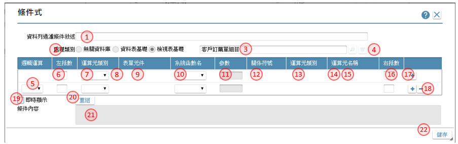
1. 條件說明：以敍述方式說明條件內容
2. 處理類別：選擇是否有指定查表的來源 
	無：表示查詢比對的來源只有表單元件 
	資料表：表示查詢比對的來源為資料表 
	檢視表：表示查詢比對的來源為檢視表 
3. 查表來源：處理類別＜＞無時，開窗挑選指表格名稱
4. 參數鍵：處理類別＝檢視表，且該檢視表是否有定義接收參數，而點選本鍵開啟[【傳遞參數】](20.html#PassParameters)，操作說明請參考［附錄A3］
5. 運算：下拉指定，AND/OR
6. 左括：輸入左括弧的數量
7. 類別＿左：下拉選項，元件/來源/參數/自訂/狀態/全域變數
8. 檔區＿左：當 [類別＿左] ＝檔區時，下拉選項，挑選檔區名稱
9. 元件名＿左：依當 [類別＿左] 指定，挑選不同欄位或輸入內容
10. 函數名：對左元件附加函數時，下拉挑選函數
11. 參數：針對指定的函數有參數指定時，在本欄位輸入
12. 判斷式：下拉運算子，大於/等於/小於……
13. 類別＿右：下拉選項，元件/來源/參數/函數/運算式/全域變數
14. 檔區＿右：當 [類別＿右] ＝檔區時，下拉選項，挑選檔區名稱
15. 運算元名稱＿右：依當 [類別＿右] 指定，挑選不同欄位或輸入內容
16. 右括：輸入右括弧的數量
17. +鍵：新增條件式
18. -鍵：刪除條件式
19. 即時顯示：勾選本項，表示任何條件項目的異動，均同步異動條件內容
20. 重組鍵：點選本鍵，依條件項目重新組合條件內容
21. 條件內容：依條件項目顯示內容，可編輯

案例一：不同型態元件的比對判斷
> (元件.文字A=元件.文字B) 或 (元件.日期E>元件.日期F) 或 (元件.數字X <> 元件.數字Y) 

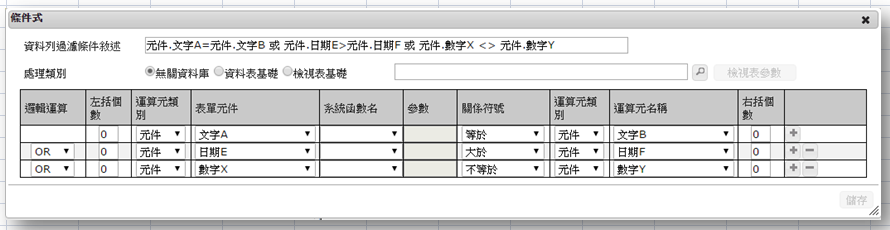

案例二：不同型態元件的對函數的比對判斷
> (元件.文字A="") 或 (元件.日期E>函數.系統日期) 或 (元件.數字X=函數.登入語系(數字型態)) 

案例三：不同型態元件的經函數處理後的比對判斷
> 算長度(元件.文字A)>5 或 取年度(元件.日期E)=2017 或 取整數(元件.數字X)<>10 

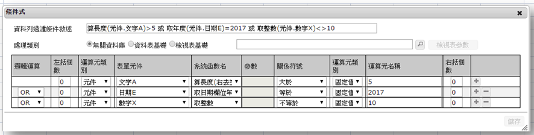

案例四：判斷某種情境下的狀態，僅以右邊運算元判定是否符合條
> 新增狀態 或 修改狀態 

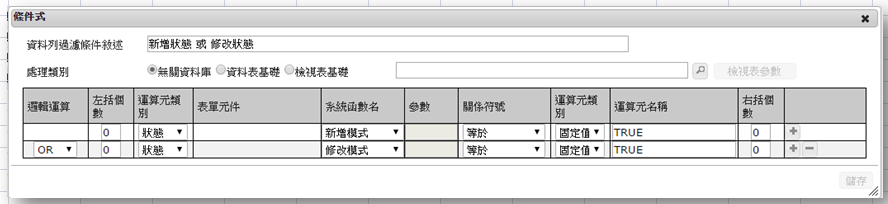

案例五：多重的判斷式, 以括號數做為區隔
> (文字A="A") 且 (日期E=日期F 或 取週次(日期E)=25) 且 ((數字X=1 且 數字Y=2) 或 數字Z=3)) 

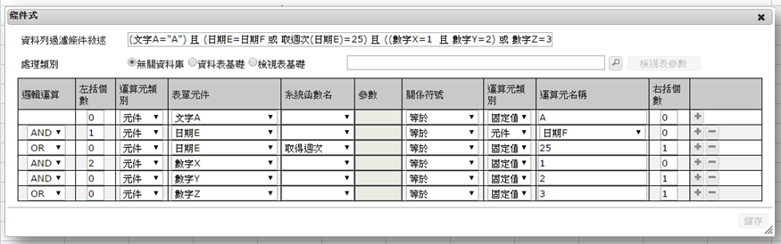

##  **A2. 運算式 expression statement**
> 作業目的：將欄位與其他欄位組合或運算使用。
參考資料：
 - [☢函數介面](https://youtu.be/bDDu97UBuGY){:target='_blank'} [℗函數介面](pdf/7-7-3運算式函數介面.pdf){:target='_blank'}
 - [☢自訂介面](https://youtu.be/-yxIAQGEdC4){:target='_blank'} [℗自訂介面](pdf/7-7-4運算式自訂介面.pdf){:target='_blank'}

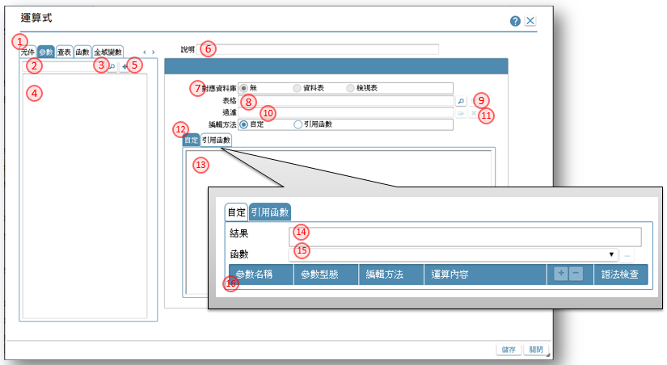
1. 來源類別頁籤：可切換不同的來源，挑選要納入運算類別元件 
元件：駐留表單、報表、檢視表、過帳的元件清單 
參數：駐留表單、報表、檢視表、過帳的接收參數清單 
查表：有指定查表時，該表格的元件清單 
函數：系統提供的系統函數清單 
全域變數：專案下設定的全域變數清單 
附註：在過帳時，會增加一為段落的頁籤，作用於挑選段落下的元件清單 
2. 關鍵字：可輸入關鍵字，以利查詢接近的內容
3. 搜尋鍵：把駐留的頁籤下，搜尋符合關鍵字的欄位，列入 [元件清單] 中
4. 元件清單：依駐留的頁籤，顯示個別的內容
5. 加入鍵：把駐留在元件清單的記錄，納入[自訂運算式] 或 [函數運算式] 中
6. 說明：以敍述方式說明運算式內容
7. 對應資料庫：選擇是否有指定查表的來源 
無：表示沒有用到查表功能 
資料表：表示以資料表做為查表來源 
檢視表：表示以檢視表做為查表來源 
8. 表格：處理類別＜＞無時，開窗挑選指表格名稱
9. 參數鍵：處理類別＝檢視表，且該檢視表是否有定義接收參數，而點選本鍵開啟[【傳遞參數】](20.html#PassParameters)，操作說明請參考［附錄A3］
10. 過濾：可利用本鍵, 開啟[【條件式】](20.html#ConditionStatement)中, 設定查表的條件內容，操作說明請參考［附錄A1］
11. 過濾條件清除鍵鍵：清除過濾條件
12. 編輯方式：編輯運算式的方式有二 
自定：在[自訂運算式] 編輯區塊裡自行輸入內容 
引用函數：利用 [函數運算式] 中的操作，完成運算式的設定 
13. 自訂運算式：在編輯方式=自定時，設定運算式的區塊
14. 函數運算式＿結果：在編輯方式=引用函數時，操作設定的結果
15. 函數運算式＿函數：顯示所有在 [函數運算式] 中有引用到的函數清單，可下拉切換
16. 函數運算式＿參數區：依駐留的函數，顯示該函數所引用的參數及對應、運算的設定

### 案例一：數字元件運算：
> 駐留小計欄位，做金額與稅額兩欄位的相加

**自定運算式的操作方法**

>步驟：
1. 駐留清單下的 金額欄位, 點選按鈕 加入 鍵, [自定運算式] 會出現一有框線的元件，標示 	元件.金額
2. 在 [自定運算式]  元件.金額後一格的位置 輸入 + 鍵 ,  [自定運算式]  內容:  元件.金	額 +
3. 駐留清單下的 稅額欄位, 點選按鈕 加入 鍵, [自定運算式] 內容: 元件.金額 + 元件.稅額

**引用函數的操作方法**

>步驟：
1. 駐留函數頁籤下
2. 找到數字函數, 並駐留在該記錄上
3. 點選按鈕 加入 鍵
4. [結果] 會出現函數名及所需參數

>步驟：
5. 點選函數裡的參數名
6. 駐留在運算內容欄位
7. 切換頁籤到元件, 找到金額欄, 並駐留它
8. 點選按鈕 加入 鍵
9. [結果] 函數的參數會被取代成元件名

>步驟：
10. 點選增加參數列的+鍵
11. 下拉編輯方法，選定 相加
12. 駐留在運算內容欄位
13. 切換頁籤到元件, 找到稅額欄, 並駐留它
14. 點選按鈕 加入 鍵
15. [結果] 函數的參數多出了計算的內容

### 案例二.文字元件運算：
> 駐留文字C欄位, 取文字A的前三碼, 中間有-符號 , 接文字B 第5碼取2碼

**自定運算式的操作方法**

>步驟：
1. 在 [自定運算式]  輸入左取的函數名Left( )  ,  [自定運算式]  內容:  Left( )
2. 駐留清單下的 文字A欄位, 點選按鈕 加入 鍵，置入括號中, [自定運算式] ： Left( 元件.	金額 )
3. 在函數裡補上取3位的參數 , [自定運算式] ： Left( 元件.金額, 3 )
4. 加上中間的間隔符號 - , 以加號串接 , [自定運算式] ： Left( 元件.金額, 3 )+"-"
5. 接著是取字函數 , 以加號串接 , [自定運算式] ： Left( 元件.金額, 4 )+"-"+Mid( )
6. 駐留清單下的 文字B欄位, 點選按鈕 加入 鍵，置入Mid括號中 , [自定運算式] ： 	Left( 元件.金額, 5 )+"-"+Mid( 元件.文字B )
7. 在函數裡補上從第5起, 取2位的參數 , [自定運算式] ： Left( 元件.金額, 5 )+"-"+Mid( 元	件.文字B, 5, 2 )

**引用函數的操作方法**
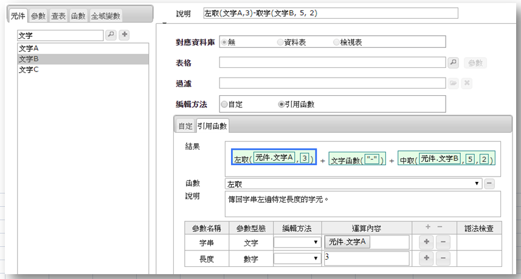

> 步驟：
1. 駐留函數頁籤下
2. 找到左取函數, 並駐留在該記錄上
3. 點選按鈕 加入 鍵
4. [結果] 會出現函數名及所需參數

5. 點選函數裡的參數名
6. 駐留在參數.文字的運算內容欄位
7. 切換頁籤到元件, 找到文字A欄, 並駐留它
8. 點選按鈕 加入 鍵

9. 點選函數裡的長度的參數
10. 駐留在參數.長度的運算內容欄位, 輸入長度 3

11. 駐留第一個函數的外框
12. 駐留函數頁籤下, 找到中取函數, 並駐留在該記錄上,
13. 點選按鈕 加入 鍵
14. 附加函數時, 會出現【引用函數方式】的視窗, 詢問附加的方式
15. 新增的方式有三： 
	取代：表示以新函數取代駐留函數 
	附加在前：表示以新函數於駐留數之前 
	附加在後：表示以新函數於駐留數之後 
16. 運算方式，選擇兩個函數之間的運算子
17. 確認選項後，點選本鍵存回

18. 建立後的函數結果
19. 對附加的函數，進行參數內容的指定

## **A3. 調色盤 Palette** {#Palette}
> 作業目的：規格需設定顏色，利用本作業挑選指定色碼。

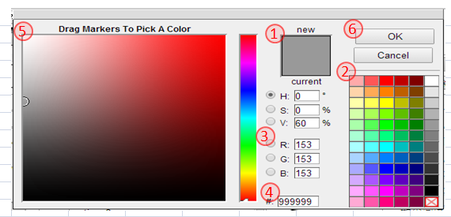

1. 調整後的顏色顯示
2. 色盤區：直接點選常用的顏色
3. ＲＧＢ色碼：直接輸入紅綠藍的數字
4. 色號：可輸入16進位的色號
5. 色階盤；點選較微小色差的顏色
6. OK鍵：把確定的顏色回傳給呼叫端

##  **A4. 傳遞參數 pass parameters**
> 作業目的：當各規格定義時使用的檢視表有定義接收參數時，必須通過本界面指定傳入對應參數的內容值。

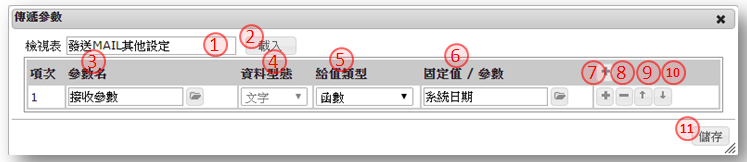
1. 檢視表：顯示設定參數的檢視表名
2. 載入鍵：可利用本鍵，把檢視表的所有參數載入表格中
3. 參數名：開窗勾選檢視表的接收參數，並指定回傳到欄位上
4. 資料類型：顯示參數的類型
5. 給值類別：參數類別: 固定值/參數/表單元件/隱藏元件/函數
6. 給值內容：依指定的參數類別，經由不同清單介面內容值
7. 新增條件列鍵：點選本鍵增加條件列
8. 刪除條件列鍵：點選本鍵刪除駐留條件列
9. 條件上移鍵：點選本鍵將駐留條件列往上移一列
10. 條件下移鍵：點選本鍵將駐留條件列往下移一列
11. 儲存鍵：儲存編修後的內容

##  **A5. 圖表參數 chart parameters**
> 功能說明：以下以案例介紹各項圖表的參數設定說明。
參考資料：[☢嵌入圖表](https://youtu.be/8FjOJ43dhvI){:target='_blank'} [℗嵌入圖表](pdf/9-12-2嵌入圖表.pdf){:target='_blank'}

**檢視表：圖表\_資料來源：**

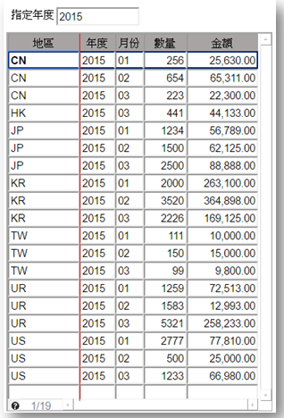

**長條圖** 

**折線圖** 

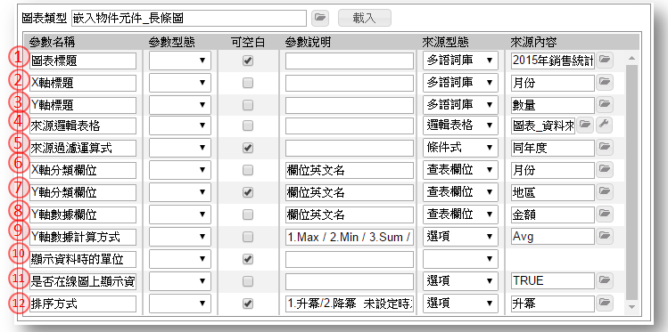

1. 圖表標題：設定標題的內容，開啟[【多語詞庫】](16.html#MaintainMultilingual)挑選指定，可空白表示無標題，操作方法請參考［16.2］
2. X軸標題：設定X軸標題的內容，開啟[【多語詞庫】](16.html#MaintainMultilingual)挑選指定，不可空白，操作方法請參考［16.2］
3. Y軸標題：設定X軸標題的內容，開啟[【多語詞庫】](16.html#MaintainMultilingual)挑選指定，不可空白，操作方法請參考［16.2］
4. 來源邏輯表格：指定圖表的資料來源，選擇檢視表格名稱
5. 來源過濾運算式：設定資料來源的過濾條件，開啟[【條件式】](20.html#ConditionStatement)中設定符合條件內容，空白代表不過濾，操作說明請參考［附錄A1］
6. X軸分類欄位：設定X軸分類的依據，指定檢視表中的欄位
7. Y軸分類欄位：設定Y軸分類的依據，指定檢視表中的欄位
8. Y軸數據欄位：呈現在圖表中的數據基礎，指定檢視表中的欄位
9. Y軸數據計算方式：指定數據欄位的計算方式，Max / Min / Sum / Avg / Count，擇一
10. 顯示資料時的單位，開啟[【多語詞庫】](16.html#MaintainMultilingual)挑選指定，可空白表示無標題，操作方法請參考［16.2］
11. 是否在線圖上顯示資料：指定是否在圖示上顯示數據
12. 排序方式：Y軸數據分類的排序方式，預設：升冪

**圓餅圖** 

1. 圖表標題：設定標題的內容，開啟[【多語詞庫】](16.html#MaintainMultilingual)挑選指定，可空白表示無標題，操作方法請參考［16.2］
2. 來源邏輯表格：指定圖表的資料來源，選擇檢視表格名稱
3. 來源過濾運算式：設定資料來源的過濾條件，開啟[【條件式】](20.html#ConditionStatement)中設定符合條件內容，空白代表不過濾，操作說明請參考［附錄A1］
4. Y軸分類欄位：設定Y軸分類的依據，指定檢視表中的欄位
5. Y軸數據欄位：呈現在圖表中的數據基礎，指定檢視表中的欄位
6. Y軸數據計算方式：指定數據欄位的計算方式，Max / Min / Sum / Avg / Count，擇一
7. 是否在線圖上顯示資料：指定是否在圖示上顯示數據

**雙軸圖** 

1. 圖表標題：設定標題的內容，開啟[【多語詞庫】](16.html#MaintainMultilingual)挑選指定，可空白表示無標題，操作方法請參考［16.2］
2. 來源邏輯表格：指定圖表的資料來源，選擇檢視表格名稱
3. 來源過濾運算式：設定資料來源的過濾條件，開啟[【條件式】](20.html#ConditionStatement)中設定符合條件內容，空白	代表不過濾，操作說明請參考［附錄A1］
4. X軸標題：設定X軸標題的內容，開啟[【多語詞庫】](16.html#MaintainMultilingual)挑選指定，不可空白，操作方法請參考［16.2］
5. X軸分類欄位：設定X軸分類的依據，指定檢視表中的欄位
6. 主要圖表類型：line(折線圖) / column(長條圖)
7. 主要圖表Y軸標題：設定主要圖表Y軸標題的內容，開啟[【多語詞庫】](16.html#MaintainMultilingual)挑選指定，不可空白，操作方法請參考［16.2］
8. 主要圖表Y軸分類欄位：設定主要圖表Y軸分類的依據，指定檢視表中的欄位
9. 主要圖表Y軸數據欄位：主要圖表呈現在圖表中的數據基礎，指定檢視表中的欄位
10. 主要圖表數據計算方式：指定數據欄位的計算方式，Max / Min / Sum / Avg / Count，擇一
11. 主要圖表顯示資料時的單位，開啟[【多語詞庫】](16.html#MaintainMultilingual)挑選指定，可空白表示無標題，操作方法請參考［16.2］
12. 主要圖表是否在線圖上顯示資料：指定是否在圖示上顯示數據
13. 次要圖表類型：line(折線圖) / column(長條圖)
14. 次要圖表Y軸標題：設定次要圖表Y軸標題的內容，開啟[【多語詞庫】](16.html#MaintainMultilingual)挑選指定，不可	空白，操作方法請參考［16.2］
15. 次要圖表Y軸分類欄位：設定次要圖表Y軸分類的依據，指定檢視表中的欄位
16. 次要圖表Y軸數據欄位：次要圖表呈現在圖表中的數據基礎，指定檢視表中的欄位
17. 次要圖表數據計算方式：指定數據欄位的計算方式，Max / Min / Sum / Avg / Count，擇一
18. 次要圖表顯示資料時的單位，開啟[【多語詞庫】](16.html#MaintainMultilingual)挑選指定，可空白表示無標題，操作方法請參考［16.2］
19. 次要圖表是否在線圖上顯示資料：指定是否在圖示上顯示數據

**流量圖** 

1. 圖表標題：設定標題的內容，開啟[【多語詞庫】](16.html#MaintainMultilingual)挑選指定，可空白表示無標題，操作方法請參考［16.2］
2. 顯示資料時的單位，開啟[【多語詞庫】](16.html#MaintainMultilingual)挑選指定，可空白表示無標題，操作方法請參考［16.2］
3. 最小數字：設定流量表上的最小數字
4. 最大數字：設定流量表上的最大數字
5. 安全區顏色：顯示安全區的顏色，開啟[【調色盤】](20.html#Palette)挑選色碼，操作說明請參考［附錄A3］
6. 安全區起始值：設定流量表上安全區的最小數字
7. 安全區終止值：設定流量表上安全區的最大數字
8. 警告區顏色：顯示警告區的顏色，開啟[【調色盤】](20.html#Palette)挑選色碼，操作說明請參考［附錄A3］
9. 警告區起始值：設定流量表上警告區的最小數字
10. 警告區終止值：設定流量表上警告區的最大數字
11. 危險區顏色：顯示危險區的顏色，開啟[【調色盤】](20.html#Palette)挑選色碼，操作說明請參考［附錄A3］
12. 危險區起始值：設定流量表上危險區的最小數字
13. 危險區終止值：設定流量表上危險區的最大數字
14. 來源邏輯表格：指定圖表的資料來源，選擇檢視表格名稱
15. 來源過濾運算式：設定資料來源的過濾條件，開啟[【條件式】](20.html#ConditionStatement)中設定符合條件內容，空	白代表不過濾，操作說明請參考［附錄A1］
16. 來源數據欄：圖表的數據基礎，指定檢視表中的欄位
17. Y軸數據計算方式：指定數據欄位的計算方式，Max / Min / Sum / Avg / Count，擇一
18. 多久重新查詢一次畫面：設定秒數
19. 警告畫面提醒：當測試值在危險範圍區時，是否顯示警告畫面
20. 警告聲音提醒：當測試值在危險範圍區時，是否顯示警告音訊

##  **A6. 單元檢錯 Unit error detection** 
> 作業目的：對已定義好的規格，進行語法及完成度的檢查。

1. 檢錯類別：選擇有５，表單／報表／檢視表／資料表／過帳
2. 檢錯標的：依檢錯類別，開窗挑選
3. 全階展開：點選本鍵後會展開以標的為準往下展開的所有物件
4. 展開清單：顯示所有的下階物件，以樹狀階層呈現
5. 執行鍵；點選本鍵進行語法的檢錯查
6. 結果清單：若檢查的過程發現錯誤點時，會以條列的方式表示，並可超連結到錯誤的註解	介面
7. 單元連結：當檢查到規格有誤時，可利用文字上的連結，開啟對應設定規格的介面

##  **A7 打樣狀態查詢**
> 作業目的：在表單設計的工具列上，可以找到 打樣狀態 鍵，查詢因打樣而延續的查詢、除錯等動作。

## **A7.1 打樣狀態查詢**
- [☢影片](https://youtu.be/1L-W3gmHUto){:target='_blank'} [℗文件](pdf/15-2打樣狀態查詢.pdf){:target='_blank'}
- [☢影片](https://youtu.be/jn_3X8JXMLg){:target='_blank'} [℗文件](pdf/15-1打樣測試.pdf){:target='_blank'}

1. 打樣類別：打樣的類別有三 
表單：單一表單 
作業：單一流程模組下的所有表單 
檢視表：單一的檢視表格 
2. 打樣名稱：依打樣類別，顯示或挑選指表單／作業名稱／檢視表格名稱									
3. 載入鍵：載入與打樣來源有關的清單									
4. 等待清單：當打樣台已有打樣作業處理中時，會依序排隊，點選本鍵開啟【打樣等候清單】查詢內容		
5. 表單異動日：顯示表單最後異動的日期									
6. 打樣日期：顯示表單最後打樣的日期									
7. 表單：顯示表單/流程/檢視表名稱									
8. 狀態：顯示表單最後打樣的狀態									
9. 詳細資料鍵：點選本鍵開啟【打樣狀態備註】檢視打樣產生的訊息									
11. 刪除資料鍵：點選本鍵開啟【打樣資料刪除】清除打樣測試階段的測試資料									

##  **A7.2 等待清單**(#FormPrototypeing_WaitList)
> 作業目的：當多張表單同行打樣時，系統會以按下打樣的時間為排序，本作業呈現等待的內容。
參考資料：[☢影片](https://youtu.be/rWrthYQLDUE){:target='_blank'} [℗文件](pdf/15-3查詢打樣等候清單.pdf){:target='_blank'}

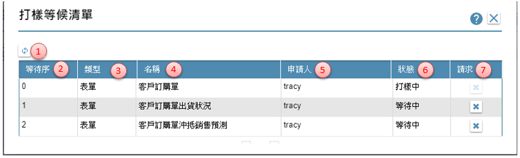
1. 重顯鍵：重新顯示目前的等待狀況
2. 等待序：顯示排隊的順序，０表示執行中
3. 類型：打樣的類別，表單／作業／檢視表
4. 名稱：依打樣類別，顯示表單／作業／檢視表名稱
5. 申請人：顯示執行打樣的使用者姓名
6. 狀態：僅等待序＝０者為打樣中，其餘為等待中
7. 請求鍵：點選本鍵，即表示放棄打樣，會被踼出等待清單

### **A7.3 打樣狀態備註**
> 作業目的：清除打樣測試階段的測試資料。
參考資料：[☢影片](https://youtu.be/vIRHpGZHxeM){:target='_blank'} [℗文件](pdf/15-4預覽(驗證)打樣結果.pdf){:target='_blank'}

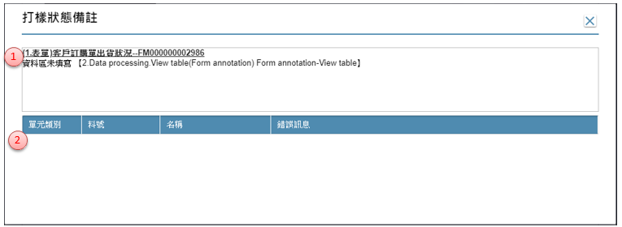
1. 訊息清單鍵：顯示打樣檢錯的訊息
2. 單元清單：顯示錯誤的單元內容

##  **A7.4 打樣資料刪除**
> 作業目的：當資料表的結構異動到無法利用系統對應，或者欲清空特定資料表格時，可以用此作業將內容資料表的內容清除。
參考資料：[☢影片](https://youtu.be/GzH7ONP6QE4){:target='_blank'} [℗文件](pdf/15-5刪除打樣資料.pdf){:target='_blank'}

1. 表單名稱：顯示打樣的表單名稱
2. 料號：顯示打樣的表單料號
3. 以上全選鍵：以指定的記錄為準，將駐留以上資料勾選全部勾選
4. 以下取消鍵：以指定的記錄為準，將駐留以上資料勾選取消勾選
5. 以下全選鍵：以指定的記錄為準，將駐留以下資料勾選全部勾選
6. 以下取消鍵：以指定的記錄為準，將駐留以下資料勾選取消勾選
7. 反向選取鍵：利用本鍵，將清單內原勾選者改為取消勾選狀態，原無勾選者進行勾選狀	態
8. 勾選鍵：勾選或取消單一表格
9. 刪除資料鍵：執行本鍵，將勾選清單裡有勾選的表格，清除記錄

##  **A8. 訊息替代** 
> 作業目的：在訊息提示時，依操作需求將固定字串換成有義意的資訊。

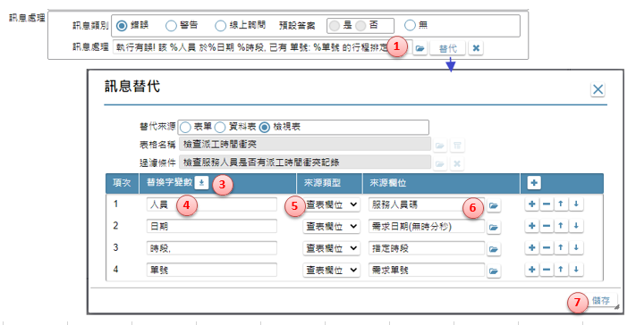
1. 訊息內容：當元件或按鍵在執行時，需在訊息內利用替代方式，將固定字串換成有義意的資訊時，可在訊息文字中以％帶頭定義變數
2. 替代鍵：當訊息內有（以％帶頭）可此按鍵開啟[【訊息替代】](20.html#MessageReplace)表格宣告替換的內容及方式
3. 載入鍵：系統自動載入有％符號的變數名稱
4. 替換字變數：指定替代裡的變數名稱
5. 替代類別：依替代的來源決定下拉的類型
6. 替代來源欄位：參考來源類別裡的設定，挑選替換字資料來源
7. 儲存鍵：確認並存回表格內容後，關閉表單						

---
#  **B 過帳架構及案例說明**
> **過帳架構**

> 案例說明

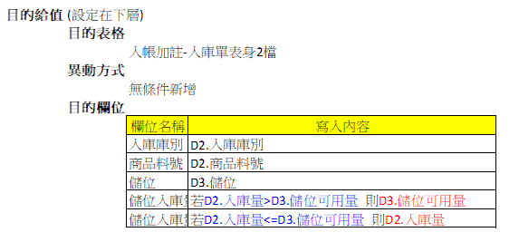

---
[**回到章節目錄**](index.html#MainMenu)