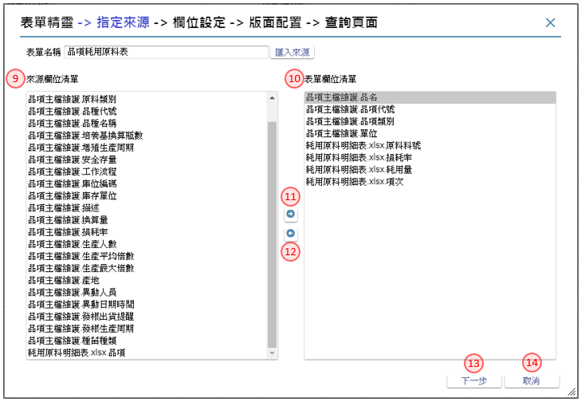
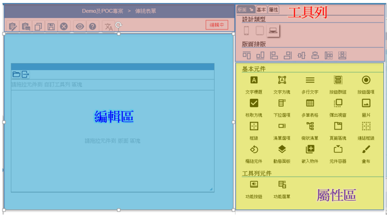

作業目的：作業表單是將來應用系統操作的主體，也是專案發展系統時的主軸，從表單(名稱)的宣告、表單版面的繪製(同時宣告表單元件)、表單元件的處理規格，一直到輸入完成後按提交鈕來執行最後的資料庫更新。

## **5.1 作業表單的宣告** {#FormLayout}

作業表單被宣告(declare) 的方法有二:
 1. 由架構樹 的作業流程裡的流程裡, 使用單據, 同時建立作業表單的名稱
 2. 直接在架構樹的作業流程上, 新增作業表單。

### **5.1.1 新增表單**
參考資料：[℗文件](pdf/3-2建立表單.pdf){:target='_blank'}

方法一：由作業流程節點，直接新增表單 

1. 架構樹上的「作業流程」節點，利用滑鼠右鍵開啟選單後
2. 點選單內的新增項，進入第二層的選單
3. 選擇新增表報，開啟【新增表單／報表】頁面

方法二：在流程清單裡，建立新表單 

1. 在流程清單裡的活動類型選擇：單據
2. 駐留表單／報表名稱欄位，會出現【單據清單】，點選其新增鍵，就會開啟【新增表單／報表】的頁面

1. 類型：選擇 表單									
2. 設計類型：標準：適用於PC/NB，RWD：自適應表單,不限裝置，App：適用於行動裝置
3. 名稱：輸入要新增的表單名稱									
4. 作業代號：輸入要新增的的作業代號，同一專案下不允重複									
5. 功能說明：描述本張表單的作用									
6. 使用時機：說明本張表單的操作情況及時機									
7. 儲存鍵：系統依表單名稱，產生空白版面									

### **5.1.2 表單精靈操作**
> 作業目的：編輯或檢視作業的表單版面內容。

參考資料：
- 表單精靈-由Excel建立 [℗文件](pdf/20-1表單精靈-由Excel建立.pdf){:target='_blank'}
- 表單精靈-由檢視表建立[℗文件](pdf/20-2表單精靈-由檢視表建立.pdf){:target='_blank'}

1. 新增鍵：在表報清單點選本鍵，開啟【新增表單／報表】的頁面
2. 表單精靈鍵：開啟表單精靈操作視窗，並駐留「指定來源」頁面

> 步驟一： 
駐留「指定來源」頁面，挑選匯入來源欄位，選擇列入表單欄位清單內容

1. 表單名稱：輸入新增表單名稱
2. 匯入來源鍵：開啟匯入來源視窗
3. Excel：選擇來源類別為Excel
4. 選擇檔案鍵：開啟檔案總管，挑選待匯入之Excel檔
5. 標題列：輸入Excel中，標題所在列數
6. 其它表單：選擇專案內其它表單
7. 取代鍵：將挑選匯入來源，完全取代已存在的來源欄位清單， 並清空表單欄位清單內容
8. 附加鍵：將挑選匯入來源，附加於原來源欄位清單內容下方

9. 來源欄位清單：顯示匯入來源帶入之所有欄位內容，不含已列入表單欄位清單之欄位
10. 表單欄位清單：顯示自來源欄位清單列入之欄位內容
11. 列入表單欄位清單鍵：將來源欄位清單指定的欄位，列入表單欄位清單中
12. 退回來源欄位清單鍵：將已選取指定欄位自表單欄位清單中移除，並退回來源欄位清單中
13. 下一步鍵：前往「欄位設定」頁面
14. 取消鍵：確認取消後，將關閉表單精靈視窗

> 步驟二： 
駐留「欄位設定」頁面，增刪表單欄位清單內容，並設定各欄位之功能

1. 新增鍵：開啟新增欄位視窗，輸入新增欄位名稱，按下儲存鍵後，將欄位新增至表單欄位清單中
2. 刪除鍵：駐留表單欄位清單某一欄位，執行後將欄位自表單欄位清單中移除
3. 編輯鍵：駐留表單欄位清單某一欄位，執行後元件屬性設定區塊進入編輯狀態
4. 儲存鍵：執行後，將存回設定內容，元件屬性設定區塊返回瀏覽狀態
5. 取消鍵：執行後，取消編輯設定內容，元件屬性設定區塊返回瀏覽狀態
6. 元件類型：下拉選擇，目前提供類型:文字方塊/下拉選項/彈出視窗/多行文字/核取方塊/圖片
7. 資料模版：下拉選擇專案內已存在之模版內容
8. 資料長度：匯入來源為其它表單時，依原表單設定內容；來源為Excel時，則預設為20
9. 小數位：當選擇資料模版型態為數字時顯示，可輸入1~9
10. 不可重複：勾選本項，產生元件加註將於基本設定中，勾選不可重複功能
11. 不可空白：勾選本項，產生元件加註將於基本設定中，勾選必要項/空值要檢錯功能
12. 不可負值：勾選本項，產生元件加註將於基本設定中，勾選不可負值功能
13. 僅供顯示：勾選本項，產生元件加註將於基本設定中，勾選僅供顯示功能
14. 自動給值：勾選本項，即可選擇預設值內容
15. 自動給值設定：下拉選擇，目前提供:系統日期/使用者名稱/流水號
16. 下拉選項：勾選本項，可自行設定欄位下拉內容
17. 下拉選項設定：自行輸入下拉文字內容，以分號(;)區隔不同的選項，例:1.男;2.女
18. 開窗挑選：勾選本項，將依設定產生元件加註，新增開窗參照內容
19. 開窗挑選＿表單名稱：開窗選擇專案內其它表單
20. 開窗挑選＿挑選欄位：依選擇專案表單，開窗選擇表單內元件，將值帶回給駐留欄位
21. 查表帶值：勾選本項，將依設定產生元件加註，新增更新給值內容，依比對欄位與駐留欄位為設定過濾條件，分別依帶回欄位給給值來源，及依寫入欄位給目的欄位
22. 查表帶值＿表單名稱：開窗選擇專案內其它表單
23. 查表帶值＿比對欄位：挑選指定表單的表單元件，作為與駐留欄位比對用
24. 查表帶值＿帶回欄位：挑選指定表單的表單元件，作為寫入欄位之來源值
25. 查表帶值＿寫入欄位：挑選表單欄位清單內欄位，作為帶值之目的欄位
26. 公式計算：勾選本項，將依設定產生元件加註，新增被動更新內容，將設定內容執行結果更新給駐留欄位
27. 公式計算設定：自行輸入文字，以中括號[]包覆欄位，例:[單價]*[數量]
28. 多筆加總：勾選本項，將依設定產生元件加註，新增被動更新內容，將多筆加總設定選擇之欄位值合計加總結果給駐留欄位
29. 多筆加總設定：挑選表單欄位清單內欄位
30. 上一步鍵：返回「指定來源」頁面
31. 下一步鍵：前往「版面配置」頁面

> 步驟三： 
駐留「版面配置」頁面，將表單欄位清單內容分別配置給單筆區塊及多筆明細區塊，並依配置內容，分別產生不同類型之主要表單

1. 僅單筆區塊有值時，產生單筆表單
2. 僅多筆明細區塊有值時，產生多筆表單
3. 單筆區塊及多筆明細區塊皆有值時，產生雙檔表單

1. 單筆清單：該欄位清單內容，由表單欄位清單列入
2. 單筆列入清單鍵：將表單欄位清單指定的欄位，列入單筆清單，增加單筆清單的資料列
3. 單筆退回清單鍵：將單筆清單指定的欄位，改退回列入表單欄位清單
4. 單筆排列順序置頂鍵：將單筆清單裡指定的內容，移到最上面，駐留第一列時除能
5. 單筆排列順序上移鍵：將單筆清單裡指定的內容，往上移一列序，駐留第一列時除能
6. 單筆排列順序下移鍵：將單筆清單裡指定的內容，往下移一列序，駐留最後一列時除能
7. 單筆排列順序置底鍵：將單筆清單裡指定的內容，移到最下面，駐留最後一列時除能
8. 多筆清單：該欄位清單內容，由表單欄位清單列入
9. 多筆列入清單鍵：將表單欄位清單指定的欄位, 列入多筆清單，增加多筆清單的資料列
10. 多筆退回清單鍵：將多筆清單指定的欄位，改退回列入表單欄位清單
11. 多筆排列順序置頂鍵：將多筆清單裡指定的內容，移到最上面，駐留第一列時除能
12. 多筆排列順序上移鍵：將多筆清單裡指定的內容，往上移一列序，駐留第一列時除能
13. 多筆排列順序下移鍵：將多筆清單裡指定的內容，往下移一列序，駐留最後一列時除能
14. 多筆排列順序置底鍵：將多筆清單裡指定的內容，移到最下面，駐留最後一列時除能
15. 上一步鍵：返回「欄位設定」頁面
16. 下一步鍵：前往「查詢頁面」頁面

>步驟四： 
駐留「查詢頁面」頁面，先後設定查詢表單之查詢結果欄位及條件欄位內容，並定義各條件欄位之查詢類型

1. 配置欄位清單：該欄位清單內容，顯示「版面配置」頁面中單筆及多筆欄位清單
2. 查詢欄位清單：該欄位清單內容，為設定查詢表單的表身查詢結果欄位內容，由配置欄位清單列入
3. 列入查詢清單鍵：將配置欄位清單指定的欄位, 列入查詢欄位清單，增加查詢欄位清單的資料列
4. 退回配置清單鍵：將查詢欄位清單指定的欄位，改退回列入配置欄位清單
5. 查詢欄位排列順序置頂鍵：將查詢欄位清單裡指定的內容，移到最上面，駐留第一列時除能
6. 查詢欄位排列順序上移鍵：將查詢欄位清單裡指定的內容，往上移一列序，駐留第一列時除能  
7. 查詢欄位排列順序下移鍵：將查詢欄位清單裡指定的內容，往下移一列序，駐留最後一列時除能
8. 查詢欄位排列順序置底鍵：將查詢欄位清單裡指定的內容，移到最下面，駐留最後一列時除能  
9. 條件欄位清單：該欄位清單內容，為設定查詢表單的表頭查詢條件欄位內容，由查詢欄位清單列入
10. 列入條件清單鍵：將查詢欄位清單指定的欄位, 列入條件欄位清單，增加條件欄位清單的資料列
11. 退回查詢清單鍵：將條件欄位清單指定的欄位，自欄位清單中移除
12. 條件欄位排列順序置頂鍵：將條件欄位清單裡指定的內容，移到最上面，駐留第一列時除能
13. 條件欄位排列順序上移鍵：將條件欄位清單裡指定的內容，往上移一列序，駐留第一列時除能  
14. 條件欄位排列順序下移鍵：將條件欄位清單裡指定的內容，往下移一列序，駐留最後一列時除能
15. 條件欄位排列順序置底鍵：將條件欄位清單裡指定的內容，移到最下面，駐留最後一列時除能  
16. 單一欄位：將依設定，於執行後產生單一查詢元件
17. 單一欄位＿完全符合：依設定產生按鍵加註/資料過濾條件內容；執行查詢時，將輸入查詢條件與來源資料完全相同者，列示於表身
18. 單一欄位＿相似包含：依設定產生按鍵加註/資料過濾條件內容；執行查詢時，將輸入查詢條件包含於來源資料內容者，列示於表身
19. 範圍區間：將依設定，於執行後產生欄位起和欄位迄兩個查詢元件
20. 範圍區間＿包含起迄：依設定產生按鍵加註/資料過濾條件內容；執行查詢時，將來源資料中屬於輸入查詢範圍區間且包含起迄欄位內容者，列示於表身
21. 範圍區間＿不含起迄：依設定產生按鍵加註/資料過濾條件內容；執行查詢時，將來源資料中屬於輸入查詢範圍區間但不包含起迄欄位內容者，列示於表身
22. 上一步鍵：返回「版面配置」頁面
23. 確認&打樣鍵：依設定內容產生主要表單版面及其元件和按鍵加註內容，並於執行打樣後預覽開啟主要表單；當「查詢頁面」有設定時，將一併產生主要表單與查詢表單之表單版面及相關元件和按鍵加註內容，並於執行打樣後預覽開啟查詢表單

---
## **5.2 表單版面介紹**
> 作業目的：在不同的版面區域均安排不同用途的操作介面,以方便完成版面的編排

### **5.2.1 工具列**
> 功能說明：在編輯模式及瀏覽模式下的按鈕選項有些差異, 以下說明

1. 駐留順序鍵：點選後，開啟[【駐留順序】](#FormLayout_TabOrder)調整各元件駐留順序，操作方式請參考［5.7］
2. 規格定義鍵：點選後，開啟[【規格定義】](06.html#SpecificationDefinition)檢視及設定各元件的邏輯定義，操作方式請參考［6.2］
3. 規格描述鍵：點選後，開啟[【規格描述】](06.html#SpecificationAnnotated)檢視及設定各元件的規格說明，操作方式請參考［6.1.1］
4. 編輯鍵：進入表單版面編輯模式
5. 匯入鍵：點選後，開啟[【表格生成表單版面】](#FormLayout_SchemaGenScreen)，利用其它方式匯入產生表單，操作方式請參考［5.9］
6. 表格鍵：點選後，開啟[【表單版面生成表格】](#FormLayout_ScreenGenSchema)將版面元件生成檢視及資料表格，操作方式請參考［5.8］
7. 打樣鍵：點選後，執行表單打樣的動作，先檢錯->打樣->預覽
8. 打樣狀態鍵：點選後，開啟[【打樣狀態查詢】](20.html#FormPrototypeing_Status)就打樣的記錄及產生錯誤的訊息,進行檢查及排除，操作方式請參考［附錄A7］
9. 畫面同步鍵：當專案設有多語系時，各版面是獨立設定。可依版面指定的語系為依據，改變其它語系的版面
10. 線上說明鍵：點選後，開啟【線上說明】駐留在表單版面說明
11. 語系：依據專案多語的設定，可下拉選擇不同語系的版面內容；選擇後依指定的語系顯示該語系版面內容
12. 規格定義鍵：點選後，開啟[【規格定義】](06.html#SpecificationDefinition)檢視及設定各元件的邏輯定義，操作方式請參考［6.2］
13. 規格描述鍵：點選後，開啟[【規格描述】](06.html#SpecificationAnnotated)檢視及設定各元件的規格說明。操作方式請參考［6.1.1］
14. 複製鍵：點選後，開啟[【版面複製】](#FormLayout_copy)可複製其它單據存在的元件。操作方式請參考［5.6.3］
15. 儲存鍵：將排版內容記錄儲存
16. 取消鍵：取消排版的異動, 回復到編輯前狀態
17. 顯示異動項目鍵：切換是否標示有異動的元件內容
18. 線上說明鍵：點選後，開啟【線上說明】駐留在表單版面說明
19. 語系：依據專案多語的設定，可下拉選擇不同語系的版面內容；選擇後依指定的語系顯示該語系版面內容
20. 對齊工具列_置上鍵：在複選多個元件的狀態下, 以標註的元件為基準, 向上對齊
21. 對齊工具列_置下鍵：在複選多個元件的狀態下, 以標註的元件為基準, 向下對齊
22. 對齊工具列_置左鍵：在複選多個元件的狀態下, 以標註的元件為基準, 向左對齊
23. 對齊工具列_置右鍵：在複選多個元件的狀態下, 以標註的元件為基準, 向右對齊
24. 對齊工具列_垂直置中鍵：在複選多個元件的狀態下, 以標註的元件為基準, 垂直置中對齊
25. 對齊工具列_水平置中鍵：在複選多個元件的狀態下, 以標註的元件為基準, 水平置中
26. 對齊工具列_同寬鍵：在複選多個元件的狀態下,  預統一寛度；本工具彈出寬度輸入框，要求指定寬度，系統預設: 圈選範圍內左上角元件的寬
27. 對齊工具列_同高鍵：在複選多個元件的狀態下,  預統一高度；本工具彈出高度輸入框，要求指定高度，系統預設: 圈選範圍內左上角元件的高
28. 屬性區_版面頁：顯示與版面元件類型清單，供拖拉、挑選
29. 屬性區_表單頁：顯示及設定表單有關的資訊
30. 屬性區_屬性頁：顯示及設定元件、按鍵有關的資訊
31. 屬性區_鎖定鍵：切換駐留屬性頁的狀態，若為鎖定者，在切換表單或元件、按鍵時，不會跟著切換頁籤
32. 設計類型：標示本表單的類型，圖示由左到右，分別是APP表單, RWD表單, 傳統表單

### **5.2.2 編輯區**
> 功能說明：利用拖拉的方式, 在元件清單中,挑選除了的功能按鈕、功能選單以外的元件到本區域, 移動位置、調整大小, 組成版面所屬的樣式。

1. 選單列：呈現表單指定的系統功能鍵內容
2. 工具列：呈現表單自訂作業功能鍵的內容
3. 編輯區：表單版面下各欄位或按鈕放置及編排的主要區域，是資料收集的作業或是查詢結果的顯示區域。

---
## **5.3 表單設定**
> 功能說明：平台針對不同的裝置所使用的表單設計類型，而設定相關的屬性。

### **5.3.1 傳統表單**

1. 版面屬性：頁籤模式，切換到本頁籤，顯示及設定與表單排版時有關的內容
2. 設計類型：利用本圖示表示為傳統表單
3. 基本屬性：頁籤模式，切換到本頁籤，顯示及設定與表單版面相關的資訊
4. 表單名稱：此表單的命名，使用於規格設定時的資源名稱(resource name)
5. 標題名稱：設定表單的標題名稱
6. 作業代號：出現在文件旳作業號
7. 表單料號：顯示駐留表單的料號
8. 成品料號：顯示駐留表單的成品料號
9. 對應自適應表單：當本身是傳統表單, 但在行動裝置上操作時, 可指定一RWD表單來做替換。也就是若在運行環境操作系統點選本單時，在PC 上會開本單, 但在行動裝置上，則改開指定的RWD表單
10. 系統功能鍵：指定本表單是否有系統功能鍵的需求。在APP表單上沒有此類功能選項
11. 表單自訂樣式：表單指定的單元樣式
12. 表單底圖：挑選當底圖的圖片, 可選擇圖示裡的圖檔，挑選時會過濾圖示用表單者
13. 系統工具列樣式：可在個別表單上指定的系統工具的單元樣式
14. 顯示工具列：是否顯示工具列
15. 工具列自訂樣式：工具列上指定的單元樣式
16. 顯示狀態列：設定狀態列的列高
17. 狀態列自訂樣式：狀態列上指定的單元樣式
18. 表單全高：表單全高
19. 編輯區高：編輯區高
20. 表單寛度：表單寛度
21. 自動對齊：是否開始自動對齊的功能
22. 自動對齊間距：自動對齊的有效的狀態下的預設間距

### **5.3.2 RWD表單**

1. 版面屬性：頁籤模式，切換到本頁籤，顯示及設定與表單排版時有關的內容
2. 設計類型：利用本圖示表示為自適應的RWD表單
3. 列樣式：本表格會依據版面切分的列數所決定筆數
4. 列自訂樣式：依據版面的列序，可個別定義單元樣式
5. 排版建議：系統預設７種對單列設定欄位的方法，依版面附圖，由左至右分別為: 1、1:1、1:1:1、1:2:1、1:1:1:1、1:3、3:1每一比例佔比25%
6. 欄樣式：本表格會依據版面駐留的列，呈現該列所有的欄數的筆數
7. 欄自訂樣式：依據版面的該列的欄序，可個別定義單元樣式
8. 基本屬性：頁籤模式，切換到本頁籤，顯示及設定與表單版面相關的資訊
9. 表單名稱：此表單的命名，使用於規格設定時的資源名稱(resource name)
10. 標題名稱：設定表單的標題名稱
11. 作業代號：出現在文件旳作業號
12. 表單料號：顯示駐留表單的料號
13. 成品料號：顯示駐留表單的成品料號
14. 系統功能鍵：指定本表單是否有系統功能鍵的需求。在APP表單上沒有此類功能選項
15. 表單自訂樣式：表單指定的單元樣式
16. 系統工具列樣式：可在個別表單上指定的系統工具的單元樣式
17. 顯示工具列：是否顯示工具列
18. 工具列自訂樣式：工具列上指定的單元樣式
19. 顯示狀態列：設定狀態列的列高
20. 狀態列自訂樣式：狀態列上指定的單元樣式
21. 指定顯示的類型：在行動裝置上操作的表單, 不是固定的寛、高，而是以版面的尺寸做自適應調整，在此挑選指定排版呈現的種機尺寸
22. 屏幕方向：選擇排版時，呈現的向方直屏或橫屏

### **5.3.3 APP表單**

1. 版面屬性：頁籤模式，切換到本頁籤，顯示及設定與表單排版時有關的內容
2. 設計類型：利用本圖示表示為自適應的RWD表單
3. 列樣式：本表格會依據版面切分的列數所決定筆數
4. 列自訂樣式：依據版面的列序，可個別定義單元樣式
5. 排版建議：系統預設７種對單列設定欄位的方法，依版面附圖，由左至右分別為: 1、1:1、1:1:1、1:2:1、1:1:1:1、1:3、3:1每一比例佔比25%
6. 欄樣式：本表格會依據版面駐留的列，呈現該列所有的欄數的筆數
7. 欄自訂樣式：依據版面的該列的欄序，可個別定義單元樣式
8. 基本屬性：頁籤模式，切換到本頁籤，顯示及設定與表單版面相關的資訊
9. 表單名稱：此表單的命名，使用於規格設定時的資源名稱(resource name)
10. 標題名稱：設定表單的標題名稱
11. 作業代號：出現在文件旳作業號
12. 表單料號：顯示駐留表單的料號
13. 成品料號：顯示駐留表單的成品料號
14. 系統功能鍵：指定本表單是否有系統功能鍵的需求。在APP表單上沒有此類功能選項
15. 表單自訂樣式：表單指定的單元樣式
16. 顯示上方導覽列：是否顯示上方導覽工具列
17. 上方導覽列自訂樣式：上方導覽工具列上指定的單元樣式
18. 顯示下方導覽列：是否顯示下方導覽工具列
19. 下方導覽列自訂樣式：下方導覽工具列下指定的單元樣式
20. 指定顯示的類型：在行動裝置上操作的表單, 不是固定的寛、高，而是以版面的尺寸做自適應調整，在此挑選指定排版呈現的種機尺寸
21. 屏幕方向：選擇排版時，呈現的向方直屏或橫屏

---
## **5.4 表單元件(component type in form)**
> 作業目的：作業表單的操作畫面是由許多的元件所組成的，包含顯示目的的文字說明與執行時的圖片顯示，以及資料輸入的各類方法元件。

### **5.4.1 表單元件類型**

|WEB表單 |RWD表單  |APP表單 |
| :- | :- | :- |
| | | |

1. 文字標題(label)：純粹作為顯示字幕，無關資料收集或顯示
2. 單行文字(TextEdit)：一般型文數字資料欄位
3. 多行文字(MultiEdit)：多行數的長資料欄位
4. 按鈕群組(radioGroup)：按鈕選項的底層
5. 按鈕選項(radio button)：單一選擇的單選鈕 
6. 核取方塊(check box)：多項選擇的勾取項
7. 下拉選項(dropList)：有下拉式清單的輸入欄位
8. 多筆表格(grid)：多欄位且有多筆資料行
9. 彈出視窗(popup)：結合元件規格定義之“另開視窗“可以呼叫另一個表單，操作的結果會帶回此表單元件內
10. 圖片(image)：劃出一個矩形來顯示圖片
11. 框線(frame)：純裝飾用的矩形框線
12. 清單選項(list)：固定視窗來顯示操作輔助選項
13. 樹狀結構(tree)：可以定義一棵樹狀的結構
14. 頁籤區塊(tabs)：宣告一個頁籤區塊來區隔不同屬性的操作需求
15. 連結框：可以設定背後連結的框線
16. 樞紐元件(Pivot widget)：是一個樞紐分析元件
17. 動態面版(dynamicpanel)：功能類似頁籤元件，但無頁籤標題
18. 崁入物件(embed object)：是要崁入一個物件的，如網頁、地圖、統計圖表等等
19. 元件容器(container)：功能類似網格多筆，限瀏覽用, 同時適用行動裝置
20. 畫布(Canvas)：功能類似圖片，但有編輯手繪圖的功能
21. 多筆瀏覽(grid Lite)：多欄位且有多筆資料行, 但僅供顯示

附註：各元件類型的屬性可以預設，請參考［3.2.4 元件樣式預設］

### **5.4.2 表單元件屬性**
共通屬性

1. 元件類型：說明本元件的類型名稱 ；元件類型與元件的行為有關，若欲變更，可利用下拉切換成不同類型
2. 元件名稱：此元件的命名，使用於規格設定時的資源名稱(resource name)
3. 資料模版：
4. 顯示字數：
5. X軸座標：相對於編輯區起點的X軸
6. Y軸座標：相對於編輯區起點的Y軸
7. 元件寬度：元件的寬度，若勾選顯示標題且顯示在左、右時，則包含標題的寬度
8. 元件高度：元件的高度，若勾選顯示標題且顯示在上、下時，則包含標題的高度
9. 顯示標題：是否有標題的顯示
10. 標題內容：此元件的顯示在版面上的標題文字
11. 標題位置：標題顯示在原文件的上、下、左、右
12. 標題寬度：標題的寬度，若標題位置在上、下時，限定與元件內容同寛度；不允修改
13. 標題高度：標題的高度，若標題位置在左、右時，限定與元件內容同高度；不允修改
14. 自訂樣式：指定的單元樣式
15. 僅供顯示：指定本欄位是否只能顯示, 不能輸入
16. 欄位寛度比例：RWD與APP 表單版面是自適應，元件的寬度是用比例表示
17. 欄位高度比例：RWD與APP 表單版面是自適應，元件的高度是用px表示
18. 變動高度：指定元件的高度是否隨資料的多寡, 而變換高度. 若為固定高度時, 超出寛度的資料會以… 省略符號表示；若為變動高度，則會折行撐大列高。

標題與變動高度之間的變化案例模擬請參考本節 註一 

<table>
  <tr>
    <td width="50%" ><image src="images/05.4.2-2.png"/>  </td>
    <td width="50%" >
  1. 元件類型：當設計類型＝傳統表單，元件類型為多行文字 
  2. 自動換列：當此元件放置在多筆表格時，可勾選設定 自動換行；當欄位內容超過欄位時，會自動折行 
     </td>
    </tr>

  <tr>
    <td width="50%" ><image src="images/05.4.2-3.png"/> </td>
    <td width="50%" >
    1. 元件類型：當元件類型為多筆表格 
    2. 寛高尺寸：下拉選擇自動計算或自行指定, 若選擇自動計算時時,系統自動計算所有欄位的寬度+捲軸為表格的寛度 
    3. 欄位數量：此表格包含的欄位數量 column 
    4. 單頁筆數：此表格一頁顯示的資料列數 
    6. 高度：表格裡總高度 
    7. 標題列高：表格裡標題列的高度 
    8. 資料列高：表格裡資料列的高度 
    9. 資料列距：表格裡每一資料列的間距 
     </td>
     </tr>   
  </tr>
     <tr>
     <td width="50%" ><image src="images/05.4.2-4.png"/> </td>
     <td width="50%" >
     1. 元件類型：當元件類型為頁籤區塊 
     2.  頁籤項目高度：頁籤項目的高度 
     3. 頁籤項目寛度：頁籤項目的寛度 
     4. 頁籤項目清單-鎖定鍵：針對頁籤項目進行順序移動時，可利用鎖定鍵將項目標註後，以拖拉方式將項目移到新的位置 
     5. 頁籤項目清單-頁籤名稱：輸入頁籤項目的名稱 
     6. 頁籤項目清單-操作工具：可利用滑鼠右鍵，開啟工具列對頁籤項目進行操作。新增：增加項目在最後一筆；插入：增加項目在駐留筆；刪除：刪除駐留筆 
      </td>
      </tr>   
     <tr>
         <td width="50%" ><image src="images/05.4.2-5.png"/> </td>
         <td width="50%" >
         1. 元件類型：當元件類型為樞紐元件 
         2. 橫軸(X軸)標題欄寛：橫軸(X軸)標題欄寛 
         3. 橫軸(X軸)標題列高：橫軸(X軸)標題列高 
         4. 縱軸(Y軸)標題欄寛：縱軸(Y軸)標題欄寛 
         5.縱軸(Y軸)標題列高：縱軸(Y軸)標題列高 
         6. 縱軸(Y軸)標題列距：縱軸(Y軸)標題列距 
         7. 過濾條件：指定是否須安排過濾條件欄位 
         8. 過濾條件_標題：當勾選過濾條件時，輸入過濾條件的標題 
         9. 過濾條件_標題高度：當勾選過濾條件時，輸入過濾條件的標題高度 
         10. 過濾條件_標題寛度：當勾選過濾條件時，輸入過濾條件的標題寛度 
         11. 過濾條件_資料寛度：當勾選過濾條件時，輸入過濾條件的資料寛度 
          </td>
         </tr>    
     <tr>
         <td width="50%" ><image src="images/05.4.2-6.png"/> </td>
         <td width="50%" >
         1. 元件類型：當元件類型為動態面版 
         2. 面版內容清單-鎖定鍵：針對內容項目進行順序移動時，可利用鎖定鍵將項目標註後，以拖拉方式將項目移到新的位置 
         3. 面版內容清單-清單-內容名稱：輸入內容項目的名稱 
         4. 面版內容清單-操作工具：可利用滑鼠右鍵，開啟工具列對內容項目進行操作。新增：增加項目在最後一筆；插入：增加項目在駐留筆；刪除：刪除駐留筆 
          </td>
         </tr>        
     <tr>
         <td width="50%" ><image src="images/05.4.2-7.png"/> </td>
         <td width="50%" >
         1. 元件類型：當元件類型為元件容器 
         2. 滑動方向：指定上下或左右滑動 
         3. 區塊模式：指定資料區塊是為單列式或磚塊式 
         4. 磚塊高度：當資料區塊為磚塊式時, 指定其高度 
         5. 磚塊寬度：當資料區塊為磚塊式時, 指定其寛度 
          </td>
         </tr>       
     <tr>
         <td width="50%" ><image src="images/05.4.2-8.png"/> </td>
         <td width="50%" >
         1. 元件類型：當元件類型為多筆瀏覽裡的按鍵元件 
         2.   圖示顯示模式：單選(固定大小/自動填滿) 
         3. 圖示位置: 下拉(上 / 下 / 左 / 右)，系統預 
          </td>
         </tr>            
     <tr>
         <td width="50%" ><image src="images/05.4.2-9.png"/> </td>
         <td width="50%" >
         1. 元件類型：當元件類型為多筆瀏覽 
         2.   單頁筆數：指定每頁出現的筆數，當筆數不足時，表格高度會依筆數變矮，但是大於此設定者，以此設定為準。 
         3. 變動高度：尚表格內的元件設為變動高度, 導致一個頁面高度放不下指定的筆時, 是否採變動高度, 讓表格變高, 或者, 不勾選, 而出現Scroll Bar 
         4.   分頁格式：指定跳頁的工具列模式(數字分頁/指定跳頁) 
         5.   分頁位置：指定跳頁的工具位置(表格上方/表格下方)      
         案例模擬請參考本節註二 
          </td>
         </tr>                                                   
</table>

註一： 

---
## **5.5 表單按鍵**
### **5.5.1 表單按鍵類型**
**系統按鍵設定**：指定表單所需的系統功能鍵。

1.  駐留表單的選單列, 點撃本區空白處, 屬性區會出現選單列的屬性視窗
2.  經由勾選, 指定表單所需的系統功能鍵

**自訂按鍵設定：**點撃本區空白處, 屬性區會出現選單列的屬性視窗, 經由勾選指定表單所需的系統功能鍵。

1. 駐留表單的工具列, 在元件清單中,挑選適用的功能按鈕或功能選單到本區域, 形成自訂功能鍵
2. 功能按鈕function button：出現在工具列上，可利用熱鍵呼叫啟動的功能按鍵
3. 功能選單 submenu function：出現在工具列上，以子選單的方式彙集功能按鍵(APP表單, 不支援)

### **5.5.2 表單按鍵屬性**

1. 按鍵類型：說明本按鍵的類型名稱
2. 按鍵名稱：此按鍵的命名，使用於規格設定時的資源名稱(resource name)
3. 標題內容：此元件的顯示在版面上的標題文字
4. X軸座標：相對於編輯區起點的X軸
5. Y軸座標：相對於編輯區起點的Y軸
6. 按鍵寬度：按鍵的寬度
7. 按鍵高度：按鍵的高度
8. 自訂樣式：指定的單元樣式
9.  圖示：指定本按鍵顯示圖示的內容, 開窗挑選時，會過濾圖示用途＝按鍵者

1. 按鍵類型：說明本按鍵的類型名稱
2. 按鍵名稱：此按鍵的命名，使用於規格設定時的資源名稱(resource name)
3. 標題內容：此元件的顯示在版面上的標題文字
4. X軸座標：相對於編輯區起點的X軸
5. Y軸座標：相對於編輯區起點的Y軸
6. 按鍵寬度：按鍵的寬度
7. 按鍵高度：按鍵的高度
8. 選單項目清單-選單名稱：輸入選單項目的名稱
9. 選單項目清單-操作工具：可利用滑鼠右鍵，開啟工具列對選單項目進行操作。新增：增加項目在最後一筆；插入：增加項目在駐留筆；刪除：刪除駐留筆
10. 自訂樣式：指定的單元樣式
11.  圖示：指定本按鍵顯示圖示的內容, 開窗挑選時，會過濾圖示用途＝按鍵者

---
## **5.6 表單繪製的操作**
> 作業目的：使用於表單版面美化，調整表單元件的寬高、位置。

### **5.6.1 表單元件移位的操作 ove component location**
> 功能說明：可以單個元件處理，也可以以群組處理。

1. 移動位置：當元件的外框出現駐留的陰影時, 即對著元件按下滑鼠左鍵不放, 進行移動, 待確定位置後, 放掉滑鼠左鍵
2. 調整寬高：在元件的右下角有一調整的符號, 滑鼠移到該符號上, 按下滑鼠左鍵不放, 進行拖拉動作,  待確定大小後, 放掉滑鼠左鍵
3. 圈選多元件: 同時選擇多個元件(左圖)一併做位置上的調整時, 可將滑鼠移到空白處, 按下滑鼠左鍵進行拖拉動作, 將要選擇的元件, 包含在框框內,
放掉滑鼠左鍵, 即產生右圖的結果
4. 複製：對元件進行圈選的動作後, Ctrl+C 複製
5. 貼上：將已複製的元件貼在目前游標所在位置, Ctrl+V 貼上
6. 刪除：圈選元件後, 鍵盤 Delete鍵
7. 對齊：對多元件進行圈選的動作後, 被圈選的元件中會出現一個紅色框線的元件(圈選的過程中, 第一個被完全包含在框框內的元件), 則是對齊的基準元件,在點選工具列的對齊項目時, 皆以該元件為標準。

> 功能說明： 若設計類型=APP 或 自適應, 拖移後依滑鼠指標所在位置，若所在位置未介於元件間，依目前欄內容中的元件位置排序至最後；若所在位置介於元件間，則插入並重新排列該欄所有元件的位置順序。

> 功能說明： 若設計類型=APP 或 自適應，以滑鼠指標所在區塊決定元件放置欄，並下列拖拉效果說明，出現定位指標線告知插 入點，若無法判定定位指標線，則拖拉無效。

### **5.6.2 編輯狀態的右鍵的操作**
> 功能說明：可以單個元件處理，也可以以群組處理。

<table>
  <tr>
    <td width="50%" >一般元件：<image src="images/05.6.2-1.png"/></td>
    <td width="50%" >
    新的一般元件： 
    1. 刪除：刪除本元件 
    已經過存檔後的元件： 
    2. 功能敍述鍵：點選後，開啟【規格描述】進行規格說明，操作方式請參考［6.1.1］ 					
    3. 規格定義鍵：點選後，開啟【規格定義】畫面，並駐留在相關元件上，操作方式請參考［6.2］ 
     </td>
    </tr>
  <tr>
      <td width="50%" >多筆表格：<image src="images/05.6.2-2.png"/></td>
      <td width="50%" >
      4. 增加不同類型的欄位 
      5. 此處的刪除，是刪除整個表格 
       </td>
  </tr>
  <tr>
    <td width="50%" >頁籤項目：<image src="images/05.6.2-3.png"/></td>
    <td width="50%" >
    6. 增加一個頁籤項目在最後 
    7. 插入一個頁籤項目在最駐留的項目 
    8. 此處的刪除，是刪除駐留的項目	 
     </td>
    </tr>
  <tr>
      <td width="50%" >動態面版：		<image src="images/05.6.2-4.png"/></td>
      <td width="50%" >
      9. 增加一個面版項目在最後 
      10. 插入一個面版項目在最駐留的項目	 
      11. 切換到指定的面版項目 
      12. 刪除到指定的面版項目，連同該面版上的所有元件 
      13. 此處的刪除，是刪除整個面版所有項目       
       </td>
      </tr>     
  <tr>
    <td width="50%" >功能選單項目：<image src="images/05.6.2-5.png"/></td>
    <td width="50%" >
    14. 增加一個選單項目在最後	 
    15. 插入一個選單項目在最駐留的項目 
    16. 此處的刪除，是刪除駐留的項目 
     </td>
    </tr>
  <tr>
      <td width="50%" >列感應條：<image src="images/05.6.2-6.png"/></td>
      <td width="50%" >
      17. 增加一空白列在駐留列下方 (預設高度 50 px)		 			
      18. 插入一空白列在駐留列上方	 
      19. 此處的刪除，是駐留本列；若本列有包含子元件時, 會提示訊問 合併或刪除的訊息 
       </td>
      </tr>    
  <tr>
	  <td width="50%" >欄感應條：<image src="images/05.6.2-7.png"/></td>
	  <td width="50%" >
	  20. 增加一欄在駐留欄的右側(最多4欄, 每欄比例總合欄數平均分配)		 
	  21. 插入一欄在駐留欄的左側 
	  22. 此處的刪除，是駐留本欄；若本列有包含子元件時, 會提示訊問 合併或刪除的訊息
	   
	   </td>
	</tr>
	
  <tr>
	  <td width="50%" >欄感應條：<image src="images/05.6.2-8.png"/></td>
	  <td width="50%" >
	  23. 必須駐留在多筆瀏覽的元件標題位置 
		24. 在表格最上方，插入一標題列，預設同 資料欄對應標題內容 
		25. 刪除表格最上方，一標題列，標題列只剩一階，按鍵除能	 
		26. 開啟「標題合併」, 確認後，依內容變化表格標題			 		
		27. 當駐留的標題是存在標題合併的狀態時, 可利用本按鍵取消合併 
		28. 向右合併欄數：輸入向右合併的欄數，若空白，表示不執行；若駐留標題為最後一欄，不允執行 
		29. 向下合併欄數：輸入向下合併的欄數，若空白，表示不執行；若駐留標題為最後一階，不允執行
		   
	   </td>
	</tr>

  </table>

註一：

### **5.6.3 複製其它表單的元件 copy component from a form** {#FormLayout_copy}
> 功能說明：為了加快表單元件的規格定義，如果知道本專案已完成的表單中有相同的規格，或是部分相同的規格可以參考使用，則可以把它的內容複製過來修改使用；分為完全複製及部分複製。
>

1. 駐留表單工具列，進入表單編輯狀態
2. 複製鍵：點選工具列本鍵，開啟【版面複製】
3. 複製專案：挑選欲複製來源表單的專案，必須具該專案的權限可允檢視
4. 關鍵字：輸入要查詢的表單關鍵字
5. 搜尋鍵：依據指定的關鍵字，畫面出現符合條件的表單清單；系統依表單的設計類型限定可過濾的表單
6. 表單名稱：指定要複製的來源表單
7. 來源名稱：顯示載入的專案及表單名
8. 複製方式：全表單覆蓋/元件附加，預設:元件；當來源表單設計類型=傳統表單時，限定為元件不允異動。
9. 全選/全不選：利用此核取方塊，決定全選/全不選指定表單的所有元件
10. 勾選指定：針對表單的元件, 進行勾選／取消的動作
11. 執行鍵：將指定的表單元件、複製的方式，所勾選的元件複製到目的表單

## **5.7 駐留順序設定** {#FormLayout_TabOrder}
> 作業目的：如果表單操作的欄位順序(按tab 鍵到下一個欄位) 與宣告順序不同，或是經過位置調整過後的順序整理。
>
參考資料：[℗文件](pdf/4-3駐留順序設定.pdf){:target='_blank'}

1.  駐留順序鍵：於表單的瀏覽狀態，點選工具列本鍵，開啟【駐留順序】
2. 單筆移動 : 駐留表單欄位資料列，按住滑鼠往上或往下拖拉到指定的位置，再放掉滑鼠
3. 多筆移動：利用鎖定鍵，挑選多筆欄位組成群組，按住滑鼠往上或往下拖拉到指定的位置，再放掉滑鼠
4. 解鎖: 解除鎖定的欄位
5. 頂端：把鎖定的多欄位, 移到是前面
6. 上移：把駐留的單一欄位或鎖定的多欄位, 往上移
7. 下移：把駐留的單一欄位或鎖定的多欄位, 往下移
8. 底端：把駐留的單一欄位或鎖定的多欄位, 移到是後面
9. 存回: 儲存調整後的駐留順序
10. 取消: 取消編修後的內容

---
## **5.8 表單版面自動產生表格 auto schema from screen** {#FormLayout_ScreenGenSchema}
> 作業目的：
參考資料： [℗文件](pdf/4-6表單版面-匯入並自動產生版面.pdf){:target='_blank'}

1. 表格鍵：於表單的瀏覽狀態，點選工具列本鍵，開啟【表單版面生成表格】
2. 檔區：系統依據表格的多寡產生檔區數量
3. 檢視表格名稱：表頭檔區以表單名為預設定，可修改；表身檔區以表單名稱＋多筆表格命名，可修改
4. 產生資料表： 勾選是否依據元件屬性及設定，產生對應的資料表格，且主動對應到檢視表
5. 不重複欄位： 選定一欄位做為表單儲存檔前的唯一、不可重複的欄位；若勾選產生實體時，同時以此做為主索引
6. 表格元件名稱：表單上若有多筆表格元件時，該表格下的元件被視為另一檔區
7. 執行鍵：依上述條件指定產生相間的檢視表及資料表，其資料來源對應如下： 
  7.1 檢視元件名＝元件名 
  7.2 檢視元件英文名＝系統自動編制料號 
  7.3 檢視元件型態＝由元件屬性上的資料模版判斷, 無模版者由元件類型判定 
  7.4 檢視元件長度＝由元件屬性上的限定長度判斷, 無長度者由元件類型判定 
  7.5 檢視元件資料來源＝若指定產生實表時，對應實表元件；若無，由系統依型態對應空值 

  規格限制：1. 執行前會檢控表單內是否有同名的元件 
  規格限制：2. 執行時, 若對應的表格已存在，則以元件名稱進行比對，若不存在則附加；存在者修改 

## **5.9 檢視表自動產生表單版面 auto screen painting from view** {#FormLayout_SchemaGenScreen}
參考資料： [℗文件](pdf/4-6匯入並自動產生畫面.pdf){:target='_blank'}

1. 表格鍵：於表單的瀏覽狀態，點選工具列本鍵，開啟【預設檢視表格】
2. 表單名稱：顯示要入的表單名稱
3. 系統功能：選擇要產生系統功鍵的選項
4. 匯入來源：可選擇Excel 匯入或View檢視表匯入
5. Excel檔案：當匯入來源=Excel匯入時, 必須指定本欄位, 挑選一具在標題列的檔案
6. Excel檔案的標題列所在行：當匯入來源=Excel匯入時, 必須指定標題列的起始列數
7. View檢視表：當匯入來源=Viewl匯入時, 必須指定本欄位挑選一存在的檢視表名稱
8. 版面格式：可選擇表格或矩陣
9. 矩陣欄數：可指定單欄/雙欄/三欄
10. 矩陣欄寛：可指定依長度/固定寛度
11. 駐留順序：可重調整欄位的順序, 以利排版, 操作說明可參考5.7 駐留順序調整
12. 執行鍵：依上述條件產生表單元件內容，此動作會刪除原存在表單的所有元件，重新產生
13. 附加鍵：依上述指定表格的內容，此動作會保留原存在表單的所有元件，僅增加此檢視表所產生的多筆表格(Grid)元件

**案例 1: View、矩陣、單欄、依欄位長度**

**案例 2 : View、矩陣、雙欄、依欄位長度**

**案例 3 : View、矩陣、單欄、固定寛度**

**案例 4 : View、表格**

**案例 5 : 利用案例 2, 附加案例 4**

---
## **5.10 表單打樣測試**
> 作業目的：將設計完成的表單，進行打樣產出可執行的作業表單，以供表單的單元測試。在表單設計的工具列上，可以找到 打樣預覽 及 打樣狀態 的按鈕，打樣預覽是要求進行打樣，並且在打樣成功後可以執行單元測試，打樣狀態 則是查詢 	最近的打樣紀錄或是錯誤訊息。

### **5.10.1 打樣預覽**
> 作業目的：在表單設計的工具列上，可以找到 打樣預覽鍵，執行打樣，進而預覽操作表單，執行單元測試。

參考資料：[℗文件](pdf/15-1打樣測試.pdf){:target='_blank'}

1. 打樣預覽鍵：於表單的瀏覽狀態，點選工具列本鍵
2. 系統通知：當本表單曾經打樣成功後，系統會提示訊息窗詢問使用者要進行的動作
3. 打樣鍵：執行本鍵，表示重新打樣產出
4. 驗證鍵：執行本鍵，開啟打樣成功表單進行驗證

### **5.10.2 打樣狀態查詢及相關處理**
> 作業目的：在表單設計的工具列上，可以找到 打樣狀態 鍵，查詢因打樣而延續的查詢、除錯等動作。

參考資料：
- [℗打樣狀態查詢](pdf/15-2打樣狀態查詢.pdf){:target='_blank'}
- [℗等候清單](pdf/15-3查詢打樣等候清單.pdf){:target='_blank'}
- [℗刪除打樣資料](pdf/15-5刪除打樣資料.pdf){:target='_blank'}

1. 打樣狀態鍵：於表單的瀏覽狀態，點選工具列本鍵, 開啟[【打樣狀態查詢】](20.html#FormPrototypeing_Status)，操作方式請參考［附錄A7］

---
[**回到章節目錄**](index.html#MainMenu)