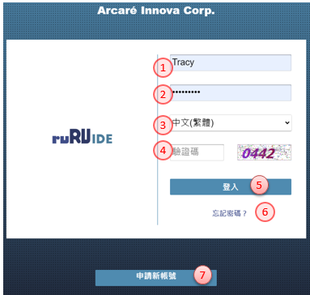
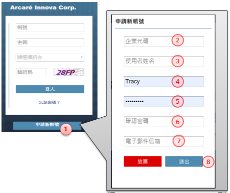
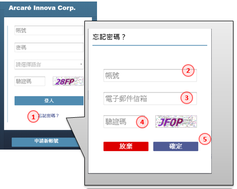

# **2.系統登入 Log in platform**
> 作業目的：系統登入的目的管理用戶及其權限，每一個ruRU IDE user都需要有帳號，並規屬於一個以登記的企業/機構之下。新客戶必須先申請帳號，舊用戶必須輸入正確的帳號及密碼。ruRU IDE新帳號核准的權限是在 site manager。
>
參考資料： [℗文件](pdf/1-2登入.pdf){:target='_blank'}

## **2.1 進入ruRU IDE平台**
> 作業目的：登入ruRU IDE之前必須先取得該ruRU IDE所存在的URL。軟體需求：瀏覽器 Google Chrome 或 FireFox。

### **2.1.1 進入ruRU IDE平台**

1. 帳號：輸入已登冊的帳號, 不分大小寫
2. 密碼：輸入密碼, 區分大小寫
3. 選擇語言：挑選要顯示的平台語系
4. 驗證碼：依畫面指示, 輸入驗證碼, 區分大小寫
5. 登入鍵：確定登入系統。
6. 忘記密碼：若忘記密碼時，可點選本鍵開啟【忘記密碼】頁面
7. 申請新帳號：若為第一次註冊或有需要新的帳號時，可點選本鍵開啟【帳號申請】頁面

### **2.1.2 帳號申請**
> 作業目的：若未有帳號者，可點選「申請帳號」連結，依螢幕指示操作申請新帳號。為了管理使用者只能看到其所屬公司的專案，所以帳號的申請必須提供其服務公司的企業代號，來過濾出它可以看得到的專案清單，或是接受PM的邀請加入某個專案。
>
參考資料：[℗文件](pdf/1-1申請帳號.pdf){:target='_blank'}

1. 申請帳號：在登入畫面點選本連結, 開啟【申請帳號】的頁面
2. 企業代碼：輸入用戶所屬的企業代碼				
3. 使用者姓名：輸入密碼, 區分大小寫				
4. 帳號：同一個Site 內會檢控不允重複				
5. 密碼：輸入密碼, 區分大小寫				
6. 確認密碼：同樣密碼再輸入一次				
7. 電子郵件信箱：同一個Site 內會檢控不允重複；				
8. 提交鍵：系統會發送確認碼到登錄的Email信箱。				

### **2.1.3 忘記密碼** 
> 作業目的：若忘記密碼，可點選「忘記密碼」，經由郵件重置密碼內容。

參考資料：[℗文件](pdf/1-3忘記密碼.pdf){:target='_blank'}

1. 忘記密碼：在登入畫面點選本連結, 開啟【重設密碼】的頁面
2. 帳號：指定要重置密碼的帳號
3. 電子郵件信箱：輸入該帳號的郵件信箱
4. 驗證碼：依畫面指示, 輸入驗證碼, 區分大小寫
5. 確認鍵：系統會發送新的密碼到登錄的Email信箱。

## **2.2 ruRU IDE 主畫面介紹**

ruRU IDE的主畫面分為四大塊
1.	系統架構區：包括專案的登入、切換、模組、事件清單
2.	專案資源區：包含表單/報表清單、元件清單、資料標清單、檢視表清單、資料交易過帳清單)，以及公用的系統服務功能清單
3.	編輯區：包含表單、報表版面編輯
4.	輔助工具區：包含繪製版面所需的元件清單、屬性設定等

## **2.3 個人帳號維護** {#MyAccount}
> 作業目的：提供使用者維護自己的帳號相關資訊，以及密碼的變更。

參考資料：[℗文件](pdf/1-4使用者設定.pdf){:target='_blank'}

### **2.3.1 個人資料修改**
> 作業目的：提供使用者維護自己的帳號相關資訊，以及密碼的變更。

1. 帳號鍵：點選後會, 開啟【帳號設定】的頁面
2. 修改個入資料：切換到本頁籤
3. 編輯鍵：進入編輯模式
4. 使用者帳號：顯示登入的帳號
5. 使用者姓名：修改使用者姓名
6. 電子郵件信箱：修改使用者郵件信箱
7. 預設語言：變更使用者常用的語系
8. 企業代碼：顯示本帳號在申請時所歸屬的企業代號
9. 新手教學：勾選本項目的狀態下，可以在工具列上找到教學的圖示
10. 儲存鍵：儲存編修後的內容

### **2.3.2 變更密碼**
> 作業目的：提供使用者維護自己的帳號相關資訊，以及密碼的變更。

1. 帳號鍵：點選後會, 開啟【帳號設定】的頁面
2. 修改密碼：切換到本頁籤
3. 編輯鍵：進入編輯模式
4. 舊密碼：先輸入原存在的密碼
5. 新密碼：輸入新的密碼
6. 確認密碼：再一次輸入新密碼
7. 儲存鍵：儲存編修後的內容

### **2.3.3 登入記錄**
> 作業目的：提供使用者維護自己的帳號相關資訊，以及密碼的變更。

1. 帳號鍵：點選後會, 開啟【帳號設定】的頁面
2. 登入記錄：切換到本頁籤
3. 姓名：顯示登入者的姓名
4. 查詢日期起：查詢的起始日期
5. 查詢日期迄：查詢的終止日期
6. 查詢鍵：經本鍵查詢符合日期區間的登入記錄

---
[**回到章節目錄**](index.html#MainMenu)