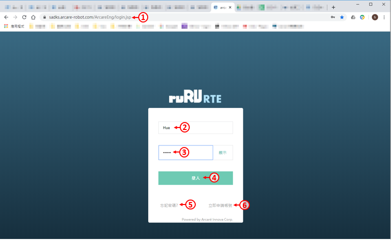
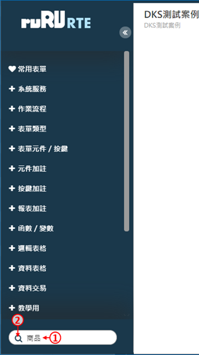
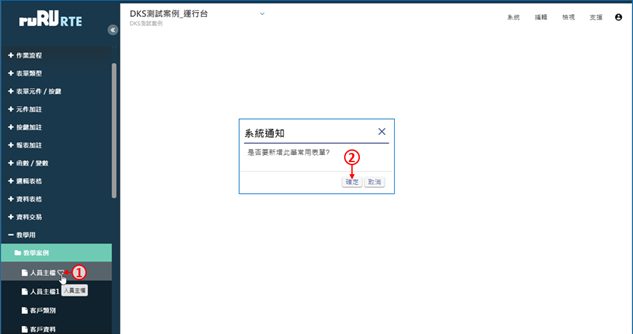
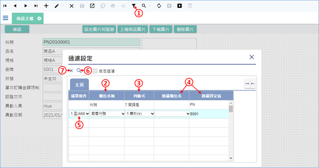
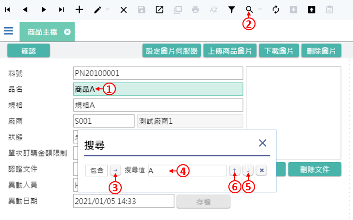
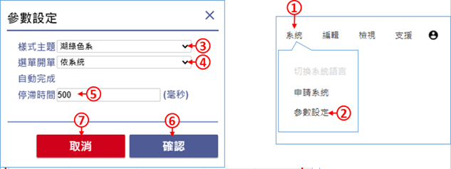

[**1.登入系統**](#Login)

  1.1 登入ruRU RTE平台
  
[**2.基本操作**](#Basicoperation)

  2.1 運行平台框架
  
  2.2 表單操作
  
  2.3 個人資料
  
  2.4 個人資料 
  
  2.5 問題回報  
  

---
#**1.系統登入**{#Login}
> 作業目的：系統登入的目的管理用戶及其權限，每一個ruRU RTE user都需要有帳號，並規屬於一個以登記的企業/機構之下。新用戶必須先申請帳號，舊用戶必須輸入正確的帳號及密碼。ruRU IDE新帳號核准的權限是在企業管理員。
>
參考資料： [℗文件](pdf/1-2登入.pdf){:target='_blank'}

##**1.1 登入ruRU RTE平台**
> 作業目的：登入ruRU RTE之前必須先取得該ruRU IDE所存在的URL。軟體需求：瀏覽器 Google Chrome 、FireFox、Safari。

首先開啟Chrome瀏覽器。
1.輸入連線網址，網址為「http://伺服器IP:8080/ArcareEng/login.jsp」或「https://伺服器網域名稱/ArcareEng/login.jsp」若不知伺服器IP或網域，請洽貴公司系統管理員取得。
2.輸入帳號。
3.輸入密碼。
4.下登入鍵。
5.如果忘記密碼，可按下忘記密碼連結，並依照畫面指示操作。
6.如果沒有帳號，請按下立即申請帳號連結，並依照畫面指示操作，申請之後請通知貴公司系統管理員進行核准。

###**1.1.1 帳號申請**
> 作業目的：若未有帳號者，可點選「申請帳號」連結，依螢幕指示操作申請新帳號。為了管理使用者只能看到其所屬公司的系統，所以帳號的申請必須提供其服務公司的企業代號，來過濾出它可以看得到的系統清單。
>
參考資料：

1.在登入畫面中，按下「立即申請帳號」連結。
2.輸入企業名稱(若不知道，請詢問系統管理員)。
3.進行下一步

1.輸入想申請的帳號，請注意英文字母大小寫。
2.輸入您的姓名。
3.輸入密碼，請依照畫面上提示的密碼規則輸入。
4.再次輸入密碼，請注意上下兩組密碼須完全一致。
5.輸入您的電子郵件地址，必須為有效的電子郵件地址。
6.選擇預設的登入語言。
7.挑選部門，本欄位可以空白不填。
8.依照右側顯示的圖案輸入驗證碼，請注意英文字母大小寫。
9.按下送出鍵，等待系統管理員審核帳號即可。(系統會發送郵件給管理員，您也可自行通知管理員。)

###**1.1.2 忘記密碼**
> 作業目的：使用者忘記密碼時，可依本節說明重設密碼，使用此功能之前，必須確定使用者的電子郵件地址是正確而且可以收到信的。。
>
參考資料：

1.輸入帳號。
2.輸入驗證碼，注意大小寫需相符。
3.按下「送出」按鍵，系統將會發出密碼重設郵件給使用者。
4.按下「確定」。

到電子郵件信箱中，打開系統寄出的郵件，然後按下「前往設定新密碼」連結。。
1.輸入要設定的密碼。
2.再輸入一次相同的密碼。
3.按下「送出」鍵即可。

#**2.基本操作**{#Basicoperation}
> 作業目的：。
>
參考資料： [℗文件](pdf/1-2登入.pdf){:target='_blank'}

##**2.1 運行平台框架**
> 作業目的：

登入後的畫面如上圖，概述如下：
1.系統選單，可選擇要登入的系統。
2.功能選單。
3.可查詢帳號資料，或是登出系統。
4.系統目錄選單，可從這裡展開目錄，開啟要作業的表單。
5.可開啟常用表單(類似我的最愛)介面。
6.表單搜尋框，可搜尋表單名稱。
7.需要時，可以將目錄區收起，增加右側的空間。

### 2.1.1 表單速查功能

1. 在左下角的搜尋欄位中，輸入要尋找的表單關鍵字。
2. 按下搜尋圖示。

1. 符合查詢條件的表單，會顯示在搜尋欄位下方。
2. 按一下要開啟的表單，該張表單就會被開啟。

### 2.1.2 設定常用表單

- 常用表單功能，可讓使用者儲存常用表單的清單，方便每次使用系統時，都能快速找到表單。

1. 展開左側的選單，將滑鼠游標停留在要加入常用表單的表單名稱上，並且按下表單名稱右邊的愛心圖案。
2. 在詢問視窗中按下「確定」鍵，表單就會被加入到常用清單中。

1. 在左側選單的上方按下「常用表單」，可以開啟常用表單介面。
2. 在「常用表單」清單中的任何一個表單名稱上點兩下滑鼠左鍵，就可以開啟該表單。
3. 按下「移除」鍵，可以將該張表單從清單中移除。
4. 按一下表單名稱，在該張表單被選取之後，再按住滑鼠左鍵不放，可以上下拖曳，改變清單中的表單順序。
5. 「全部移除」功能，可以清除所有的常用表單。

1. 在「最近開啟」清單中的任何一個表單名稱上點兩下滑鼠左鍵，可以開啟該表單。
2. 「清除紀錄」功能，可以清除所有的最近開啟表單。

##**2.2 表單操作**

###**2.2.1 工具列按鈕介紹**
> 作業目的：。
>
參考資料：

開啟指定的表單之後，有一些通用的系統功能，這些系統功能不一定每張表單都能使用，以各張表單的設計為準：
1.按下愛心按扭，可以將該表單加入常用表單。
2.駐留到第一筆資料。(Ctrl+Home)
3.上一筆資料。(Page Up)
4.下一筆資料。(Page Down)
5.駐留到最後一筆資料。(Ctrl+End)
6.新增資料。(F2)
7.修改資料。(F3)
8.刪除資料。(F4)
9.存檔功能。(F9)
10.關閉表單。(Esc)
11.複製資料。
12.列印資料。
13.恢復資料的排序。
14過濾資料。(Ctrl+F)
15.搜尋資料。(F12)
16.重新從資料庫更新資料。
17.匯入Excel檔案。
18.匯出Excel或PDF檔案。
19.以下同值功能。

###**2.2.2 表單資料過濾**
> 作業目的：此功能可以依據使用者的需求過濾符合條件的資料。
>
參考資料：

1.	啟動表單過濾功能。
2.	挑選要過濾的欄位名稱。
3.	挑選判斷式。
4.	挑選過濾欄位名，或是輸入過濾固定值(兩者擇一)。
5.	如果有兩個以上條件，請選擇運算條件(且、或)。
6.	按下搜尋按鍵，系統會過濾出符合條件的資料。
7.	刪除鍵可清除過濾條件。
•	上圖的案例，是要過濾「料號是PN開頭，而且廠商代號是S001」的資料。

###**2.2.3 表單資料搜尋**
> 作業目的：此功能可以針對表單上的特定欄位，搜尋出符合條件的資料，找到時會停在那筆資料上。
>
參考資料：

1.	按一下要搜尋的欄位。
2.	按下上方的放大鏡圖示，或是鍵盤的F12，啟動搜尋功能。
3.	此鍵可以切換搜尋的模式，例如包含、等於、開頭是…等等。
4.	輸入搜尋值。
5.	開始從這筆資料往下搜尋(往後搜尋)。
6.	開始從這筆資料往上搜尋(往前搜尋)。

## 2.3 個人資料

1. 按一下右上角的人像圖示。
2. 在選單中按下「個人資料」。

### 2.3.1 變更個人資料

1. 顯示帳號。
2. 顯示所屬企業名稱。
3. 輸入使用者姓名。
4. 輸入電子郵件信箱。
5. 輸入備用電子郵件信箱。
6. 輸入分機或專線號碼。
7. 輸入手機號碼。
8. 下拉選擇國別。
9. 點選「變更」，即可儲存變更資料。
10. 可點選「放棄」，取消變更資料。

### 2.3.2 變更個人資料

1. 按一下右上角的人像圖示。
2. 在選單中按下「個人資料」。
3. 切換到「密碼變更」頁籤。
4. 此欄位顯示使用者帳號。
5. 輸入原密碼，請注意大小寫。
6. 輸入新密碼，請注意大小寫。
7. 再次輸入新密碼。
8. 點選「變更」，即可完成密碼設定。
9. 可點選「放棄」，取消變更密碼設定。

### 2.3.3 查詢登入操作記錄

1. 按一下右上角的人像圖示。
2. 在選單中按下「個人資料」。
3. 切換到「登入操作紀錄」頁籤。
4. 輸入查詢的起迄時間。
5. 按下「過濾」鍵。
6. 登入操作紀錄會顯示在下方表格中。

### 2.3.4 查詢推播通知記錄

## 2.4.設定系統參數

1. 按一下右上角的「系統」。
2. 在選單中按下「參數設定」。
3. 可挑選表單的樣式主題，此功能可改變表單之配色風格。
4. 此功能可選擇開啟表單的模式。
- 單頁籤：同時間只能開啟一張表單。
- 多頁籤：同時間可開啟多張表單，相同的表單也可重複開啟。
- 不重複頁籤：同時間可開啟多張表單，相同的表單不可重複開啟。
- 依系統：依照系統管理員的設定。
5. 此功能可選擇變動下拉元件輸入資料後停留時間。
6. 確認鍵可保留上述設定。
7. 取消鍵可忽略本次的設定並離開。

## 2.5 問題回報

1. 按一下右上角的「支援」。
2. 在選單中按下「問題回報」。
3. 依據發生的錯誤情況，挑選提問類別。
4. 詳細描述問題的內容，系統管理員才能看懂並處理您的問題。
5. 選擇問題的嚴重程度。
6. 若有圖片或是文件可上傳至此。
7. 輸入E-MAIL地址。
8. 送出問題即可。

---
[**回到目錄**](index.html#MainMenu)