## Runtime Time Environment Reference Manual
### RWD(Responsive Web Design) on Mobile

### **修訂記錄** (Revision History)

| 版本 Version  |出版日期 Issue Date  |修訂章節 Section Changed |出版修訂原因 Reason for Issue |
| :-: | :-: | :-: | :-: |
| 8.10.1 | 2021/12/25 | All | 依RWD運行台8.10.1 改版, 更新說明內容 |

### **章節目錄**

[**1.登入系統**](#Login)  
&nbsp;&nbsp;&nbsp;1.1 登入ruRU RTE RWD 運行台  

[**2.基本操作**](#Basicoperation)  
&nbsp;&nbsp;&nbsp; 2.1 RWD運行平台框架  
&nbsp;&nbsp;&nbsp; 2.2 表單操作  

[**3.相關設定**](#BasicSetting)  
&nbsp;&nbsp;&nbsp; 3.1 個人資料  
&nbsp;&nbsp;&nbsp; 3.2 變更密碼   
&nbsp;&nbsp;&nbsp; 3.3 字型倍率  
&nbsp;&nbsp;&nbsp; 3.4 樣式主題   
&nbsp;&nbsp;&nbsp; 3.5 自動完成停滯時間  

# **1.系統登入** {#Login}
> 作業目的：系統登入的目的管理用戶及其權限，每一個ruRU RTE user都需要有帳號，並規屬於一個以登記的企業/機構之下。新用戶必須先申請帳號，舊用戶必須輸入正確的帳號及密碼。ruRU RTE新帳號核准的權限是在企業管理員。
>

## **1.1 登入ruRU RTE RWD平台**
> 作業目的：登入ruRU RTE之前必須先取得該ruRU RTE所存在的URL。軟體需求：瀏覽器 Google Chrome 、FireFox、Safari。

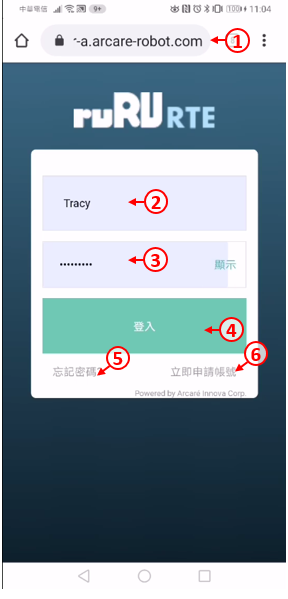

首先開啟Chrome瀏覽器。
1. 輸入連線網址，網址為「http://伺服器IP:8080/ArcareEng/login.jsp」或「https://伺服器網域名稱/ArcareEng/login.jsp」若不知伺服器IP或網域，請洽貴公司系統管理員取得。
2. 輸入帳號。
3. 輸入密碼。
4. 按下登入鍵。
5. 如果忘記密碼，可按下忘記密碼連結，並依照畫面指示操作。
6. 如果沒有帳號，請按下立即申請帳號連結，並依照畫面指示操作，申請之後請通知貴公司系統管理員進行核准。

### **1.1.1 帳號申請**
> 作業目的：若未有帳號者，可點選「申請帳號」連結，依螢幕指示操作申請新帳號。為了管理使用者只能看到其所屬公司的系統，所以帳號的申請必須提供其服務公司的企業代號，來過濾出它可以看得到的系統清單。
>

1. 在登入畫面中，按下「立即申請帳號」連結。  
2. 輸入企業名稱(若不知道，請詢問系統管理員)。  
3. 進行下一步  

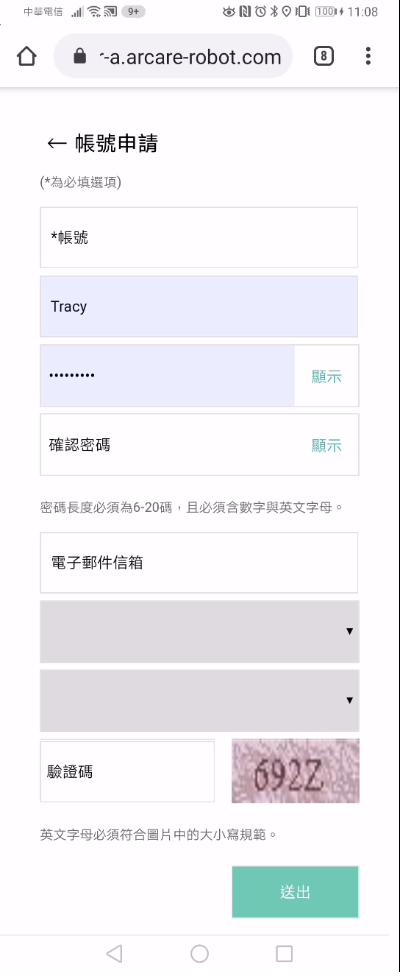

1. 輸入想申請的帳號，請注意英文字母大小寫。
2. 輸入您的姓名。
3. 輸入密碼，請依照畫面上提示的密碼規則輸入。
4. 再次輸入密碼，請注意上下兩組密碼須完全一致。
5. 輸入您的電子郵件地址，必須為有效的電子郵件地址。
6. 選擇預設的登入語言。
7. 依照右側顯示的圖案輸入驗證碼，請注意英文字母大小寫。
8. 按下送出鍵，等待系統管理員審核帳號即可。(系統會發送郵件給管理員，您也可自行通知管理員。)

### **1.1.2 忘記密碼**
>作業目的：使用者忘記密碼時，可依本節說明重設密碼，使用此功能之前，必須確定使用者的電子郵件地址是正確而且可以收到信的。。
>

1. 輸入帳號。
2. 輸入驗證碼，注意大小寫需相符。
3. 按下「送出」按鍵，系統將會發出密碼重設郵件給使用者。
4. 按下「確定」。

到電子郵件信箱中，打開系統寄出的郵件，然後按下「前往設定新密碼」連結。

1. 輸入要設定的密碼。
2. 再輸入一次相同的密碼。
3. 按下「送出」鍵即可。

## **1.2 指定系統**
> 作業目的：登入ruRU RTE後，必須指定使用的系統名稱。唯是否有使用系統的權限則由系統管理員設定。

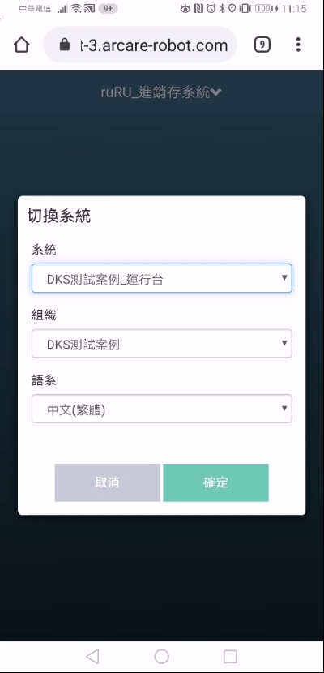

1. 下拉挑選可使用系統清單
2. 下挑挑選可操作的組織帳務清單
3. 選擇該系統所提供的語系
4. 按下確定鍵。

# **2.基本操作** {#Basicoperation}
> 作業目的：。
>

## **2.1 運行平台框架**
> 作業目的：

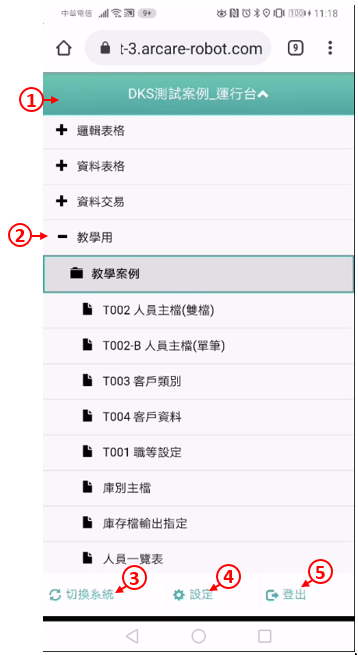

登入後的畫面如上圖，概述如下：  
1. 顯示登入的系統名稱，可點擊開閤選單  
2. 功能選單，依系統設計或權限選單上的設定顯示不同層次的類型，可以是模組、流程跟表單。  
3. 點選本鍵可回到選擇系統別的介面，以達到切換系統的目的。  
4. 點選本鍵可進入設定頁面。  
5. 可查詢帳號資料，或是登出系統。  

## **2.2 表單操作**

### **2.2.1 工具列按鈕介紹**
> 作業目的：。
>

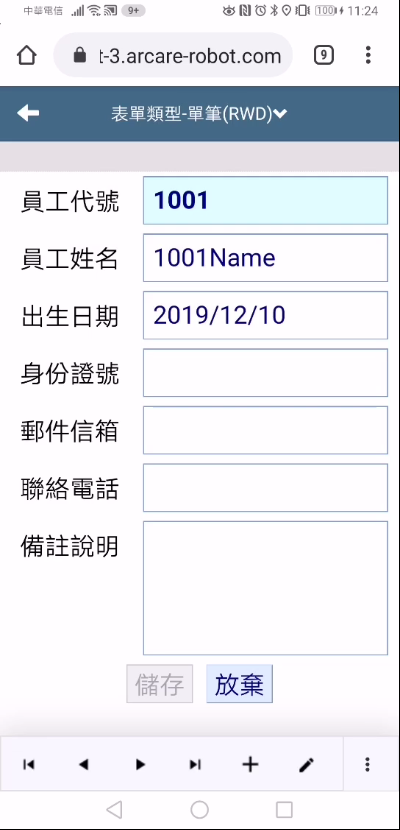
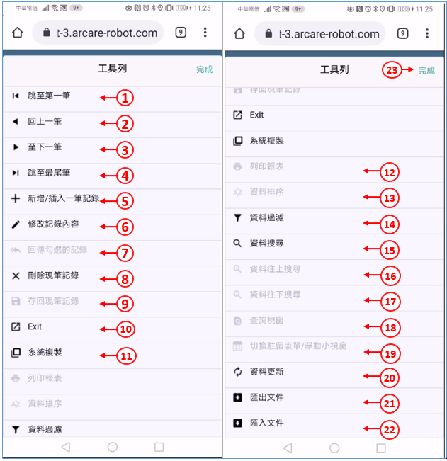

開啟指定的表單之後，有一些通用的系統功能，這些系統功能不一定每張表單都能使用，以各張表單的設計為準：
1. 駐留到第一筆資料。
2. 上一筆資料。
3. 下一筆資料。
4. 駐留到最後一筆資料。
5. 新增資料。
6. 修改資料。
7. 回傳勾選的記錄
8. 刪除資料。
9. 存檔功能。
10. 關閉表單。
11. 複製資料。
12. 列印報表。
13. 恢復資料的排序。
14. 過濾資料。
15. 搜尋資料。
16. 資料往上搜尋
17. 資料往下搜尋
18. 開啟查詢視窗
19. 切換駐留表單/浮動小視窗
20. 重新從資料庫更新資料。
21. 匯入Excel檔案。
22. 匯出Excel或PDF檔案。
23. 完成動作回到原畫面

### **2.2.2 表單資料過濾**
> 作業目的：此功能可以依據使用者的需求過濾符合條件的資料。
>

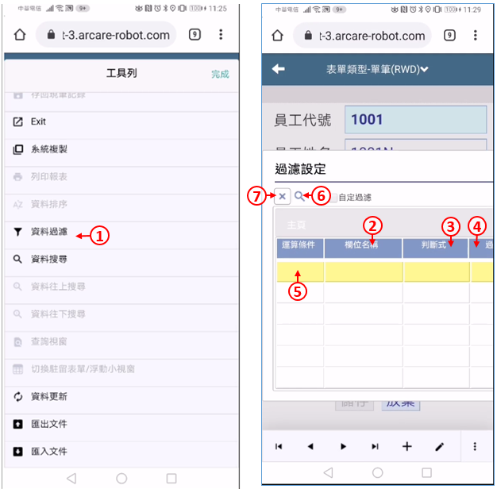
1. 啟動表單過濾功能。
2. 挑選要過濾的欄位名稱。
3. 挑選判斷式。
4. 挑選過濾欄位名，或是輸入過濾固定值(兩者擇一)。
5. 如果有兩個以上條件，請選擇運算條件(且、或)。
6. 按下搜尋按鍵，系統會過濾出符合條件的資料。
7. 刪除鍵可清除過濾條件。

### **2.2.3 表單資料搜尋**
> 作業目的：此功能可以針對表單上的特定欄位，搜尋出符合條件的資料，找到時會停在那筆資料上。

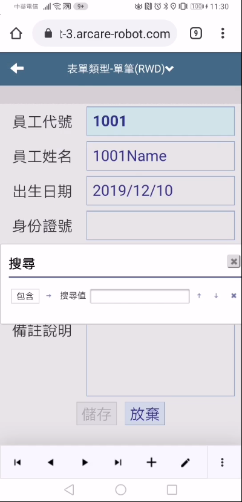
1. 駐留在要搜尋的欄位。
2. 按系統鍵
3. 點選資料搜尋圖示。
4. 此鍵可以切換搜尋的模式，例如包含、等於、開頭是…等等。
5. 輸入搜尋值。
6. 開始從這筆資料往下搜尋(往後搜尋)。
7. 開始從這筆資料往上搜尋(往前搜尋)。

# **3.相關設定** {#BasicSetting}
> 作業目的：。
>

## 3.1 個人資料

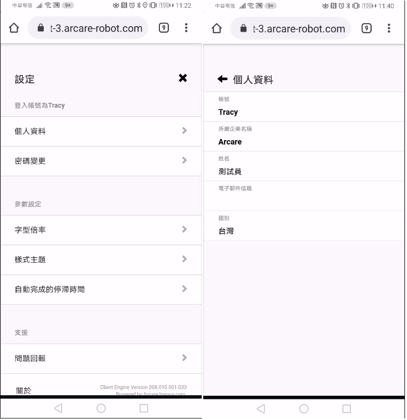

在設定的頁面
1. 點選「個人資料」字樣，開啟個人資料內容
2. 顯示帳號。
3. 顯示所屬企業名稱。
4. 顯示使用者姓名。
5. 顯示電子郵件信箱。
6. 下拉選擇國別。

## 3.2 變更密碼

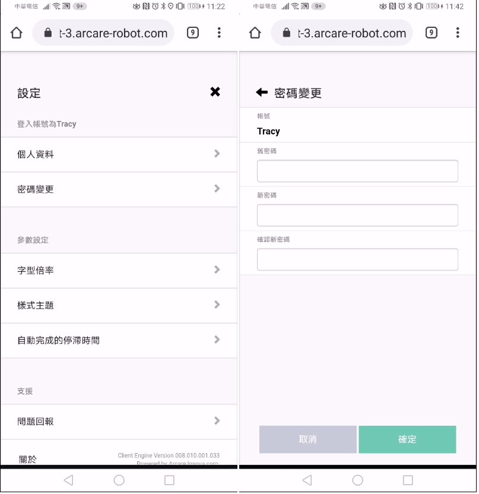

在設定的頁面
1. 點選「密碼變更」字樣，開啟密碼變更內容
2. 此欄位顯示使用者帳號。
3. 輸入原密碼，請注意大小寫。
4. 輸入新密碼，請注意大小寫。
5. 再次輸入新密碼。
6. 點選「變更」，即可完成密碼設定。

## 3.3 字型倍率

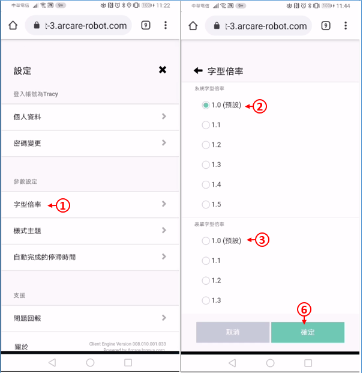

在設定的頁面
1. 點選「字型倍率」字樣，開啟字型倍率內容
2. 點選「系統文字倍率」的選項，設定系統在顯示系統文字時，所參照的倍數。
3. 點選「表單文字倍率」的選項，設定系統在顯示表單文字時，所參照的倍數。
4. 點選「確定」，即可完成設定。

## 3.4 樣式主題

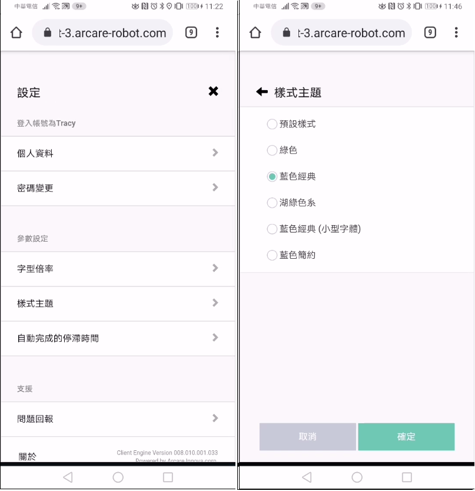

在設定的頁面
1. 點選「樣式主題」字樣，開啟樣式主題內容
2. 點選「樣式主題」的選項，該清單由設計階段事先準備。
3. 點選「確定」，即可完成設定。

## 3.5 自動完成停滯時間

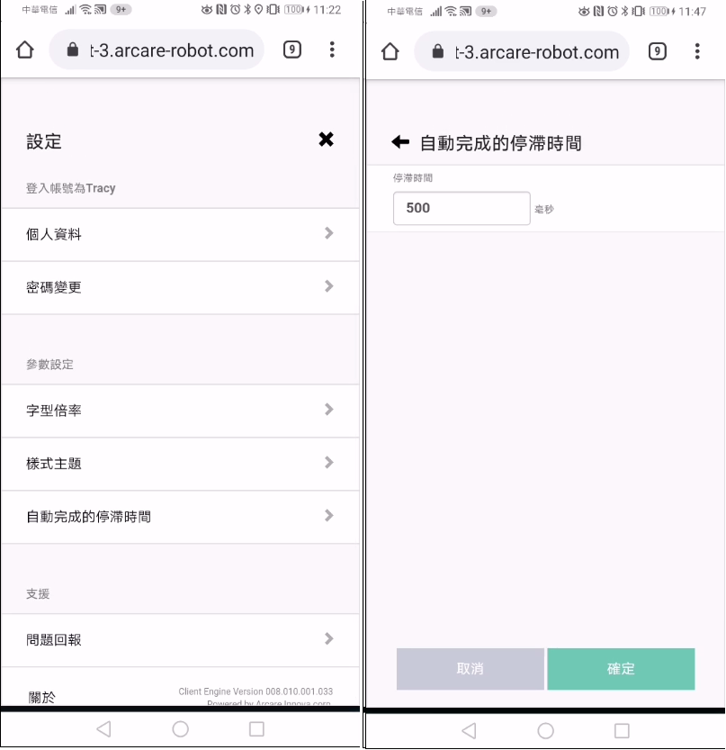

在設定的頁面  
1. 點選「自動完成停滯時間」字樣，開啟自動完成停滯時間設定頁面
2. 輸入停滯時間的毫秒數，以影響下拉欄位的自動完成時間。
3. 點選「確定」，即可完成設定。

## 3.6 問題回報

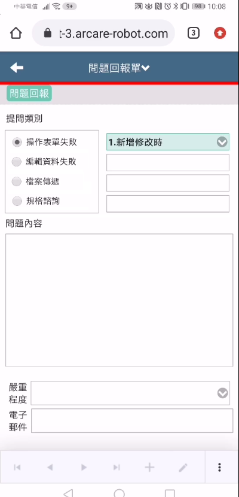

在設定的頁面  
1. 點選「問題回報」的功能項，將相關問題回報給系統管理者。  
2. 問題類別：依據發生的錯誤情況，挑選提問類別。  
3. 詳細描述問題的內容，系統管理員才能看懂並處理您的問題。  
4. 選擇問題的嚴重程度。  
5. 若有圖片或是文件可上傳至此。  
6. 輸入E-MAIL地址。  
7. 送出問題即可。  

---
[**回到目錄**](index.html#MainMenu)
