[**1 登入**](#Login)
  1.1 激活
  1.2 個人設定
  
[**2.Site管理**](#SiteManagement)

  2.1 參數設定
  2.2 系統管理
  2.3 企業設定
  2.4 帳號清單
  2.5 Site目前線上人數查詢
  2.6 企業目前線上人數查詢
  
[**3 企業管理**](#EnterpriseSet)

  3.1 帳號清單
  3.2 系統_管理員設定
  3.3 企業目前線上人數查詢
  3.4 系統目前線上人數查詢
  
[**4 系統管理**](#SystemManagement)

  4.1 帳號清單
  4.2 系統_使用者設定
  4.3 系統_帳號申請查詢
  4.4 系統_使用系統申請查詢
  4.5 系統目前線上人數查詢
  4.6 建立新帳務
  4.7 稽核LOG設定
  4.8 推播通知管
  
[**Appendix A 附件**](#Login)

---

# 1. 登入 {#Login}

>作業目的：進入Site的管理介面。

>操作說明：輸入網址【http://IP:PORT/ArcareEng/SiteLogin.jsp】

 
1. 輸入登入帳號(注意大小寫有別)，初次預設為Admin\_ArcareSite
2. 輸入登入密碼(注意大小寫有別)，初次預設為arcare
3. 按確認鍵後登入
4. 按下忘記密碼後，系統會要求輸入帳號及驗證碼，提交後會依照該帳號的信箱送出MAIL幫助使用者重設密碼

## 1.1 激活

>功能說明：第一次登入Site時設定項目

- 國別設定：設定Site預設國別

+ 設定國別，可自己新增國別或是執行左上方【載入預設】後會載入系統預設的四筆國別資料，再勾選預設完成第一步 

- 變更密碼：變更Site管理員密碼

 
 

- 變更個人資料：設定Site管理員帳號的個人資料

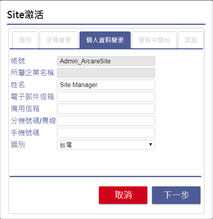 
 
 設定Site管理員帳號的個人資料，註：電子郵件信箱必填 

- 服務中間台：設定中間台的IP/Port, 當有多中間台時,必須指定其一負責處理排程.

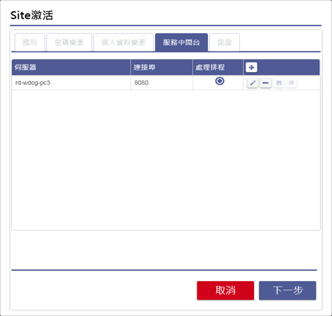 
  
  設定Site的郵件伺服器，請詢問貴公司的MIS並填入相關設定。註：Site帳號的生失效皆會發送Mail，此處設定不正確會導致帳號的生失效失敗 

- 認證：Site名稱認證，輸入Site名稱，可自訂。 

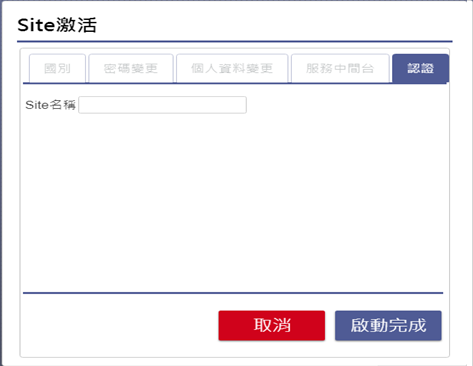 
  
 

## 1.2 個人設定

>功能說明：登入系統後個人可變更的設定項目

 

1. 點選「設定」，可進入Site的設定畫面，進行個人資料變更、密碼變更、登入操作紀錄 
2. 點選「關於」，可查詢目前Site管理引擎的相關版本 
3. 點選「登出」，登出Site管理系統 
 
### 1.2.1 個人資料變更

>功能說明：設定及變更個人的資料頁面一

- 個人資料變更：變更個人的資料頁面，帳號及所屬企業名稱不可修改 
  
 
 
1. 輸入姓名，不可空白
2. 輸入電子信箱，不可空白
3. 輸入備用電子信箱，非必填
4. 輸入分機號碼，非必填
5. 輸入分機號碼，非必填
6. 設定國別，選項依照Site上的設定下拉出現
7. 點選「放棄」，即放棄此次變更
8. 點選「變更」，即可完成設定

- 密碼變更： 設定及變更登入密碼

 
  
1. 輸入舊密碼，請注意大小寫
2. 輸入新密碼，請注意大小寫，長度須為6~12碼，內容須有英文、數字
3. 再次輸入新密碼
4. 點選「放棄」，即放棄此次變更
5. 點選「變更」，即可完成設定
 
- 登入操作紀錄： 檢視個人的系統登入及操作記錄

 
 
1. 挑選要過濾的日期時間起迄 
2. 點選「過濾」，依照前面挑選的日期時間進行過濾功能 
3. 登入操作的日期時間 
4. 登入操作的功能 
5. 操作功能的說明 
6. 執行操作的系統，如空白代表是在Site上操作 
7. 登入操作的IP 

# 2. Site 管理 {#SiteManagement}

>作業目的：管理運行台的環境設置等相關作業。

>作業內容：以Site管理員的身份登入系統，進行運行台環境參數、企業管理、企業管理者設置等作業。

 
 
 Site系統服務下列功能將依序在下方做簡單介紹，詳細功能請由目錄點選連結前往詳閱 
 
 * 參數設定：Site的各項參數設定 
 * 系統管理：新增、修改或刪除Site的系統資料 
 * 帳號清單：可查詢、新增或修改帳號資料，註：企業管理員可查看該企業底下所有帳號，系統管理員只能查看該系統底下帳號 
 * 企業設定：可查詢、新增或修改企業資料 
 * Site目前上線人數查詢：查詢Site底下有多少使用者正在線上 
 * 企業目前上線人數查詢：查詢企業底下有多少使用者正在線上 
 * 系統目前上線人數查詢：查詢系統底下有多少使用者正在線上 

## 2.1 參數設定

>功能說明：參數設定中有許多Site的各項設定，詳細功能將在下方說明

 

 2.1.1 密碼相關設定：密碼錯誤、密碼變更、忘記密碼的相關設定 
 2.1.2 郵件伺服器：Site的郵件伺服器設定 
 2.1.3 國別設定：Site的國別資料設定 
 2.1.4 Site自訂版面：設定Site登入的畫面和登入後的LOGO樣式 
 2.1.5 系統自訂版面：設定系統登入的畫面和登入後的LOGO樣式 
 2.1.6 服務中間台：設定Site連結多台中間台 
 2.1.7 預設國別設定：設定載入預設的國別資料 
 2.1.8 其他參數：設定清除暫存檔、自動登入保留 
 2.1.9 跨伺服器設定：設定Site跨伺服器取得資料的URL 
 2.1.10 匯入資料：進行系統資料的匯入 
 2.1.11 匯入系統：進行系統架構的匯入 
 

### 2.1.1 密碼相關設定

>功能說明：密碼錯誤、密碼變更、忘記密碼的相關設定

 
  
1. 輸入連續密碼錯誤的次數，達到設定次數則系統會將帳號鎖定
2. 輸入密碼強制變更的週期天數
3. 輸入密碼強制變更前多少天預先提醒使用者
4. 輸入變更密碼時不可與前N次相同，例：如設定1次，則密碼變更時不可設定與前一次相同
5. 輸入系統發送MAIL後的激活有效時間
6. 設定是否開啟手機簡訊驗證
7. 輸入手機簡訊激活的有效時間
   

### 2.1.2 郵件伺服器

>功能說明：Site的郵件伺服器設定

 
  
1. 輸入外寄郵件伺服器
2. 輸入伺服器的連接埠
3. 輸入伺服器的登入使用者名稱
4. 輸入伺服器的登入使用者密碼
5. 設定是否需要使用SPA登入
6. 設定是否採用匿名發送信件
7. 輸入系統發送信件時寄件人的電子信箱

### 2.1.3 國別設定

>功能說明：Site的國別資料設定

 
  
1. 載入預設國別
2. 目前已設定的國別資料
3. 點選預設按鈕，設定目前Site的國別 
4. 點選「+」，新增國別設定

### 2.1.4 Site自訂版面

>功能說明：設定Site登入的畫面和登入後的LOGO樣式

 
  
 1. 點選「恢復系統預設」，可將Site登入畫面恢復成系統預設樣式 
 2. 點選「載入系統預設」，可將系統預設樣式載入至下方 
 3. 目前已設定的版面資料 
 4. 點選「上傳」，上傳已設計好的版面壓縮檔 
 5. 點選「下載」，下載版面壓縮檔 
 6. 點選「+」，新增一筆資料 
 7. 預覽上傳的版面 
 8. 設計版面的規則說明 
 9. 點選「上傳」，上傳已設計好的LOGO檔案 
 10. 點選「下載」，下載LOGO檔案 
 11. 點選「恢復系統預設」，可將Site的LOGO恢復成系統預設樣式 
 12. 預覽上傳的LOGO 
 13. 設計LOGO的規則說明 

### 2.1.5 系統自訂版面

>功能說明：設定系統登入的畫面和登入後的LOGO樣式

 
  
1. 點選「恢復系統預設」，可將系統登入畫面恢復成系統預設樣
2. 點選「載入系統預設」，可將系統預設樣式載入至下方
3. 目前已設定的版面資料
4. 點選「上傳」，上傳已設計好的版面壓縮檔
5. 點選「下載」，下載版面壓縮檔
6. 點選「+」，新增一筆資料
7. 預覽上傳的版面
8. 設計版面的規則說明
9. 點選「上傳」，上傳已設計好的LOGO檔案
10. 點選「下載」，下載LOGO檔案
11. 點選「恢復系統預設」，可將Site的LOGO恢復成系統預設樣式
12. 預覽上傳的LOGO
13. 設計LOGO的規則說明

### 2.1.6 服務中間台

>功能說明：設定Site連結多台中間台

 
  
### 2.1.7 預設國別設定

>功能說明：設定載入預設的國別資料

 
  
 1. 載入預設國別
 2. 目前已設定的國別資料
 3. 點選預設按鈕，設定目前Site的國別
 4. 點選「+」，新增國別設定
 

### 2.1.8 其他參數

>功能說明：設定清除暫存檔、自動登入保留

 
  
1. 設計統計使用操作系統數據的排程開始時間
2. 使用者操作明細數據的保留天數
3. 使用者操作統計的保留天數
4. 點選後可立即執行統計動作
5. 「執行」鍵按下時, 表示立即執行統計
6. 設定每日執行清除的時間，系統會清除超過檔案保留天數的暫存檔
7. 輸入檔案保留的天數
8. 輸入自動登入保留時間
9. 挑選稽核LOG中間台

 
  
 10.輸入Windows AD Server網域，可設定三組 
 11. 輸入Web AD Server網域, 依畫面所示填具必要欄位
 * 註：如果使用AD Sever網域設定，儲存後，須至帳號清單新建一組帳號，且該帳號要和AD Sercer中的某一組帳號相同，再將該帳號設為企業管理員
 
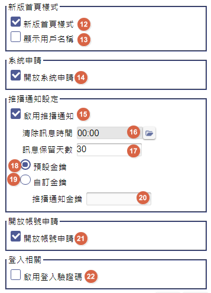 
12.可設定是否為新版的首頁 
13.設定是否在首頁選單列顯示用戶名稱  
14.設定申請帳號時, 是否有開放系統申請選項  
15.設定系統上是否有啟動推播通知的功能  
16.在設定推播通知後, 設定排程清除訊息的時間  
17.在設定推播通知後, 設定保留訊息的天數  
18.指定推播功能使用的金鑰, 是預設值設  
19.指定推播功能使用的金鑰, 採自訂  
20.推播通知自訂金鑰的序號  
21.設定登入畫面是否有開放帳號申請的圖示  
22.設定登入畫面是否有輸入驗證碼的需求 

### 2.1.9 跨伺服器設定

>功能說明：設定Site跨伺服器取得資料的URL

 
  
 1. 點選「+」，新增一筆資料，輸入URL位置 
 

### 2.1.10 匯入資料

>功能說明：進行系統資料的匯入, 限定於伺服器本機操作執行

 
  

1. 挑選進行匯入的MDB檔案。
2. 下拉選擇匯入的系統。
3. 下拉選擇匯入系統的共用資料庫或是分公司資料庫
4. 選擇匯入方式，【新增】或是【覆蓋(全刪全增)】
5. 各參數設定完成後，點擊開始匯入
* 註. 此功能只可在本機使用。
 

### 2.1.11 匯入系統

>功能說明：進行應用系統規格程的匯入，限定於伺服器本機操作執行

 
  
1. 挑選進行匯入的安裝檔。
2. 點擊將安裝黨內容載入至頁面。
3. 點擊檢查匯入狀態。
4. 勾選進行匯入的系統。
5. 顯示目前匯入進度。
6. 顯示匯入結果，【成功】或是【失敗】。
7. 顯示結果說明，如結果為【失敗】，則詳細原因會顯示於此處。
8. 點擊開始進行匯入或取消。
9. 顯示各系統匯入的詳細執行明細。

## 2.2 系統管理

>功能說明：系統管理中有許多系統的各項設定，詳細功能將在下方說明

 
  
 . 新增系統請先點選「WellWareProject」，再點選「+」，新增系統
 

- 共用資料庫：安裝設置Site 可使用的系統資料庫

 
  
1. 重整系統資料庫，包含共用資料庫與底下所有分公司資料庫  
2. 刪除系統設定  
3. 新增分公司  
4. 輸入專案代號，預設自動產生  
5. 輸入組裝專案代號，可先複製填入專案代號，後續可修改  
6. 輸出專案名稱  
7. 挑選或新建資料庫，資料庫名不可以有「-」符號  
8. 挑選或新建備份資料庫  
9. 輸入備份保留份數  
10. 單獨重整共用資料庫  
11. 挑選空白分公司資料庫，資料庫名不可以有「-」符號  
12. 重整空白分公司資料庫，資料庫名不可以有「-」符號  
13. 輸入服務人員的電子信箱 
14. 勾選是否將訊息轉發給系統管理員 

- 分公司資料庫：安裝設置Site 可使用的系統所對照的分公司資料庫

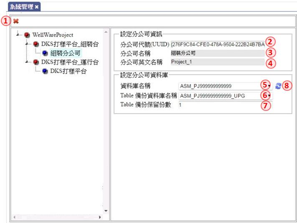 
  
1. 刪除分公司設定  
2. 輸入分公司代號，預設自動產生  
3. 輸入分公司名稱  
4. 輸入分公司英文名稱  
5. 挑選或新建資料庫  
6. 挑選備份資料庫  
7. 輸入備份保留份數  
8. 單獨重整分公司資料庫  

## 2.3 企業設定

>功能說明：建立及維護Site下各企業的資料資料

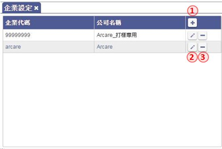 
  
1. 點選「+」，新增企業資料
2. 修改企業資料
3. 刪除企業設定
註：新增、修改企業資料請參考6-1.企業明細 
 

### 2.3.1 企業明細

>功能說明：針對單一企業的設定及相關資料的建檔與維護

 
  
1. 輸入企業代碼，必填
2. 輸入公司名稱，必填
3. 輸入公司英文名，必填
4. 輸入統一編碼/稅籍碼
5. 挑選國別
6. 輸入公司地址
7. 輸入公司郵遞區號
8. 輸入公司電話代表號
9. 輸入電話國碼
10. 輸入負責人姓名
11. 輸入收費聯絡人姓名，必填
12. 挑選企業管理員，初次設定此欄位可空白，新增帳號後請將管理員帳號回填此欄位
13. 輸入企業同時最大上線人數
14. 輸入Google API Key
15. 企業預設的閒置登出時間, 預設30分鐘
16. 企業預設的上傳檔案限制, 預設50 MB
17. 企業的LOGO圖示檔案
18. 上傳企業LOGO圖示
19. 企業LOGO圖示的預覽
20. 點選「+」，新增企業底下的應用系統
21. 挑選本站台已安裝的應用系統
22. 設定指定系統的上線人數, 所有系統加統必須小於等於企業最大上線人數
23. 應用系統選單樣式下拉挑選階層式或折疊式，預設為「階層式」
24. 應用系統的閒置登出時間, 預設為與企業設定值
25. 應用系統的上傳檔案大小, 預設為與企業設定值
26. 應用系統開啟表單的呈現方式, 下拉挑選 單頁籤、多頁籤、多頁籤不重複，預設為「多頁籤不重複」
27. 儲存鍵，修改後的設定必須經由本鍵儲存

## 2.4 帳號清單

>功能說明：檢視及設定本企業下所有的帳號狀況，及生失效設定

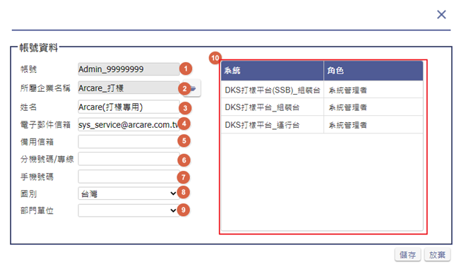 
  
 1.挑選企業進行過濾，此欄位只有最高權限帳號可使用  
 2.依帳號進行相似字過濾，可空白  
 3.依帳號姓名進行相似字過濾，可空白  
 4.依照帳號狀態進行過濾  
 5.點選「過濾」，照前面的設定進行過濾功能  
 6.新增一筆帳號  
 7.上傳EXCEL，新增多筆帳號，註：格式請參考附件「批次匯入帳號格式」  
 8.將帳號生效，狀態為申請中或失效時致能  
 9.將帳號失效，狀態為生效時致能 
 10.當帳號遭鎖定時，解鎖帳號  
 11.修改帳號資料  
 12.刪除帳號  
 * 註1：由帳號清單新增的帳號預設密碼皆為abc123
 * 註2：新增帳號後，請記得回企業設定將企業Manager補上 
 

### 2.4.1 帳號明細

>功能說明：編輯帳號的相關料，及該帳號在Site上的角色

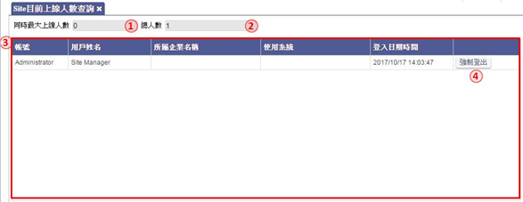 
  
1. 輸入帳號，必填，不可重覆
2. 挑選帳號所屬企業
3. 輸入使用者姓名，必填
4. 輸入使用者電子信箱，必填
5. 輸入使用者備用電子信箱
6. 輸入分機號碼/專線
7. 輸入手機號碼 
8. 挑選使用者國別
9. 帳號對應的部門單位
10. 帳號目前歸屬系統及角色 

## 2.5 Site目前線上人數查詢

>功能說明：檢視目前單一企業的上線人數，及處置強制登出的介面

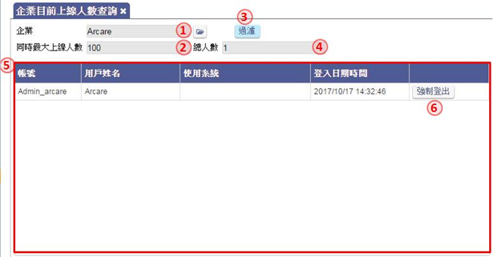 
  
1. Site同時最大上線人數，預設0代表無限制
2. 目前Site線上總人數
3. 目前正在線上的帳號列表，內容含帳號、姓名、所屬企業、使用的系統、登入日期時間
4. 點選「強制登出」，將使用者強制登出系統

## 2.6 企業目前線上人數查詢

>功能說明：檢視目前單一企業的上線人數，及處置強制登出的介面

 
  
1. 挑選欲查詢的企業
2. 該企業最大上線人
3. 點選「過濾」，進行過濾功
4. 目前企業線上總人數
5. 目前正在線上的帳號列表，內容含帳號、姓名、使用的系統、登入日期時間
6. 點選「強制登出」，將使用者強制登出系統

# 3.企業管理 {#EnterpriseSet}

>作業目的：管理運行台的跟單一企業設置等相關作業。

>作業內容：以企業管理員的身份登入系統，進行運行台環境參數、企業管理、企業管理者設置等作業。

 
    
 * Site系統服務下列功能將依序在下方做簡單介紹，詳細功能請由目錄點選連結前往詳閱 
 * 帳號清單：可查詢、新增或修改帳號資料，註：企業管理員可查看該企業底下所有帳號，系統管理員只能查看該系統底下帳號 
 * 系統＿使用者設定：設定系統的管理者 
 * 企業目前上線人數查詢：查詢企業底下有多少使用者正在線上 
 * 系統目前上線人數查詢：查詢系統底下有多少使用者正在線上 

## 3.1 帳號清單

>功能說明：檢視及設定本企業下所有的帳號狀況，及生失效設定

 
  
1. 挑選企業進行過濾，此欄位只有最高權限帳號可使用
2. 依帳號進行相似字過濾，可空白
3. 依帳號姓名進行相似字過濾，可空白
4. 依照帳號狀態進行過濾
5. 點選「過濾」，照前面的設定進行過濾功能
6. 新增一筆帳號
7. 上傳EXCEL，新增多筆帳號，註：格式請參考頁籤「批次匯入帳號格式」
8. 將帳號生效，狀態為申請中或失效時致能
9. 將帳號失效，狀態為生效時致能
10. 當帳號遭鎖定時，解鎖帳號
11. 修改帳號資料
12. 刪除帳號
 

### 3.1.1 帳號明細

>功能說明：編輯帳號的相關料，及該帳號在Site上的角色

 
  
1. 輸入帳號，必填，不可重覆
2. 挑選帳號所屬企業
3. 輸入使用者姓名，必填
4. 輸入使用者電子信箱，必填
5. 輸入使用者備用電子信箱
6. 輸入分機號碼/專線
7. 輸入手機號碼
8. 挑選使用者國別
9. 帳號對應的部門單位
10. 帳號目前歸屬系統及角色

## 3.2 系統_管理員設定

>功能說明：對企業下可使用的系統設定系統管理員，註：進行管理員設定前，系統須先安裝好系統工具

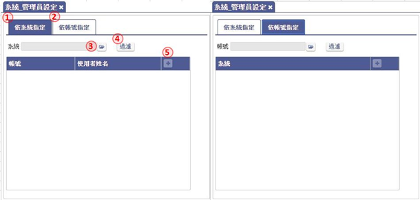 
  
1. 依系統指定新增一位或多位管理員
2. 依帳號指定新增管理員至一個或多個系統
3. 挑選系統或帳號做過濾
4. 點選「過濾」，照前面的設定進行過濾功能
5. 過濾後新增資料

* 註：帳號設定為系統管理員後，將預設擁有系統的最高權限 

## 3.3 企業目前線上人數查詢

>功能說明：檢視目前單一企業的上線人數，及處置強制登出的介面

 
  
1. 挑選欲查詢的企業
2. 該企業最大上線人數
3. 點選「過濾」，進行過濾功能
4. 目前企業線上總人數
5. 目前正在線上的帳號列表，內容含帳號、姓名、使用的系統、登入日期時間
6. 點選「強制登出」，將使用者強制登出系統
 

## 3.4 系統目前線上人數查詢

>功能說明：檢視目前單一系統的上線人數，及處置強制登出的介面

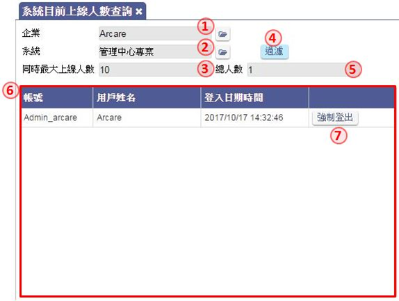 
  
1. 挑選欲查詢的企業 
2. 挑選欲查詢的系統
3. 該系統目前設定的最大上線人數
4. 點選「過濾」，照前面的設定進行過濾功能
5. 目前系統線上總人數
6. 目前正在線上的帳號列表，內容含帳號、姓名、登入日期時間
7. 點選「強制登出」，將使用者強制登出系統

# 4.系統管理 {#SystemManagement}

>作業目的：管理運行台的單一系統設置等相關作業

>作業內容：以系統管理員的身份登入系統，進行運行台環境參數、企業管理、企業管理者設置等作業。

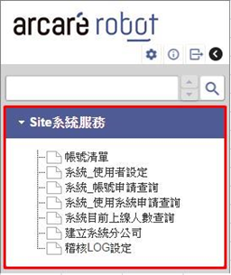 
  
  Site系統服務下列功能將依序在下方做簡單介紹，詳細功能請由目錄點選連結前往詳閱 
  * 帳號清單：可查詢、新增或修改帳號資料，註：企業管理員可查看該企業底下所有帳號，系統管理員只能查看該系統底下帳號 
  * 系統＿使用者設定：設定系統一般使用者 
  * 系統＿帳號申請查詢：查詢目前有哪些使用者申請帳號，管理員可進行核准或駁回 
  * 系統＿使用系統申請查詢：查詢目前有哪些使用者申請新系統，管理員可進行核准或駁回 
  * 系統目前上線人數查詢：查詢系統底下有多少使用者正在線上 
  * 建立系統分公司：當系統需要新增分公司時，可使用此表單，註：只有系統管理員可使用此功能 
  * 稽核LOG設定：設定所屬系統是否啟用稽核LOG 

## 4.1 帳號清單

>功能說明：檢視及設定本企業下所有的帳號狀況，及生失效設定

   

1. 挑選企業進行過濾，此欄位只有最高權限帳號可使用
2. 依帳號進行相似字過濾，可空白
3. 依帳號姓名進行相似字過濾，可空白
4. 依照帳號狀態進行過濾
5. 點選「過濾」，照前面的設定進行過濾功能
6. 新增一筆帳號
7. 上傳EXCEL，新增多筆帳號，註：格式請參考頁籤「批次匯入帳號格式」
8. 將帳號生效，狀態為申請中或失效時致能
9. 將帳號失效，狀態為生效時致能
10. 當帳號遭鎖定時，解鎖帳號
11. 修改帳號資料
12. 刪除帳號

### 4.1.1 帳號明細

>功能說明：編輯帳號的相關料，及該帳號在Site上的角色

   

1. 輸入帳號，必填，不可重覆
2. 挑選帳號所屬企業
3. 輸入使用者姓名，必填
4. 輸入使用者電子信箱，必填
5. 輸入使用者備用電子信箱
6. 輸入分機號碼/專線
7. 輸入手機號碼
8. 挑選使用者國別
9. 帳號對應的部門單位
10. 帳號目前歸屬系統及角色

 
## 4.2 系統_使用者設定

>功能說明：檢視及設定各帳號使用者可登入的系統；或各系統開登入的帳號清單，註：進行使用者設定前，系統須先安裝好系統工具

  
  
1. 依系統指定新增一位或多位使用員
2. 依帳號指定新增到一個或多個系統的使用者
3. 挑選系統或帳號做過濾
4. 點選「過濾」，照前面的設定進行過濾功能
5. 過濾後新增資料 
* 註：新增完使用者後還需至系統內的用戶帳號維護新增權限給使用者才算完整設定，後續設定方式可參考文件【RTE\_系統工具使用說明】 

 

## 4.3 系統_帳號申請查詢

>功能說明：以清單的角度檢視帳號申請使用的狀況，以利核准處理

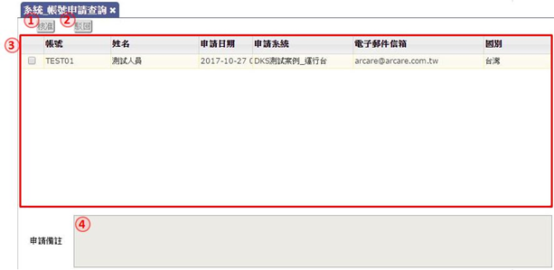  
  
1. 點選「核准」，同意新增帳號  
2. 點選「駁回」，取消新帳號的申請
3. 等待審核的帳號申請列表，內容含申請帳號、使用者姓名、申請日期、申請系統…等
4. 使用者申請新帳號時的備註

## 4.4 系統_使用系統申請查詢

>功能說明：以系統別的角度檢視帳號申請使用的清單，以利核准處理

  
  
1. 點選「核准」，同意帳號可以使用系統
2. 點選「駁回」，取消帳號的使用系統申請
3. 等待審核的使用系統申請列表，內容含申請帳號、使用者姓名、申請日期、申請系統…等
4. 使用者申請使用系統時的備註

## 4.5 系統目前線上人數查詢

>功能說明：檢視目前單一系統的上線人數，及處置強制登出的介面

  
  
1. 挑選欲查詢的企業
2. 挑選欲查詢的系統
3. 該系統目前設定的最大上線人數
4. 點選「過濾」，照前面的設定進行過濾功能
5. 目前系統線上總人數
6. 目前正在線上的帳號列表，內容含帳號、姓名、登入日期時間
7. 點選「強制登出」，將使用者強制登出系統

 

## 4.6 建立新帳務

>功能說明：當系統使用需要切割成多公司的資料庫時，由本介面操作建立後，產生新的分公司資料選項

  
  
1. 挑選欲建立組織帳務的系統
2. 新增鍵, 建立不同語系的組織帳務
3. 下拉挑選語系
4. 輸入指定語系的組織帳務名稱
5. 輸入組織帳務資料庫名
6. 輸入組織帳務備份資料庫名
7. 輸入組織帳務資料庫備份保留數
8. 點選「建立」，確認新增組織帳務

## 4.7 稽核LOG設定

>功能說明：當系統使用需要切割成多公司的資料庫時，由本介面操作建立後，產生新的分公司資料選項

  
  
1. 勾選該系統是否啟用稽核LOG
2. 顯示最後異動勾選的人員帳號
3. 顯示最後異動勾選的日期時間 

## 4.8 推播通知管理

>功能說明：管理使用者的裝置接收推播通知的能力。

  
  
1. 有登冊的裝置代號  
2. 該裝置的或設備的名稱  
3. 該裝置登記的用戶帳號  
4. 該帳號的使用者姓名  
5. 生效鍵，讓裝置可以正常運作，接收推播的訊息  
6. 失效鍵，取消裝置可以運作功能，無法接收推播的訊息  
7. 刪除鍵，刪除此裝置的登冊記錄  

# Appendix A 附件

A1 批次匯入帳號格式
|#|FieldName|Fieldtype/Length|Descrip|
|:--|:--|:--|:--|:--|
|1|帳號|String(20)||
|2|姓名|String(20)||
|3|企業代號|String(20)||
|4|電子郵件信箱|String(100)||
|5|分機號碼/專線|String(20)||
|6|手機號碼|String(20)||
|7|國別代碼|String(4)||
|8|密碼(明碼)|String(20)||

---
[**回到目錄**](index.html#MainMenu)
