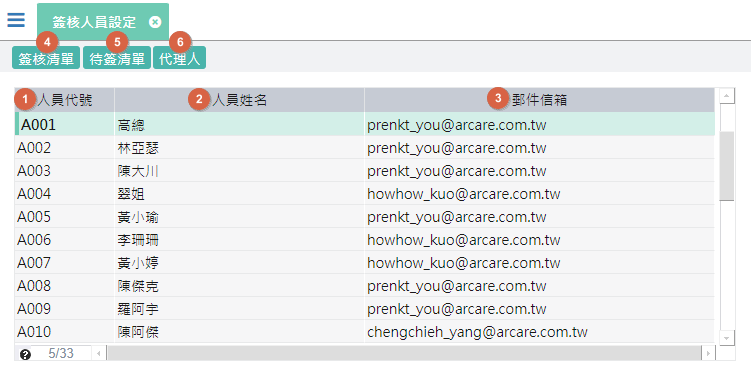

[**表單清單**](#FormList)  
[**1.簽核人員&代理人**](#AccountManagement)  
&nbsp;&nbsp;&nbsp;1.1.簽核人員設定
&nbsp;&nbsp;&nbsp;1.2.代理人設定

---
# 表單清單 {#FormList}

|對應選單 |作業表單名稱 |說明 |
|---------|---------|---------|
|組織編制	|<a id='FX000000003061'>簽核人員設定</a>	|查詢組織下已生效的簽核人員。 * 可查詢人員的送簽、已簽、待簽記錄。|
|組織編制	|<a id='FX000000003252'>簽核人員代理設定</a>	|可設定簽核人員在指定期間的代理簽核人員。【新增/修改/刪除】|
|組織編制	|<a id='FX000000003068'>簽核組織單位</a>	|可設定「組織單位」的基本資料維護。【新增/修改/刪除】|
|組織編制	|<a id='FX000000003069'>簽核組織編制</a>	|可設定組織編制版本並生效編制版本。|
|組織編制	|<a id='FX000000003067'>簽核組織編制結構</a>	|可設定「組織單位」的階層關係及各組織單位下的人員從屬關係。【新增/修改/刪除】  * 本單由 [簽核組織編制] 介面按鈕.編制明細 開啟。|
|組織編制	|<a id='FX000000003070'>簽核組織編制複製作業</a>	|可複製指定的組織版本資料並指定預計要生效的日期。|
|組織編制	|<a id='FX000000003063'>簽核專案編制設定</a>	|可設定「專案」的階層關係(編制/任務)，及各階層下的人員從屬關係。【新增/修改/刪除】|
|簽核流程	|<a id='FX000000003079'>簽核流程定義</a>	|可設定簽核流程的簽核編制類型(組織/專案)，及關卡資訊(各關卡簽核對象、各簽核對象通知信、關卡回覆通知信、關卡核決權的條件)。【新增/修改/刪除】|
|簽核流程	|<a id='FX000000003078'>表報流程設定</a>	|可設定(表單/報表)對應的簽核流程及決定送簽人員、送簽(單位/專案)、送簽按鍵、抽單按鍵、送簽核准時要執行的結案按鍵。|
|簽核流程	|<a id='FX000000003288'>催簽設定</a>	|可設定催簽郵件內容、及設定系統排程在催簽期限到期前多久要發送郵件。|
|簽核流程	|<a id='FX000000003059'>待簽核清單</a>	|提供「登入人員」透過「簽核類別」查詢該登入人員的待簽核清單。  * 亦提供讓會簽人員進行快速簽核【同意、不同意、退簽(退回上一關卡、退回送簽人員)】|
|簽核流程	|<a id='FX000000003057'>單據簽核回覆作業</a>	|提供會簽及會辦人員進行簽核回覆及上傳回覆附件。 * 本單由 [待簽核清單] 介面按鈕.回覆 開啟。|
|簽核流程	|<a id='FX000000003082'>單據增加簽核</a>	|提供會簽人員在當前關卡設定(加簽/會辦)人員，並設定要接收的郵件內容。【修改】  * 本單由 [單據簽核回覆作業] 介面按鈕.增加簽核人員 開啟|
|簽核流程	|<a id='FX000000003093'>人員簽核查詢作業</a>	|提供「申請/簽核人員」、「送簽表報」、「送簽狀態」為搜尋條件，查詢該人員的已簽及送簽資訊。  * 本單亦可由首頁的 [支援/簽核查詢] 開啟，開啟後會鎖定「申請/簽核人員」為登入人員。|
|簽核流程	|<a id='FX000000003058'>單據簽核歷程</a>	|提供送簽的表單或報表，查詢簽核的歷程。  * 本單亦可由首頁的 [支援/簽核歷程] 開啟，開啟後會鎖定目前駐留的表報。|
|簽核流程	|<a id='FX000000003092'>單據簽核查詢作業</a>	|提供管理人員依「簽核人員」、「送簽專案/組織」、「送簽表報」、「送簽鍵值」、「逾期天數」、「送簽狀態」為搜尋條件，查詢簽核的歷程。|

# 表單說明

## 簽核人員設定 {#FX000000003061}

> 說明：檢閱目前駐留的組織，已生效且擁有系統登入權限的帳號，即為可設定簽核的人員。

1. 人員代號：顯示人員代號 
2. 人員姓名：顯示人員姓名
3. 郵件信箱：顯示人員對應的郵件信箱
4. 簽核清單：駐留人員，可開啟[人員簽核查詢作業](WFS#FX000000003093)
5. 待簽清單：駐留人員，可開啟[待簽核清單](WFS#FX000000003059)
6. 代理人：駐留人員，可開啟[簽核人員代理設定](WFS#FX000000003252)

## 簽核人員代理設定 {#FX000000003252}

> 說明：當人員在特定期間無法進行簽核時，可設定代理簽核的人員，系統會在設定的期間內將簽核通知信發送至代理的郵件信箱。

## 簽核組織單位 {#FX000000003068}

> 說明：設定簽核的部門單位基本資訊

## 簽核組織編制 {#FX000000003069}

> 說明：檢視簽核的組織編制版本。

## 簽核組織編制複製作業 {#FX000000003070}

> 說明：檢視簽核的組織編制版本。

## 簽核組織編制結構 {#FX000000003067}

## 簽核專案編制設定 {#FX000000003063}

## 簽核流程定義 {#FX000000003079}

## 表報流程設定 {#FX000000003078}

## 催簽設定 {#FX000000003288}

## 待簽核清單 {#FX000000003059}

## 單據簽核回覆作業 {#FX000000003057}

## 人員簽核查詢作業 {#FX000000003093}

## 單據簽核歷程 {#FX000000003058}

## 單據簽核查詢作業 {#FX000000003092}

---
[**回到目錄**](index.html#MainMenu)