### **修訂記錄** (Revision History)

| 版本 Version  |出版日期 Issue Date  |修訂章節 Section Changed |出版修訂原因 Reason for Issue |
| :-: | :-: | :-: | :-: |
| 8.10.2 | 2022/12/28 | All | 依簽核模組8.10.2 改版, 更新說明內容 |

### **章節目錄**

[**1.表單清單**](#FormList)  

---
# 表單清單 {#FormList}

|對應選單 |作業表單名稱 |說明 |
|---------|---------|---------|
|組織編制	|[簽核人員設定](#FX000000003061)    |查詢組織下已生效的簽核人員。 * 可查詢人員的送簽、已簽、待簽記錄。|
|組織編制	|[簽核人員代理設定](#FX000000003252)	|可設定簽核人員在指定期間的代理簽核人員。【新增/修改/刪除】|
|組織編制	|[簽核組織單位](#FX000000003068)	|可設定「組織單位」的基本資料維護。【新增/修改/刪除】|
|組織編制	|[簽核組織編制](#FX000000003069)	|可設定組織編制版本並生效編制版本。|
|組織編制	|[簽核組織編制結構](#FX000000003067)	|可設定「組織單位」的階層關係及各組織單位下的人員從屬關係。【新增/修改/刪除】  * 本單由 [簽核組織編制] 介面按鈕.編制明細 開啟。|
|組織編制	|[簽核組織編制複製作業](#FX000000003070)	|可複製指定的組織版本資料並指定預計要生效的日期。|
|組織編制	|[簽核組織編制版本生效](#FX000000003071)	|將指定的組織版本，指定預計要生效的日期後進行生效。|
|組織編制	|[簽核專案編制設定](#FX000000003063)	|可設定「專案」的階層關係(編制/任務)，及各階層下的人員從屬關係。【新增/修改/刪除】|
|簽核流程	|[簽核流程定義](#FX000000003079)	|可設定簽核流程的簽核編制類型(組織/專案)，及關卡資訊(各關卡簽核對象、各簽核對象通知信、關卡回覆通知信、關卡核決權的條件)。【新增/修改/刪除】|
|簽核流程	|[表報流程設定](#FX000000003078)	|可設定(表單/報表)對應的簽核流程及決定送簽人員、送簽(單位/專案)、送簽按鍵、抽單按鍵、送簽核准時要執行的結案按鍵。|
|簽核流程	|[催簽設定](#FX000000003288)	|可設定催簽郵件內容、及設定系統排程在催簽期限到期前多久要發送郵件。|
|簽核流程	|[待簽核清單](#FX000000003059)	|提供「登入人員」透過「簽核類別」查詢該登入人員的待簽核清單。  * 亦提供讓會簽人員進行快速簽核【同意、不同意、退簽(退回上一關卡、退回送簽人員)】|
|簽核流程	|[單據簽核回覆作業](#FX000000003057)	|提供會簽及會辦人員進行簽核回覆及上傳回覆附件。 * 本單由 [待簽核清單] 介面按鈕.回覆 開啟。|
|簽核流程	|[單據增加簽核](#FX000000003082)	|提供會簽人員在當前關卡設定(加簽/會辦)人員，並設定要接收的郵件內容。【修改】  * 本單由 [單據簽核回覆作業] 介面按鈕.增加簽核人員 開啟|
|簽核流程	|[人員簽核查詢作業](#FX000000003093)	|提供「申請/簽核人員」、「送簽表報」、「送簽狀態」為搜尋條件，查詢該人員的已簽及送簽資訊。  * 本單亦可由首頁的 [支援/簽核查詢] 開啟，開啟後會鎖定「申請/簽核人員」為登入人員。|
|簽核流程	|[單據簽核歷程](#FX000000003058)	|提供送簽的表單或報表，查詢簽核的歷程。  * 本單亦可由首頁的 [支援/簽核歷程] 開啟，開啟後會鎖定目前駐留的表報。|
|簽核流程	|[單據簽核查詢作業](#FX000000003092)	|提供管理人員依「簽核人員」、「送簽專案/組織」、「送簽表報」、「送簽鍵值」、「逾期天數」、「送簽狀態」為搜尋條件，查詢簽核的歷程。|

# 表單說明

## 簽核人員設定 {#FX000000003061}

> 作業說明：檢閱目前駐留的組織，已生效且擁有系統登入權限的帳號，即為可設定簽核的人員。

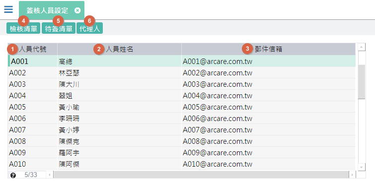
1. 人員代號：顯示人員代號 
2. 人員姓名：顯示人員姓名
3. 郵件信箱：顯示人員對應的郵件信箱
4. 簽核清單：駐留人員，可開啟[人員簽核查詢作業](WFS#FX000000003093)
5. 待簽清單：駐留人員，可開啟[單據簽核查詢作業](WFS#FX000000003092)
6. 代理人：駐留人員，可開啟[簽核人員代理設定](WFS#FX000000003252)

## 簽核人員代理設定 {#FX000000003252}

> 作業說明：當人員在特定期間無法進行簽核時，可設定代理簽核的人員，系統會在設定的期間內將簽核通知信發送至代理的郵件信箱。

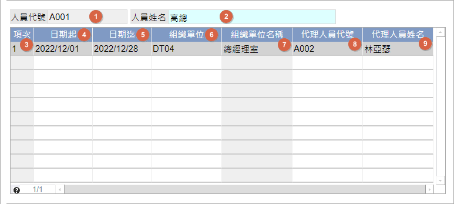
1. 人員代號：顯示人員代號
2. 人員姓名：顯示人員姓名
3. 項次：顯示流水號
4. 日期起：輸入簽核代理的起始日期
5. 日期迄：輸入簽核代理的終止日期
6. 組織單位：挑選簽核代理人員所屬的組織單位代號
7. 組織單位名稱：顯示組織單位簡稱，由`組織單位`挑選後帶入
8. 代理人員代號：挑選指定簽核代理人員代號
9. 代理人員姓名：顯示代理人員姓名，由`代理人員代號`挑選後帶入

## 簽核組織單位 {#FX000000003068}

> 作業說明：設定簽核所需要的部門單位基本資訊

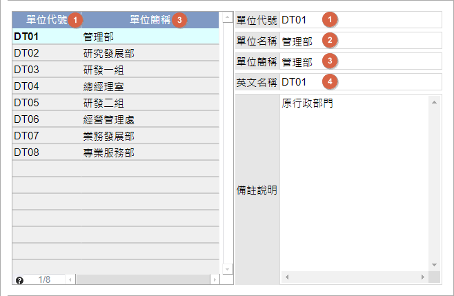
1. 單位代號：自行輸入單位代號
2. 單位名稱：自行輸入單位名稱
3. 單位簡稱：自行輸入單位簡稱
4. 英文名稱：自行輸入單位英文名稱

## 簽核組織編制 {#FX000000003069}

> 作業說明：檢視簽核的組織編制版本清單。

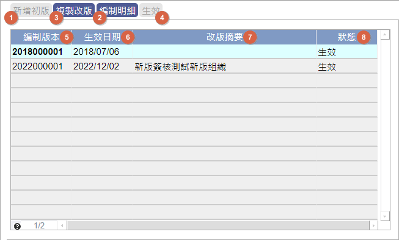
1. 新增初版：當第一次建立組織編制，此按鍵才會致能，執行後會產生第一筆編制版本
2. 編制明細：駐留編制版本，可開啟[簽核組織編制結構](WFS#FX000000003067)，編輯調整編制結構
3. 複製改版：編制若欲改版，可依駐留的編制版本，開啟[簽核組織編制複製作業](WFS#FX000000003070)，進行編制版本及結構的複製
4. 生效：可駐留未生效的編制版本，開啟[簽核組織編制版本生效](WFS#FX000000003071)，進行編制生效
5. 編制版本：顯示編制版本
6. 生效日期：顯示生效日期，預設為系統日期，可於執行生效時進行調整
7. 改版摘要：顯示說明，由[簽核組織編制複製作業](WFS#FX000000003070)執行複製時，將`版本摘要`寫入
8. 狀態：顯示狀態，由[簽核組織編制版本生效](WFS#FX000000003071)執行生效後寫入狀態

## 簽核組織編制複製作業 {#FX000000003070}

> 作業說明：複製來源編制版本的組織編制結構並設定新版本預計生效日期

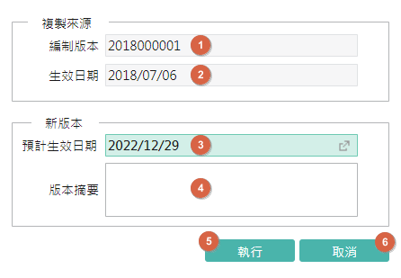
1. 編制版本：顯示欲複製來源的編制版本
2. 生效日期：顯示欲複製來源的生效日期
3. 預計生效日期：預設為系統日期，可調整
4. 執行：依複製來源編制，產生一組新的編制版本及編制結構，執行完成後關閉本單據
5. 取消：放棄複製，關閉本單據

## 簽核組織編制版本生效 {#FX000000003071}

> 作業說明：將指定的編制版本設定新版本預計生效日期後進行生效

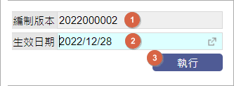
1. 編制版本：顯示欲生效的編制版本
2. 生效日期：預設為系統日期，可調整
3. 執行：依指定的編制版本進行生效並寫入狀態(生效)，執行完成後關閉本單據

## 簽核組織編制結構 {#FX000000003067}

> 作業說明：設定部門單位的編制結構，以及各單位下員工的從屬關係。

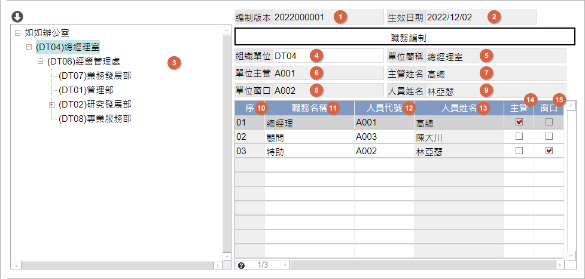
1. 編制版本：顯示編制版本
2. 生效日期：顯示生效日期
3. 編制結構：組織編制結構由樹狀方式呈現
4. 組織單位：挑選組織單位代號
5. 單位簡稱：顯示組織單位簡稱，由`組織單位`挑選後帶入
6. 單位主管：顯示`主管`有勾選的人員代號
7. 主管姓名：顯示`主管`有勾選的人員姓名
8. 單位窗口：顯示`窗口`有勾選的人員代號
9. 窗口姓名：顯示`窗口`有勾選的人員姓名
10. 序：顯示流水號
11. 職務名稱：可自行輸入職務名稱
12. 人員代號：挑選該組織單位下的人員代號
13. 人員姓名：顯示人員名稱，由`人員代號`挑選後帶入
14. 主管：指定該組織單位下的主管，須勾選一人
15. 窗口：指定該組織單位下的窗口，須勾選一人

## 簽核專案編制設定 {#FX000000003063}

> 作業說明：設定專案的編制結構，以及各編制或任務下員工的從屬關係。
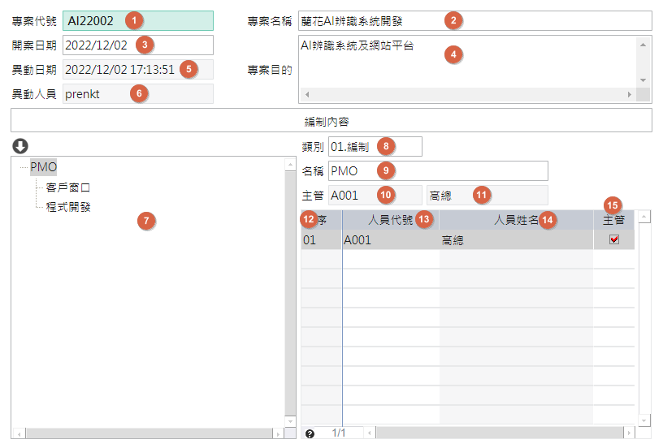
1. 專案代號：自行輸入專案代號
2. 專案名稱：自行輸入專案名稱
3. 開案日期：預設系統日期，可調整
4. 專案目的：自行輸入專案目的
5. 異動日期：異動(新增/修改/存回)時，記錄系統日期時間
6. 異動人員：異動(新增/修改/存回)時，記錄登入人員姓名
7. 編制結構：專案編制結構由樹狀方式呈現
8. 類別：下拉選取類別(01.編制 / 02.任務)，當類別=任務時，不允新增子階編制
9. 名稱：自行輸入編制任務名稱
10. 主管：顯示`主管`有勾選的人員代號
11. 主管姓名：顯示`主管`有勾選的人員姓名
12. 序：顯示流水號
13. 人員代號：挑選該編制任務下的人員代號
14. 人員姓名：顯示人員名稱，由`人員代號`挑選後帶入
15. 主管：指定該組織單位下的主管，須勾選一人

## 簽核流程定義 {#FX000000003079}

> 作業說明：設定簽核流程對應的編制類型及各關卡簽核資訊。

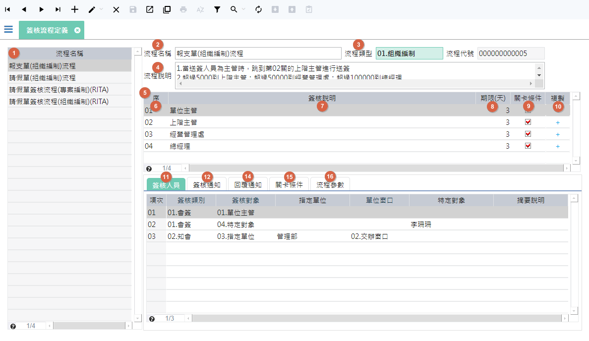
1. 流程名稱表格：顯示已建立的流程清單。
2. 流程名稱：輸入流程名稱；本欄不可空白。
3. 流程類型：下拉選取流程類型(1.組織編制 / 2.專案編制)；本欄不可空白。
4. 流程說明：輸入流程說明內容；雙擊可開啟文字編輯器輸入內容。
5. 流程表格：可設定流程關卡資訊。
6. 序：系統預設帶入2碼流水號(01、02、...)，本欄可自行輸入修改且不可空白。 
7. 簽核說明：輸入關卡的簽核說明；本欄不可空白。
8. 期限(天)：輸入關卡的簽核期限天數；**0** 表示無期限。簽核通知送出時，會依據此欄位計算該關卡的簽核期限日期。
9. 關卡條件：當頁籤.關卡條件的欄位.`設定關卡條件`被勾選時，本欄會同步顯示為勾選。
10. 複製：瀏覽模式時才可以執行，執行後會複製駐筆已設定的簽核資訊。
11. 頁籤.簽核人員：可設定關卡的會簽、知會、會辦人員。
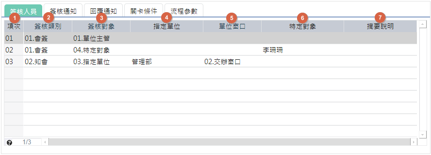    
    1. 項次：系統預設帶入2碼流水號(01、02、....)，本欄可自行輸入修改且不可空白。
    2. 簽核類別：下拉選取簽核類別(1.會簽 / 2.知會 / 3.會辦)；本欄不可空白。
        * **[註1]** 會簽：關卡會簽人員，須全部簽核，關卡才算通過。
        * **[註2]** 知會：通知人員有此簽核事項。知會人員，不具任何簽核權限，僅會在關卡啟動時，寄送流程定義上的知會郵件。
        * **[註3]** 會辦：在會簽過程中交辦他人處理事項，以利會簽人員進行簽核決策。會辦人員，不具任何簽核權限。在收到會辦郵件時，須透過[待簽核清單](WFS#FX000000003059)至[單據簽核回覆作業](WFS#FX000000003057)進行回覆。
    3. 簽核對象：本欄依據`流程類型`及`簽核類別`下拉選取的內容會有所不同；本欄不可空白。
        * 3-1. 當`流程類型`=1.組織編制 且 `簽核類別`=1.會簽，可選取選項(01.單位主管 / 02.上階主管 / 03.指定單位 / 04.特定對象)。
        * 3-2. 當`流程類型`=2.專案編制 且 `簽核類別`=1.會簽，可選取選項(05.編制主管 / 02.上階主管 / 03.指定單位 / 04.特定對象)。
        * 3-3. 當`簽核類別`=2.知會或3.會辦，可選取選項(03.指定單位 / 04.特定對象)。
        * **[註1]** 單位主管：指送簽人員所屬編制單位的直屬主管；上階主管：指送簽人員所屬編制單位的上一階層的主管；編制主管：指送簽人員所屬專案編制的直屬主管。
    4. 指定單位：當`簽核對象`=指定單位，依`流程類型`可下拉選取當前生效的(組織/專案)編制單位，且本欄不可空白。
    5. 單位窗口：當`簽核對象`=指定單位 且 `指定單位`已有值，則可下拉選取(01.單位主管 / 02.交辦窗口)，且本欄不可空白。
    6. 特定對象：當`簽核對象`=特定對象，依`流程類型`可下拉選取當前生效的(組織/專案)的人員，且本欄不可空白。
    7. 摘要說明：自行輸入內容；本欄可空白。
12. 頁籤.簽核通知：可設定關卡被啟動時，送簽人員及各簽核對象是否要發送通知及通知郵件的內容。
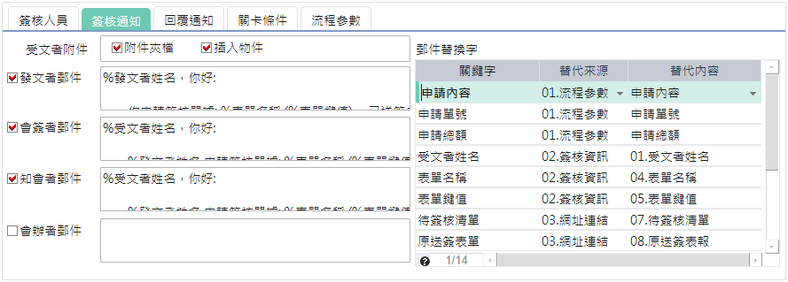  
    1. 受文者附件：當送簽單據存在附件時，在發送的簽核通知信中，是否要將附件夾檔或插入物件至郵件中。
    2. 郵件替換字表格：可設定通知郵件內容中，郵件替換成簽核相關資訊或設定網址連結。
    3. 關鍵字：自行輸入，同一關卡內簽核通知的關鍵字不允許重覆。
    4. 替代來源：下拉選項替代來源(01.流程參數 / 02.簽核資訊 / 03.網址連結 / 04.插入物件)；選項: 04.插入物件須為`受文者附件`的`插入物件`有被勾選時，才會出現在選項中；且本欄不允空白。
    5. 替代內容：本欄依據`替代來源`，下拉選取的內容會有所不同；當`替代來源`有值，本欄不允空白。
        * 當`替代來源`=01.流程參數 且 頁籤.流程參數中的`套用流程時定義的參數`表格中有記錄時，可下拉選取參數，且本欄不可空白。
        * 當替代來源=02.簽核資訊，可然下拉選取

    2. 發文者郵件：勾選表示在關卡啟動時會依據設定的郵件內容發送至送簽人員的郵件信箱中；雙擊可開啟文字編輯器輸入內容。

[Top](#FormList)

## 表報流程設定 {#FX000000003078}

> 作業說明：設定需要送簽的表單或報表，以及對應的簽核流程和簽核資訊。

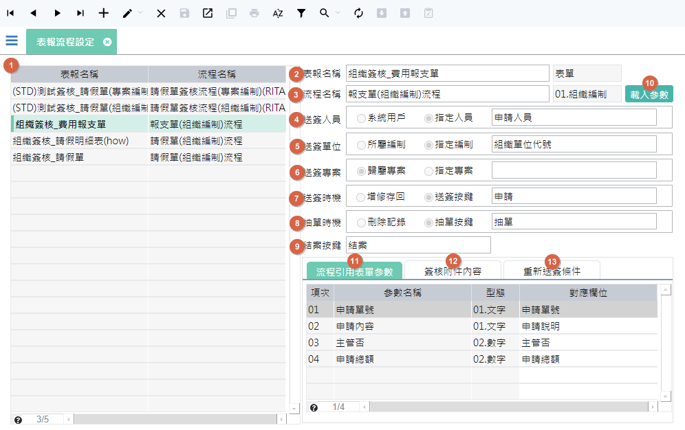

## 催簽設定 {#FX000000003288}

> 作業說明：可設定催簽郵件內容、及設定系統排程在催簽期限到期前多久要發送郵件。

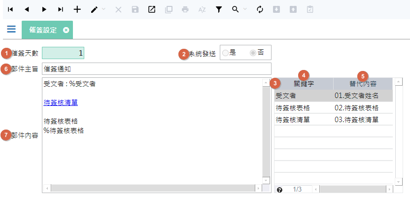

## 待簽核清單 {#FX000000003059}

> 作業說明：依登入人員查詢人員的待簽核清單；會簽人員可在本單勾選多筆待簽記錄進行快速簽核。

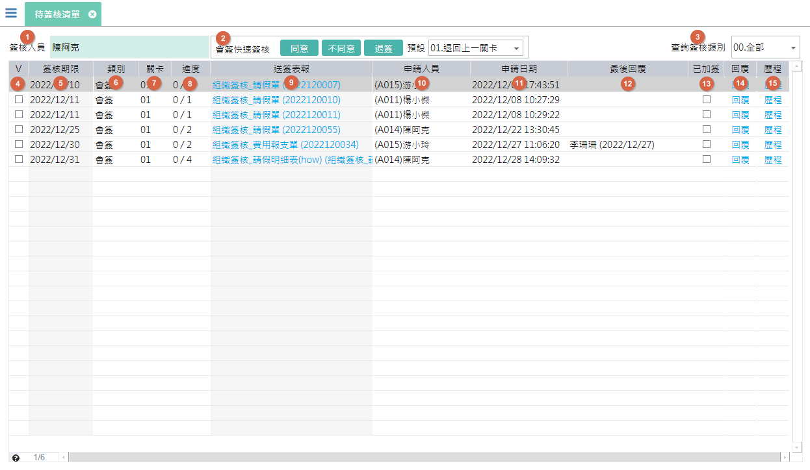

## 單據簽核回覆作業 {#FX000000003057}

> 作業說明：會簽及會辦人員，可在本單進行簽核回覆，並上傳回覆附件。

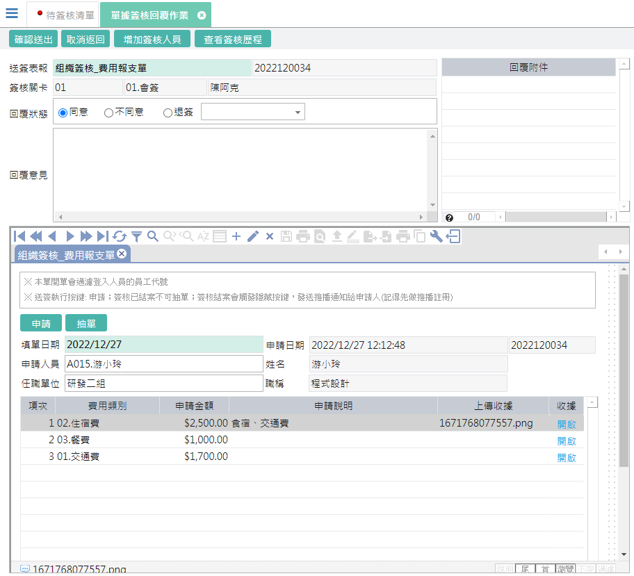

## 單據增加簽核 {#FX000000003082}

> 作業說明：可設定關卡的一般加簽及會辦人員，並設定要發送的郵件內容。 

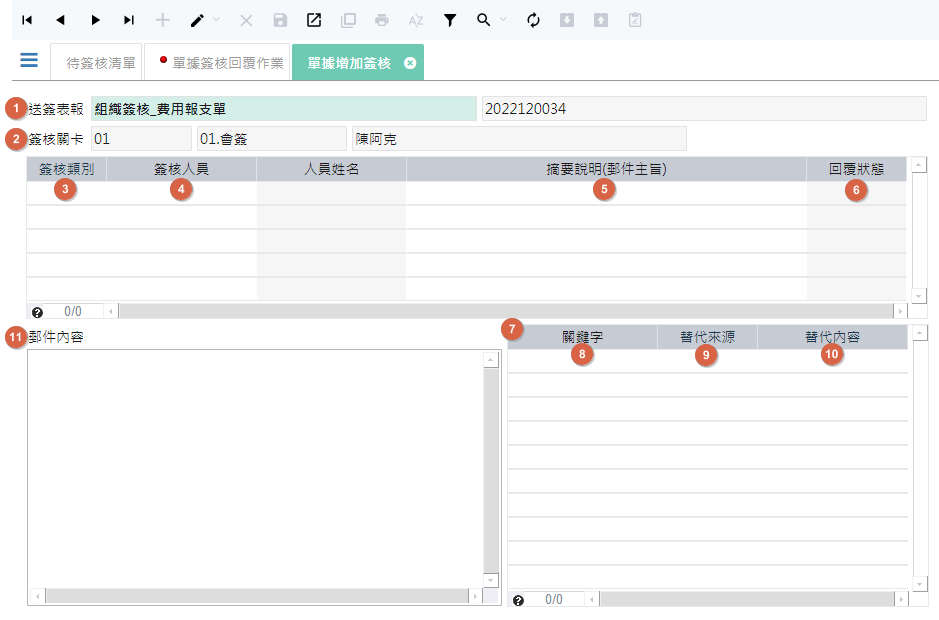

## 人員簽核查詢作業 {#FX000000003093}

> 作業說明：查詢單一人員的送簽及已簽核的簽核資訊。

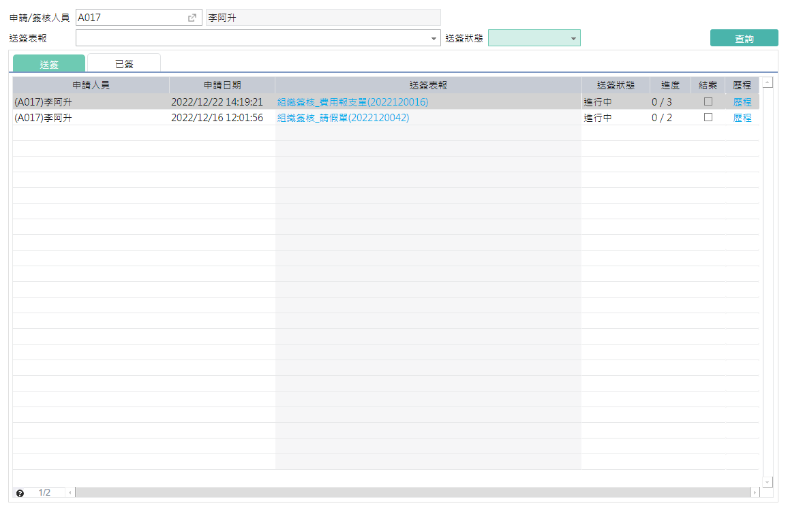

## 單據簽核歷程 {#FX000000003058}

> 作業說明：查詢已送簽的單據，其簽核的歷程狀況。

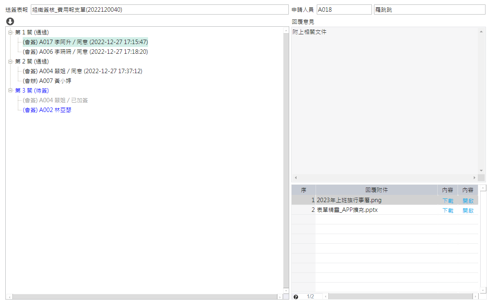

## 單據簽核查詢作業 {#FX000000003092}

> 作業說明：可依簽核人員、送簽專案或單位 查詢簽的狀況及資訊。

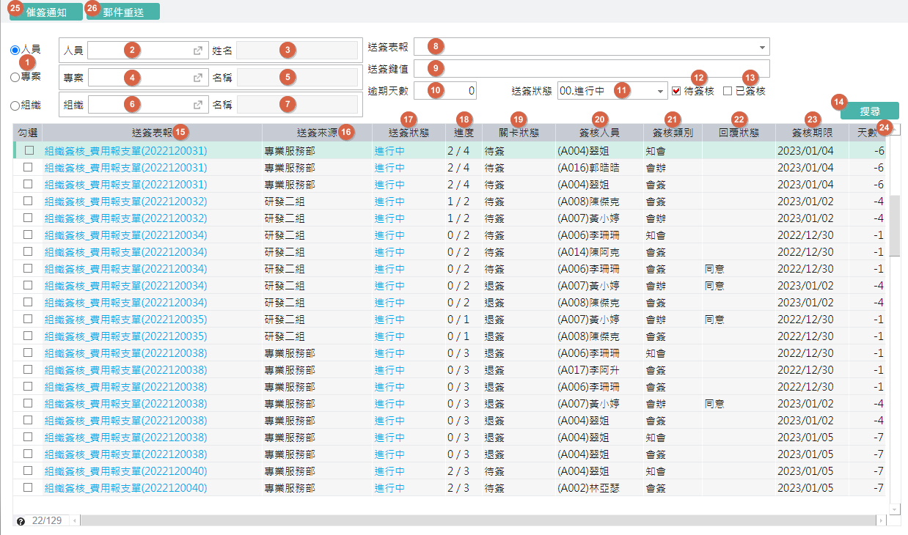

---
[**回到目錄**](index.html#MainMenu)