### **修訂記錄** (Revision History)

| 版本 Version  |出版日期 Issue Date  |修訂章節 Section Changed |出版修訂原因 Reason for Issue |
| :-: | :-: | :-: | :-: |
| 8.10.2 | 2022/12/28 | All | 依簽核模組8.10.2 改版, 更新說明內容 |

### **章節目錄**

[**1.作業流程**](#SignOffFlow)  

[**2.表單清單說明**](#FormList)  

[**3.送簽建置說明**](#SignOffSetting)  
&nbsp;&nbsp;&nbsp;3.1 建置簽核流程  
&nbsp;&nbsp;&nbsp;3.2 設定核決權限(關卡條件)  
&nbsp;&nbsp;&nbsp;3.3 設定送簽單據對應簽核流程  

[**4.簽核通知郵件說明**](#SignOffMail)  
&nbsp;&nbsp;&nbsp;4.1 簽核通知信  
&nbsp;&nbsp;&nbsp;4.2 關卡回覆通知信  
&nbsp;&nbsp;&nbsp;4.3 抽單通知信  
&nbsp;&nbsp;&nbsp;4.4 退簽通知信  
&nbsp;&nbsp;&nbsp;4.5 結案通知信  

[**5.簽核回覆操作說明**](#SignOffReply)  
&nbsp;&nbsp;&nbsp;5.1 簽核回覆-使用郵件連結  
&nbsp;&nbsp;&nbsp;5.2 簽核回覆-使用會簽快速簽核  
&nbsp;&nbsp;&nbsp;5.3 簽核回覆-使用簽核回覆作業  
&nbsp;&nbsp;&nbsp;5.4 簽核回覆-當前關卡增加會簽或會辦人員  

---
# 作業流程 {#SignOffFlow}

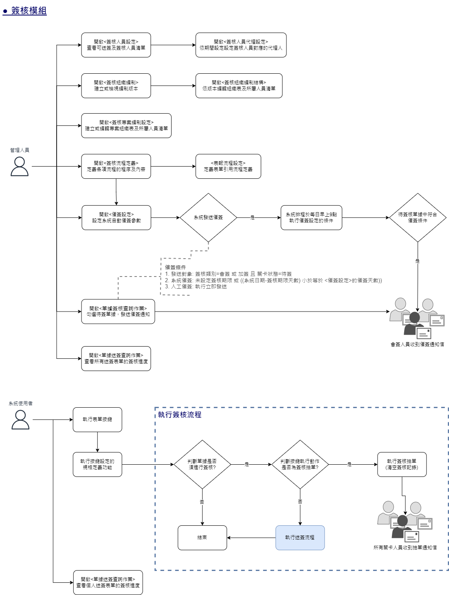

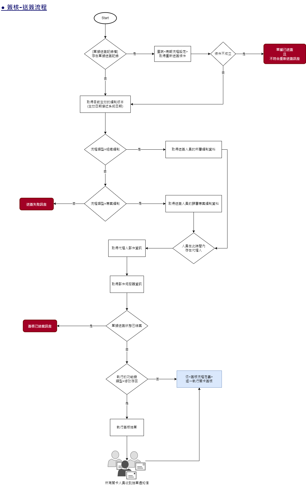

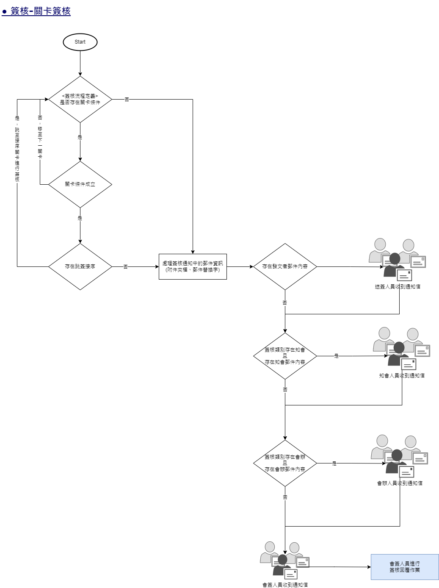

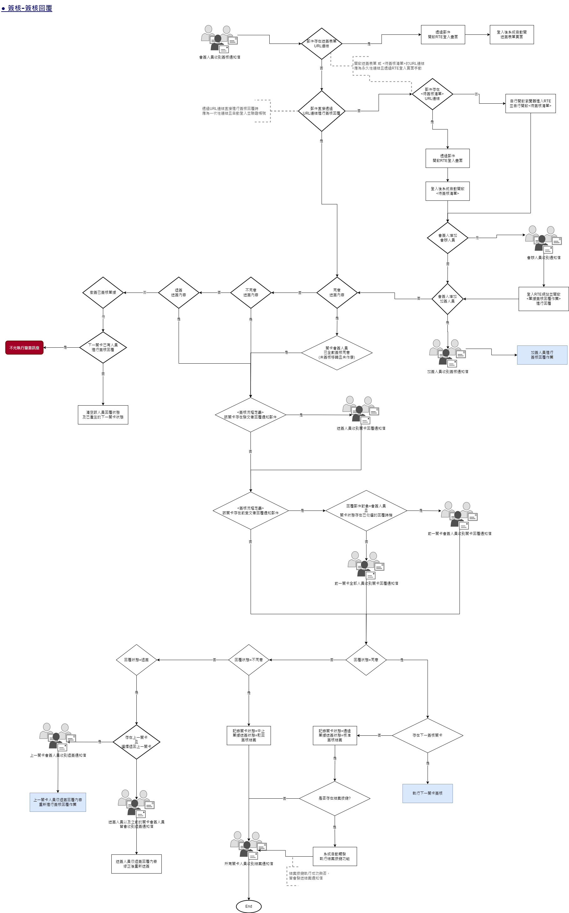

[Top](#SignOffFlow)

# 表單清單 {#FormList}

|對應選單 |作業表單 |說明 |
|---------|---------|---------|
|組織編制	|[簽核人員設定](#FX000000003061)    |查詢組織下已生效的簽核人員。 * 可查詢人員的送簽、已簽、待簽記錄。|
|組織編制	|[簽核人員代理設定](#FX000000003252)	|可設定簽核人員在指定期間的代理簽核人員。【新增/修改/刪除】|
|組織編制	|[簽核組織單位](#FX000000003068)	|可設定「組織單位」的基本資料維護。【新增/修改/刪除】|
|組織編制	|[簽核組織編制](#FX000000003069)	|可設定組織編制版本並生效編制版本。|
|組織編制	|[簽核組織編制結構](#FX000000003067)	|可設定「組織單位」的階層關係及各組織單位下的人員從屬關係。【新增/修改/刪除】  * 本單由 [簽核組織編制] 介面按鈕.編制明細 開啟。|
|組織編制	|[簽核組織編制複製作業](#FX000000003070)	|可複製指定的組織版本資料並指定預計要生效的日期。|
|組織編制	|[簽核組織編制版本生效](#FX000000003071)	|將指定的組織版本，指定預計要生效的日期後進行生效。|
|組織編制	|[簽核專案編制設定](#FX000000003063)	|可設定「專案」的階層關係(編制/任務)，及各階層下的人員從屬關係。【新增/修改/刪除】|
|簽核流程	|[簽核流程定義](#FX000000003079)	|可設定簽核流程的簽核編制類型(組織/專案)，及關卡資訊(各關卡簽核對象、各簽核對象通知信、關卡回覆通知信、關卡核決權的條件)。【新增/修改/刪除】|
|簽核流程	|[表報流程設定](#FX000000003078)	|可設定(表單/報表)對應的簽核流程及決定送簽人員、送簽(單位/專案)、送簽按鍵、抽單按鍵、送簽核准時要執行的結案按鍵。|
|簽核流程	|[催簽設定](#FX000000003288)	|可設定催簽郵件內容、及設定系統排程在催簽期限到期前多久要發送郵件。|
|簽核流程	|[待簽核清單](#FX000000003059) &nbsp;&nbsp;[[RWD Web版](#FX000000003059_RWD)] |提供「登入人員」透過「簽核類別」查詢該登入人員的待簽核清單。  * 亦提供讓會簽人員進行快速簽核【同意、不同意、退簽(退回上一關卡、退回送簽人員)】|
|簽核流程	|[單據簽核回覆作業](#FX000000003057) &nbsp;&nbsp;[[RWD Web版](#FX000000003057_RWD)]	|提供會簽及會辦人員進行簽核回覆及上傳回覆附件。 * 本單由 [待簽核清單] 介面按鈕.回覆 開啟。|
|簽核流程	|[單據增加簽核](#FX000000003082)	|提供會簽人員在當前關卡設定(加簽/會辦)人員，並設定要接收的郵件內容。【修改】  * 本單由 [單據簽核回覆作業] 介面按鈕.增加簽核人員 開啟|
|簽核流程	|[人員簽核查詢作業](#FX000000003093) &nbsp;&nbsp;[[RWD Web版](#FX000000003093_RWD)]	|提供「申請/簽核人員」、「送簽表報」、「送簽狀態」為搜尋條件，查詢該人員的已簽及送簽資訊。  * 本單亦可由首頁的 [支援/簽核查詢] 開啟，開啟後會鎖定「申請/簽核人員」為登入人員。|
|簽核流程	|[單據簽核歷程](#FX000000003058) &nbsp;&nbsp;[[RWD Web版](#FX000000003058_RWD)]	|提供送簽的表單或報表，查詢簽核的歷程。  * 本單亦可由首頁的 [支援/簽核歷程] 開啟，開啟後會鎖定目前駐留的表報。|
|簽核流程	|[單據簽核查詢作業](#FX000000003092)	|提供管理人員依「簽核人員」、「送簽專案/組織」、「送簽表報」、「送簽鍵值」、「逾期天數」、「送簽狀態」為搜尋條件，查詢簽核的歷程。|

# 表單說明

## 簽核人員設定 {#FX000000003061}

> 作業說明：檢閱目前駐留的組織，已生效且擁有系統登入權限的帳號，即為可設定簽核的人員。

1. 人員代號：顯示人員代號 
2. 人員姓名：顯示人員姓名
3. 郵件信箱：顯示人員對應的郵件信箱
4. 簽核清單：駐留人員，可開啟[人員簽核查詢作業](WFS#FX000000003093)
5. 待簽清單：駐留人員，可開啟[單據簽核查詢作業](WFS#FX000000003092)
6. 代理人：駐留人員，可開啟[簽核人員代理設定](WFS#FX000000003252)

[Top](#FormList)

## 簽核人員代理設定 {#FX000000003252}

> 作業說明：當人員在特定期間無法進行簽核時，可設定代理簽核的人員，系統會在設定的期間內將簽核通知信發送至代理的郵件信箱。

1. 人員代號：顯示人員代號
2. 人員姓名：顯示人員姓名
3. 項次：顯示流水號
4. 日期起：輸入簽核代理的起始日期
5. 日期迄：輸入簽核代理的終止日期
6. 組織單位：挑選簽核代理人員所屬的組織單位代號
7. 組織單位名稱：顯示組織單位簡稱，由`組織單位`挑選後帶入
8. 代理人員代號：挑選指定簽核代理人員代號
9. 代理人員姓名：顯示代理人員姓名，由`代理人員代號`挑選後帶入

[Top](#FormList)

## 簽核組織單位 {#FX000000003068}

> 作業說明：設定簽核所需要的部門單位基本資訊

1. 單位代號：自行輸入單位代號
2. 單位名稱：自行輸入單位名稱
3. 單位簡稱：自行輸入單位簡稱
4. 英文名稱：自行輸入單位英文名稱

[Top](#FormList)

## 簽核組織編制 {#FX000000003069}

> 作業說明：檢視簽核的組織編制版本清單。

1. 新增初版：當第一次建立組織編制，此按鍵才會致能，執行後會產生第一筆編制版本
2. 編制明細：駐留編制版本，可開啟[簽核組織編制結構](WFS#FX000000003067)，編輯調整編制結構
3. 複製改版：編制若欲改版，可依駐留的編制版本，開啟[簽核組織編制複製作業](WFS#FX000000003070)，進行編制版本及結構的複製
4. 生效：可駐留未生效的編制版本，開啟[簽核組織編制版本生效](WFS#FX000000003071)，進行編制生效
5. 編制版本：顯示編制版本
6. 生效日期：顯示生效日期，預設為系統日期，可於執行生效時進行調整
7. 改版摘要：顯示說明，由[簽核組織編制複製作業](WFS#FX000000003070)執行複製時，將`版本摘要`寫入
8. 狀態：顯示狀態，由[簽核組織編制版本生效](WFS#FX000000003071)執行生效後寫入狀態

[Top](#FormList)

## 簽核組織編制複製作業 {#FX000000003070}

> 作業說明：複製來源編制版本的組織編制結構並設定新版本預計生效日期

1. 編制版本：顯示欲複製來源的編制版本
2. 生效日期：顯示欲複製來源的生效日期
3. 預計生效日期：預設為系統日期，可調整
4. 執行：依複製來源編制，產生一組新的編制版本及編制結構，執行完成後關閉本單據
5. 取消：放棄複製，關閉本單據

[Top](#FormList)

## 簽核組織編制版本生效 {#FX000000003071}

> 作業說明：將指定的編制版本設定新版本預計生效日期後進行生效

1. 編制版本：顯示欲生效的編制版本
2. 生效日期：預設為系統日期，可調整
3. 執行：依指定的編制版本進行生效並寫入狀態(生效)，執行完成後關閉本單據

[Top](#FormList)

## 簽核組織編制結構 {#FX000000003067}

> 作業說明：設定部門單位的編制結構，以及各單位下員工的從屬關係。

1. 編制版本：顯示編制版本
2. 生效日期：顯示生效日期
3. 編制結構：組織編制結構由樹狀方式呈現
4. 組織單位：挑選組織單位代號
5. 單位簡稱：顯示組織單位簡稱，由`組織單位`挑選後帶入
6. 單位主管：顯示`主管`有勾選的人員代號
7. 主管姓名：顯示`主管`有勾選的人員姓名
8. 單位窗口：顯示`窗口`有勾選的人員代號
9. 窗口姓名：顯示`窗口`有勾選的人員姓名
10. 序：顯示流水號
11. 職務名稱：可自行輸入職務名稱
12. 人員代號：挑選該組織單位下的人員代號
13. 人員姓名：顯示人員名稱，由`人員代號`挑選後帶入
14. 主管：指定該組織單位下的主管，須勾選一人
15. 窗口：指定該組織單位下的窗口，須勾選一人

[Top](#FormList)

## 簽核專案編制設定 {#FX000000003063}

> 作業說明：設定專案的編制結構，以及各編制或任務下員工的從屬關係。

1. 專案代號：自行輸入專案代號
2. 專案名稱：自行輸入專案名稱
3. 開案日期：預設系統日期，可調整
4. 專案目的：自行輸入專案目的
5. 異動日期：異動(新增/修改/存回)時，記錄系統日期時間
6. 異動人員：異動(新增/修改/存回)時，記錄登入人員姓名
7. 編制結構：專案編制結構由樹狀方式呈現
8. 類別：下拉選取類別(01.編制 / 02.任務)，當類別=任務時，不允新增子階編制
9. 名稱：自行輸入編制任務名稱
10. 主管：顯示`主管`有勾選的人員代號
11. 主管姓名：顯示`主管`有勾選的人員姓名
12. 序：顯示流水號
13. 人員代號：挑選該編制任務下的人員代號
14. 人員姓名：顯示人員名稱，由`人員代號`挑選後帶入
15. 主管：指定該組織單位下的主管，須勾選一人

[Top](#FormList)

## 簽核流程定義 {#FX000000003079}

> 作業說明：設定簽核流程對應的編制類型及各關卡簽核資訊。

1. 流程名稱表格：顯示已建立的流程清單。
2. 流程名稱：輸入流程名稱；本欄不可空白。
3. 流程類型：下拉選取流程類型(1.組織編制 / 2.專案編制)；本欄不可空白。
4. 流程說明：輸入流程說明內容；雙擊可開啟文字編輯器輸入內容。
5. 流程表格：可設定流程關卡資訊。
6. 序：系統預設帶入2碼流水號(01、02、...)，本欄可自行輸入修改且不可空白。 
7. 簽核說明：輸入關卡的簽核說明；本欄不可空白。
8. 期限(天)：輸入關卡的簽核期限天數；**0** 表示無期限。簽核通知送出時，會依據此欄位計算該關卡的簽核期限日期。
9. 關卡條件：當頁籤.關卡條件的欄位.`設定關卡條件`被勾選時，本欄會同步顯示為勾選。
10. 複製：瀏覽模式時才可以執行，執行後會複製駐筆已設定的簽核資訊。
11. 頁籤.簽核人員：可設定關卡的會簽、知會、會辦人員。
    
    1. 項次：系統預設帶入2碼流水號(01、02、....)，本欄可自行輸入修改且不可空白。
    2. 簽核類別：下拉選取簽核類別(1.會簽 / 2.知會 / 3.會辦)；本欄不可空白。
        * **[名詞解釋]**
            * 會簽：關卡會簽人員，須全部簽核，關卡才算通過。
            * 知會：通知人員有此簽核事項。知會人員，不具任何簽核權限，僅會在關卡啟動時，寄送流程定義上的知會郵件。
            * 會辦：在會簽過程中交辦他人處理事項，以利會簽人員進行簽核決策。會辦人員，不具任何簽核權限。在收到會辦郵件時，須透過[待簽核清單](WFS#FX000000003059)至[單據簽核回覆作業](WFS#FX000000003057)進行回覆。
    3. 簽核對象：本欄依據`流程類型`及`簽核類別`下拉選取的內容會有所不同；本欄不可空白。
        * 當`流程類型`=1.組織編制 且 `簽核類別`=1.會簽，可選取選項(01.單位主管 / 02.上階主管 / 03.指定單位 / 04.特定對象)。
        * 當`流程類型`=2.專案編制 且 `簽核類別`=1.會簽，可選取選項(05.編制主管 / 02.上階主管 / 03.指定單位 / 04.特定對象)。
        * 當`簽核類別`=2.知會或3.會辦，可選取選項(03.指定單位 / 04.特定對象)。        
        * **[名詞解釋]**
            * 單位主管：指送簽人員所屬編制單位的直屬主管；
            * 上階主管：指送簽人員所屬編制單位的上一階層的主管；
            * 編制主管：指送簽人員所屬專案編制的直屬主管。
    4. 指定單位：當`簽核對象`=指定單位，依`流程類型`可下拉選取當前生效的(組織/專案)編制單位，且本欄不可空白。
    5. 單位窗口：當`簽核對象`=指定單位 且 `指定單位`已有值，則可下拉選取(01.單位主管 / 02.交辦窗口)，且本欄不可空白。
    6. 特定對象：當`簽核對象`=特定對象，依`流程類型`可下拉選取當前生效的(組織/專案)的人員，且本欄不可空白。
    7. 摘要說明：自行輸入內容；本欄可空白。
12. 頁籤.簽核通知：可設定關卡被啟動時，送簽人員及各簽核對象是否要發送通知及通知郵件的內容。

    1. 受文者附件：當送簽單據存在附件時，在發送的簽核通知信中，是否要將附件夾檔或插入物件至郵件中。
    2. 郵件替換字表格：可設定通知郵件內容中，郵件替換成簽核相關資訊或設定網址連結。
    3. 關鍵字：自行輸入，同一關卡內簽核通知的關鍵字不允許重覆。
    4. 替代來源：下拉選項替代來源(01.流程參數 / 02.簽核資訊 / 03.網址連結 / 04.插入物件)；選項: 04.插入物件須為`受文者附件`的`插入物件`有被勾選時，才會出現在選項中。
    5. 替代內容：本欄依據`替代來源`下拉選取的內容會有所不同；當`替代來源`有值。
        * 當`替代來源`=01.流程參數 且 頁籤.流程參數中的`套用流程時定義的參數`表格中有記錄時，可下拉選取參數。
        * 當`替代來源`=02.簽核資訊，可下拉選取(01.受文者姓名 / 02.發文者姓名 / 03.會簽人姓名 / 04.表單名稱 / 05.表單鍵值 / 06.回覆狀態)
        * 當`替代來源`=03.網址連結，可下拉選取(07.待簽核清單 / 08.原送簽表報 / 09.同意 / 10.不同意 / 11.退簽)
        * 當`替代來源`=04.插入物件，可下拉選取(01.表單附件)
    6. 發文者郵件：勾選表示在關卡啟動時會依據設定的郵件內容發送至送簽人員的郵件信箱中；雙擊可開啟文字編輯器輸入內容；本欄可空白。
    7. 會簽者郵件：勾選表示在關卡啟動時會依據設定的郵件內容發送至會簽人員的郵件信箱中；雙擊可開啟文字編輯器輸入內容；本欄預設為勾選，且不可為空白。
    8. 知會者郵件：勾選表示在關卡啟動時會依據設定的郵件內容發送至知會人員的郵件信箱中；雙擊可開啟文字編輯器輸入內容；本欄可空白。
    9. 會辦者郵件：勾選表示在關卡啟動時會依據設定的郵件內容發送至會辦人員的郵件信箱中；雙擊可開啟文字編輯器輸入內容；本欄可空白。
    10. 簽核通知信範例
13. 頁籤.回覆通知：可設定關卡(通過 / 退簽 / 中止)時，送簽人員及上一關卡的人員是否要發送通知及通知郵件的內容。
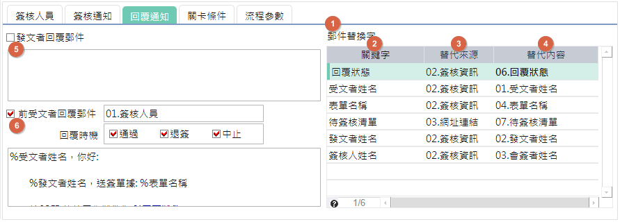
    1. 郵件替換字表格：可設定通知郵件內容中，郵件替換成簽核相關資訊或設定網址連結。
    2. 關鍵字：自行輸入，同一關卡內回覆通知的關鍵字不允許重覆。
    3. 替代來源：下拉選項替代來源(01.流程參數 / 02.簽核資訊 / 03.網址連結)。
    4. 替代內容：本欄依據`替代來源`下拉選取的內容會有所不同；當`替代來源`有值。
        * 當`替代來源`=01.流程參數 且 頁籤.流程參數中的`套用流程時定義的參數`表格中有記錄時，可下拉選取參數。
        * 當`替代來源`=02.簽核資訊，可下拉選取(01.受文者姓名 / 02.發文者姓名 / 03.會簽人姓名 / 04.表單名稱 / 05.表單鍵值 / 06.回覆狀態)。
        * 當`替代來源`=03.網址連結，可下拉選取(07.待簽核清單 / 08.原送簽表報)。
    5. 發文者回覆郵件：勾選表示在關卡結束時會依據設定的郵件內容發送至送簽人員的郵件信箱中；雙擊可開啟文字編輯器輸入內容；本欄可空白。
    6. 前受文者回覆郵件：本欄可空白。
        * 可下拉選取前一關卡要接收郵件的對象(01.簽核人員 / 02.全部人員)。
        * 可指定回覆時機為關卡`通過`或關卡`中止`或關卡被`退簽`時，才發送回覆郵件給前一關卡的接收對象。
        * 雙擊可開啟文字編輯器輸入內容。
14. 頁籤.關卡條件：可設定是否要啟動關卡執行簽核的條件。條件成立時，執行該關卡；不成立時，可決定是否要跳簽至另一個關卡。
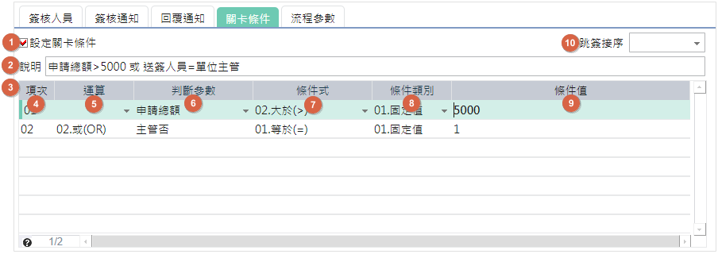
    1. 設定關卡條件：勾選表示啟動關卡件。
    2. 說明：關卡條件說明，自行輸入；本欄可空白。
    3. 關卡條件表格：目前僅提供以`流程參數`及`固定的內容值`為條件設定。
    4. 項次：系統預設帶入2碼流水號(01、02、....)，本欄可自行輸入修改且不可空白。
    5. 運算：當為多條件時，可下拉選取(01.且(AND) / 02.或(OR))。
    6. 判斷參數：依頁籤.流程參數中的`套用流程時定義的參數`表格中有記錄時，可下拉選取參數。
    7. 條件式：系統預設帶入選項:01.等於(=)，可下拉變更選取(01.等於(=) / 02.大於(>) / 03.大於等於(>=) / 04.小於(<) / 05.小於等於(<=) / 06.不等於(<>))。
    8. 條件類別：系統預設帶入選項:01.固定值，可下拉變更選取(01.固定值)。
    9. 條件值：自行輸入。
    10. 跳簽接序：可下拉挑選本關卡之後的關卡序，例如:駐留關卡02，下拉可選項取的關卡為(02 / 03 / 04 / ...)。
15. 頁籤.流程參數：可自行定義流程要使用的參數，並在[表報流程設定](#FX000000003078)傳入參數對應的內容使用。
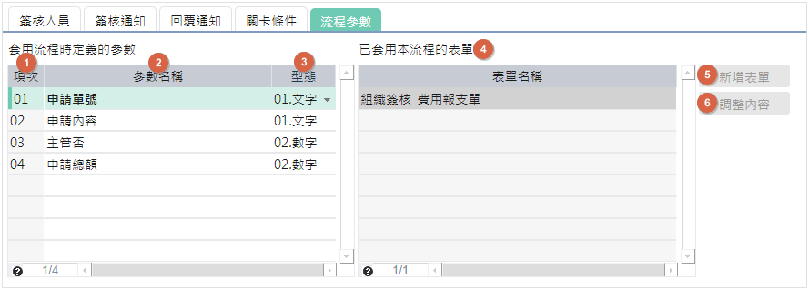
    1. 項次：系統預設帶入2碼流水號(01、02、....)，本欄可自行輸入修改且不可空白。
    2. 參數名稱：自行輸入，同一流程內參數名稱不允許重覆。
    3. 型態：可下拉選取(01.文字 / 02.數字 / 03.日期)。
    4. 已套用本流程的表單清單：顯示目前已套用本流程的表單名稱。
    5. 新增表單：瀏覽模式下才有作用，執行後可開啟[表報流程設定](#FX000000003078)，系統預設會進入新增模式。
    6. 調整內容：須駐留`已套用本流程的表單清單`中的任一筆表單 且 瀏覽模式下才有作用，執行後可開啟[表報流程設定](#FX000000003078)，系統會駐留在該筆表單。
    
[Top](#FormList)

## 表報流程設定 {#FX000000003078}

> 作業說明：設定需要送簽的表單或報表，以及對應的簽核流程和簽核資訊。

可開啟小視窗[表報元件一覽表]挑選的元件

1. 表格：顯示已建立的表報名稱及其應的流程名稱清單。
2. 表報名稱：可開啟小視窗[表報一覽表]挑選組織下的表單或報表。
3. 流程名稱：可開啟小視窗[簽核流程一覽表]挑選組下的流程定義。
4. 送簽人員：可選取送簽人員為目前登入的`系統用戶`或從已選取的`表報名稱`中，指定有儲存人員代號的元件為`指定人員`。
    * **※注意※** 當為`指定人員`時，開啟小視窗[表報元件一覽表]挑選的元件，其內容值須與[簽核人員設定](#FX000000003061)的`人員代號`一致，否則會送簽失敗。
5. 送簽單位：流程類型=01.組織編制時才有效，可選取送簽單位為目前登入用戶`所屬編制`的單位或從已選取的`表報名稱`中，指定有儲存單位代號的元件為`指定單位`。
    * **※注意※** 當為`指定單位`時，開啟小視窗[表報元件一覽表]挑選的元件，其內容值須與[簽核組織單位](#FX000000003068)的`單位代號`一致，否則會送簽失敗。
6. 送簽專案：流程類型=02.專案編制時才有效，可選取送簽單位為目前登入用戶的`歸屬專案`或從已選取的`表報名稱`中，指定有儲存專案代號的元件為`指定專案`。
    * **※注意※** 當為`歸屬專案`時，系統會依登入用戶取得[簽核專案編制設定](#FX000000003063)第一次找到的專案為歸屬專案。
    * **※注意※** 當為`指定專案`時，開啟小視窗[表報元件一覽表]挑選的元件，其內容值須與[簽核專案編制設定](#FX000000003063)的`專案代號`一致，否則會送簽失敗。
7. 送簽時機：可選取送簽的時機是在執行系統鍵的`增修改回`時或從已選取的`表報名稱`中指定按鍵。
8. 抽單時機：可選取抽單的時機是在執行系統鍵的`刪除記錄`時或從已選取的`表報名稱`中指定按鍵。
9. 結案按鍵：可開啟小視窗[表報按鍵一覽表]挑選在簽核被核准時要啟動執行的按鍵。
    * **※注意※** 目前系統僅提供簽核准時的結案按鍵，駁回沒有。
10. 載入參數：編修模式下可執行，執行後會在頁籤.流程引用表單參數中載入該流程已定義好的參數清單。
11. 頁籤.流程引用表單參數：設定流程定義的參數與本單對應欄位
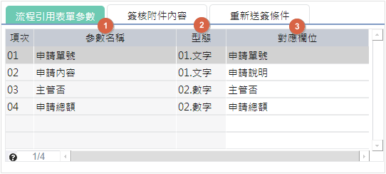
    1. 參數名稱：顯示參數名稱
    2. 型態：顯示參數的型態
    3. 對應欄位：依據已選取的`表報名稱`可開啟小視窗[表報元件一覽表]挑選元件，系統會過濾出與參數`型態`相同的元件。
12. 頁籤.簽核附件內容：當送簽的單據存在附件時，可設定送簽時要傳送的附件檔案資訊
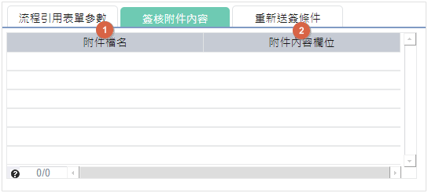
    1. 附件檔名：可開啟小視窗[表報元件一覽表]挑選的元件。
    2. 附件內容欄位：可開啟小視窗[表報元件一覽表]挑選的元件。
13. 頁籤.重新送簽條件：本功能只作用在舊版首頁，送簽表報可在單據執行系統鍵.手動送簽時會依據設定的條件決定是否重新發送簽核通知郵件。
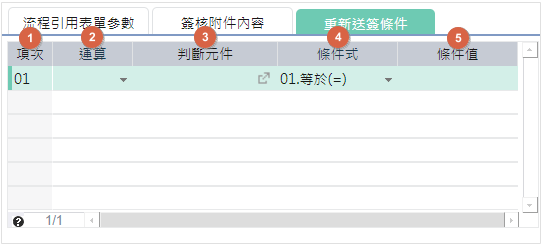
    1. 項次：系統預設帶入2碼流水號(01、02、....)，本欄可自行輸入修改且不可空白。
    2. 運算：當為多條件時，可下拉選取(01.且(AND) / 02.或(OR))。
    3. 判斷元件：可開啟小視窗[表報元件一覽表]挑選的元件。
    4. 條件式：系統預設帶入選項:01.等於(=)，可下拉變更選取(01.等於(=) / 02.大於(>) / 03.大於等於(>=) / 04.小於(<) / 05.小於等於(<=) / 06.不等於(<>))。
    5. 條件值：自行輸入。

[Top](#FormList)

## 催簽設定 {#FX000000003288}

> 作業說明：可設定催簽郵件內容、及設定系統排程在催簽期限到期前多久要發送郵件，本單只允許新增一筆記錄。

1. 催簽天數：自行輸入
2. 系統發送：若設定為是，表示將此催簽設定列入排程，系統將會於每日上午九點整，針對符合下列條件的簽核記錄，發送催簽通知郵件。
    * 簽核對象=會簽，並依單據送簽關卡狀態=待簽的關卡
    * 依催簽天數到期發送，條件: 未設定簽核期限 或 (系統日期-簽核期限天數) 小於等於 <催簽設定>的催簽天數
3. 郵件替換字表格：可設定催簽郵件內容中，郵件替換成簽核相關資訊或設定網址連結。
4. 關鍵字：自行輸入，同一催簽內容的關鍵字不允許重覆。
5. 替代內容：可下拉選取(01.受文者姓名 / 02.待簽核表格 / 03.待簽核清單)。
    * **[名詞解釋]**
        * 待簽核表格：需要催簽的送簽單據，若為會簽人員為同一人，系統會以表格型式將送簽記錄合併發送一封郵件。如下圖所示
        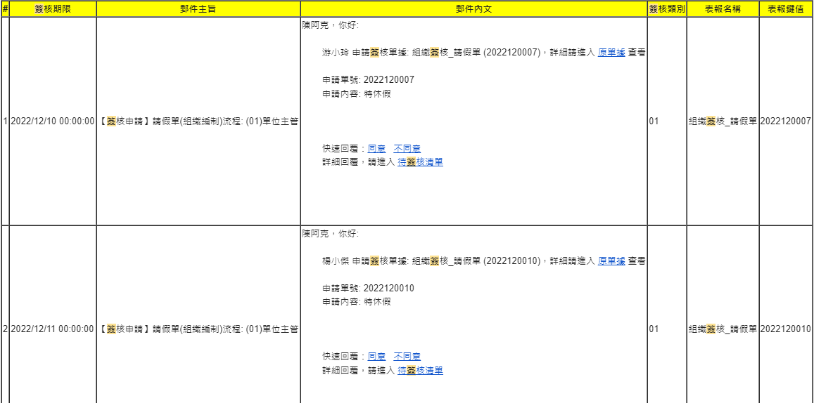
6. 郵件主旨：自行輸入，本欄不允空白。
7. 郵件內容：雙擊可開啟文字編輯器輸入內容；本欄不可空白。

[Top](#FormList)

## 待簽核清單 {#FX000000003059}

> 作業說明：依據登入用戶顯示該用戶等待簽核的項目清單；會簽人員可在本單勾選多筆待簽記錄進行快速簽核。

1. 簽核人員：顯示登入用戶名稱。
2. 會簽快速簽核：簽核`類別`=會簽時，可在勾選待簽核的記錄，進行快速簽核
    * 退簽，系統預設選項:01.退回上一關，可俢改選項(01.退回上一罵卡 / 02.退回送簽人員)。
3. 查詢簽核類別：系統預設選項:00.全部，可修改選項(00.全部 / 01.會簽 / 02.知會 / 03.會辦)，選取後，系統會依簽核類別立即查詢附合的資料。
4. V：勾選後，可使用`會簽快速簽核`區塊的按鈕進行簽核
5. 簽核期限：顯示簽核期限日期。
6. 類別：顯示簽核類別(會簽 / 知會 / 會辦)。
7. 關卡：顯示目前關卡順序
8. 進度：顯示 **已完成簽核的關卡數** / **該筆送簽的總關卡數**。例如：若送簽記錄需進行的關卡有3關，目前關卡1已通過，進入關卡2，則呈現 "1 / 3"，若關卡2已通過，進入關卡3，則呈現 "2 / 3"，以此類推
9. 送簽表報：顯示送簽的表單或報表名稱，單擊可開啟原送簽單據。
10. 申請人員：顯示送簽人員姓名。
11. 申請日期：顯示送簽的日期。
12. 最後回覆：顯示最後進行簽核回覆的人員姓名及回覆的日期。
13. 已加簽：當會簽人員有增加一般加簽人員時，顯示為勾選。
14. 回覆：執行後可開啟[單據簽核回覆作業](#FX000000003057)
15. 歷程：執行後可開啟[單據簽核歷程](#FX000000003058)

[Top](#FormList)

## 待簽核清單(RWD Web版) {#FX000000003059_RWD}

> 作業說明：於行動裝置上，依據登入用戶顯示該用戶等待簽核的項目清單；會簽人員可在本單簽記錄進行簽核。

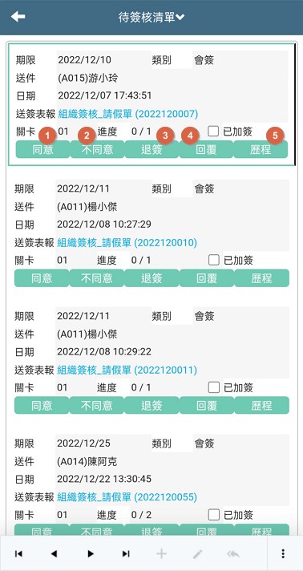
1. 同意：當`類別`=會簽 且 `已加簽`未勾選，才致能，可進行簽核
2. 不同意：當`類別`=會簽 且 `已加簽`未勾選，才致能，可進行簽核
3. 退簽：當`類別`=會簽 且 `已加簽`未勾選，才致能，可進行簽核; 退簽階段為退回上一關卡
4. 回覆：當`類別`=會簽 且 `已加簽`未勾選 或 `類別`=會辦，開啟[簽核回覆(RWD Web版)](#FX000000003057_RWD)
5. 歷程：執行後可開啟[簽核歷程](#FX000000003058_RWD)
6. 其餘欄位、按鍵說明同[待簽核清單](#FX000000003059)

[Top](#FormList)

## 單據簽核回覆作業 {#FX000000003057}

> 作業說明：會簽及會辦人員，可在本單進行簽核回覆，並上傳回覆附件。

1. 送簽表報資訊：顯示 送簽表格名稱及鍵值內容
2. 簽核關卡資訊：顯示 目前關卡順序；關卡類別；簽核人員姓名
3. 回覆狀態：系統預設:同意
    * 退簽，系統預設選項:01.退回上一關，可俢改選項(01.退回上一罵卡 / 02.退回送簽人員)。
4. 回覆意見：可自行輸入，當回覆狀態為不同意或退簽時，本欄位不可空白。
5. 回覆附件：可開啟檔案總管挑選檔案後存回。
6. 原單據：顯示原送簽單據表單畫面。
7. 確認送出：執行後會將回覆結果儲存並關閉本單。
8. 取消返回：執行後會關閉本單。
9. 增加簽核人員：本按鈕只允許會簽人員執行，執行後可開啟[單據增加簽核](#FX000000003082)
10. 查看簽核歷程：執行後可開啟[單據簽核歷程](WFS#FX000000003058)

[Top](#FormList)

## 簽核回覆(RWD Web版) {#FX000000003057_RWD}

> 作業說明：於行動裝置上，會簽及會辦人員，可在本單進行簽核回覆。

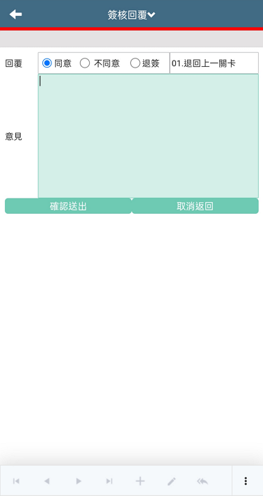
1. 欄位、按鍵說明同[單據簽核回覆作業](#FX000000003057)

[Top](#FormList)

## 單據增加簽核 {#FX000000003082}

> 作業說明：可設定關卡的一般加簽及會辦人員，並設定要發送的郵件內容。郵件會在修改存回後立即發送出。

1. 送簽表報資訊：顯示 送簽表格名稱及鍵值內容
2. 簽核關卡資訊：顯示 目前關卡順序；關卡類別；簽核人員姓名
3. 簽核類別：可下拉選取(01.加簽 / 02.會辦)
    * **[名詞解釋]**
        * 加簽: 指上對下的簽核關係，若流程簽核至部門經理，部門經理簽核時判斷需上呈總經理，由總經理核決，即可使用一般加簽。
        * 使用加簽後，簽核權限將移轉至加簽人員身上，不論加簽人員回覆的結果如何，原會簽人員都同意此回覆結果。
4. 簽核人員：可開啟小視窗[簽核組織編級人員清單]挑選人員
5. 摘要說明：可設定要傳送郵件主旨
6. 回覆狀態：若(加簽/會辦)人員有回覆，會顯示該人員回覆狀態(同意 / 不同意 / 退簽)。
7. 郵件替換字表格：可設定通知郵件內容中，郵件替換成簽核相關資訊或設定網址連結。
8. 關鍵字：自行輸入，關鍵字不允許重覆。
9. 替代來源：下拉選項替代來源(02.簽核資訊 / 03.網址連結 / 04.插入物件)；選項: 04.插入物件須為[簽核流程定義](#FX000000003079)的`受文者附件`的`插入物件`有被勾選時，才會出現在選項中。
10. 替代內容：本欄依據`替代來源`下拉選取的內容會有所不同；當`替代來源`有值。
    * 當`替代來源`=02.簽核資訊，可下拉選取(01.受文者姓名 / 02.發文者姓名 / 03.會簽人姓名 / 04.表單名稱 / 05.表單鍵值 / 06.回覆狀態)
    * 當`替代來源`=03.網址連結，可下拉選取(07.待簽核清單 / 08.原送簽表報 / 09.同意 / 10.不同意 / 11.退簽)
    * 當`替代來源`=04.插入物件，可下拉選取(01.表單附件)
11. 郵件內容：系統預設會帶入上一筆記錄的郵件內容；雙擊可開啟文字編輯器輸入內容；本欄不可空白。

[Top](#FormList)

## 人員簽核查詢作業 {#FX000000003093}

> 作業說明：查詢單一人員的送簽及已簽核的簽核資訊。

1. 申請簽核人員代號：指定查詢的人員代號，不可空白
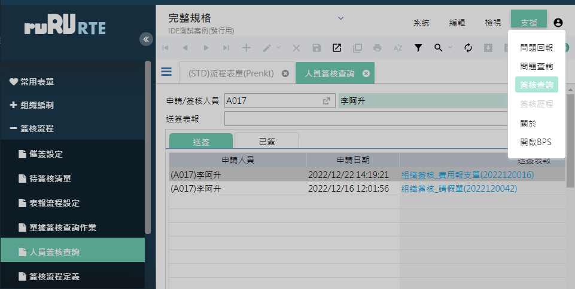
    * 若由 首頁/支援/簽核查詢 開啟，本欄位不可調整，指定為登入人員
    * 若由 選單 開啟，預設登入人員，可挑選欲查詢的人員代號
2. 申請簽核人員姓名：顯示人員名稱，由`申請簽核人員代號`挑選後帶入
3. 送簽表報：下拉選取查詢的送簽表報，若不指定，則查詢所有送簽表報
4. 送簽狀態：下拉選項單據目前的送簽狀態(00.進行中 / 01.核准 / 02.駁回)，若不指定，則查詢所有狀態
5. 查詢：依條件查詢記錄
    * 依送簽人員=`申請簽核人員代號`、`送簽表報`、`送簽狀態`...等條件，查詢送簽記錄，並呈現於`頁籤.送簽`的表格中
    * 依簽核人員=`申請簽核人員代號`、`送簽表報`、`送簽狀態`、簽核類別=會簽、已完成回覆、簽核記錄未作廢...等條件，查詢送簽記錄，並呈現於`頁籤.已簽`的表格中
6. 頁籤.送簽：呈現`申請簽核人員代號`的送簽記錄
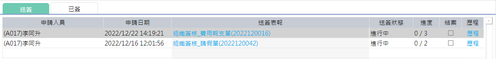
    1. 申請人員：顯示 (送簽人員代號)送簽人員姓名
    2. 申請日期：顯示送簽日期時間
    3. 送簽表報：顯示 送簽表報名稱(送簽表報鍵值)，可點選超連結開啟原單據，查看送簽單據的資料記錄
    4. 送簽狀態：顯示此記錄目前的送簽狀態(進行中 / 核准 / 駁回)
    5. 進度：若送簽記錄需進行的關卡有3關，目前關卡1已通過，進入關卡2，則呈現 "1 / 3"，若關卡2已通過，進入關卡3，則呈現 "2 / 3"，以此類推
    6. 結案：若顯示勾選，則表示此送簽記錄的流程已結束，送簽的狀態為核准或駁回
    7. 歷程：可開啟[單據簽核歷程](WFS#FX000000003058)，查看送簽記錄的所有簽核歷程
7. 頁籤.已簽：呈現`申請簽核人員代號`為 會簽者 且 簽核記錄已完成回覆 且 簽核記錄未作廢 的記錄
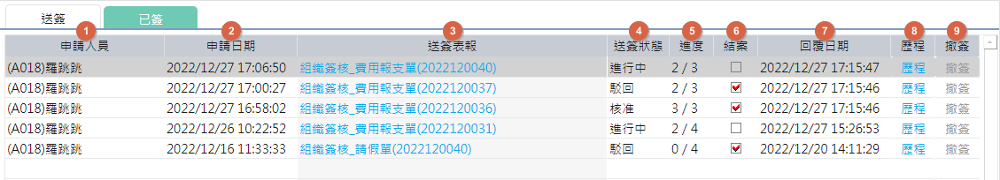
    1. 申請人員：顯示 (送簽人員代號)送簽人員姓名
    2. 申請日期：顯示送簽日期時間
    3. 送簽表報：顯示 送簽表報名稱(送簽表報鍵值)，可點選超連結開啟原單據，查看申請單據的資料記錄
    4. 送簽狀態：顯示此記錄目前的送簽狀態(進行中 / 核准 / 駁回)
    5. 進度：若送簽記錄需進行的關卡有3關，目前關卡1已通過，進入關卡2，則呈現 "1 / 3"，若關卡2已通過，進入關卡3，則呈現 "2 / 3"，以此類推
    6. 結案：若顯示勾選，則表示此送簽記錄的流程已結束，送簽的狀態為核准或駁回
    7. 回覆日期：顯示簽核人員所回覆的日期時間
    8. 歷程：可開啟[單據簽核歷程](WFS#FX000000003058)，查看送簽記錄的所有簽核歷程
    9. 撤簽：執行後，清空該關卡會簽人員的回覆狀態、回覆內容
        * 下一關卡的會簽人員還未回覆 且 送簽狀態未結案，按鍵才致能
        * 執行後，下一關卡的狀態清空，本關卡的狀態改為待簽

[Top](#FormList)

## 人員簽核查詢(RWD Web版) {#FX000000003093_RWD}

> 作業說明：於行動裝置上，查詢單一人員的送簽及已簽核的簽核資訊。

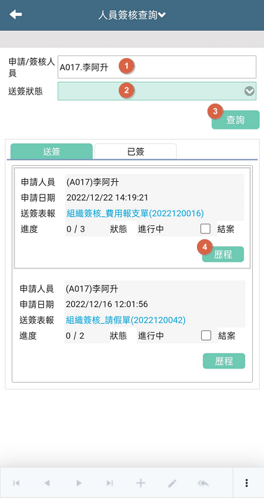
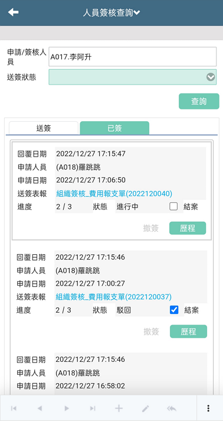
1. 申請簽核人員：指定查詢的人員代號，不可空白
    * 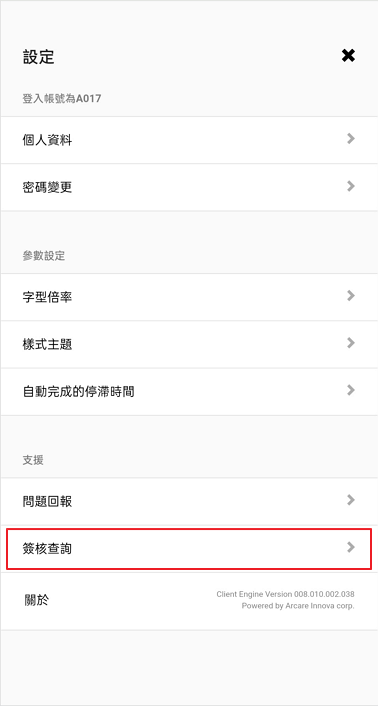
    * 若由 首頁/設定/簽核查詢 開啟，本欄位不可調整，指定為登入人員
    * 若由 選單 開啟，預設登入人員，可挑選欲查詢的人員代號
2. 送簽狀態：下拉選項單據目前的送簽狀態(00.進行中 / 01.核准 / 02.駁回)，若不指定，則查詢所有狀態
3. 查詢：依條件查詢記錄
    * 依送簽人員=`申請簽核人員`、`送簽狀態`...等條件，查詢送簽記錄，並呈現於`頁籤.送簽`的表格中
    * 依簽核人員=`申請簽核人員`、`送簽狀態`、簽核類別=會簽、已完成回覆、簽核記錄未作廢...等條件，查詢送簽記錄，並呈現於`頁籤.已簽`的表格中
4. 歷程：執行後可開啟[簽核歷程](#FX000000003058_RWD)
5. 其它欄位、按鍵說明同[人員簽核查詢作業](#FX000000003093)

[Top](#FormList)

## 單據簽核歷程 {#FX000000003058}

> 作業說明：查詢已送簽的單據，其簽核的歷程狀況。

1. 送簽表報：顯示 送簽表報名稱(送簽表報鍵值)
2. 申請人員代號：顯示送簽人員代號
3. 申請人員姓名：顯示送簽人員姓名
4. 簽核歷程：顯示送簽記錄下所有關卡及各關卡會簽者、會辦者的簽核記錄，由樹狀方式呈現
    * 關卡節點：顯示 第n關 (關卡狀態)
        * n為[簽核流程定義](WFS#FX000000003079)的流程順序
        * 關卡狀態為 (空白) / 待簽 / 通過 / 退簽 / 中止
        * 關卡狀態=待簽，則顯示藍色字體; 關卡狀態=中止，則顯示紅色字體
    * 簽核節點：顯示 (簽核類別) 人員代號 人員姓名 / 回覆狀態(回覆日期時間) 已加簽
        * 簽核類別為 會簽、會辦
        * 若未回覆，則 回覆狀態(回覆日期時間) 不顯示
        * 回覆狀態為 (空白) / 同意 / 不同意 / 退簽
        * 若會簽者已增加簽核人員且加簽類別為加簽，則顯示 已加簽，否則不顯示
        * 關卡狀態=待簽 且 未回覆 且 未作廢，則顯示藍色字體; 回覆狀態=不同意，顯示紅色字體; 簽核記錄作廢 或 已加簽，則顯示灰色
        * **[名詞解釋]**
            * 簽核記錄作廢：例 若送簽記錄進行到關卡3，而關卡3的會簽者將回覆狀態設定為退簽/退回上一關卡，則關卡2的所有會簽者的簽核記錄皆會改變為作廢
    * 顯示案例：關卡1、2皆通過，目前進行到關卡3，原關卡3的會簽人員加簽其它會簽人員

        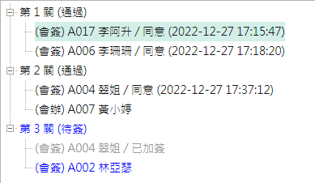
    * 顯示案例：關卡1、2皆通過，關卡3的會簽人員不同意

        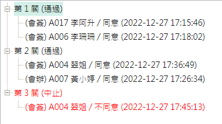
    * 顯示案例：關卡1、2皆通過，關卡3的會簽人員退簽/退回送簽人員

        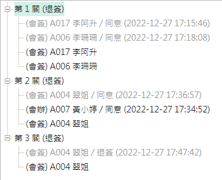
5. 回覆意見：駐留節點顯示回覆意見
6. 回覆附件序：顯示附件流水順序
7. 回覆附件：顯示附件檔名
8. 回覆檔案下載：可下載附件
9. 回覆檔案開啟：可直接開啟附件
10. 駐留送簽表報，可於 首頁/支援/簽核歷程 開啟本單，查詢該記錄的簽核歷程; 亦可由簽核系統的查詢單據開啟本單

    

[Top](#FormList)

## 簽核歷程(RWD Web版) {#FX000000003058_RWD}

> 作業說明：於行動裝置上，查詢已送簽的單據，其簽核的歷程狀況。

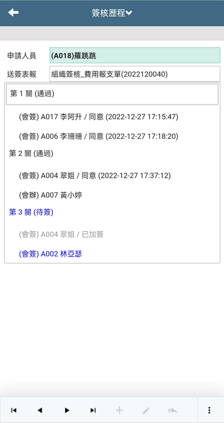
1. 欄位、按鍵說明同[單據簽核歷程](#FX000000003058)
2. 駐留送簽表報，可於 首頁/設定/簽核歷程 開啟本單，查詢該記錄的簽核歷程; 亦可由簽核系統的查詢單據開啟本單

    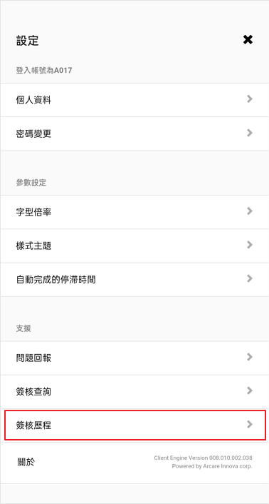

[Top](#FormList)

## 單據簽核查詢作業 {#FX000000003092}

> 作業說明：可依簽核人員、送簽專案或單位 查詢簽的狀況及資訊。

1. 查詢類別：依選擇的類別查詢簽核記錄
    * 若選擇人員，則查詢`簽核人員`=`人員代號`的簽核記錄
    * 若選擇專案，則查詢`送簽來源`=`專案代號`的簽核記錄
    * 若選擇組織，則查詢`送簽來源`=`組織單位代號`的簽核記錄
2. 人員代號：查詢類別=人員，可挑選欲查詢的簽核人員代號
3. 人員姓名：顯示人員名稱，由`人員代號`挑選後帶入
4. 專案代號：查詢類別=專案，可挑選欲查詢的專案代號
5. 專案名稱：顯示專案名稱，由`專案代號`挑選後帶入
6. 組織單位代號：查詢類別=組織，可挑選欲查詢的組織單位代號
7. 組織單位簡稱：顯示組織單位簡稱，由`組織單位代號`挑選後帶入
8. 送簽表報關鍵字：可挑選欲查詢的送簽表報，亦可自行輸入關鍵字，查詢時會依表報名稱包含關鍵字執行搜尋，無設定時，則搜尋全部
9. 送簽鍵值關鍵字：可自行輸入關鍵字，查詢時會依鍵值包含關鍵字執行搜尋，無設定時，則搜尋全部
10. 逾期天數：可自行輸入數字，查詢時依`天數`>=`逾期天數`搜尋
11. 送簽狀態：下拉選項單據目前的送簽狀態(00.進行中 / 01.核准 / 02.駁回)，預設00.進行中
12. 待簽核：若勾選，則查詢關卡狀態=待簽、退簽的簽核記錄，送簽狀態=進行中，預設勾選
13. 已簽核：若勾選，則查詢關卡狀態=通過、中止的簽核記錄，送簽狀態=核准、駁回，預設勾選
14. 搜尋：依上述查詢欄位，進行簽核記錄的查詢
15. 送簽表報：顯示 送簽表報名稱(送簽表報鍵值)，可點擊超連結開啟原單據，查看申請單據的資料記錄
16. 送簽來源：顯示該筆送簽記錄所屬的組織單位或專案
17. 送簽狀態：顯示此記錄目前的送簽狀態(進行中 / 核准 / 駁回); 可點擊超連結，可開啟[單據簽核歷程](WFS#FX000000003058)，查看送簽記錄的所有簽核歷程
18. 進度：若送簽記錄需進行的關卡有3關，目前關卡1已通過，進入關卡2，則呈現 "1 / 3"，若關卡2已通過，進入關卡3，則呈現 "2 / 3"，以此類推
19. 關卡狀態：顯示此簽核記錄所屬關卡的狀態(待簽 / 通過 / 中止 / 退簽)
20. 簽核人員：顯示此簽核記錄的簽核人員，顯示 (人員代號)人員姓名
21. 簽核類別：顯示此簽核記錄的簽核類別(會簽 / 知會 / 會辦)
22. 回覆狀態：顯示此簽核記錄的回覆狀態(同意 / 不同意 / 退簽)
23. 簽核期限：顯示此簽核記錄的簽核期限日期
24. 天數：顯示簽核期限與系統日期的相差天數
25. 催簽通知：依`勾選`有打勾 且 `簽核類別`=會簽 且 `關卡狀態`=待簽 且 `回覆狀態`為空，則發送摧簽通知郵件; 郵件內容依[催簽設定](WFS#FX000000003288)顯示
26. 郵件重送：依`勾選`有打勾 且 `關卡狀態`=待簽 且 `回覆狀態`為空，則發送郵件

[Top](#FormList)

# 送簽建置說明 {#SignOffSetting}

## **3.1 建置簽核流程**
> 設定流程所需通過的關卡及各關卡的簽核對象、通知郵件、核決權限...等相關定義

1. 指定本流程的編制、關卡說明及簽核對象
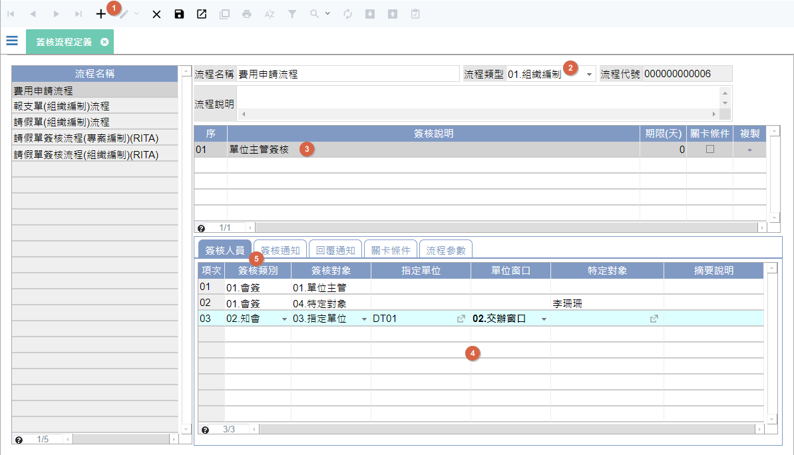
    1. 執行新增，開始建立一新的簽核流程，設定本流程名稱
    2. 指定本流程的編制
    3. 輸入關卡說明及本關卡的簽核期限天數
    4. 設定本關卡的簽核對象
    5. 關卡中，至少要有一會簽人員

2. 設定本關卡的通知郵件內容
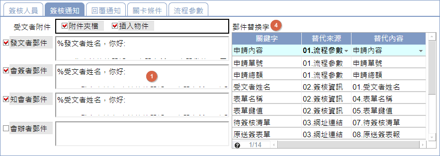
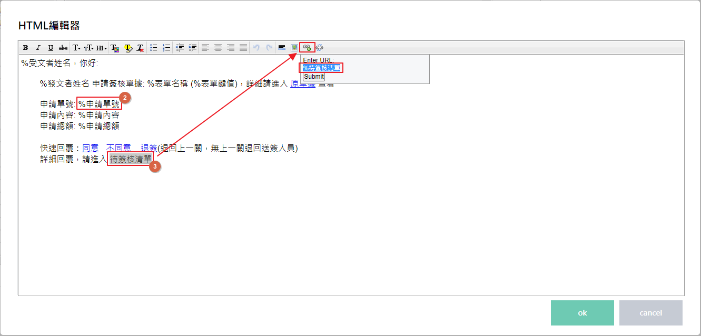
    1. 於郵件內容滑鼠雙擊可開啟編輯器，編輯內容
    2. 須替代的內容，於關鍵字前加上 % 符號
    3. 若需要超連結，請圈選文字後 → 執行按鍵.加入超連結 → 將URL輸入替換關鍵字 → 執行按鍵.Submit
    4. 將郵件內容中，須替換的關鍵字，指定替換內容

3. 郵件內容的替換字，若須引用送簽單據的欄位內容，則需設定流程參數
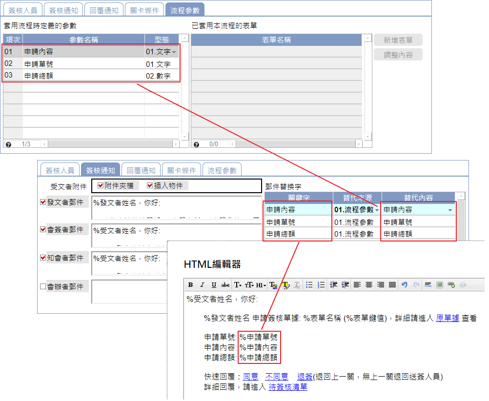

4. 若要新增關卡2，有2種方式，可自行新增，或複製關卡1的記錄
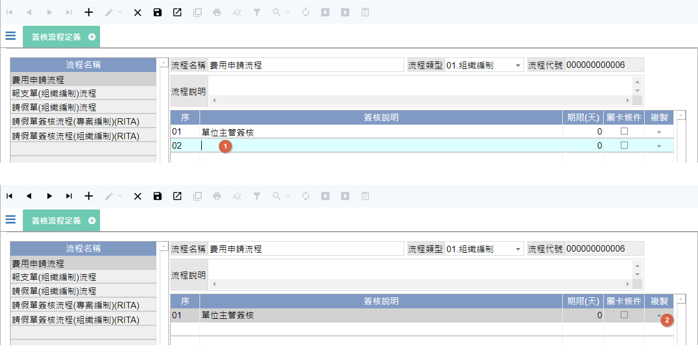
    1. 方式一，可自行新增關卡，設定關卡內容
    2. 方式二，於瀏覽模式下，可執行按鍵.複製，複製關卡記錄後，再調整關卡內容

5. 關卡通過、退簽、中止時，若須發郵件通知回覆結果，須設定回覆通知
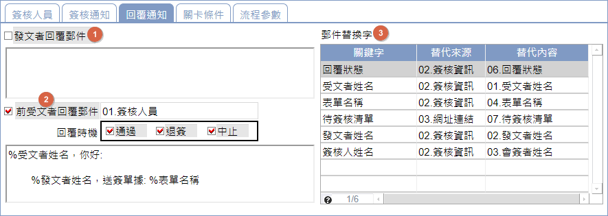
    1. 若需發送回覆郵件給送簽人員，於此勾選並設定郵件內容
    2. 若需發送回覆郵件給上一關卡的指定人員，於此勾選並指定收信對象、時機、郵件內容
    3. 將郵件內容中，須替換的關鍵字，指定替換內容

## **3.2 設定核決權限(關卡條件)**
> 產生送簽關卡時，依條件判斷是否產生關卡

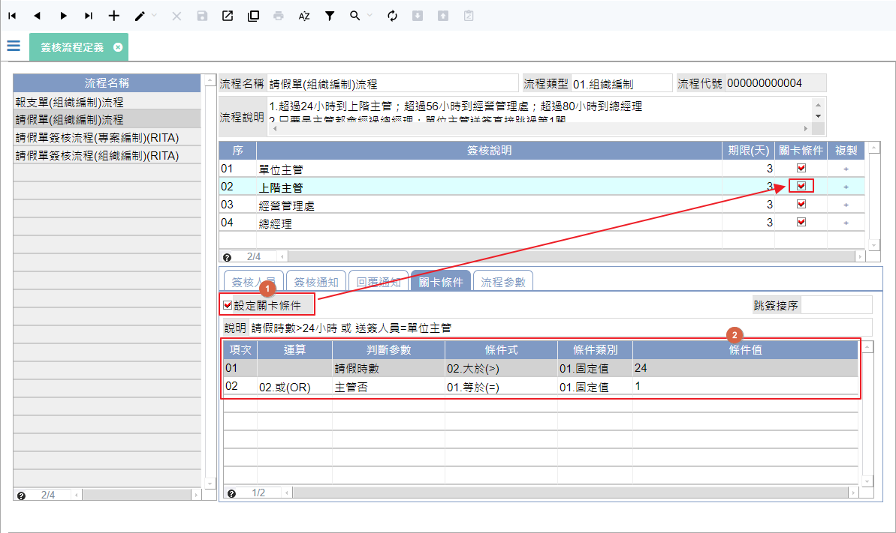
1. 若須判斷是否產生關卡，則設定關卡條件
2. 設定關卡條件，若不符合設定的條件，則跳過此關卡，依上圖為例說明，請假單的請假記錄，若 請假時數<=24 且 申請人不為主管，則該不產生此關卡的簽核記錄

## **3.3 設定送簽單據對應簽核流程**
> 設定送簽單據指定套用的流程定義，設定送簽人員、單位及送簽、抽單時機...等

1. 單據套用流程相關設定
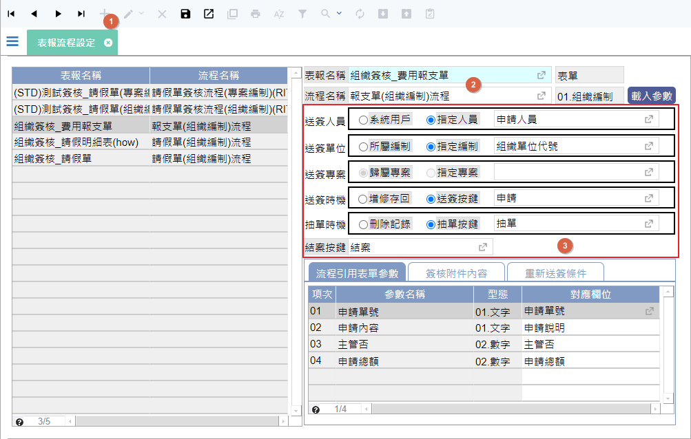
    1. 執行新增，開始建立
    2. 設定送簽單據及套用的流程定義
    3. 設定送簽相關定義
        * 指定送簽人員為系統用戶(登入人員) 或 表單欄位所記錄的員工代號
        * 指定送簽單位為登入人員所屬的單位 或 表單欄位所記錄的組織單位代號，流程定義為組織編制才須設定
        * 指定送簽專案為登入人員所屬的專案 或 表單欄位所記錄的專案代號，流程定義為專案編制才須設定
        * 指定送簽時機為單據執行新增存回、修改存回時 或 執行表單上的按鍵時，進入送簽流程
        * 指定抽單時機為單據執行刪除時 或 執行表單上的按鍵時，進行抽單刪除送簽記錄
        * 送簽狀態為核准時，會執行指定的結案按鍵，可不設
2. 流程定義所需的流程參數，在此需指定對應到表單的欄位
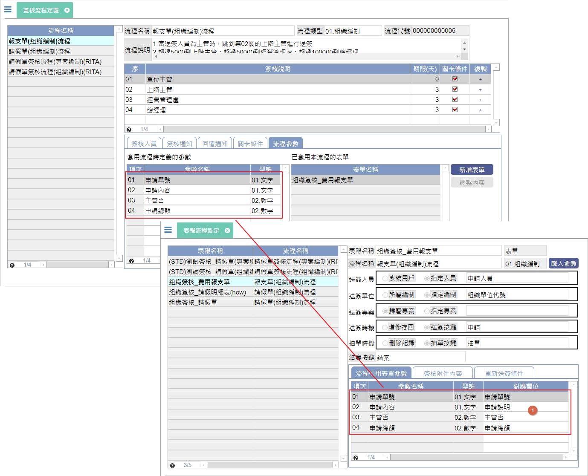
    1. 指定流程參數對應到表單的欄位
3. 流程定義的簽核通知郵件，若有勾選附件夾檔、插入物件，在此可指定送簽單據中附件的檔名、檔案欄位
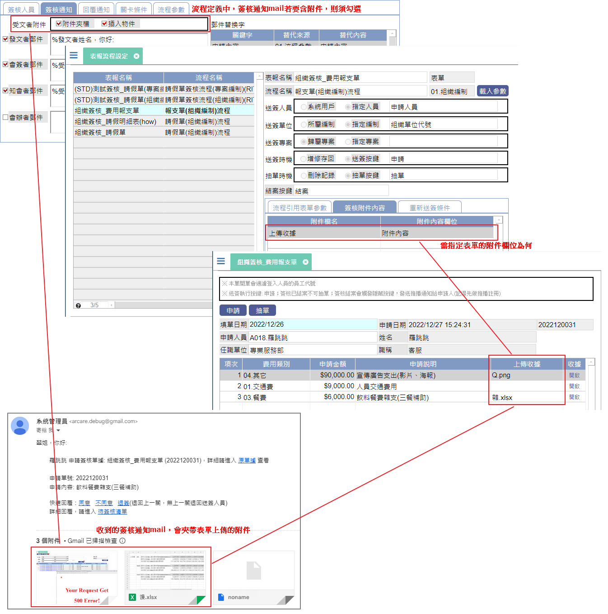

[Top](#SignOffSetting)

# 簽核通知郵件 {#SignOffMail}

## **4.1 簽核通知信**

* 發送時機：1.關卡啟動時；2.[單據增加簽核](#FX000000003082)的修改存回時
* 發送對象：依據關卡啟動時設定的簽核對象發送
* 郵件主旨：【簽核申請 / 簽核知會通知 / 簽核會辦通知】表報名稱簽核: (關卡順序)關卡名稱
* 郵件內容：依據[簽核流程定義](#FX000000003079):頁籤.簽核通知 或 [單據增加簽核](#FX000000003082) 的郵件內容產生

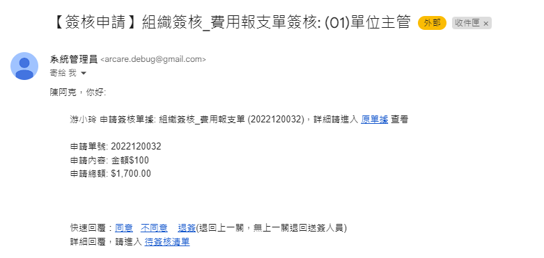

## **4.2 關卡回覆通知信**

* 發送時機：關卡結束時
* 發送對象：[簽核流程定義](#FX000000003079):頁籤.回覆通知的設定內容
* 郵件主旨：【簽核關卡回覆】表報名稱簽核: (關卡順序)關卡名稱
* 郵件內容：依據[簽核流程定義](#FX000000003079):頁籤.回覆通知的郵件內容產生

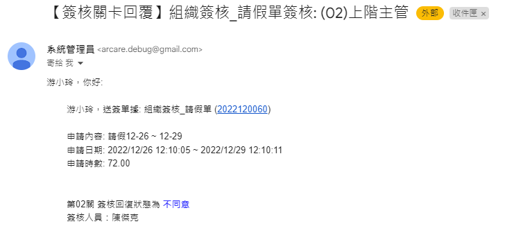

## **4.3 抽單通知信**

* 發送時機：當送簽人員執行[表報流程設定](#FX000000003078)設定的抽單按鍵時發送
* 發送對象：本次送簽產生的全部關卡人員
* 郵件主旨：【簽核抽單通知】表報名稱簽核: (關卡順序)關卡名稱
* 郵件內容：系統固定發送內容，請參考下圖所示

## **4.4 退簽通知信**

* 發送時機：當會簽人員簽核回覆狀態為退簽時發送
* 發送對象：若為退回上一關，則發送對象為退簽關卡及上一關卡的會簽人員；若為退回送簽人員，則發送對象為退簽關及之前關卡的會簽人員及送簽人員
* 郵件主旨：【簽核退簽通知】表報名稱簽核: (關卡順序)關卡名稱
* 郵件內容：系統固定發送內容，請參考下圖所示

## **4.5 結案通知信**

* 發送時機：當送簽狀態=核准或駁回時，即本單簽核為結案。結案立即發郵件
* 發送對象：本次送簽產生的全部關卡人員
* 郵件主旨：【簽核結案通知】表報名稱簽核: (關卡順序)關卡名稱
* 郵件內容：系統固定發送內容，請參考下圖所示

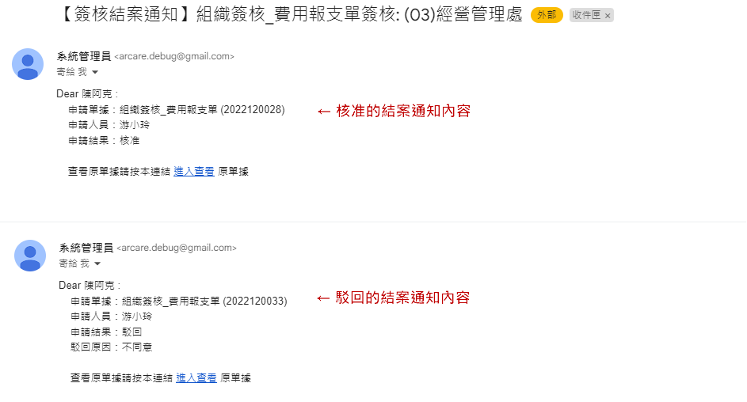

[Top](#SignOffMail)

# 簽核回覆操作說明 {#SignOffReply}

## **5.1 簽核回覆-使用郵件連結**

> 使用簽核通知郵件的URL連結進行簽核回覆。郵件通知的連結有5種: 待簽核清單 / 原送簽表報 / 同意 / 不同意 / 退簽，以下列簽核申請通知郵件做範例說明

1. `【原送簽表報】`執行後會開啟瀏覽器分頁進入系統的登入畫面，使用收件人的帳號登入後，會直接開啟原送簽單據的介面並駐留在該筆記錄。
    * 此連結會鎖定登入帳號須為收件人的帳號，若登入非收件人的帳號會顯示訊息「你無權限執行此超連結」，如下圖所示：
    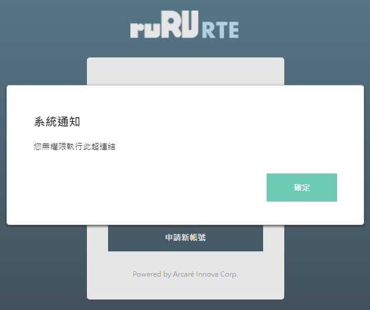
2. `【同意】`表示同意送簽內容，執行後會開啟瀏覽器分頁，並顯示系統執行結果。
    * 此連結只允許被執行一次，不論執行結果是成功或失敗，都只能執行一次，執行後連結立即失效，若再次執行，系統會顯示訊
    息「執行失敗(※無法執行※ 本筆簽核已執行.)」，如下圖所示：
    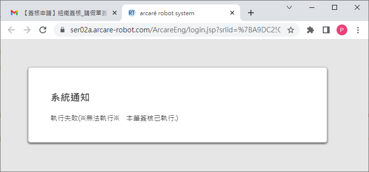
    * 執行成功，顯示訊息「同意執行成功」，如下圖所示
    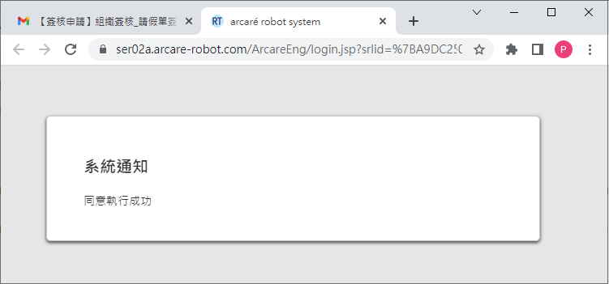
    * 執行不成功，顯示執行失敗訊息「執行失敗(※無法執行※ **失敗原因**)」。
3. `【不同意】`表示不同意送簽內容，執行後會開啟瀏覽器分頁，並顯示系統執行結果。 
    * 此連結只允許被執行一次，不論執行結果是成功或失敗，都只能執行一次，執行後連結立即失效，若再次執行，系統會顯示訊
    息「執行失敗(※無法執行※ 本筆簽核已執行.)」。
    * 相關訊息畫面範例，請參考【同意】。
4. `【退簽】`表示退簽回上一關卡送簽內容，執行後會開啟瀏覽器分頁，並顯示系統執行結果；若執行成功，系統會發送退簽通知信給相關人員。 
    * 使用超連結進行退簽，預設會退回上一關卡，無上一關卡時，會退回給送簽人員。
    * 此連結只允許被執行一次，不論執行結果是成功或失敗，都只能執行一次，執行後連結立即失效，若再次執行，系統會顯示訊
    息「執行失敗(※無法執行※ 本筆簽核已執行.)」。
    * 相關訊息畫面範例，請參考【同意】。    
5. `【待簽核清單】`執行後會開啟瀏覽器分頁進入系統的登入畫面，使用收件人的帳號登入後，會直接開啟[待簽核清單](#FX000000003059)
    * 此連結會鎖定登入帳號須為收件人的帳號，若登入非收件人的帳號會顯示訊息「你無權限執行此超連結」。
    * 相關訊息畫面範例，請參考【原送簽表報】。
* `※錯誤說明※` 當簽核通知信已發送，而該簽核記錄前一關卡會簽人員執行了徹簽，或當前關卡有任一會簽人員回覆為退簽時，其他人員再執行郵件連結，會出現訊息「執行失敗(※無法執行※ 本筆簽核關卡狀態尚未啟動.)」，如下圖所示：
    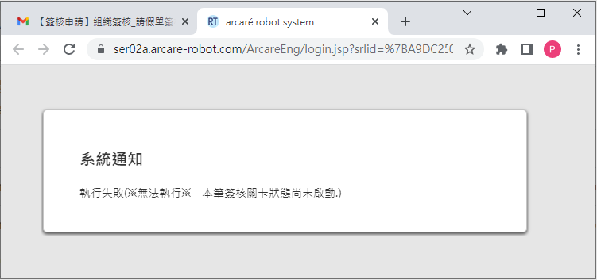

## **5.2 簽核回覆-使用會簽快速簽核**

> 若需要多筆送簽記錄同時進行簽核回覆，可使用[待簽核清單](#FX000000003059)進行簽核回覆。本方式僅提供給會簽人員使用。

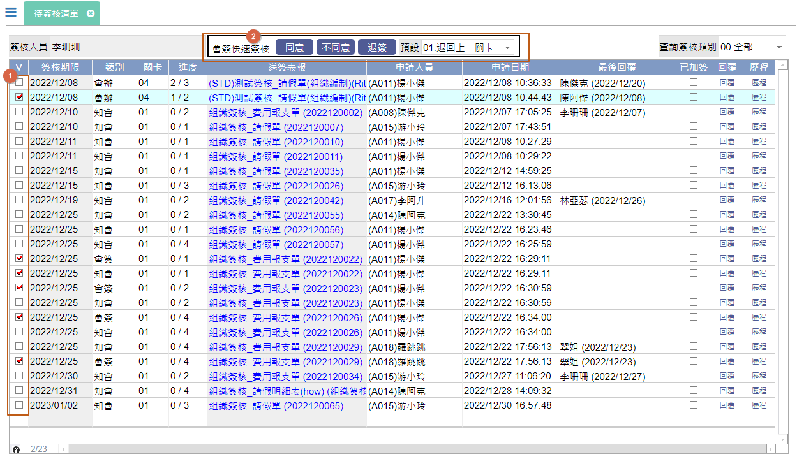    
1. 勾選要簽核的送簽記錄。
2. 單擊按鈕，進行簽核回覆(同意 / 不同意 / 退簽)，系統會依執行的按鈕寫入回覆內容。
    * 退簽可視狀況變更選取退回上一關卡 或 退回送簽人員。
    * 若勾選到會辦或知會，系統會自動跳過該簽核記錄，不要進行簽核回覆。
    * 若為執行中，系統會鎖定畫面，顯示處理中訊息且光棒會移動到目前執行筆記錄上，如下圖所示：
    
    * 若執行完成，系統會整重畫面，將已簽核成功的記錄從畫面上移除。
    * 若執行失敗，系統會停留在失敗的畫面上並依錯誤顯示失敗訊息，且系統將會停止進行簽核回覆的動作，未進行簽核記錄也不會再進行下去。
        * 請依失敗訊息，洽詢系統服務人員協助解決。

## **5.3 簽核回覆-使用簽核回覆作業(含加簽)**

> 當需要輸入回覆意見或上傳回覆附件時，可使用[單據簽核回覆作業](#FX000000003057)進行詳細的簽核回覆。 
> 會辦人員只能使用本單進行會辦回覆。

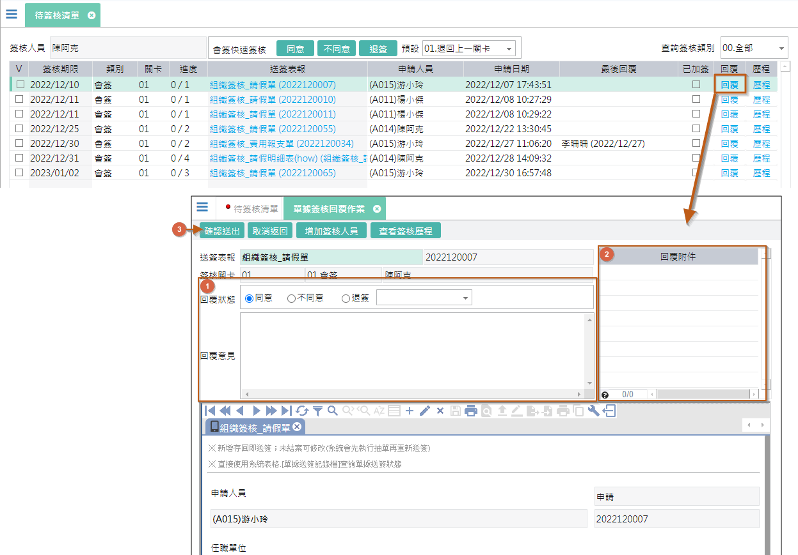
1. 選取簽核`回覆狀態`、輸入`回覆意見`。
2. 上傳回覆的附件檔案。(非必需)
3. 確認並送出簽核回覆結果。

    **【注意事項】**
    * 當`回覆狀態`=不同意或退簽時，必須輸入`回覆意見`，否則，系統顯示訊息「※執行有誤※ 不同意或退簽時, 須回覆內容」。
    * 當會簽人員已設定增加簽核的類別為加簽時，則無需再進行簽核回覆。
 

## **5.4 簽核回覆-當前關卡增加簽核人員**

> 當前關卡的會簽人員，因送簽內容，判定需上呈給上層主管 或 需請其他員工進行會辦協助時，可使用[單據增加簽核](#FX000000003082)增加簽核人員。

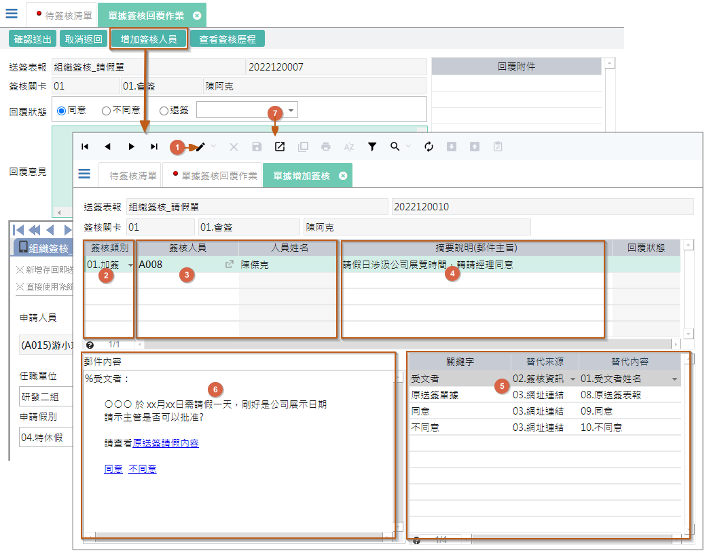
1. 進入編輯模式。
2. 選取簽核類別: 加簽 或 會辦。
3. 挑選簽核人員。
4. 填寫加簽摘要說明(即郵件送出後的郵件主旨)。
5. 設定郵件替換字來源。
6. 填寫郵件內容。
7. 存回並發送(加簽/會辦)內容。

    **【注意事項】**
    * 存回後，系統會立即發送給郵件給(加簽/會辦)人員；當郵件已發送，則該筆記錄唯讀，不可再異動。
    * 當(加簽/會辦)人員已回覆或本簽核記錄已作廢，則資料不允異動！

[Top](#SignOffReply)

---
[**回到目錄**](index.html#MainMenu)