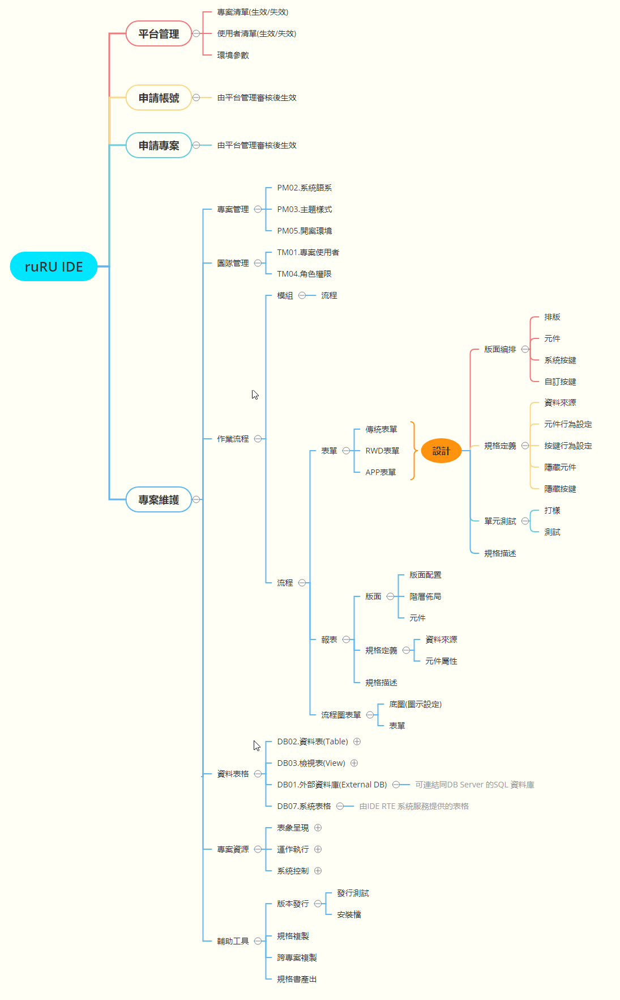

# IDE (Integrated Design Environment 設計台) 
	* ## [IDE 結構展開圖](#IDE_MAP)
	* ## [版本8.10.0 MD](../doc/8.10.0/zh-Hant/index.html)
	* ## [版本8.10.0 PDF](/library/8.10.0/zh-Hant/index.html){:target='_blank'}
	* ## [版本8.9.2](/library/8.9.2/index.html){:target='_blank'}

# RTE (Run Time Environment 運行台)
	* ## [RTE 結構展開圖](#RTE_MAP)

# FMS (Factory Management System 管理中心)
# AMS (Assembly Management System 軟體工廠)

# UTL
# WFS

# 平台各功能模組協作圖

# IDE 結構展開圖 {#IDE_MAP}

# RTE 結構展開圖 {#RTE_MAP}

